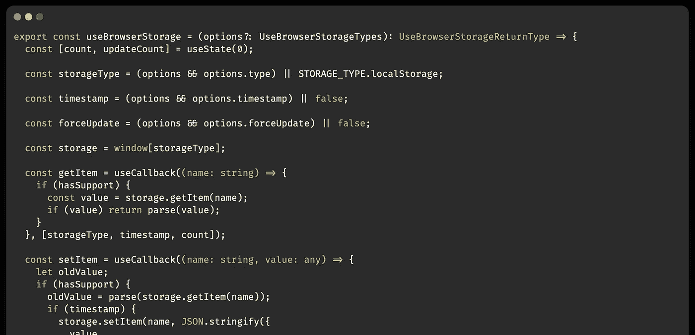

# 构建一个 React 挂钩并发布到 NPM 包

> 原文：<https://levelup.gitconnected.com/build-a-react-hook-and-publish-to-npm-packages-807041135982>



react-hook 类型脚本

这是一个关于如何构建自定义 React 自定义钩子的小教程。

React 挂钩现在更受功能组件的欢迎，它提供了一种使用 React 状态和生命周期的方法。人们可以将组件业务逻辑转换成自定义挂钩。这将使你的代码更加整洁和易于管理。让我们看看怎么做。

有两个核心 React 挂钩:

*   **使用状态**
*   **使用效果**

# 使用状态挂钩

React 的 useState home 用于在功能组件中创建状态。React 将在重新渲染之间保持这种状态。useState 返回一对值:当前状态值和一个允许您更新它的函数。您可以从事件处理程序或其他地方调用该函数。它类似于类中的 this.setState，只是它不合并新旧状态。

# 使用效果

effect 挂钩增加了处理副作用的能力，并模仿 react 的生命周期，类似于基于类的组件。它与 React 类中的**componentid mount**、**componentid update**和**componentid unmount**的作用相同，但是统一到一个 API 中。当您调用 useEffect 时，您是在告诉 React 在刷新对 DOM 的更改后运行您的“Effect”函数。

# 打造自己的钩子💡

在本教程中，我们将构建一个自定义挂钩来使用浏览器存储，并选择使用 localStorage 和 sessionStorage。

> 用户浏览器存储

如果一个函数名以“use”开头，那么它就被称为一个钩子。 *useBrowserStorage* 命名约定是 linter 插件如何使用钩子找到代码中的 bug。

# 设置

最快的开始方式是使用样板文件。因此您不需要担心添加依赖项和构建工具。我们将使用`create-react-hook` NPM 包样板工程。

[https://www.npmjs.com/package/create-react-hook](https://www.npmjs.com/package/create-react-hook)

```
npx create-react-hook <hook-name>
```

运行后，此命令将回答一些问题，CLI 将设置项目。

# 写出你的逻辑

现在你已经走到这一步，让我们写我们的`useBrowserStorage`钩子逻辑。如果你已经使用`create-react-hook` CLI 设置了项目，那么在`src/index.(jsx, tsx)`中有一个条目文件，里面有一些编写钩子的示例代码。让我们替换它。

```
export const useBrowserStorage = () => { *// logic will go here*}
```

我们将提供一个选项{ type }在`localStorage`和`sessionStorage`之间切换。类型的默认值是`localStorage`。

```
const STORAGE_TYPES = ['localStorage', 'sessionStorage'];export const useBrowserStorage = (options = {}) => { const type = (STORAGE_TYPES.includes(options.type) && options.type) || 'localStorage';}
```

现在让我们检查浏览器是否支持存储。它还会检查我们的钩子是否在服务器端运行，这样它就不会产生任何错误。

最后组合在一个文件中

# 发布到 NPM

一旦我们准备好钩子，让我们把它发布到 NPM 包。

登录 NPM CLI。输入您的用户名、密码和电子邮件进行登录。

```
npm login
```

成功登录后，让我们运行这个命令来发布

```
npm publish
```

就是这样！！！

**提示:**如果你想重新发布你的包中有新的改动或者 bug 修正。然后你必须更新你的软件包版本。您可以手动将包版本更新到`package.json`文件中，也可以运行以下命令:

```
npm version patch -m "message"
```

[为`npm version`命令读取更多](https://docs.npmjs.com/cli/v6/commands/npm-version)

这里是`useBrowserStorage`的完整源代码

[](https://github.com/ravid7000/use-browser-storage) [## ravid 7000/使用-浏览器-存储

### 在 react 组件- ravid7000/use-browser-storage 中使用 localStorage 和 sessionStorage

github.com](https://github.com/ravid7000/use-browser-storage) [](https://www.npmjs.com/package/use-browser-storage) [## 使用-浏览器-存储

### React hook 使用浏览器的存储。当前支持 localStoage 和 sessionStoage。npm 安装-保存…

www.npmjs.com](https://www.npmjs.com/package/use-browser-storage) 

希望你喜欢这个教程。感谢您的阅读！！！