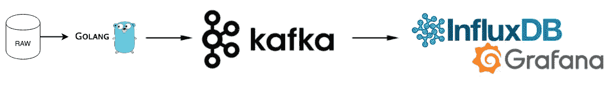
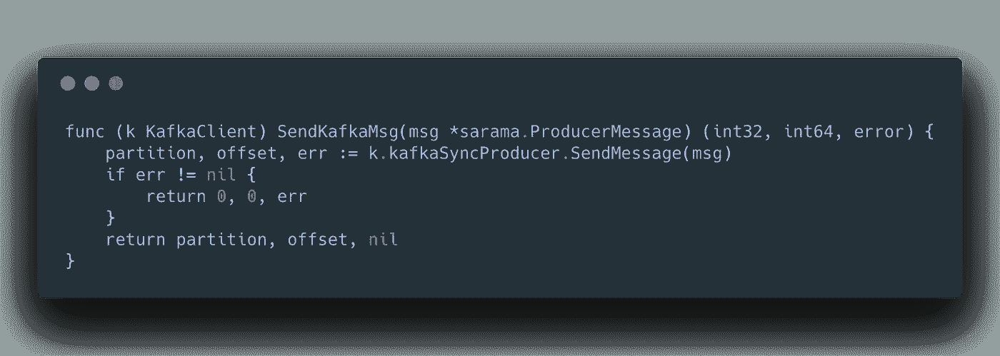

# 周末在 Go 中构建实时数据管道—第 1 部分

> 原文：<https://levelup.gitconnected.com/build-a-real-time-data-pipeline-during-the-weekend-in-go-30f9c63e207a>

在过去的十年里，我有幸在不同的行业工作过，创业、咨询、金融、零售等等。我参与了大多数公司的数字化转型。

当我从事 IT 项目时，我们总是面临挑战…

> 为什么它如此昂贵和耗时？我们怎样才能让它变得更好？

上个长周末，我有一些空闲时间，所以我决定在周末建立一个实时数据管道，这样做我也可以解释为什么它是昂贵和耗时的？

> 这不仅仅是构建，而是设计、构建、支持和改进。

# 设计阶段

这里是管道栈:Kafka，InfluxDB 和 Grafana。

建筑设计

这似乎很简单，但是，思考和设计应始终考虑生产，即:

1.  **测试:**单元测试(测试覆盖率高达 80%)，集成测试等。
2.  **部署&** **版本控制:** CI/CD 自动部署管道
3.  **监控:**可追溯性，实时支持，日志记录
4.  **低延迟:**因为实时性要求，所以低延迟是优点
5.  **可伸缩性:**这个管道如何处理大量的数据？可以吗？
6.  **安全:**确保我们的管道运行没有任何安全隐患。

那些所有的基本因素(或者甚至我们可以遵循 12 个因素)都应当被考虑，否则最终会建立一些真正**快速**的东西，但是它能够**而不是**站得住脚或者会有如此多的技术债务。

毕竟设计错误:)

# 构建阶段

## 准备开发环境

首先，设置开发环境。我还记得当我开始我的开发之旅时，最痛苦的时期是设置开发环境，特别像这种项目(超过 3 个系统)，我们需要下载不同的服务(jar，binary 等。)为了让它在本地打开运行，但是感谢容器技术，通过使用简单的 docker-compose.yml 文件，我们可以引导我们需要的所有关键应用程序/组件。

看，多简单？

## 开发/编码

让我们开始有趣的部分，Go 是我最近的首选开发语言，但为什么我选择 Go 进行数据管道开发，因为它简单，性能和类型安全。在这里我不打算解释围棋的好处，如果你有兴趣，请查看[Golang.org](https://golang.org/)。

像往常一样，如果你检查我以前的职位

> [如何使用 Go 构建 100%单元测试覆盖率的 machine box . io API](https://medium.com/@jayhuang75/how-to-build-a-machinebox-io-api-with-100-unit-testing-coverage-by-using-go-b9acbbb3e05)

你会知道，我将使用相同的应用程序结构。

**1。通过创建 Env 结构**来构建连接

**2。使用接口**

您可能已经通过 Go 演练或官方文档熟悉了接口的使用。然而，在 Go 中使用接口的美妙之处在于，你可以定义一组方法，一个类型(通常是`struct`)必须定义这些方法才能被认为是接口的实现。

当任何给定的类型实现了该接口的所有方法时，Go 编译器自动知道它被允许作为该类型使用。

**3。记录日志**

> 伐木很辛苦！

如果你已经做过应用产品支持相关的工作。您将感谢记录有关应用程序如何运行、何时以及如何失败、哪个文件、哪个功能的信息的开发人员。(加号+)

日志示例

我使用[优步 Zap libs](https://github.com/uber-go/zap) 。并且我还包装成一个[助手](https://github.com/jayhuang75/wei-helpers)，可以在不同的项目不同的级别使用。对我来说，我更喜欢将低级错误返回给主实现。

日志实现

**4。单元测试**

编写单元测试可以确保我们的代码按预期工作，比一个 bug 或回归一直到发布要“便宜”得多。

如果您还记得#1 接口实现，那么接口实现的另一个好处是帮助您轻松编写可测试的代码。

单元测试的例子之一

单元测试覆盖率是一个令人感兴趣的主题，我曾经疯狂到足以追踪 100%的覆盖率，然而，我吸取了我的教训，关于单元测试最重要的是:

> 你对你的代码有多少信心，并确保 CI/CD 自动化尽可能多地捕捉编码级回归错误。

去测试封面

## 最终结果

最终结果— gif

## 支持阶段

这条管道仅在周末建成，比如说，总共 10 个小时的设计、开发/编码。因为单元测试覆盖，日志记录，和本地集成测试。我很有信心，它的生产准备就绪，但是…

## **改进阶段**

这里唯一缺少的是安全实现、环境级别和代码级别。如果你想生产，这是最重要的部分。

本文主要关注设计和构建。下一篇文章将更加关注支持和改进。:)

第二部分:

 [## 在周末建立一个实时数据管道-第二部分

### 以前，我用感恩节的长周末来建立一个实时数据管道。万一你错过了，这是…

medium.com](https://medium.com/@jayhuang75/build-a-real-time-data-pipeline-during-the-weekend-in-go-part-2-2347f600a4c9)