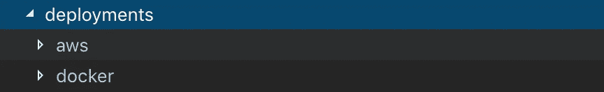

# 建立一个实时数据管道在周末去-第四部分，12 个因素。

> 原文：<https://levelup.gitconnected.com/build-a-real-time-data-pipeline-during-the-weekend-in-go-part-4-the-12-factor-7789f14a87f3>

这是本系列的第 4 篇文章，我们的想法是用所有的最佳实践来构建一个生产就绪的应用程序。前三篇文章涵盖了设计、开发、单元测试和基准/负载测试。

如果你和我一样，热衷于构建一个可伸缩的、可维护的、有成本效益的应用程序，你应该听说过 12 因素应用程序。在这篇文章中，我将通过我们的实时管道，我建立和处理 12 个因素，看看有多少已经涵盖。

# 为什么是十二因素？

> [十二要素应用是一种构建软件即服务应用的方法](https://12factor.net/)

*   使用**声明式**格式进行设置自动化，以最小化新开发人员加入项目的时间和成本；
*   与底层操作系统签订**干净契约**，在执行环境之间提供**最大的可移植性**；
*   适合在现代**云平台**上**部署**，消除对服务器和系统管理的需求；
*   **最小化开发和生产之间的差异**，使**连续部署**实现最大的敏捷性；
*   并且能够**在不对工具、架构或开发实践进行重大改变的情况下**扩大规模。

## 1.代码库(已检查)

启动项目，将代码签入到**位存储桶**中，作为我们首要的源代码控制。只有一个代码库，但会有许多应用程序的部署。而分支策略将会是 [**GitFlow**](https://www.atlassian.com/git/tutorials/comparing-workflows/gitflow-workflow) 。

## 2.依赖关系(选中)

显式声明和隔离依赖项，这不仅有助于构建，也有助于操作维护。

Go 1.11 和 1.12 包括对模块的初步[支持，Go 的](https://golang.org/doc/go1.11#modules)[新依赖关系管理系统](https://blog.golang.org/versioning-proposal)使依赖关系版本信息更明确，更易于管理。

你唯一需要做的就是创建 **go.mod，**Golang 会为你处理好休息的事情。

## 3.配置(选中)

> 我们将把配置从代码中分离出来。配置在不同的部署中有很大的不同，但是代码没有。

我从每个环境都有一些配置文件开始。当您在一台机器上运行 5–6 个实例时，这不成问题，我们可以上传配置文件、安装软件包并启动工具。然而，我们很快就会认识到有一个规模问题。

因此，这里的解决方案是将配置映射功能抽象为一个独立的功能，然后在开始部署时接收配置文件，这将很容易适应新的云部署，如 Kubernetes。

配置映射抽象函数

## 4.后台服务(选中)

> 将后台服务视为附属资源

十二要素应用程序的代码没有区分本地和第三方服务。因为 Docker 文件，对于我们的管道开发来说，两者都是附加资源，通过 Kafka 的 URL 访问，而 InfluxDB 端点存储在 config 中。因此，当我们进行部署时，我们只需要部署配置文件，而不需要对应用程序的代码进行任何更改。

配置抽象和 Docker 让我们的生活更轻松！

## 5.构建、发布、运行(选中)

> 严格分离构建和运行阶段

感谢大多数 SaaS 提供商，如 Bitbucket、CircleCI 和 Heroku 等。他们通常提供一些限制访问的免费服务；然而，这些已经足够构建 CI/CD 自动化管道了。这将解决构建和发布需求。

**bit bucket->CirecleCI->Heroku 部署。**

从长远来看，我们也可以在房子里切换，似乎所有的构建脚本都是模拟的，努力是有限的，这将是另一个关于构建或集成的话题。我们可以稍后换个话题来讨论这个问题。

## 6.流程(已检查)

> 将应用程序作为一个或多个无状态进程执行

**十二要素过程是无状态的，不共享任何东西。**任何需要持久化的数据都必须存储在有状态的后台服务中，通常是数据库(如 Redis 或另一个内存缓存等)。).

对于我们的实时管道应用程序用例，我们只使用 Kafka 作为流引擎，Kafka 集群可以将数据存储为 4 到 21 天的消息。这也符合 12 个因素的要求，在代码级是无状态和无共享的。

## 7.端口绑定(选中)

> 通过端口绑定导出服务

**十二要素应用程序是完全独立的**，不依赖于在运行时将 web 服务器注入执行环境来创建面向 web 的服务。web 应用程序**通过绑定到端口**将 HTTP 导出为一个服务，并监听来自该端口的请求。

对于我们的实时管道，由于 **#2** 配置抽象，所有端口都被设置为配置属性，比如 InfluxDB、Kafka、gRPC 和 RESTFul API。

## 8.并发性(已检查)

> 通过流程模型向外扩展

在第 2 部分中，我解释了服务工作者实现来处理我们的 RESTFul API 接口的大量 HTTP 请求。我个人最喜欢 Go，因为它有强大的并发支持，支持纵向扩展，超出了开箱即用的一个 CPU 内核。

服务人员-个人工作行动-发送给 Kafka producer

## 9.一次性(已检查)

> 快速启动和平稳关闭，最大限度地提高稳定性

我们为最终版本构建二进制文件，我们拥有的每个服务和接口(如 gRPC、RESTFul API)都实现了正常关机。而且还被单位上下试探了一下。

正常关机

## 10.开发/生产奇偶校验(已检查)

> 让开发、试运行和生产尽可能相似

**十二因素应用程序旨在通过缩小开发和生产之间的差距来实现持续部署。**看看上面描述的三个差距:

*   缩短时间间隔:开发人员可能会在几小时甚至几分钟后编写代码并部署。
*   缩小人员差距:编写代码的开发人员密切参与部署代码并观察其在生产中的行为。
*   缩小工具差距:让开发和生产尽可能相似。

像第 4 条一样，我们利用 SaaS 的大部分资源进行 CI/CD。从代码检入到部署到生产，都是完全自动化的，以减少这些差距，并确保质量和稳定性。

## 11.日志(已检查)

> 将日志视为事件流

在[第一部](https://medium.com/@jayhuang75/build-a-real-time-data-pipeline-during-the-weekend-in-go-30f9c63e207a)中，我们提到了伐木很难。我们还需要让我们的应用程序为实时日志分析做好准备，甚至与数据湖或日志服务(如 Google Stackdriver)集成。下面的关键是功能抽象可以为我们节省大量的时间和金钱。

## 12.管理进程(缺失)

> 作为一次性流程运行行政/管理任务

我们的应用程序还没有任何管理进程，但是，如 RESTFul API，我们提供的健康检查端点和二进制运行在盒子里将很容易重新启动，关机，与优雅的关机能力等。

如果我们需要提供这种功能，我们将需要开发一个 CLI 应用程序，将这些功能封装在其中。

2012 年 11 月检查了 12 因素 App 概念。我认为我们已经阐明了当前实时管道应用的最佳实践。我们对细节了解得越多，对我们的应用就越有信心。

> 编码快乐！

下一篇文章再见。如果错过我之前的文章。请看下文:

 [## 周末在 Go 中建立实时数据管道

### 在过去的十年里，我有幸在不同的行业工作过，创业、咨询、金融、零售…

medium.com](https://medium.com/@jayhuang75/build-a-real-time-data-pipeline-during-the-weekend-in-go-30f9c63e207a)  [## 在周末建立一个实时数据管道-第二部分

### 以前，我用感恩节的长周末来建立一个实时数据管道。万一你错过了，这是…

medium.com](https://medium.com/@jayhuang75/build-a-real-time-data-pipeline-during-the-weekend-in-go-part-2-2347f600a4c9)  [## 在周末建立一个实时数据管道-第 3 部分

### 以前，我用感恩节的长周末来建立一个实时数据管道。万一你错过了，这是…

medium.com](https://medium.com/@jayhuang75/build-a-real-time-data-pipeline-during-the-weekend-in-go-part-3-3aa944d10caf) 

我的其他文章可以在这里找到:

 [## 魏黄—中号

### 在媒介上阅读黄炜的作品。爱学习。学会成功。每天，黄伟和其他成千上万的人…

medium.com](https://medium.com/@jayhuang75)