# 用 React 和 GSAP 创建一个响应动画标题

> 原文：<https://levelup.gitconnected.com/build-a-responsive-animated-header-with-react-and-gsap-b154e0a26100>

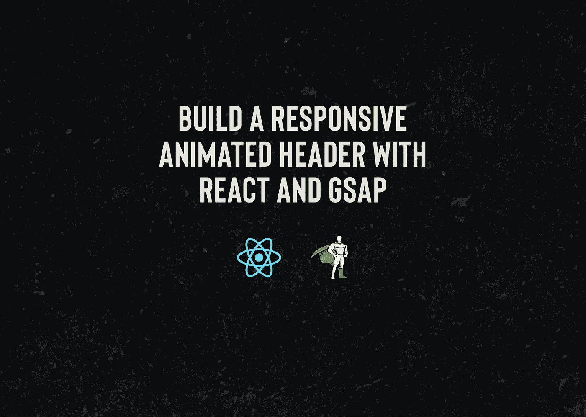

在我最近设计的一个项目中，我计划了一个简单的标题。对于桌面屏幕，设计要求在左边有一个标志，导航居中。在手机屏幕上，这个设计要求在左边有一个标志，在右边有一个汉堡图标，并且在激活时有完整的覆盖导航。设计如下:

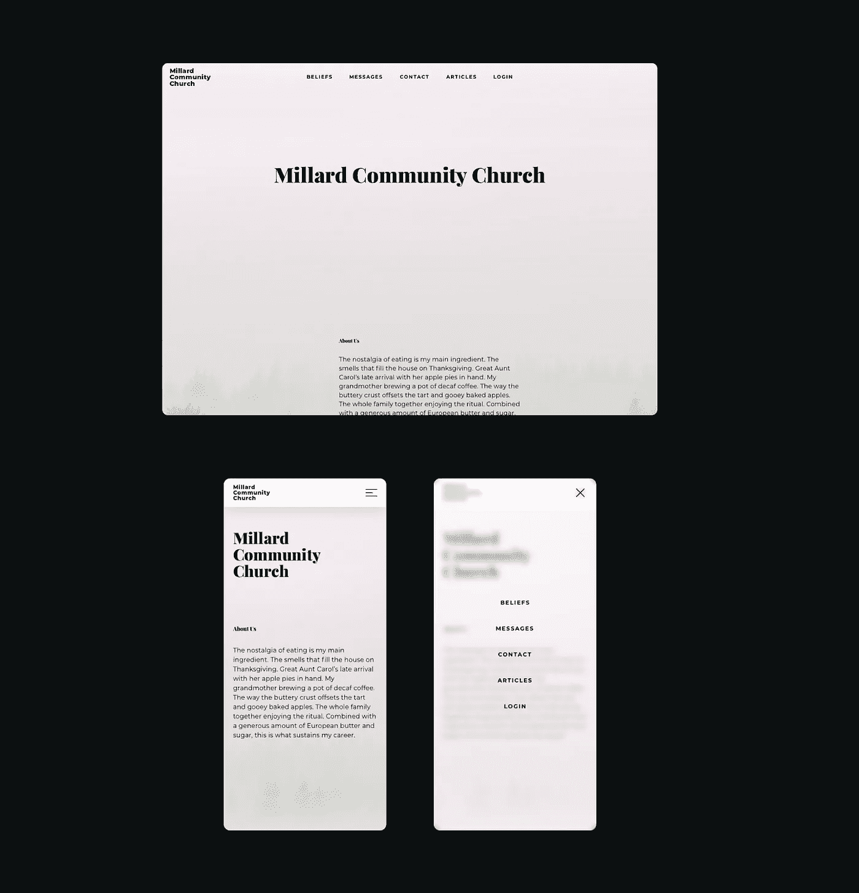

如您所见，这不是一个过于复杂的设计。然而，我希望手机导航上的动画比简单的淡入或滑入更有趣。为此，我决定使用 GSAP 建立一个时间线，将动画的元素都在和。

在继续之前有一个小提示，我在本教程中使用了 CodeSandbox，可以在这里找到。我尽最大努力复制我的正常项目结构，这意味着我使用 CSS 模块、一些 SCSS、CSS 自定义属性和我习惯的项目结构。虽然本教程不是关于这些事情，但我会尽力指出一些事情。

# 在我看来

当我看着这个设计(我知道，我设计了它，但我仍然会以同样的方式来看待它)，我看到了一个父组件——标题——和一些子组件——徽标、汉堡、导航。

虽然这是一个简单的设计，但它也是非常标准的，所以我会以一种我可以在其他项目中重用它的方式来构建它。这意味着我将拥有一个包含索引文件的标题文件夹——我们的`Header`组件——然后其他组件也将在该文件夹中。这样我可以很容易地将它打包并在其他项目中实现。

# 第一步:组件和样式

我喜欢做的第一件事是构建每个组件的结构并设计它们的样式。让我们首先构建`Header`组件。最终，这是我们所有的状态、函数等存在的地方，但是现在，它只是标记和一些类。

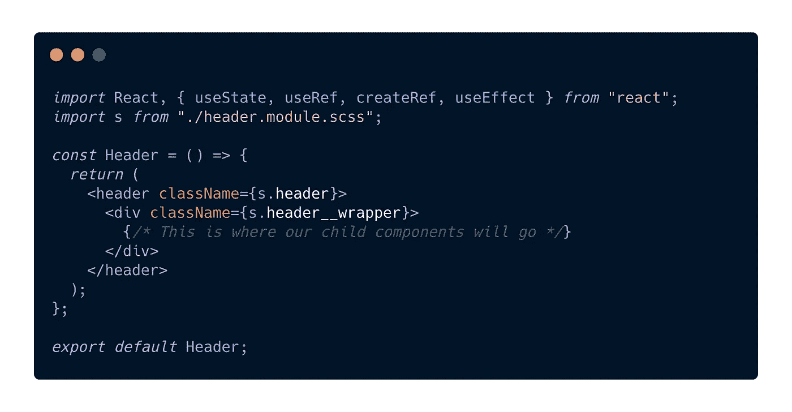

标题标记

*   如果你不熟悉 CSS 模块，你可能想知道类名是怎么回事。CSS 模块是这样工作的:你导入一个文件到一个组件中(随便你给它起什么名字，我选择了`s`，然后把这些名字放到你的组件中需要的地方。
*   您可以使用通用名称，坚持 BEM 架构，或者任何您喜欢的名称。我个人倾向于 BEM 风格，因为我喜欢嵌套在我的`scss`文件中以及它的样子。

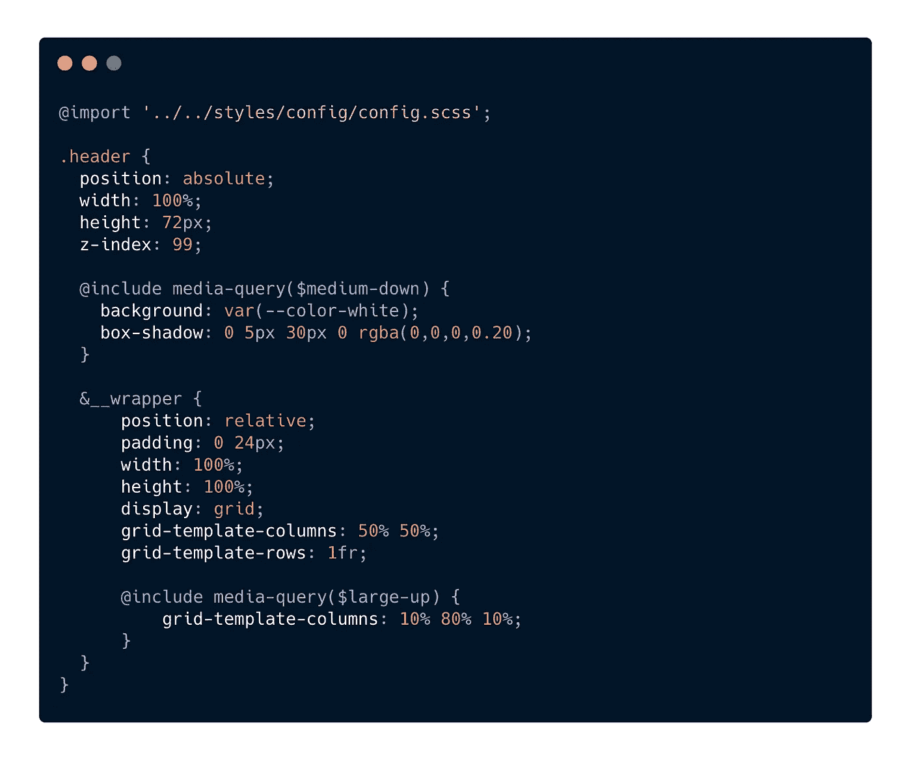

标题 SCSS

*   这里没发生什么疯狂的事。我会注意到我正在导入我的`config.scss`文件，所以我可以使用我的 mixins 和变量。

接下来，让我们构建`HeaderLogo`组件。我为我构建的站点上的几乎所有徽标使用 SVG，所以我最终会将一个 SVG 传递给这个组件来呈现:

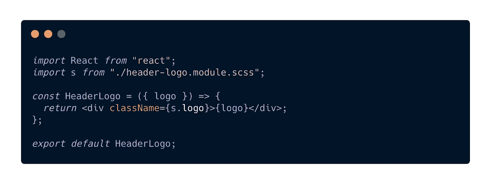

HeaderLogo 标记

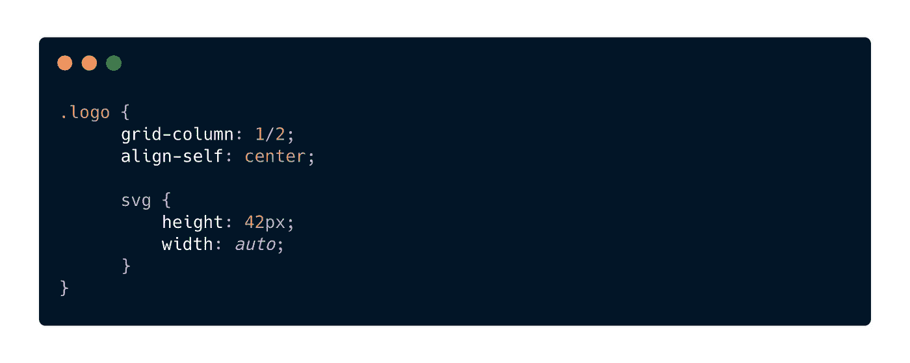

海德洛戈 SCSS

接下来是`HeaderNav`组件。现在，让我们在那里硬编码一些链接，这样我们就可以得到正确的样式。最后，我们将把项目传递给这个组件，并动态地呈现它们:

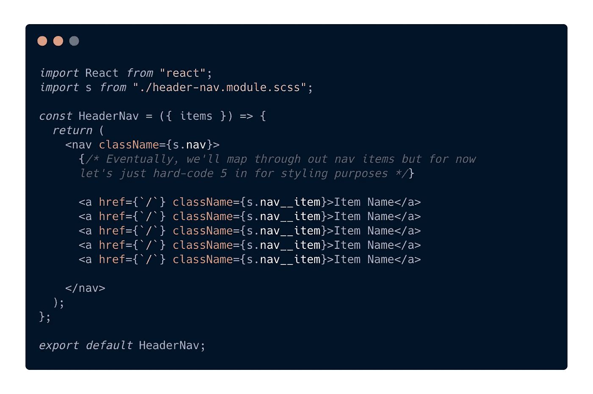

HeaderNav 标记

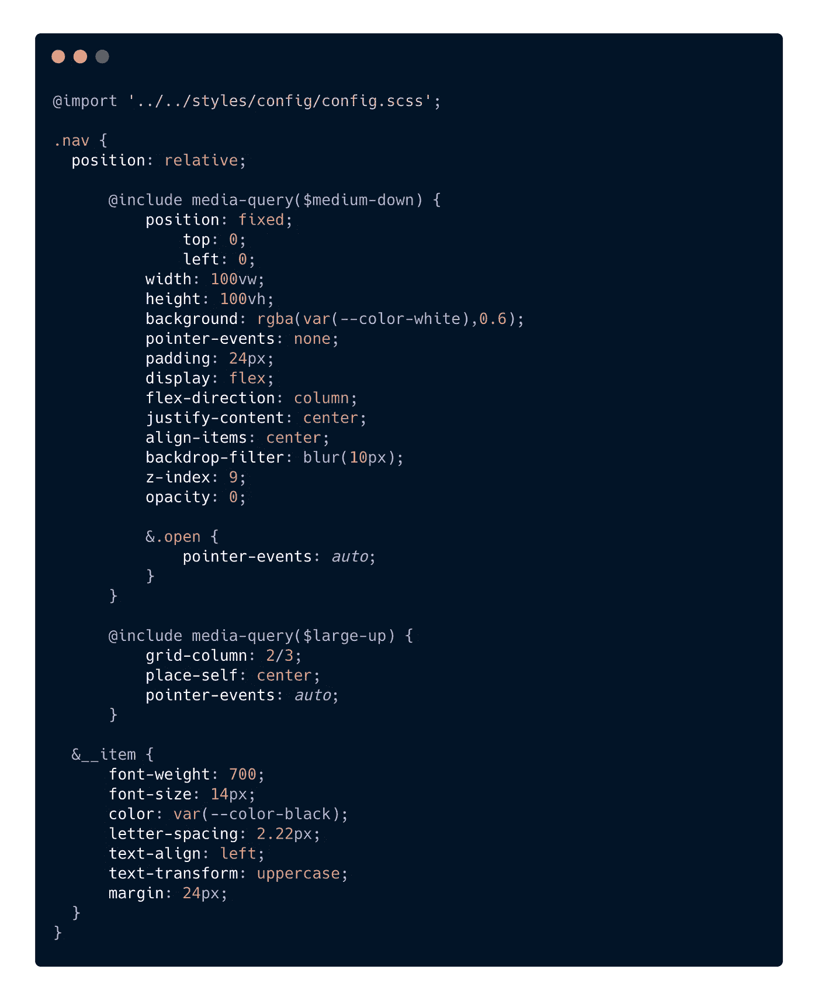

海德纳夫·SCSS

接下来是`HeaderBurger`组件。我们将使用 HTML 和 CSS 来构建它:

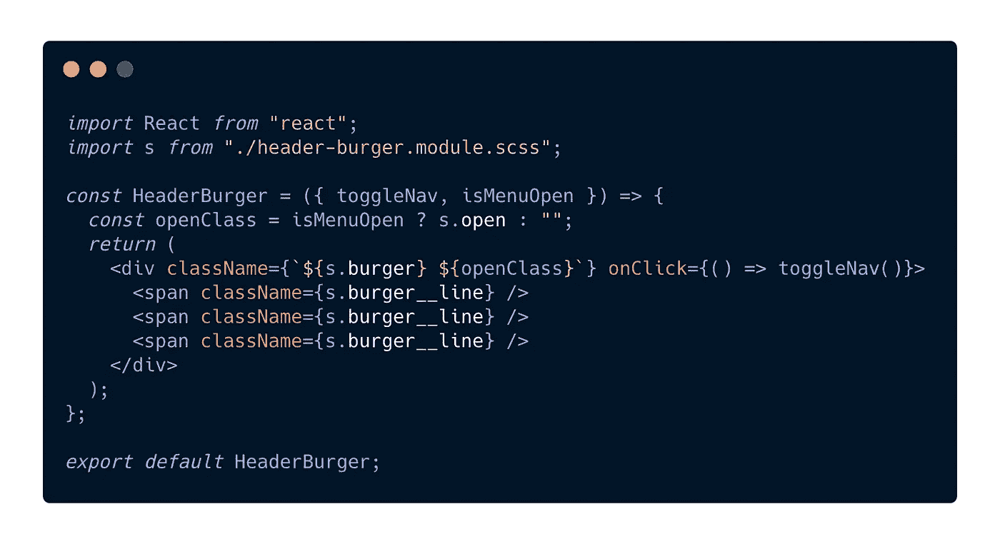

标题标记

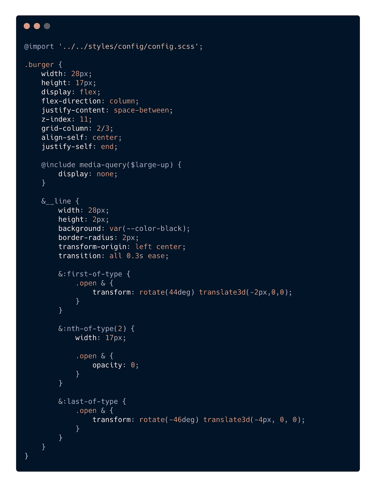

海德伯格·SCSS

*   最终，当导航打开时，我们将把它从一个标准的三行汉堡图标变成一个“X”。为此，我们最终将向我们的`burger`元素添加一个 open 类。
*   正如你所看到的，我已经添加了 CSS，当我们这样做的时候，它会适当的动画化。

既然已经处理好了，让我们开始添加功能。

# 第二步:初始功能

我们知道我们需要的两样东西是导航项目和徽标。因为这只是一个教程，所以我用我们将传递给`HeaderNav`组件的导航项设置了一个数组。您会注意到的另一件事是，我将 SVG 徽标作为 React 组件导入，然后将其传递给`ReactLogo`组件:

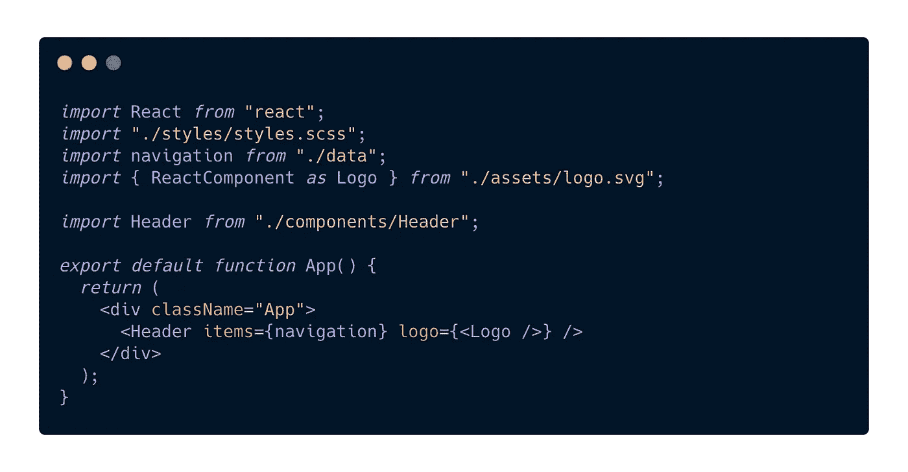

App.js

现在我们来看看`Header`组件。我们需要做的第一件事是导入子组件，并将数据放到它应该去的地方。一旦我们设置好，我们将在`HeaderNav`组件中映射我们的导航项目:

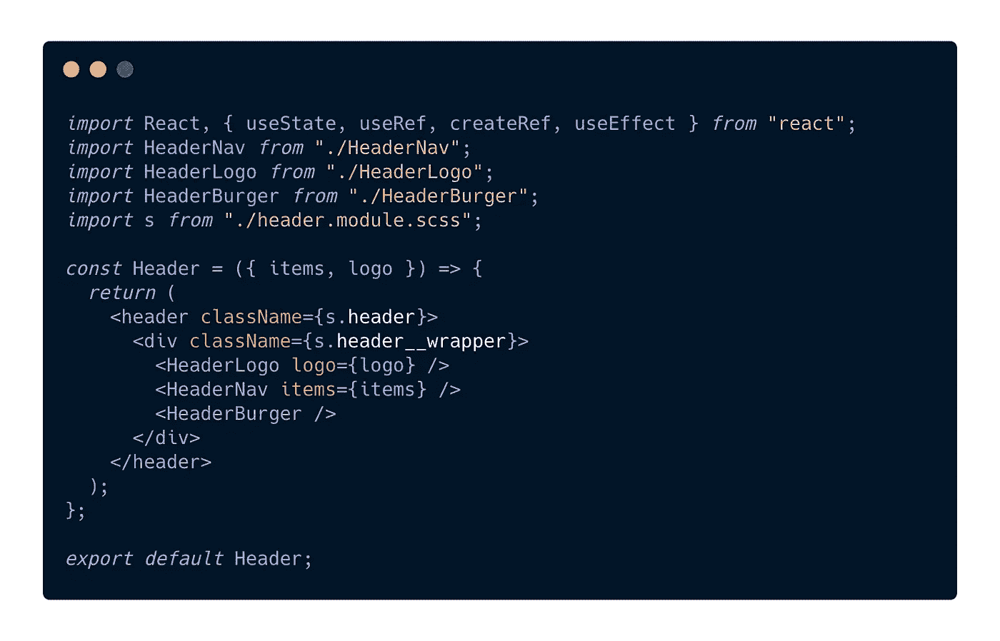

带有所有子组件的标题组件

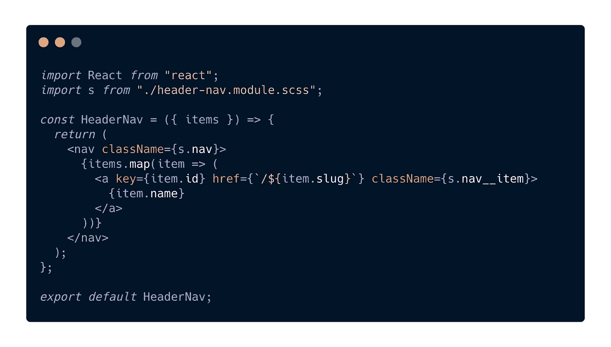

带有导航项目的 HeaderNav 组件

此时，我们能够通过`Header`组件将数据向下传递到正确的子组件。现在，我们需要开始构建功能，让我们能够动画。

# 第三步:制作汉堡动画

首先，我们需要使用钩子`useState`设置一些状态。然后我们需要创建一个可以调用`onClick`的函数来切换状态。一旦这些就绪，我们将需要将`isMenuOpen`状态传递给`HeaderNav`和`HeaderBurger`组件，并将`toggleNav`功能传递给`HeaderBurger`。在`Header`组件内部:

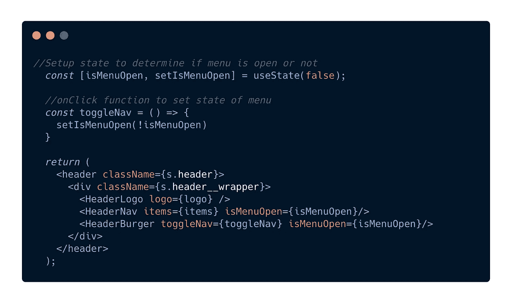

*   我们用`useState`设置初始状态。如果你不熟悉`useState`，那么**第一个元素**是**状态值**，它将被设置为`false`，而**第二个元素**是它的**更新函数**。
*   我们的`toggleNav`函数将简单地切换我们的`isMenuOpen`状态。
*   在我们的`HeaderNav`和`HeaderBurger`组件中，我们将使用`isMenuOpen`状态来添加或删除类`open`。对于我们的`HeaderNav`组件，该类只是切换指针事件。对于我们的`HeaderBurger`，该类将在`.burger__lines`上启动一个转换来创建一个`close`图标。

在这一点上，我们有一些状态和一个函数，每次它被调用时切换状态。您的菜单图标应该如下所示:

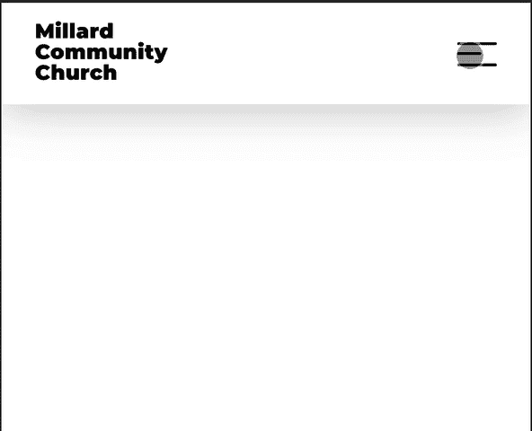

# 第四步:制作导航动画

我要做的动画是一个简单的`nav`元素的淡入淡出，然后是导航项目的交错淡入淡出。为了做到这一点，我们需要为这些元素设置一些`refs`。在`Header`组件内部:

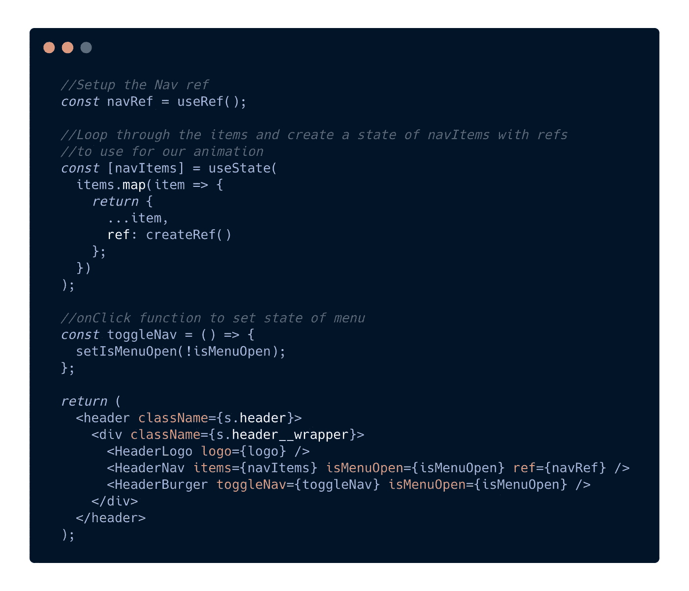

*   对于`navRef`，我们将使用`useRef`钩子并将其传递给`HeaderNav`。为了做到这一点，我们需要重构组件，这样我们就可以适当地转发`ref`。我们一会儿就来看看。
*   为了创建 nav 项的 ref，我们将创建一个名为`navItems`的新状态，方法是通过映射这些项，扩展我们已经有的内容，然后使用`createRef`添加一个`ref`。
*   首先，我们在这里使用`createRef`是因为我们不能在地图内部调用钩子。
*   第二，我们现在为每个物品设置了自己的`ref`,这样我们就可以在动画中错开它们。
*   我们还必须将我们新创建的状态`navItems`传递给`HeaderNav`。

现在让我们来看看`HeaderNav`:

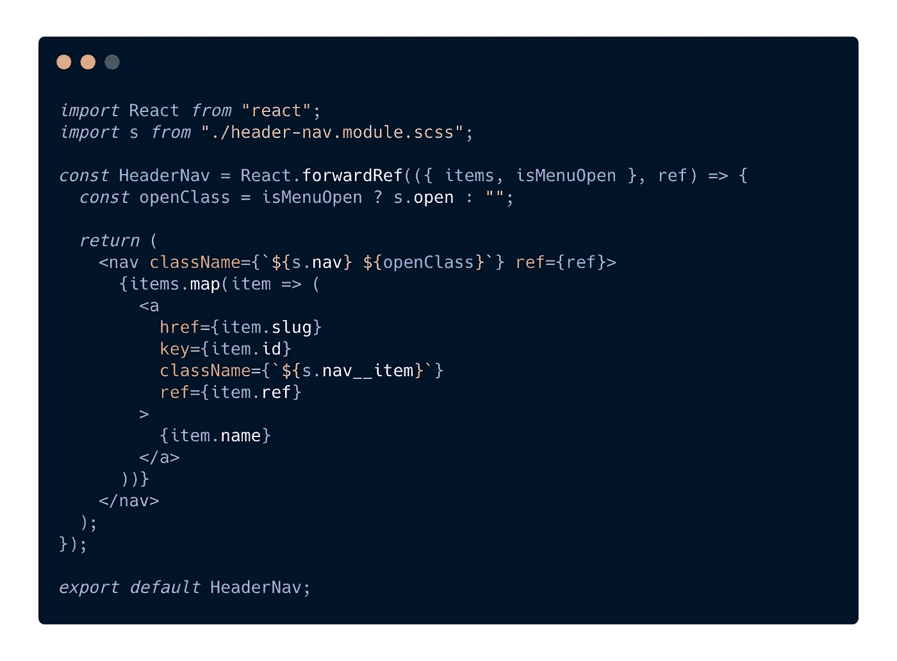

*   为了将`ref`传递给子组件，我们需要用`React.forwardRef`包装之前的组件。这需要两个论据。在我们的例子中，我们利用 ES6 并析构`props`和传递`ref`。
*   接下来，我们需要给每个`item`添加一个引用。

现在我们已经设置了 refs，我们需要设置我们的时间表。为此，我们首先将`gsap`导入到我们的`Header`组件中。接下来，我们需要在我们的`Header`中初始化一个时间线:

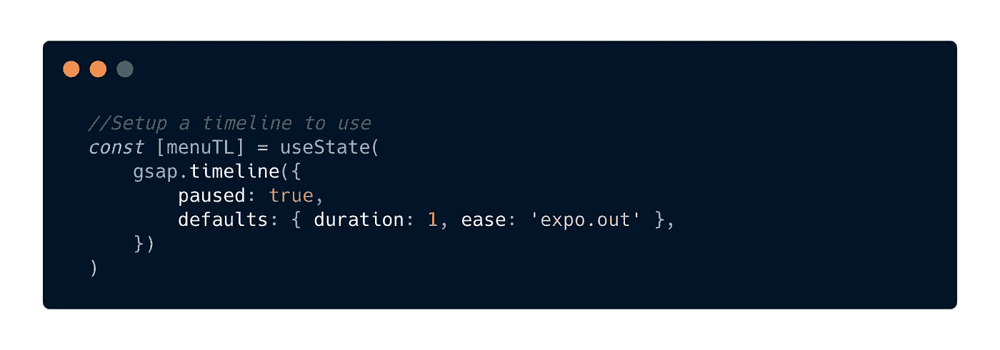

GSAP 时间表

*   我们在这里所做的就是使用`useState`建立一个 GSAP 时间轴。
*   重要的部分是我们传递到时间线中的选项。
*   首先，我们告诉时间轴从暂停状态开始。
*   第二，我们传递一些默认参数，这样我们就不必每次都重新输入它们。如果你知道你会一遍又一遍地使用某些值，这是非常好的。这些也可以在你需要的时候被覆盖。

`Refs`被设定。时间线被启动。现在让我们建立时间线。再次，在`Header`里面:

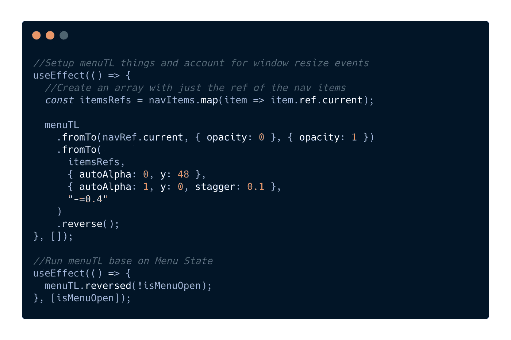

*   这里，我们将在`useEffect`钩子内部构建时间轴。如果你不熟悉的话，它基本上是所有生命周期方法的集合。
*   此时，忽略关于调整事件大小的注释。我们很快会谈到这一点，但是现在，让我们传递一个空数组作为`useEffect`的第二个参数。这只是告诉 React 在组件挂载时运行一次。
*   首先，让我们创建一个仅包含`navItems refs`的数组。这非常简单，只是不要忘记添加`.current`。我总是忘记！
*   接下来，我们开始将时间线事件链接在一起。记住，我们已经为这个时间线设置了默认的`duration`和`ease`，所以我们不必担心这些，除非我们想覆盖它们。最后，我们立即反转时间线。
*   我们要做的下一件事是设置一种方法来以正确的方向(向内或向外)播放动画。再次使用`useEffect`。这一次，我们将把`isMenuOpen`状态作为第二个参数传入。这将告诉 React 在状态改变时运行代码。
*   这句台词`menuTL.reversed(!isMenuOpen)`等于说:

```
if (tl.reversed()) {
    tl.play();
} else {
    tl.reverse();
}
```

此时，您应该有一个如下所示的动画:

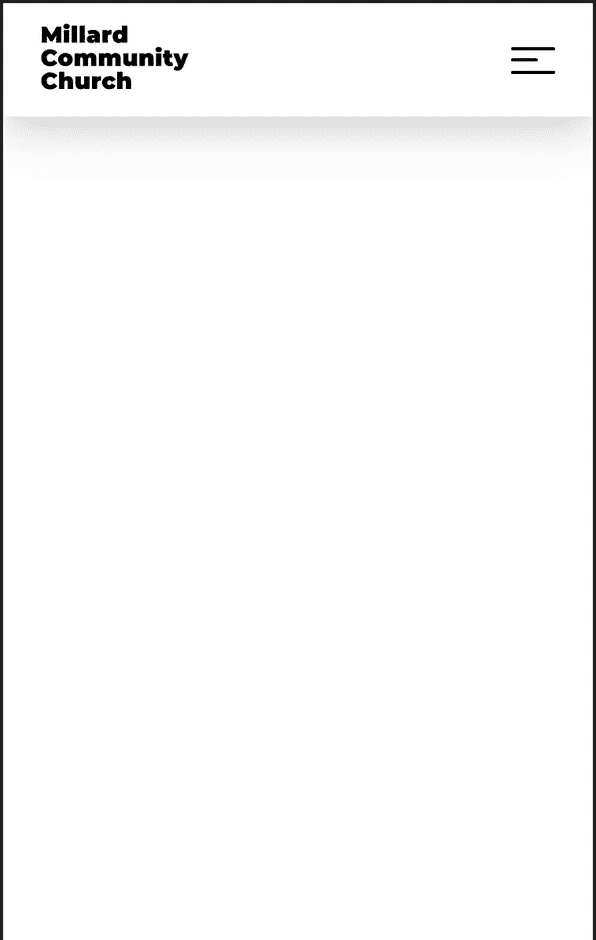

但是，您可能注意到桌面上的导航不再可见。这是因为无论屏幕大小如何，我们都是在组件安装时设置时间线。这意味着我们将 0 的不透明度应用到`nav`和`nav__items`。因此，让我们把时间线值设置为仅当我们在移动设备上时应用。当我们在那里时，我们也将考虑调整大小事件。

为了检查屏幕大小，让我们构建一个自定义钩子。听起来很有趣。在我们的`hooks`文件夹中，让我们创建一个`index.js`文件和一个`useMediaQuery.js`文件。我们可能不需要这样设置，因为我们只有一个钩子，但是我喜欢我所有的钩子都在它们自己的文件中。在我们的`useMediaQuery.js`文件中:

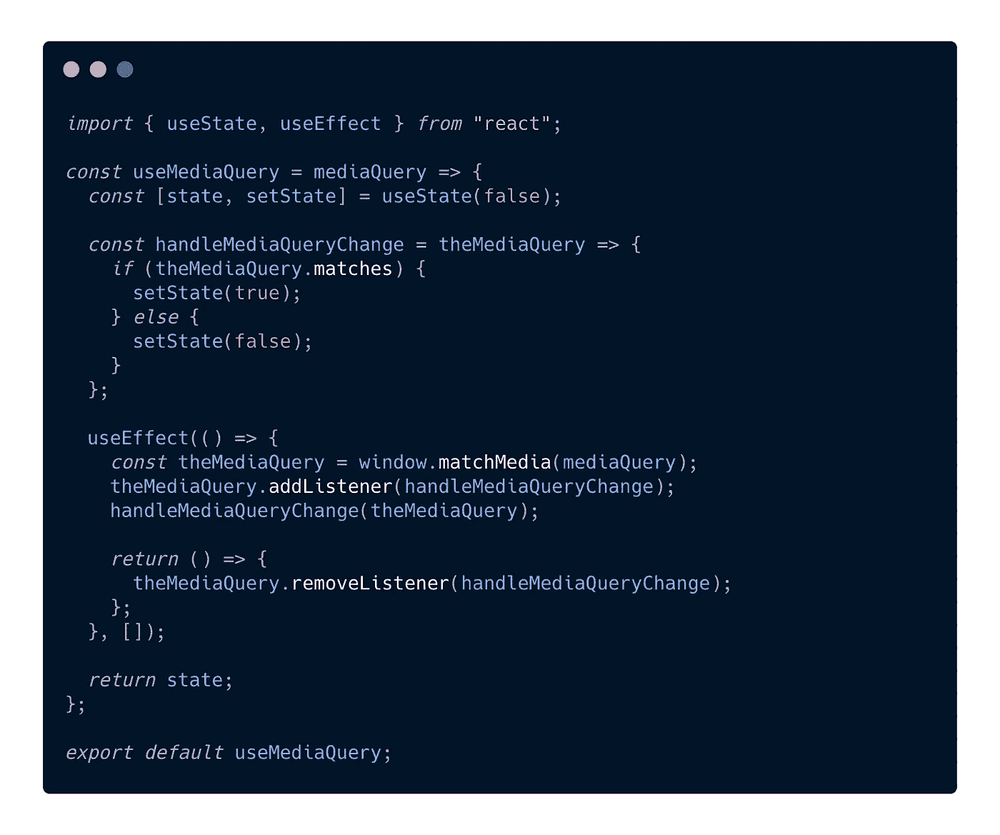

使用 MediaQuery 挂钩

*   在我们的钩子内部，我们使用了`windows`T5 方法。该方法接受任何传统的 CSS 媒体查询作为参数。
*   如果你不熟悉`useEffect`，这里需要注意的另一件事是内部的`return`。一旦组件被卸载，这是我们清理任何需要的东西的一种方法。在我们的例子中，我们正在删除侦听器。

让我们将这个挂钩导入到我们的`Header`组件中，并在构建时间轴的地方重构代码:

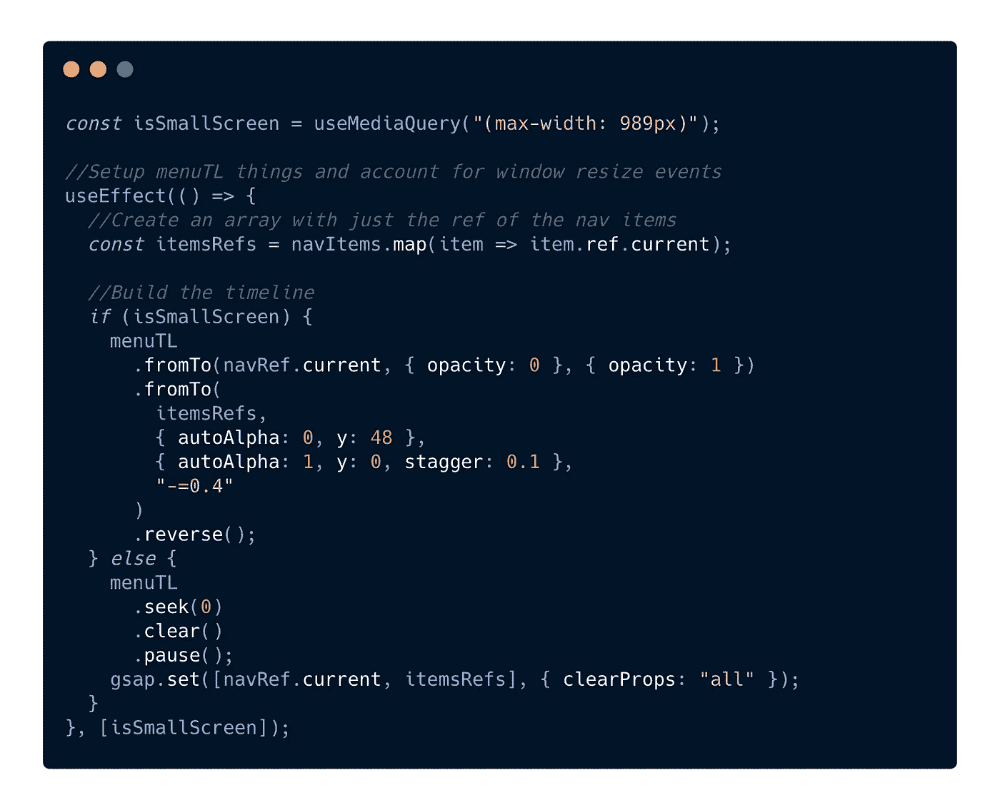

*   首先，我们需要调用新的`useMediaQuery`钩子，并向它传递我们想要观看的媒体查询。
*   接下来，我们将告诉`useEffect`注意`isSmallScreen`的任何变化。如果是，它将重新运行代码。
*   接下来，如果`isSmallScreen`为真，我们将使用一个简单的 if 语句来构建时间轴。如果它是假的，我们将告诉`menuTL`回到开始，清除所有补间，然后将其设置为暂停。
*   最后，我们需要确保我们清理了任何可能已经通过`menuTL`设置的内联样式。这将有助于如果有任何调整事件正在进行。我们将利用`set`方法，传入`navRef`和`itemsRefs`，并使用`clearProps`来清理这些内联样式。

此时，导航应该有相应的响应和动画。如果这是一个有真实页面的真实网站，你会想把`toggleNav`函数传递给每个导航项。这样，导航在页面切换时也会显示动画。

虽然这对于我正在进行的项目来说已经足够了，但是我想让它变得更加便携。为了做到这一点，我们需要允许更多的参数，更新一些 CSS，并重构一些代码。

# 第五步:让它更便携

我在想我们应该设置一个叫做`navPosition`的道具，接受三个选择中的一个:`right`、`center`或者`overlay`。这些选项仅适用于桌面及更高版本。`Center`将它保持在当前的位置(这将是我们的默认设置)，`right`将导航推到右边，`overlay`将保持它是一个完整的覆盖菜单。

首先，让我们安装并导入`PropTypes`到我们的`Header`组件中。这将允许我们设置一些关于传递给组件的道具的参数。就在我们的`export`之后:

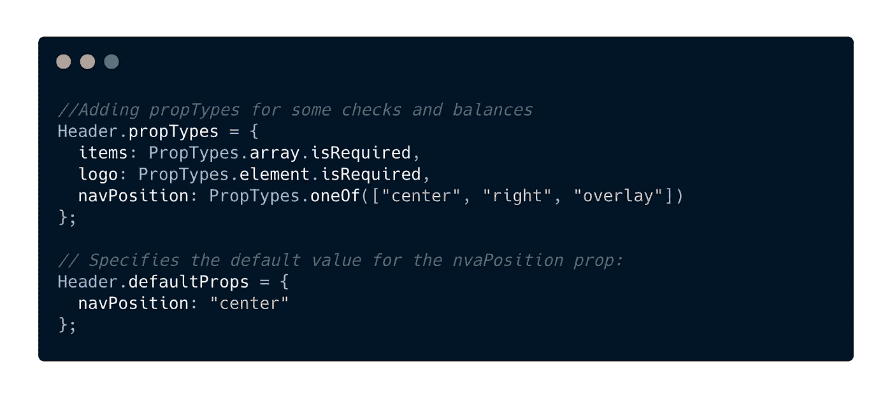

添加一些 PropTypes

*   这里我们说`items`属性是必需的并且必须是一个数组，`logo`属性是必需的并且必须是一个有效的 React 元素，`navPosition`属性只能是三个属性中的一个——中心、右侧、覆盖。
*   我们还为`navPosition`元素设置了一个默认值“中心”。

有了这些，我们可以开始进一步建设。让我们首先进行必要的 CSS 修改。为此，我们将在`header__wrapper`上添加一个`data-nav-position`属性，并将其值设置为`navPosition`:

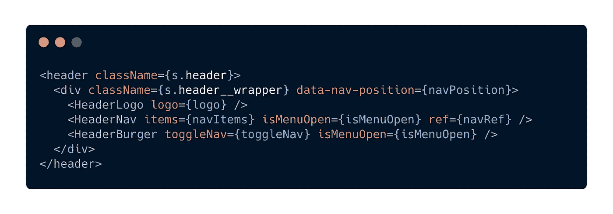

现在，我们可以将 CSS 中的特定数据值作为目标:

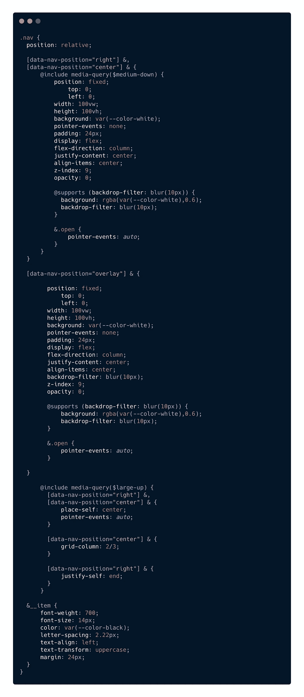

*   这里没什么特别的。我们只是针对特定的`data-nav-position`值，并相应地设计它们的样式。
*   需要注意的一点是，我们将`backdrop-filter`移到了`@supports`规则中。还不是每个浏览器都接受这一点，所以我们需要把它当作一个渐进的增强。
*   我们需要做的最后一个 CSS 修改是对`HeaderBurger`组件的修改。如果`navPosition`是`right`或`center`，我们只需要告诉汉堡藏在`desktop`上。

既然我们的样式已经设置好了，我们需要做的最后一件事就是根据`navPosition`值为时间轴添加一些逻辑。在我们的`Header`组件内部:

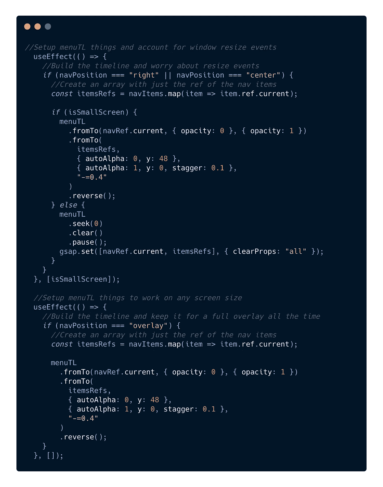

*   在我们已经有的`useEffect`内部，我们只需要检查`navPosition`是否等于右或左。如果是，我们可以运行代码。
*   接下来，我们需要再次使用`useEffect`钩子，这次检查`navPosition`是否等于 overlay。如果是真的，我们将只设置时间线，就是这样。
*   你可能会问为什么不先运行`navPosition`检查，如果是真的话再运行`useEffect`钩子。我也是这么想的，但是钩子的一个规则是永远不要有条件地渲染一个钩子。相反，在钩子内部运行条件。

# 就是这样！

我们现在有一个完全响应的标题，在移动设备上有动画导航。我们还可以将一些值传递到组件中，以改变桌面屏幕上的导航位置。

希望你在这个过程中学到了一些东西，这篇文章将成为你下一个项目的资源/灵感。