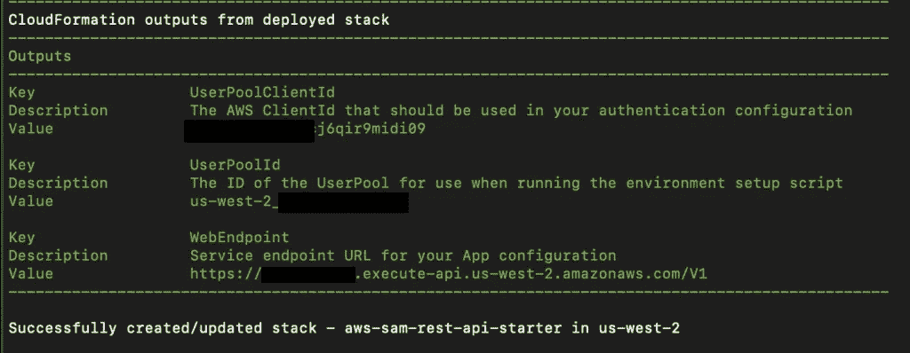

# 用 TypeScript 在 AWS 中用 5 分钟构建一个 REST API

> 原文：<https://levelup.gitconnected.com/build-a-rest-api-in-aws-with-typescript-in-5-minutes-51cdeb3bd9ed>


照片由[达科塔·鲁斯](https://unsplash.com/@dakotaroosphotography?utm_source=unsplash&utm_medium=referral&utm_content=creditCopyText)在 [Unsplash](https://unsplash.com/s/photos/framework?utm_source=unsplash&utm_medium=referral&utm_content=creditCopyText) 拍摄

有很多方法可以在 AWS 上设置 REST API。这个入门项目会节省你的时间。仅使用 AWS 服务，您可以在 5 分钟内使用 TypeScript 在 AWS 上轻松定制 REST API 设置。

您将要设置的服务的完整源代码可以在 GitHub 上找到: [aws-sam-rest-api-starter](https://github.com/jorshali/aws-sam-rest-api-starter) 。这个 starter 项目为一个名为 BLOG_POST 的数据库表创建了一个简单的 CRUD 服务。部署完成后，将公开以下 REST API:

*   **POST /blogposts —** 从 JSON 主体创建一个新的 BLOG_POST 记录
*   **GET /blogposts** —检索所有 BLOG_POST 记录
*   **GET /blogposts/:id** —检索具有给定 id 的 BLOG_POST
*   **PUT /blogposts/:id** —使用 JSON 主体通过 id 更新 BLOG_POST 记录上允许的属性
*   **删除/blogposts/:id** —删除具有给定 id 的 BLOG_POST 记录

starter 项目生成的 REST API 可以在 AWS 中用下图表示:


图 CloudFormation 将生成的 REST API 的 AWS 表示。

starter 项目很容易修改以满足您自己的需要。下面是 starter 项目所提供内容的快速总结:

*   标准化项目结构
*   在 TypeScript 中编码的 Lambda 函数
*   使用 DynamoDB 访问 NoSQL 数据库
*   通过 API 网关安全公开的 HTTP 服务方法
*   使用 Cognito 和自定义授权进行身份验证
*   预定义的 IAM 访问角色
*   使用 AWS SAM 和 CloudFormation 的全自动部署

如果您想了解 AWS 和本指南中使用的技术，请继续阅读。如果您只想尽快使用 TypeScript setup 获得一个 REST API，那么在开始使用之前，请跳到:**。**

# 介绍

AWS 以[无服务器计算](https://focus.dev/4-ways-serverless-accelerates-your-digital-transformation/)引领潮流。随着竞争的加剧，AWS 平台不得不不断发展，增加服务项目并改变建议。

这就导致了网上很多互相矛盾的信息和过时的教程。这也导致了大量的技术选择，很难涉水而过。

本指南的重点是通过结合以下 AWS 服务来快速设置 REST API:

*   AWS 无服务器计算服务，允许你在不管理服务器的情况下运行代码。
*   [DynamoDB](https://aws.amazon.com/dynamodb/) :面向 AWS 的易于管理的 NoSQL 数据库服务。
*   [API 网关](https://aws.amazon.com/api-gateway/):AWS 服务，允许您创建、维护和保护 API。
*   [cogn ITO](https://aws.amazon.com/cognito/):AWS 身份和访问管理平台。
*   [cloud formation](https://aws.amazon.com/cloudformation/):AWS 基础设施即代码(IAC)服务，用于自动化您的代码部署。
*   [AWS SAM](https://aws.amazon.com/serverless/sam/):AWS 无服务器应用模型(AWS SAM)使得在 AWS 上快速构建无服务器应用变得容易。

这种产品组合是我们通常向寻求通过云平台公开服务的初创公司推荐的。它们提供了低成本的入门和快速的开发，同时随着产品的发展提供了极大的灵活性。

该项目使用 AWS SAM 来完全自动化 REST API 的部署。所有基础设施需求和部署细节都是通过其 IaC(基础设施即代码)模型设置的。如果您是开发运维及部署自动化的新手，或者只是想复习一下，您可以[在这里](https://focus.dev/why-i-spend-more-on-coffee-than-devops/)了解更多信息。

# 在开始之前

首先，你需要一个 AWS 账户。如果你没有，你可以[在这里](https://aws.amazon.com/)注册一个。

您还需要一个本地部署概要文件。此配置文件允许您从命令行界面(CLI)对 AWS 执行操作。如果你还没有创建一个，你可以[按照这些指示到达那里](https://docs.aws.amazon.com/cli/latest/userguide/cli-configure-profiles.html)。

如果您已经有了一个帐户，并且您想专门为本教程创建一个开发环境，您可以[遵循本指南](https://focus.dev/serverless-patterns-creating-deployment-environments-in-aws-with-organizations/)。本指南还将向您展示如何创建一个开发、测试和生产环境，以便您可以安全地将软件从测试过渡到生产。

# 安装基础

准备好目标 AWS 环境后，您需要设置本地开发环境:

*   [Git](https://github.com/git-guides/install-git)
*   [AWS CLI](https://docs.aws.amazon.com/cli/latest/userguide/getting-started-install.html)
*   [山姆 CLI](https://docs.aws.amazon.com/serverless-application-model/latest/developerguide/install-sam-cli.html)

在本教程的后面，我们将安装一些面向开发的细节，但是这里我们只关注 REST API 的启动和运行。

# 设置项目

一旦安装了必要的先决条件，就可以使用以下命令设置项目:

```
$ mkdir <project-directory>
$ cd <project-directory>
$ sam init --location git@github.com:jorshali/aws-sam-rest-api-starter.git
```

起始项目现在可以在您指定的项目目录中找到。

# 构建项目

确保您已经选择了要部署到的概要文件。所有工件都将在此帐户中创建。例如，在 Mac 上:

```
$ export AWS_PROFILE=<my-deployment-profile>
```

使用 AWS SAM 构建环境:

```
$ sam build --beta-features
```

**注意:**beta-features 标志是必需的，因为我们使用的是 TypeScript。

# 将项目部署到 AWS

现在，您可以使用选择的配置文件部署到您的环境中:

```
$ sam deploy --guided
```

在部署过程中，除了**堆栈名称**之外，建议使用默认设置。您可以将**堆栈名称**定制为特定于您的项目的名称。

部署完成后，它将打印出 3 个结果:



图 2:部署 aws-sam-rest-api-starter 的预期输出。

保留这些值，因为数据设置和调用应用程序需要它们。

现在，您可以登录并浏览 AWS 控制台，查看已安装的各种组件。例如，您会在 Lambda 控制台中找到 **blogPostsFunction** 。


图 Lambda 控制台中的 blogPostsFunction。

# 设置样本数据

有几个包含的脚本，用于为初始测试设置带有默认数据的环境。这些命令将要求项目构建提供一些信息。

在项目目录中，只需运行以下命令并完成提示:

```
$ sh scripts/setup.sh
```

一旦设置好数据，您可能想要添加一个用户。这可以通过再次遍历提示，使用以下命令来完成:

```
$ sh scripts/add-user.sh
```

**注意:**如果您无法在您的环境中运行 shell 脚本，您可以在脚本中手动执行 CLI 命令。

# 在本地运行服务

您可以使用 Docker 在本地测试您的服务。你可以在这里安装 Docker。安装 Docker 后，您可以使用以下命令在本地启动项目:

```
$ sam build
$ sam local start-api
```

# 设计机构

本指南完全专注于在 AWS 上快速启动和运行 REST API 服务。在接下来的系列文章中，我将带您了解更多的项目细节。

如果您想立即开始定制项目，这里有一个项目结构的快速纲要。你可以在[和](https://code.visualstudio.com/download)的项目根目录下浏览这段代码:

*   [template.yml](https://github.com/jorshali/aws-sam-rest-api-starter/blob/main/template.yml) :定义服务需求的云生成模板。如果您想定制 REST API URL、DynamoDB 表定义等，这是一个好地方。
*   [blogposts](https://github.com/jorshali/aws-sam-rest-api-starter/tree/main/blogposts) :包含 blogposts 函数的代码。您可以在这里找到 package.json 依赖项定义、TypeScript 文件和常规配置。
*   [blogposts/index.ts](https://github.com/jorshali/aws-sam-rest-api-starter/blob/main/blogposts/index.ts) :处理所有/blogposts 请求的 TypeScript 函数。您可以将此作为您自己的服务或试验您自己的功能的基础。

如果您想设置一个调用您的新 REST API 的 UI，您可以克隆支持项目:[AWS-react-bootstrap-starter](https://github.com/jorshali/aws-react-bootstrap-starter)并遵循自述文件。这个项目将使用 Cognito APIs 登录，然后调用您的新 REST API。

如果你喜欢这篇文章，请鼓掌。关注我，以便在我的下一期发布时获得通知！

*最初发布于 2022 年 12 月 1 日*[*https://focus . dev*](https://focus.dev/build-a-rest-api-in-aws-with-typescript-in-5-minutes/)*。*