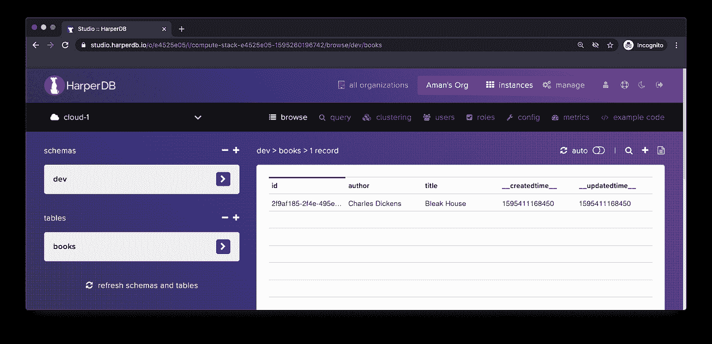

# 用 Node.js 和 HarperDB 构建 REST API

> 原文：<https://levelup.gitconnected.com/build-a-rest-api-with-node-js-and-harperdb-5d5b4cf06c91>

如果您正在使用 Node.js 构建一个应用程序，这可能会有点让人不知所措，因为有各种各样的数据库可供选择，并且有不同的方法来构建 API。减少开发时间并专注于您试图解决的问题的一种方法是使用数据库作为存储数据的服务。这种方法的优点是使用云数据库系统，而不需要购买硬件，这样可以节省成本和时间。

一个这样的数据库服务是 [**HarperDB 云**](https://harperdb.io/developers/get-started/?utm_source=amanmittal) 。为了快速构建 REST APIs，该服务允许我们使用单个端点来执行所有数据库操作。它支持多种编程语言，如 JavaScript、Java、Python 等。HarperDB 的一些功能如下:

*   单端点 API
*   允许 JSON、CSVs 文件插入
*   支持完整 CRUD 操作的 SQL 查询
*   支持 Math.js 和 GeoJSON
*   需要有限的数据库配置

在本文中，让我们使用 Node.js 和 HarperDB Cloud 构建一个简单的 REST API 来存储一些数据。我们还将使用 [Express](https://expressjs.com/) 作为构建 Node.js 服务器的框架。这是一个最小的、非常不独立的框架。

# 先决条件

在开始本教程之前，您需要以下内容:

*   [Node.js](https://nodejs.org/) 版本高于安装在本地机器上的`12.x.x`
*   访问包管理器，如 npm 或 yarn
*   基本的 JavaScript 和 ES6 知识
*   访问 REST API 客户端，如[邮递员](https://www.postman.com/)或[失眠](https://insomnia.rest/)
*   访问 [HarperDB 云](https://harperdb.io/harperdb-cloud-get-started-today/)实例(*自由层*)

要继续本教程的其余部分，请确保您拥有 HarperDB Cloud 帐户并已登录。

# 入门指南

首先在本地开发环境中创建项目目录。给这个目录起一个名字并导航到它。然后，初始化这个项目，通过创建一个`package.json`文件来管理 npm 依赖项。

从您可能已经设置的 npm 配置中初始化`package.json`时，`--yes`标志使用默认设置。

在初始化步骤之后，让我们添加一个 express 包。在终端窗口中，运行命令:

接下来，用下面的代码在项目的根目录下创建一个名为`index.js`的新文件来触发一个最小服务器:

在上面的代码片段中，`app`是 Express API 为开发人员提供的对象，用于与应用程序通信和引导服务器。

回到终端，触发普通`node index.js`启动服务器。这个`node`命令是用 Node.js 构建 API 时触发开发服务器的最简单方式。出于演示目的，我将使用[失眠](https://insomnia.rest/)。

您可以通过调用`http://localhost:8000`来测试 API 端点，它将返回如下所示的结果。

# 用 nodemon 观察文件变化

在 Node.js 项目上节省时间的一个重要的开发相关实用程序库是 [nodemon](https://www.npmjs.com/package/nodemon) 。这是一个帮助开发基于 Node.js 的应用程序的工具，当检测到目录中的文件更改时，它会自动重新启动 Node 应用程序。

要在当前的 Express 服务器中开始使用它，使用`yarn add -D nodemon`安装它，其中`-D`标志用于指示要安装的依赖项是一个`devDependency`。安装这个开发依赖项后，打开`package.json`文件并添加一个启动脚本，如下所示。

现在，您可以使用`npm run start`或`yarn run start`命令来触发服务器。使用 Express framework 设置一个基本的 Node.js 服务器就可以了。

# 设置 HarperDB 云的实例

在本文的介绍部分，您将了解什么是 HarperDB 云及其支持的特性。在本节中，让我们使用这个云数据库服务创建第一个数据库实例来存储 REST API 的数据。

假设到现在为止，您已经访问了主仪表板屏幕，如下所示。要创建新实例，请单击加号按钮。

然后选择 HarperDB 云实例选项。

填写有关实例的详细信息。确保创建一个强密码，并在 Instance Credentials 下给出一个更好的用户名(为了简洁起见，我将它们保持简单)。

如果您在自由层，将下面屏幕中的所有内容保留为默认选择，然后单击按钮`Confirm Instance Details`。

输入详细信息后，将要求您重新确认您输入的所有实例详细信息，如果一切正常，请按`Add Instance`按钮。

请务必记住您在此输入的用户名和密码。它们将被要求向 HarperDB 客户端验证 Node.js 服务器。一旦创建了云数据库的实例，它将如下所示。

您可以从 UI 中单击实例卡，它将出现在第一个欢迎添加模式的屏幕上。

HarperDB 中的模式是必需的。它相当于表的集合。没有现有的模式，就不能创建新表，没有表，就不能从 HarperDB 实例添加或更新数据。要继续，必须创建模式和表。用 UI 界面来做吧。

在左侧，在标题下写下第一个模式的名称。

一旦创建了模式，就会出现添加一个或多个表的选项。让我们创建第一个名为`books`的表，如下所示。除了表名之外，HarperDB 还要求为一个`hash_attribute`输入或分配字段。这个属性相当于表`books`中每个记录的唯一标识符。传统上，大多数数据表都将`id`作为惟一标识符，因此它是作为值传递的。

现在已经成功创建了模式和表。

让我们保存 Node.js 服务器连接到数据库所需的所有凭证。在项目的根目录下创建一个带有 for 键的`.env`文件，如下所示。

您将在这里添加您自己的 HarperDB 实例值。如上所示，不要对每个键使用相同的值，因为这样做是行不通的。这只是为了证明这些值没有用引号括起来。

# 将 HarperDB 云与 Nodejs 服务器连接

为了连接上一节中创建的 HarperDB 云实例，让我们安装一个名为[Harper rive](https://github.com/chandan-24/Harperive#readme)的依赖项，它将让我们通过执行 CRUD ( *Create、Read、Update、Delete* )操作来与数据库进行交互。返回终端窗口，运行命令:

安装完依赖项后，创建一个名为 config 的新目录，并在其中创建一个名为`dbconfig.js`的新文件。

要连接到数据库实例，您需要三样东西:

*   数据库实例 URL
*   数据库实例用户名
*   数据库实例口令

在前一节结束时，所有这些值都作为环境变量保存在一个`.env`文件中。使用`dotenv`包，现在可以通过 Node.js 服务器应用程序访问这些环境变量。在`dbconfig.js`文件中，首先导入`dotenv`包，然后导入`harperive`。创建一个将作为参数传递给`harperive.client`的`DB_CONFIG`对象。`DB_CONFIG`对象中的`schema`字段是可选的。由于这个演示应用程序只有一个模式，因此，为了避免在向数据库发送查询时反复提到模式字段，可以在这里传递它的名称。

将下面的代码片段添加到`dbconfig.js`文件中。

导出实际 HarperDB 客户机的`db`实例将允许我们查询数据库。

# 设置正文解析器

要设置服务器应用程序的路由或端点，您需要在`index.js`中包含`body-parser`。

BodyParser 将传入的 HTTP 请求解析为`req.body`下的中间件，然后路由或 API 才能访问它们并对它们执行任何进一步的操作。在 web 应用程序中使用表单时，这是非常有用和必要的一步。

上面代码片段中的`urlencoded`方法允许 body-parser 中间件从表单字段中提取数据。在 Postman 或失眠症患者这样的 REST 客户端中，可以将数据作为表单字段发送。`json`方法允许提取 JSON 数据。

# 添加新记录的查询

由于数据库没有任何记录，让我们从编写第一个查询开始，在数据库中插入新数据。创建一个名为`api/`的新目录，并在其中创建一个名为`index.js`的新文件。打开 index.js 文件，从`config/dbconfig.js`文件导入`db`。

HarperDB 的主要优势之一是从数据库实例中查询数据。它允许我们以 SQL 查询或 NoSQL 查询的形式查询数据。这里的优点是复杂 SQL 查询的能力可以很容易地用于执行操作。我将在 NoSQL 表单中定义所有的查询，但是，不要忘记查看官方文档以获得更多关于执行 SQL 查询的信息[这里](https://docs.harperdb.io/?version=latest#0b5f3698-60fc-4783-b736-b510d6063996)。

第一个查询将被称为`addBook`。这个查询将插入来自 HTTP 请求的数据。

上面代码片段中的每个查询函数至少有两个参数:`request`和`response`。

*   `request`:在创建或更新新任务以及从主体中读取数据时非常有用(这正是 BodyParser 的魅力所在)。
*   `response`:用服务器的响应来完成传入的请求。通常，它包含 HTTP 状态代码的正确状态代码。这个 HTTP 状态代码确定传入的请求是否被满足，或者是否有错误。这是 REST 范式的一部分，被认为是最佳实践。

使用 NoSQL 查询插入数据时，必须指定数据库中表的名称。在当前情况下为`books`。由于您已经在使用 HarperDB 客户端创建连接时指定了模式，所以没有必要在这里显式定义它。HarperDB 中的`records`类似于数据行，将每个字段作为一列。

您可能已经注意到，在上面的查询中，我没有显式地添加一个`id`属性来惟一地标识每个数据记录。HarperDB 自动为每个数据记录创建一个唯一的`id`。

这里插入的数据有两个字段。每本书的`title`和`author`。它们表示每个数据记录中的列或属性的名称。每个字段的值都将是来自 HTTP 请求的传入值，由`body-parser`中间件函数解析。

# 运行第一个查询来插入数据

为了在数据库中插入第一条数据记录，我们创建一条路线。打开根目录下的`index.js`文件，将`api`导入为`routesController`。控制器是 Express framework 应用程序中的命名约定。业务逻辑将下面将要定义的端点/路由绑定到它们将对特定路由上的传入请求执行的动作或操作。

回到 REST 客户端，确保 Node.js 服务器正在终端窗口中运行。

添加端点`http://localhost:8000/books`，选择请求类型`POST`。选择选项`Form URL encoded`和如下所示的两个键值对:

如果发出将数据插入 HarperDB 的 HTTP 请求，按下`Send`按钮。如果成功，将返回如下所示的成功消息。

回到 HarperDB 工作室，您将看到显示的相同数据记录。

请注意两个时间戳字段。它们由 HarperDB 自动插入并自动维护。

*   `__createdtime__`:记录插入数据时的时间戳。
*   `__updatedtime__`:记录任意数据字段最后一次更新时的时间戳。

尝试向数据库中添加更多的值。

# 按值搜索的查询

HarperDB 允许通过使用列字段名(也称为`attribute`)来搜索表中的数据库记录。让我们添加另一个查询，在发送 HTTP 请求时，只需搜索作者的名字就可以获得数据记录。打开`api/index.js`文件和以下内容:

从数据库返回的数据将是 JSON 格式的。返回主`index.js`文件，添加另一条路线。

打开 REST 客户端并发出请求，如下所示。这个 HTTP 请求的响应将是包含属性`author`值的每个数据记录。

# 通过哈希进行搜索的查询

在表中搜索数据的另一个重要方法是通过唯一标识符。HarperDB 有一个特殊的方法来做同样的事情。这个方法叫做`searchByHash`，只允许我们使用指定为具有属性的标识符来搜索数据库表。在`api/index.js`文件中，添加另一个名为`getById`的查询。

当这个查询成功运行时，来自数据库的结果将只显示数据记录的`title`属性。在上面的代码片段中，这是通过将属性的名称作为`attributes`属性的值来传递的。

在主`index.js`文件中添加端点。

转到 REST 客户端并运行查询。

# 查询删除数据记录

在 HarperDB 中从表中删除记录很简单。您所要做的就是传递`id`或者存储在表中的记录的唯一标识符。众所周知，唯一标识符是作为哈希值存储的。

将以下查询添加到`api/index.js`文件中。

接下来，转到主`index.js`文件并添加端点。

最后，返回 REST 客户机，传递要删除的数据记录的 id。成功删除后，它以直接从 HarperDB 实例发送的`message`的形式给出响应。这非常有帮助，因为这个消息响应可以直接用于任何 REST 客户端或者发送到前端框架。

# 结论

*恭喜你！*您已经到达教程的结尾。

我希望这篇文章能让你尝试一下 HarperDB 的功能。我个人很喜欢它对 SQL 和 NoSQL 查询的支持，以及一些高级特性，比如自动添加时间戳和在所有数据表和模式中以一致的方式散列唯一的 id。

## 进一步阅读

*   [HarperDB 文档](https://harperdb.io/developers/documentation/overview/?utm_source=amanmittal)
*   [HarperDB 开发者示例](https://harperdb.io/developers/developer-examples/?utm_source=amanmittal)包括 React、Websocket、Python 等教程。
*   [Harper db 中哈希属性区分大小写吗？](https://harperdbhelp.zendesk.com/hc/en-us/articles/115003081994-Are-Hash-Attributes-Case-Sensitive-)
*   [HarperDB SQL 指南](https://harperdbhelp.zendesk.com/hc/en-us/articles/115002146754-HarperDB-SQL-Guide)
*   [哈珀立夫](https://github.com/chandan-24/Harperive)

关于我写的新帖子和教程的更新，你可以在这里注册我的 [**双周刊**](https://tinyletter.com/amanhimself) **。**

其他链接:[推特](https://twitter.com/amanhimself) | [博客](https://amanhimself.dev/)