# 用 Firebase 构建一个无服务器的多人游戏

> 原文：<https://levelup.gitconnected.com/build-a-serverless-multiplayer-game-with-firebase-bf50454a1b69>

## 使用 Firebase 工具(Firestore 和动态链接)免费主持多人游戏(取决于流量)


[JESHOOTS.COM](https://unsplash.com/@jeshoots?utm_source=medium&utm_medium=referral)在 [Unsplash](https://unsplash.com?utm_source=medium&utm_medium=referral) 上拍照

当我刚刚开始编程时，我使用 Google Play Games 服务的多人 API 开发了一个 android 多人游戏。它们已于 2019 年 9 月弃用，并于 2020 年 3 月 31 日永久禁用。

我开始得到差评，即使我不打算从这个游戏中赚钱，我对我的第一个 Android 游戏得到差评感到很糟糕，所以我决定修复它。

我寻找了一些其他的主机选项，其中大部分对于一个简单的回合制多人游戏来说都是多余的，比如空中战术。而且，它们不是免费的，即使我不打算从游戏中赚钱，我也不想为它的存在付钱，:D

# 为什么是 Firebase

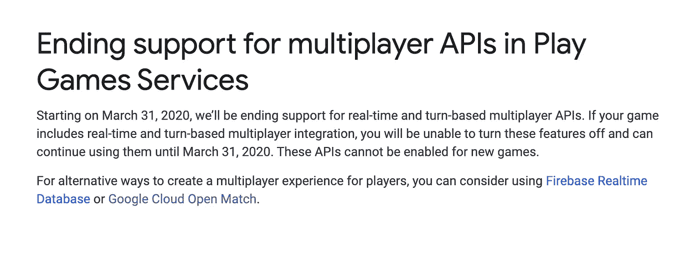

在谷歌终止多人 API 的通知中，他们建议我们可以使用 Firebase Realtime Database 和 Google Cloud Open Match 作为替代。更具体地说，实时数据库将用于游戏内的交流，而公开比赛将用于比赛安排。

我看了一下公开赛，对于一个简单的游戏来说，它似乎太复杂了。以下是谷歌对它的描述:“它包括三个核心组件:一个用于游戏客户端的前端 API，一个用于游戏服务器的后端 API，以及一个运行特定于游戏的定制匹配逻辑的 orchestrator。”我只是想允许人们邀请他们的朋友参加一个简短的空中战术游戏，而不是实现一个全球游戏平台:d。所以我实现了一个简单得多的动态链接解决方案。

# 游戏部分

Firebase 在实时数据库方面提供了两个选项:他们原来的 Firebase 实时数据库和新的 Firestore。你可以在这里查看差异。在实现方面，它们非常相似，Firestore 允许比实时数据库稍微复杂一点的查询。Firestore 也进行了更好的优化，只检索您需要的信息，从而降低成本。无论如何，我选择 Firestore 的主要原因，我建议你也这样做，是因为它是新版本，我假设谷歌将在某个时候停止支持实时数据库，只专注于 Firestore。

好的，那么我们如何在多人游戏中使用 Firestore 呢？

Firestore 是一个允许实时同步的 NoSQL 数据库。这对我们来说意味着，如果你创建了一个游戏文档，并且有两个(或更多)用户在积极地收听它，无论何时一个用户改变了游戏的状态，其他用户都会实时地被更新。您可以实现这一点，而无需轮询、管理套接字或实现循环调度。Firestore 已经在幕后为我们做了这项工作，我们需要做的就是使用他们的 SDK，并在我们感兴趣的文档上设置一个监听器，以获得更新。

这种高层次的讨论可能有点难以理解，所以让我们来看一个例子。

## 第一步。建立 Firestore

Firebase 已经为许多语言和平台提供了很好的关于如何做到这一点的教程:

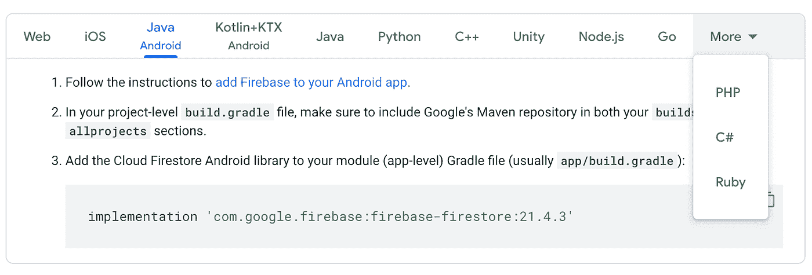

Firebase 支持的语言

## 第二步。数据库结构

创建 Firestore 数据库后，应该定义数据库结构。您可以直接从开发人员控制台完成这项工作，在那里您可以创建一个数据库外观的模型。在顶层，直接在数据库中，您可以创建集合。集合是文档的列表，文档是字段和集合的列表。

以下是空中战术数据库的结构:

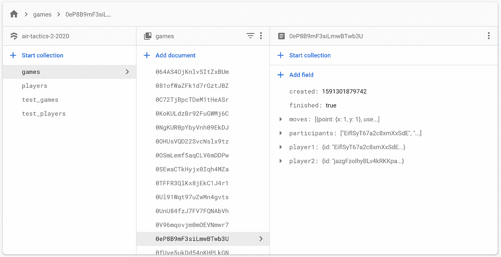

有一个**游戏**的集合，一个**玩家**的集合，我还添加了这些游戏的 2 个副本( **test_games 和 test_players** )来测试不影响制作的变化。

游戏集合中的文档代表由玩家启动的所有游戏，并且包含关于加入游戏的玩家的信息(**参与者**、**玩家 1** 、**玩家 2** )以及关于他们在游戏期间所做的动作的信息(在**移动**字段中)。它们还包含关于游戏状态(**完成**)和创建日期(**创建**)的信息。

很明显，这是一个适用于简单游戏如空中战术的结构。根据你的游戏，这可能会非常不同。例如，我有**玩家 1** 和**玩家 2** 字段，因为这个游戏只能由两个玩家玩。如果人数是可变的，你可以改变这一点，列一个球员名单。**移动**字段对我来说也是有效的，但是你可以用不同的方式来做。然而，你需要确保你在这里有重建游戏状态所需的所有信息。例如，您不能拥有像 last_move 字段这样的内容，因为您经常用 last move 覆盖它。如果所有玩家都留在游戏中直到游戏结束，这可能会起作用，但是如果一个玩家在游戏中途出现，然后试图重新加入，你将无法重新创建游戏状态。

## 第三步。履行

现在，让我们假设玩家可以神奇地找到彼此的游戏，因为我们将在下一节讨论配对。

*   **步骤 3.1。创建游戏**

你首先要实现创建游戏的逻辑。这里有一个关于如何向 Firestore 添加数据的教程[。](https://firebase.google.com/docs/firestore/manage-data/add-data#java_11)

TL；博士你必须做这样的事情:

```
db.collection(“games”).add(game)
```

其中" **game"** 是字典、地图或对象，取决于语言，与您在 Firestore 中创建的游戏文档具有相同的结构。

*   **步骤 3.2。更新游戏状态**

当用户在游戏中做一些事情时，你应该更新数据库来反映这一点。对于空中战术，你每回合可以做一个动作，所以这相当于在“**招式**列表中增加一个招式。

你可以像这里的一样更新整个游戏。

你可以更新特定的字段，比如这里的[和](https://firebase.google.com/docs/firestore/manage-data/add-data#update_fields_in_nested_objects)。

你可以在列表中添加一个元素，比如这里的[和](https://firebase.google.com/docs/firestore/manage-data/add-data#update_elements_in_an_array)。

在 Firestore 中，从定价的角度来看，是更新整个文档还是只更新您需要的字段并不重要，因为在这两种情况下都将计为 1 次写操作。但是为了提高效率，您应该只更新您需要的内容。此外，Firestore 可能会在未来改变其定价政策，以考虑上传的大小，你可能会看到你的成本上升。

*   **步骤 3.3。从 Firestore 获取游戏状态**

这里有一个关于如何从 Firestore 获取数据的教程。这与我们在“创建游戏”步骤中的操作相反。你得到一个“游戏”引用，你可以把它转换成一个自定义对象，或者以地图或字典的形式得到它，这取决于语言。正如我之前提到的，你需要确保你可以在游戏生命周期的任何阶段阅读它:

*   在它刚刚被创建之后
*   用户加入后
*   在此期间
*   在它完成之后
*   **第 3.4 步。监听游戏变化**

在一个玩家在游戏中做了一些事情之后，其他人应该会看到这种变化。你可以用一个[实时监听器](https://firebase.google.com/docs/firestore/query-data/listen)来做到这一点。基本上，每当游戏文档改变时，你都会得到更新，你可以用服务器上的游戏状态覆盖你的游戏状态，或者你可以看到自上次以来发生了什么变化(比如这里的)并相应地更新本地信息。

注意:当玩家更新游戏状态时，他也会收到自己变化的更新。请务必考虑到这一点。

# 火柴制造

玩家可以通过两种方式与另一个真人对战:

*   社交配对**——用户与朋友或他们已经认识的人一起玩**
*   **游戏内配对——用户与已经在游戏中的其他玩家一起玩**

## ****社交牵线****

**当用户和朋友一起玩时，他们会更加投入。**

**这是新用户的巨大来源。如果您创建了一个选项，用户可以通过它邀请尚未安装您的游戏的人，如果没有这个邀请，这些人可能永远不会找到您的游戏。而且他们是很棒的用户，他们比你平时的用户有更好的留存，因为他们是被认识的人邀请来玩游戏的。从我的 Google Play 仪表板中的统计数据来看，对于空中战术，从 Google Playstore 安装游戏的用户在 7 天后的保留率为 **44%** 。通过邀请安装游戏的用户在 7 天后拥有 64%的保留率。所以保持率比普通用户高 50%。**

**当你刚刚发布你的游戏时，它工作得很好。如果你有成千上万的玩家(来自社交媒体或 Kickstarter 上的预发布活动)正在等待游戏的发布，你可能不会在意这一点，但对于大多数游戏开发者来说，情况并非如此。一开始，很有可能，你只会有少数几个用户玩你的游戏，如果你只给他们提供与现有用户对战的选项，他们不会有太多的选项可供选择，而且看起来根本就没有多人游戏选项。在你得到足够多的玩家，任何人都可以在几秒钟内找到对手(同时在线，也在寻找游戏)之前，你可以用社交配对来解决这个问题。你的多人游戏选项是非常可用的，你也可以从邀请中获得一些额外的用户。**

****社交配对—动态链接****

**动态链接是一个智能 URL，它可以将用户引导到游戏的正确部分。这里的主要思想是，用户可以通过社交媒体向朋友发送动态链接。**

**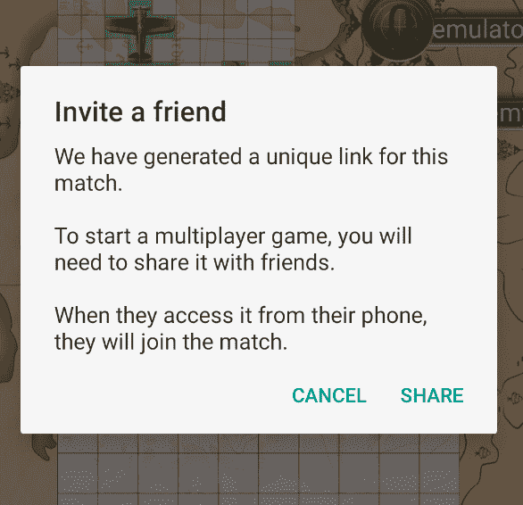**

**确保让你的用户知道他们将要发送一个动态链接以及它的用途。**

**当朋友打开动态链接时:**

*   **如果他们有应用程序，应用程序应该打开，他们应该立即加入游戏**
*   **如果他们没有应用程序，他们将被带到 playstore/app store，在他们安装并打开应用程序后，他们也应该立即加入游戏**
*   **另一种情况是朋友打开桌面上的网址。如果你的游戏也可以在网上玩，很好，你也会让他们加入到游戏中来。如果没有，你应该实现一个登陆页面，在那里你展示你的游戏，并把他们重定向到你的游戏。这是可选的，因为大多数用户从他们的移动设备与社交媒体互动，但如果他们从一个你的游戏不可用的平台使用它，你会将他们重定向到一个不存在的页面。**

****社交牵线——实现****

*   ****第一步。动态链接设置****

**在 Firebase 控制台中，您应该打开“动态链接”选项卡。**

**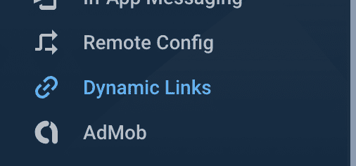**

**按下**开始**，当出现提示时，输入您的自定义域(如果您有)或使用 Firebase 的带有您首选前缀的域。**

**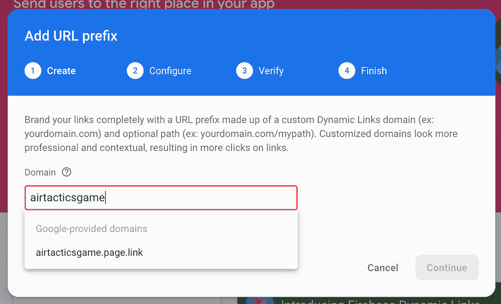**

**之后，你就可以发送你的动态链接了。**

*   ****第二步。发送动态链接****

**Firebase 有给 [iOS](https://firebase.google.com/docs/dynamic-links/ios/create) 、 [Android](https://firebase.google.com/docs/dynamic-links/android/create) 、 [C++](https://firebase.google.com/docs/dynamic-links/cpp/create) 、 [Unity](https://firebase.google.com/docs/dynamic-links/unity/create) 发送动态链接的教程。对于其他任何东西，你可以使用他们的 [REST API](https://firebase.google.com/docs/dynamic-links/rest) 。**

**这是 java 版本，因此我们可以浏览参数并了解它们的含义:**

**您可以使用“setLink”设置动态链接将重定向到的链接:**

```
.setLink(Uri.parse("https://www.example.com?game_id=" + gameId))
```

**如果你有你的游戏的网页版本，或者登陆页面，你应该把“www.example.com”替换成可以找到它们的域名。 **gameId** 应该是你尝试分享的游戏的文档 Id，就像它出现在 Firestore 里一样。**

**接下来，应该用“setDomainUriPrefix”设置域前缀。这应该是您在 Firebase 控制台中设置动态链接时定义的 URI。**

```
.setDomainUriPrefix("https://airtacticsgame.page.link")
```

**接下来，您应该添加移动应用程序的详细信息:**

**安卓系统:**

```
.setAndroidParameters(
        new DynamicLink.AndroidParameters.Builder("com.example.android")
                        .setMinimumVersion(125)
                        .build())
```

**iOS:**

```
.setIosParameters(
        new DynamicLink.IosParameters.Builder("com.example.ios")
                .setAppStoreId("123456789")
                .setMinimumVersion("1.0.1")
                .build())
```

**最低版本用于用户安装了应用程序的情况。如果已安装应用程序的版本小于动态链接中的最低版本，它不会打开应用程序，而是会将用户带到 playstore/app store 进行升级。**

**接下来，您应该设置 URL 的元标记:**

```
.setSocialMetaTagParameters(
        new DynamicLink.SocialMetaTagParameters.Builder()
                .setTitle("Example of a Dynamic Link")
                .setDescription("This link works whether the app is installed or not!")
                .setImageUrl("https://www.example.com/icon.png")
                .build())
```

**这些参数将定义动态链接在社交媒体上共享时的预览效果，因此使用它们来解释当用户点击它时会发生什么。**

**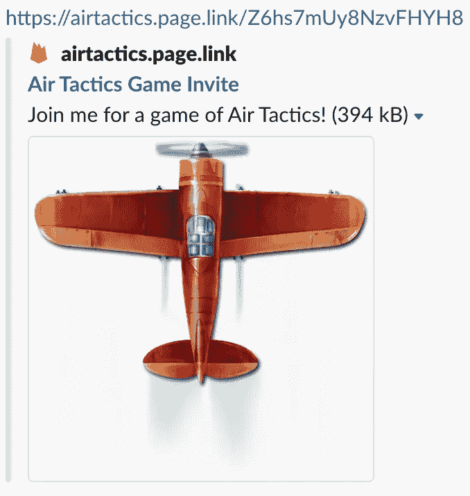**

**Slack 上共享的空中战术游戏邀请示例**

**请记住，这个网址将来自一个朋友，所以从发件人的角度发出行动号召。类似于“和我一起玩……游戏”这样的话应该就可以了。**

**或者，您还可以添加分析信息:**

```
.setGoogleAnalyticsParameters(
        new DynamicLink.GoogleAnalyticsParameters.Builder()
                .setSource("orkut")
                .setMedium("social")
                .setCampaign("example-promo")
                .build())
.setItunesConnectAnalyticsParameters(
        new DynamicLink.ItunesConnectAnalyticsParameters.Builder()
                .setProviderToken("123456")
                .setCampaignToken("example-promo")
                .build())
```

**收到 Firebase 的动态链接后，让用户与朋友分享，这样他们就可以加入游戏了。**

*   ****第三步。接收动态链接****

**Firebase 有接收 [iOS](https://firebase.google.com/docs/dynamic-links/ios/receive) 、 [Android](https://firebase.google.com/docs/dynamic-links/android/receive) 、 [C++](https://firebase.google.com/docs/dynamic-links/cpp/receive) 、 [Unity](https://firebase.google.com/docs/dynamic-links/unity/receive) 动态链接的教程。在这里，我不会详细讨论实现，因为根据平台和语言的不同，实现会有很大的不同，但是 Firebase 教程应该有实现这一部分所需的所有信息。**

**无论平台或语言如何，你的游戏都将通过一个回调函数打开，在回调函数中你可以访问用来打开它的 URL。更准确的说是你在上一步设置的网址，看起来是这样的那个:“https://www . example . com/？game _ id = 064 as 4 ojknlvsitzxbum”。你应该从这个 URL 中去掉游戏 id，并用它来加入相应的游戏。如果你有一个类似于我的数据库结构，你可以通过更新游戏来将你作为一个玩家，从而告诉其他玩家你加入了。**

## **游戏内配对**

**这对于拥有大量用户的游戏来说非常好。**

**不是所有的玩家都想和朋友一起玩，或者他们可能没有朋友也喜欢你的游戏。对他们来说，有一个和其他玩家对战的选择是很好的。**

**如果游戏很复杂，你需要根据用户的技能或排名进行匹配，那么你将不得不进行游戏内匹配，但我不建议使用 Firestore 进行匹配。你可能应该更深入地研究 Google 的 Open Match，或者其他提供匹配服务的框架。理论上，你可以在 Firestore 中实现这一点，但它不是为这种事情而构建的，它有一些查询限制，这将是一个问题，并且成本可能比你从专门的框架中获得的要大。**

****游戏内配对——实现****

**我将只介绍一个基本的实现，用户可以创建一个开放的游戏并等待其他玩家加入。其他用户可以看到已经创建的开放游戏列表，并可以选择加入其中一个。**

**首先，你需要定义什么是开放游戏，并将其构建到数据库结构中。在空中战术中，开放游戏是指**参与者列表**少于 2 项的游戏。**

**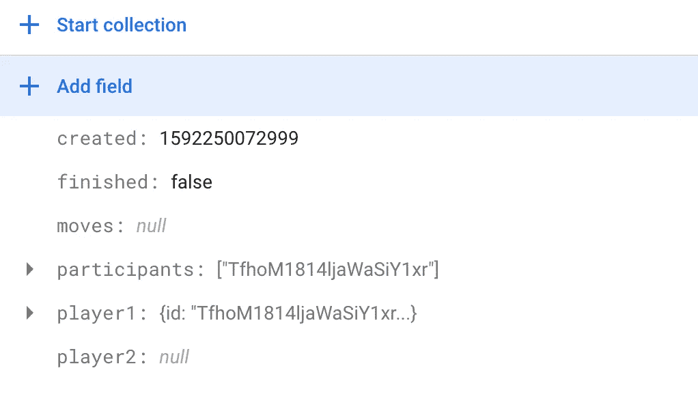**

**空中战术中的开放式博弈示例**

**当用户创建一个新的开放游戏时，只需在 Firestore 中创建游戏，将他们添加到游戏中，并启动实时监听器，以便在其他用户加入时通知他们。**

**当用户试图获得一个开放游戏的列表时，你需要在 Firestore 中进行查询。你可以在这里找到一个简单查询[的例子，但是考虑到可能有很多开放的游戏，你需要将结果限制在少数几个。不这样做将增加您的成本，正如您在下一节中看到的。我还建议将游戏按照创建日期降序排列，这样创建游戏的玩家就更有可能还活着。你可以在这里](https://firebase.google.com/docs/firestore/query-data/queries#execute_a_query)找到关于限制和订购查询[的细节。](https://firebase.google.com/docs/firestore/query-data/order-limit-data)**

**采用这种方法，许多开放的游戏将会丢失，永远不会被任何人加入，只是占用你的 Firestore 的空间。你可以创建一个带有 Firebase 函数的 cron-job 来删除任何超过一周的游戏。你可以在这里找到关于这个[的细节。](https://firebase.google.com/docs/firestore/solutions/delete-collections)**

**当用户从列表中选择一个游戏时，只需做与社交配对相同的事情:将他们的玩家 id 添加到游戏中，以便其他玩家知道他们加入了游戏，如果需要，更改游戏的状态，并打开正在进行的游戏的屏幕。**

# **定价**

**让我们谈谈成本。你可以在这里找到所有费用的详细汇总。**

**但是这张图片很好的概括了这一切。**

**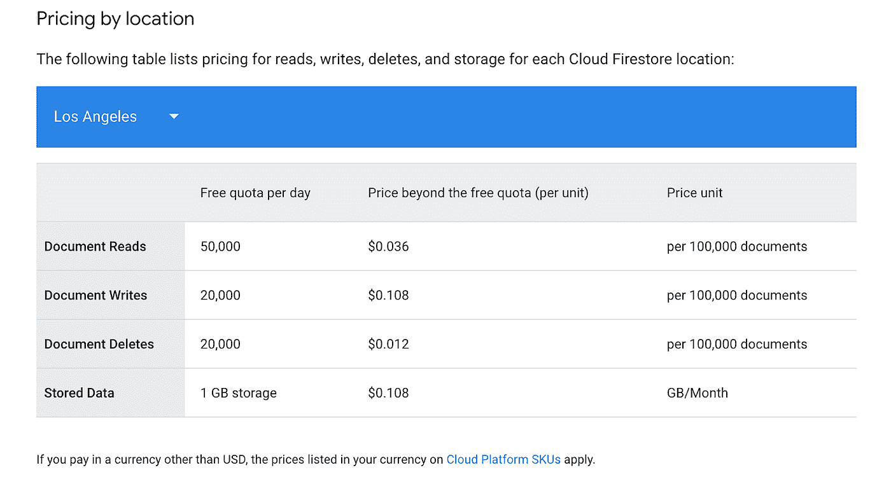**

**Firestore 在洛杉矶托管时的成本**

**所以免费的话，你会得到 **50k 读**， **20k 写**， **20k 删除**，和 **1 GB** 的存储。**

**如果超出这些值，您将支付:**

**在 0.036 美元到 0.06 美元之间为 **100k** 为**读数为****

**在**0.108 美元到 0.18 美元**之间，用于 **100k 次写入****

**在**0.012 美元到**0.02 美元**之间，100k 删除****

**每 GB/月在**0.108 美元至**0.18 美元之间**

****有一个价格范围，因为价格取决于您创建 Firebase 项目的位置。上面例子中的“**洛杉矶** s”比较便宜，而“**欧洲(多地区)**”则比较贵。****

****这些是什么意思？****

****从上表中可以看出，阅读意味着阅读文档(或文档的一部分)。****

****因此，如果您有一个返回文档的查询，它将计为 1 次读取。****

****如果您有一个返回 10 个文档的查询，它们将被计为 10 次读取。****

****如果你有一个实时监听器，每次你正在监听的文档的一部分发生变化，都会被认为是一次阅读。*根据我的测试，来自同一设备的写入所触发的更改似乎不会算作新的读取。****

****相同的规则适用于写入和删除。****

****你如何估算你的游戏成本？****

****如您所见，写操作的开销是读操作的 3 倍，因此这些可能是您需要小心的地方。****

****你的大部分读写将来自游戏中的动作。对于空中战术，我能够从我的分析中看到一个完成的游戏需要每个玩家 40 步。这意味着 80 次写入(两个玩家)和 80 次读取。正如我上面所说的，实时监听器实际上会被触发 160 次，因为您会收到您或您的对手所做更改的更新，但您触发的更新不会被算作新的读取，因为它们发生在本地设备上。****

****对于这 80 次写入和 80 次读取，有一些额外的写入用于创建游戏和加入游戏，还有一些额外的读取用于读取正在进行的游戏列表。****

****所以我的平均值是 **100** 读， **100** 写给**每一个完成的游戏**。所以这意味着我每天可以用**免费**得到 **200** 个游戏。之后，每增加 **1000 个游戏成品**将花费高达**0.18 美元**。****

****这对于空中战术来说已经足够好了。由于我没有投入时间和金钱来推广这款游戏，现在我每天不超过 200 款游戏，所以我可以免费主持游戏，但我确保即使在某个时候我的用户数量激增，我也不必自掏腰包。游戏中有广告，每完成 1000 个游戏可以赚 2 美元左右，所以这应该可以覆盖 Firestore 的成本。****

****在实现这个解决方案之前，您也应该为您的游戏做这个估计。如果你有回合制游戏，这应该没问题，只要你有任何形式的货币化(广告或应用内购买)。对于每个游戏都有很多动作的实时游戏，成本可能太高，你最好使用另一个游戏平台，每月支付固定的费用。****

****启动游戏后，您可以在 Firebase 控制台的数据库使用选项卡上检查读写操作:****

****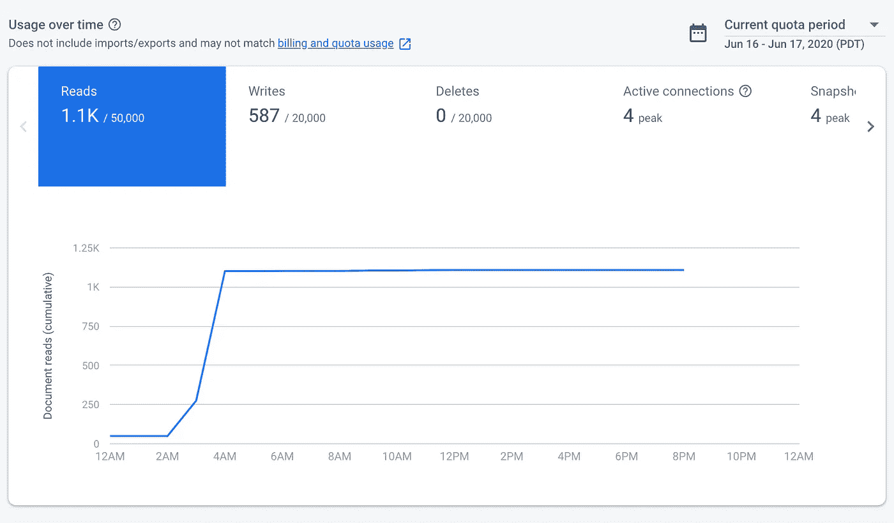****

****写次数错误的 Firestore 使用选项卡****

****但请确保点击“计费和配额使用”以获得正确的数据，因为根据我的经验，这里的写永远不会正确。****

****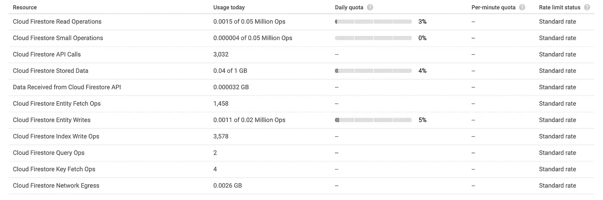****

****正确读写的计费和配额使用****

# ****结论****

****这是我在 Firebase 上主持多人游戏的经历。我希望它能对你的游戏有所帮助，或者至少它能帮助决定这是否是你的场景的一个好的解决方案。除了我自己有问题的情况，我没有详细说明，但如果你需要任何澄清，请随时留下评论，我会尽我所能回答。****