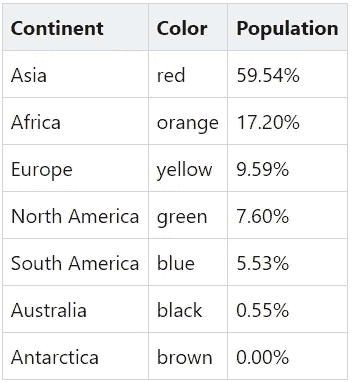

# 用 HTML 和 CSS 构建一个简单的饼状图

> 原文：<https://levelup.gitconnected.com/build-a-simple-pie-chart-with-html-and-css-33f3956e30f0>

您可以使用一个名为`conic-gradient`的简单 CSS 函数在 HTML 中创建一个**饼状图**。

首先，我们向 HTML 页面添加一个`
`元素，作为饼图的占位符。

我们需要为`
`元素提供一个`width`和一个`height`，它们决定了我们的饼状图的大小:

然后，我们需要通过将`border-radius`的值设置为`50%`来使我们的饼图呈圆形:

最后，我们准备用我们的数据填充饼图。

例如，让我们考虑在以下链接中报告的世界人口数据:
[https://www.worldometers.info/geography/7-continents/](https://www.worldometers.info/geography/7-continents/)
我们希望使用我们的饼状图显示每个大洲的人口分布。

对于每个大洲，我们从上面的链接中选择任意颜色和人口百分比。下表总结了这些数据:

为了将这些值应用到我们的饼图中，我们需要将饼图分成 7 个部分，每个部分代表一个大洲。为了创建扇区，我们可以使用`conic-gradient` CSS 函数。每个扇区都有一种颜色、一个起始位置和一个终止位置。

例如，南极洲以棕色表示，占世界人口的 0.00%。因此，我们想要一个从 0.00%到 0.00%的棕色扇区。
然后，我们想要绘制一个黑色的扇形来代表澳大利亚，它拥有世界人口的 0.55%。这导致黑色部分从 0.00%到 0.55%。
同样，为了表示南美，我们希望蓝色部分从 0.55%到 6.08% (= 0.55% + 5.53%)。
以此类推。

最后，我们将有以下 CSS 背景属性:

🐛仅此而已。现在我们能够用 CSS 创建一个饼状图。