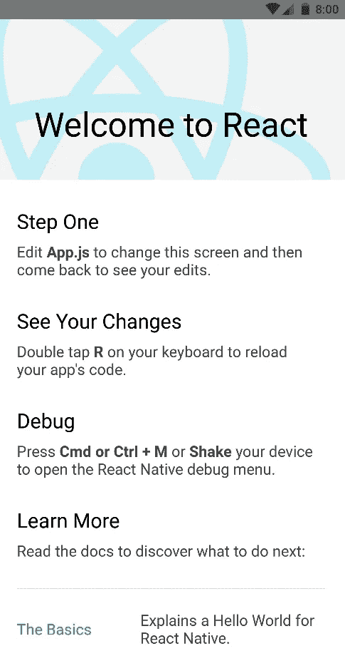
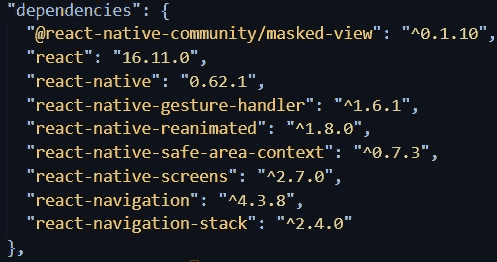
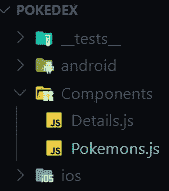
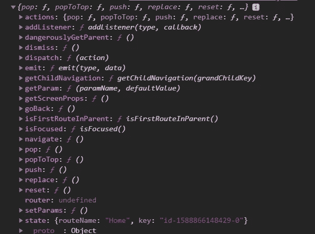
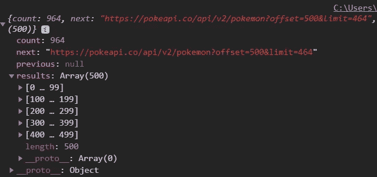
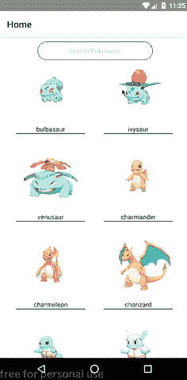
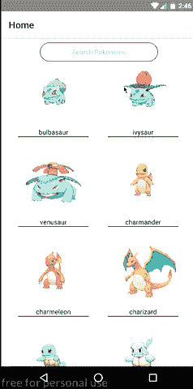

# 用 React-Navigation 构建一个简单的 React 原生口袋妖怪应用程序

> 原文：<https://levelup.gitconnected.com/build-a-simple-react-native-pokemon-app-with-react-navigation-1bbf1e845d92>


来源:https://hackernoon.com/drafts/ro2832a9.png

当我们开始学习新技术时，我们希望开始构建一些东西或从事一个简单的项目，以更好地理解技术。所以，让我们来构建这个简单的应用程序。

对于这个应用程序，我们将使用 [PokeApi](https://pokeapi.co/) 来获取我们的口袋妖怪数据，我们还将使用[钩子](https://reactjs.org/docs/hooks-intro.html)。我正在使用口袋妖怪精灵的[口袋妖怪 db](https://pokemondb.net/) 。这只是个人喜好，你想用什么就用什么。

## 一些先决条件:

*   对反应堆的基本理解
*   对 JavaScript(ES6)语法的基本理解
*   已安装 npm

## React-Native 入门

我将在这个项目中使用 react-native-cli。我用的是 windows，但是你可以在这里了解更多关于设置 react-native 开发者环境[的信息。](https://reactnative.dev/docs/environment-setup)

让我们首先使用以下命令在我们的计算机上全局安装 react-native-cli:

```
npm install -g react-native-cli
```

现在让我们使用下面的命令来获取 react-native 样板文件

```
npx react-native init Pokedex
```

Pokedex 将成为我们应用的名字，因为何乐而不为！

现在让我们进入我们的项目，打开我们的代码编辑器。我用的是 VS 代码。

```
cd Pokedex
code .
```

## 运行我们的应用

您可以在物理设备或模拟器上使用此命令运行 android 应用程序。

```
npx react-native run-android
```

对于 iOS，您可以使用以下命令

```
npx react-native run-ios
```

你会看到这个屏幕，这意味着我们准备好了！



让我们安装该应用程序所需的一些依赖项。

```
npm install react-navigation react-navigation-stack react-native-reanimated react-native-gesture-handler react-native-screens react-native-safe-area-context @react-native-community/masked-view
```

您的 package.json 将如下所示



## 让我们编码！

首先，让我们在项目中创建一个 Components 文件夹，并创建两个文件 Pokemons.js 和 Details.js，如下所示



因此，正如在*“欢迎使用 React”*屏幕的第一步中所写的，让我们编辑我们的 App.js。App.js 是 react-native 应用程序的根组件，因此我们需要导入我们的组件并在 app . js 中编写我们的路线。在 app . js 中，我们将编写以下代码

在上面的代码中，`createStackNavigator`是一个返回组件的函数，它可以接受两个参数，第一个配置对象是我们的路由，我们可以传递第二个可选的配置对象。`createStackNavigator`将一个组件像堆栈一样放在顶部，因此得名。在`createStackNavigator`的配置对象中，`Home`路由渲染口袋妖怪组件，`Details`路由渲染细节组件。在第二个选项对象中，我们可以声明应用程序加载时将呈现的初始路线，我们将保持`Home`为初始路线。

`createAppContainer`是一个接受`appNavigator`并返回从`appNavigator`返回的组件的函数。最后，我们从 App.js 文件中导出`AppContainer`。

## 航行

导航属性被传递给每个屏幕组件。导航道具对象具有以下内容



为了导航到其他组件，我们使用`navigation.navigate()`功能。我们将路由名称作为第一个参数传递。如果我们想要传递参数，我们传递一个对象作为第二个参数。

```
navigation.navigate('RouteName', { /* params go here */ })
```

为了读取被传递的参数，我们使用`navigation.state.params`。

## 编写我们的第一个组件

在 Pokemons.js 文件中，我们导入了以下内容

```
*import* React, {useState, useEffect} *from* ‘react’;
*import* {View, Text, ScrollView, Image, TouchableOpacity, StyleSheet, TextInput} *from* ‘react-native’;
```

`useState()` hook 帮助我们在功能组件中使用状态变量。我们将使用一个状态变量来保存我们的口袋妖怪数据，当有人使用搜索输入时，使用另一个状态变量来过滤口袋妖怪。你可以阅读更多关于`useState()`钩子[这里](https://reactjs.org/docs/hooks-state.html)。

我们可以将`useEffect()`挂钩作为`componentDidMount()`。useEffect()将回调作为参数。为了让它像`componentDidMount()`一样工作，我们在使用`useEffect()`钩子时传递一个空数组作为第二个参数，

```
useEffect(() => {
fetchPokemons();
},[])
```

上面的代码作为`componentDidMount()`工作。此外，我们编码如下

```
*import* React, {useState, useEffect} *from* 'react';
*import* {View, Text, ScrollView, Image, TouchableOpacity, StyleSheet, TextInput} *from* 'react-native';const Pokemons = (props) => {
const [pokemons, setPokemons] = useState([]);
const [searchfeild, setSearchfeild] = useState('');useEffect(() => {
 fetchPokemons();
},[]);const fetchPokemons = () => {
fetch('https://pokeapi.co/api/v2/pokemon?limit=500')
.then(response => response.json())
.then(pokemons => setPokemons(pokemons.results));
};
```

在上面的代码中，`pokemons`是一个状态变量，一个我们保存口袋妖怪数据的数组。最初，它是一个空数组，`setPokemons`是一个用来改变状态的函数。`searchfeild` 状态变量是我们将使用的搜索输入。`setPokemons`、`setSearchfeild`作为`this.setState()`工作。我们使用`useEffect()`作为 componentDidMount()。在`fetchPokemons()`函数中，我们对 [PokeApi](https://pokeapi.co/) 服务器进行 API 调用，以获取我们的口袋妖怪数据。我们将从 API 得到以下响应。



然后我们将它转换成 JSON 格式，然后使用`setPokemons`函数将`pokemons.results`保存在我们的`pokemons`状态变量中。

现在，我们将对组件的 UI 进行样式化和编码

首先，我们对位于顶部的 TextInput 进行编码。我们使用`onChangeText`来监听 TextInput 中发生的变化，并使用`setSearchfeild`函数将 TextInput 的值设置为`searchfeild`。我们使用 JavaScript `.filter()`方法根据搜索过滤口袋妖怪。`.filter()`方法返回一个数组，所以我们使用`.map()`方法来映射这个数组。

为了处理触摸，我们在 React-Native 中使用可触摸组件。`TouchableOpacity`触摸或轻触时给出反馈。您可以使用`activeOpacity`属性来调整不透明度。你可以在这里阅读更多关于可触摸组件[的信息。我将图片`uri`中的`pokemon.name`作为模板文字进行传递，以获得各个口袋妖怪的精灵。](https://reactnative.dev/docs/handling-touches)

在`onPress` 中，我们使用`props.navigation.navigate()`来导航到 Details.js 组件，并将`pokemon.name`作为参数传递，我们将使用该参数来获取单个口袋妖怪数据。

现在我们定义组件的样式

```
const styles = StyleSheet.create({  
container: {    
 display: 'flex',    
 flexDirection: 'row',    
 flexWrap: 'wrap',    
 justifyContent: 'center',    
 marginTop: 30,  
},  
card: {    
 display: 'flex',    
 alignItems: 'center',    
 borderBottomWidth: 1,    
 borderBottomColor: 'black',    
 marginHorizontal: 20,    
 marginVertical: 10,  
},  
searchCont: {    
 position: 'absolute',    
 marginBottom: 70,    
 left: '20%',    
 zIndex: 1,    
 marginTop: 10,  
},  
searchfeild: {    
height: 40,    
borderWidth: 1,    
borderColor: '#000',    
textAlign: 'center',    
width: 250,    
borderRadius: 50,  
},
});
```

我们在 React-Native 中使用`StyleSheet`来定义组件的样式。在`StyleSheet.create()`中，我们传递一个对象，在这个对象中我们可以定义组件的样式。我们通过在 React-Native 元素的 style 属性中传递该样式的引用来使用样式。

因此，此时 Pokemons.js 组件将如下所示

如果我们运行我们的应用程序，或者如果你正在运行它，你会看到一个错误，因为我们还没有编码 Details.js。

让我们快速编写 Details.js 代码，并检查一切是否正常

```
*import* React *from* 'react';
*import* {View, Text} *from* 'react-native';const Details = props => {
 *return* (
  <View *style*={{ flex: 1, alignItems: 'center', justifyContent:          'center' }}> 
   <Text>Details</Text>
 </View>);
};*export* *default* Details;
```

在我们的设备/仿真器中，应该是这样工作的，



现在，我们所需要的是完成我们的细节部分，我们就完成了。它将类似于口袋妖怪组件，在`useEffect()`中进行 API 调用，并将其保存在我们的州。然后，使用状态变量在屏幕上显示数据。Details.js 应该是这样的

我们使用`navigation.state.params` 来读取从 Pokemons 组件传递到 Details 组件的参数。使用`fetchPokemonsDetail`函数中的参数，我们进行一个 API 调用来获取单个口袋妖怪数据。当从组件返回时，我添加了一个条件，以便在获取数据时不会显示空白屏幕，它会显示`ActivityIndicator`。这是一个循环加载动画。



这就是，你的口袋妖怪应用反应原生。如果你完成了这个应用程序，请鼓励自己。