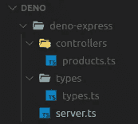

# 用 Deno 和 Express 构建一个简单的 Rest API

> 原文：<https://levelup.gitconnected.com/build-a-simple-rest-api-with-deno-and-express-b0b62e52c230>


Deno 是一个简单、现代、安全的 JavaScript 和 TypeScript 运行时，它使用 V8 并内置于 Rust 中。

## Deno 的特点

1.  默认安全。除非明确启用，否则没有文件、网络或环境访问权限。
2.  支持现成的 TypeScript。
3.  仅提供一个可执行文件。
4.  有内置的工具，如依赖检查器(deno info)和代码格式化程序(deno fmt)。
5.  拥有一套经过审查(审计)的标准模块，保证能够与 Deno:[deno.land/std](https://deno.land/std)

Deno 不使用 NPM 或节点模块来管理程序包。相反，我们使用浏览器兼容的 URL 链接第三方包。

# **安装 Deno**

**如果您使用的是基于 Mac 或 Linux 的系统。打开您的终端，复制/粘贴以下命令来安装 Deno。**

```
curl -fsSL https://deno.land/x/install/install.sh | sh
```

**如果您使用的是 Windows 操作系统，只需打开 power shell 并运行该命令。**

```
iwr [https://deno.land/x/install/install.ps1](https://deno.land/x/install/install.ps1) -useb | iex
```

**安装后，您可以通过运行以下命令来验证安装。**

```
*deno --version*
```

让我们运行我们的 hello world 程序，一个来自 Deno 的官方示例。复制下面显示的命令，并在您的终端中运行它。

```
deno run [https://deno.land/std/examples/welcome.ts](https://deno.land/std/examples/welcome.ts)
```

## 您应该会看到以下响应。

```
Welcome to Deno 🦕
```

为了帮助您进一步探索 Deno，我推荐您阅读本文[**《Deno 手册:一个带代码示例的 TypeScript 运行时教程**](https://www.freecodecamp.org/news/the-deno-handbook/)

**权限标志列表**

由于 deno 在默认情况下是安全，所以它没有启用任何权限。运行文件时，这些标志对于权限非常有用。

*   `**--allow-env:**` 允许环境访问。
*   `**--allow-hrtime:**` 允许高分辨率时间测量。
*   `**--allow-net:**` 允许网络访问。
*   `**--allow-plugin:**` 允许加载插件。
*   `**--allow-read:**` 允许文件系统读访问。
*   `**--allow-run:**` 允许运行子流程。
*   `**--allow-write:**` 允许文件系统写访问。
*   `**--allow-all:**` **:** 给予全部访问权限。

耶！我们可以结束对 Deno 的简要介绍，然后转移到本文的重点。我希望你能享受❤❤❤之旅

我们开始吧

我们将创建一个简单的 REST API 来执行 CRUD 操作。端点将通过 Postman 应用程序进行测试。你可以从[这里](https://www.postman.com/downloads/)下载《邮差》。这个 API 将使用本文标题中提到的 ***Typescript 和 Express framework*** 来开发。

> 让我们看看我们的程序结构



*   **控制器:**拥有应用程序的逻辑，并处理客户端请求。
*   **Server.ts:** 运行本地主机服务器的代码。
*   **Types.ts:** 包含模型定义。

> 让我们设置本地主机服务器

创建`server.ts`文件并从`[http](https://raw.githubusercontent.com/NMathar/deno-express/master/mod.ts)://raw.guthubusercontent.com/NMather/deno-express/master/mod.ts`导入`* as expressive`

> 中间件

*   simpleLog():这个方法用于记录请求和响应的状态。
*   json():返回只解析`json`的中间件，只查看`Content-Type`头与`type`选项匹配的请求

> 让我们升级我们的模型

`types.ts`将持有产品的界面。

> 创造我们的产品

我们会创造一系列产品

现在，让我们在`product.ts`文件中创建不同的方法

getProducts: 它将返回列表中的所有产品。如上所述。在`/api/products`上发出 GET 请求

**getProduct:** 如果找不到产品，将根据 Id 和错误返回单个产品。在`/api/products/:id`上发出 GET 请求

**添加产品:**将产品添加到列表中。在`/api/products.`上发出 POST 请求

**更新产品:**会更新产品。在`/api/products/:id.`上发出上传请求

**删除产品:**这将从列表中删除产品。在`/api/product/:id`进行删除

创建完这些函数后，我们需要将其导入到`server.ts`中。通过导出这些函数来完成`product.ts`。

```
*export* { getProducts, getProduct, addProduct, updateProduct, deleteProduct };
```

这是完整的`Product.ts`文件

现在，回到我们的`server.ts`文件，从控制器导入`products.ts`文件，并创建一个应用程序来监听端口。最终版的`server.ts`会是这个样子。

为了运行我们的 server.ts 文件，我们将运行 deno 命令

```
deno run --allow-net --allow-read server.ts
```

结论

万岁！！我们已经到了本教程的结尾。我希望到目前为止你已经学到了一些东西，现在可以用 Deno 和 Express 创建一个 REST API。你还可以探索更多关于[德诺](https://deno.land/manual)的信息。

在 [Github](https://github.com/temmyjay001/Deno-Medium) 上找到完整的源代码

你运行代码有困难吗？如果是的话，请在下面留下评论。如果你能通过给朋友发电子邮件或在推特或脸书上分享来帮助它的传播，我会非常感激。 ***谢谢！***

*随意连接* *上:**[Github](https://github.com/temmyjay001)***，***[***Twitter***](https://twitter.com/uncu001)***，***[***LinkedIn***](https://www.linkedin.com/in/ajayi-solomon-temmyjay001/)*

***受**启发:[普什卡·塔库尔](https://medium.com/u/fa661a1f194c?source=post_page-----b0b62e52c230--------------------------------)*