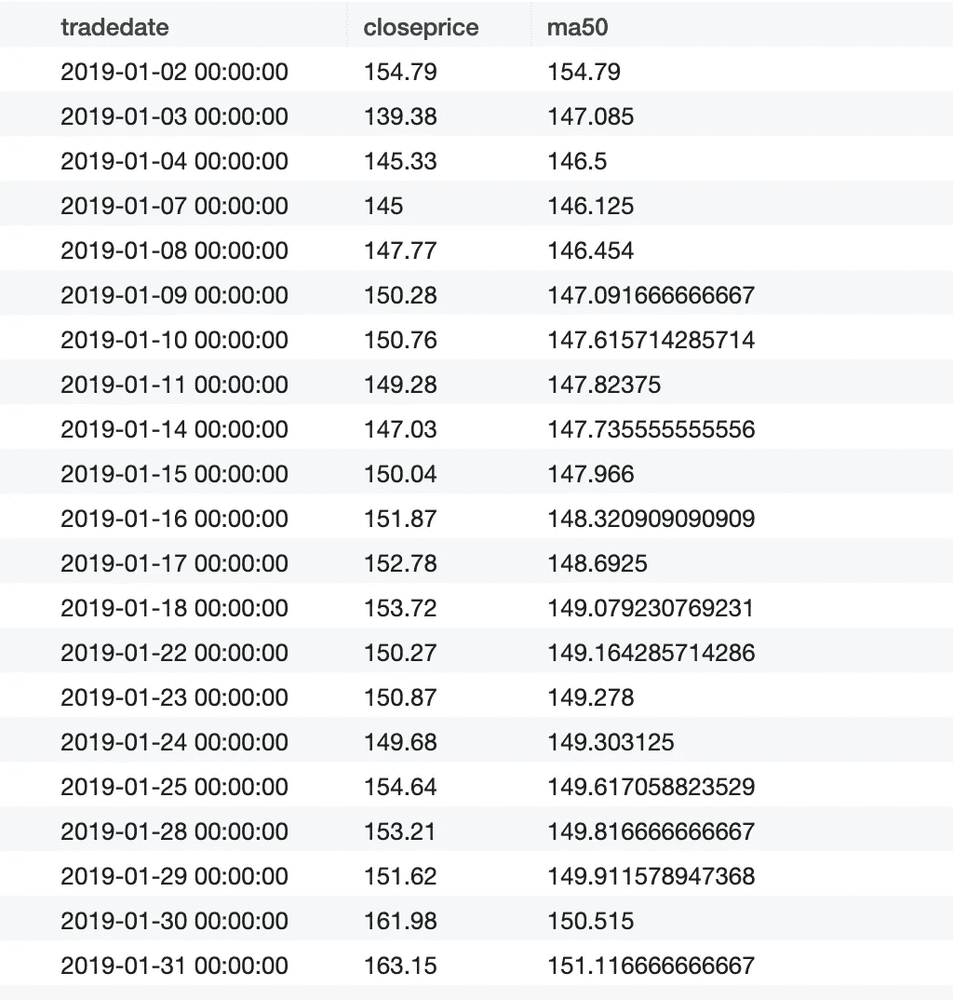
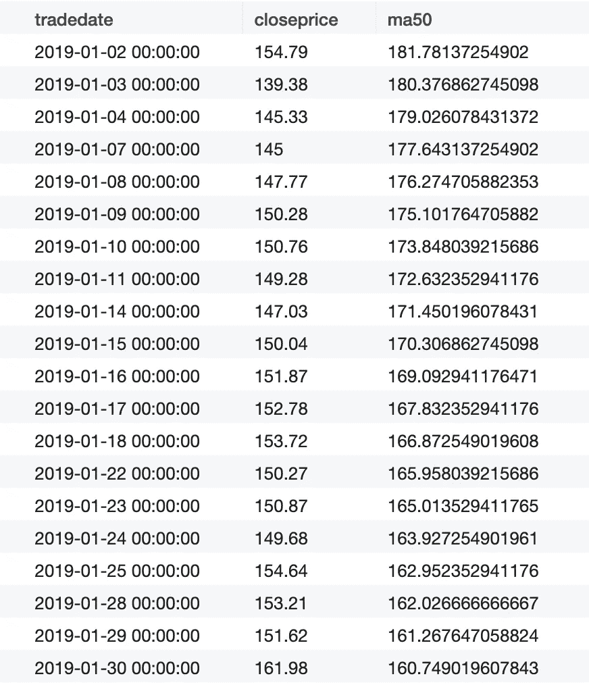
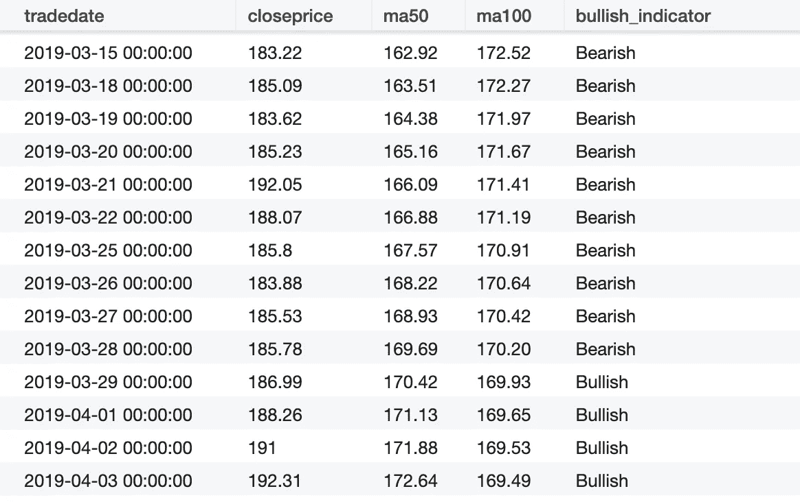
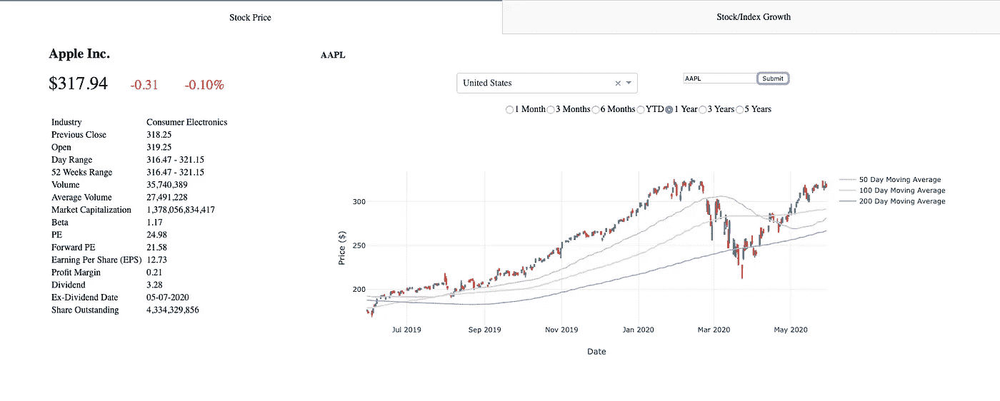

# 用 SQL 构建一个简单的股票价格指标

> 原文：<https://levelup.gitconnected.com/build-a-simple-stock-price-indicator-with-sql-7ddf169d8b33>

当你进入投资世界时，你会做的第一件事是挑选一只股票，看它的股价，但你不知道它意味着什么。这时候你可能需要获取股票的基本面和一些指标来评价股票是否公允。当然，像市盈率、净收入利润率、股息收益率这样的基本指标是很好的指标，但是像移动平均线这样的技术指标对于理解股价的趋势是有用的。直到我用移动平均线构建可视化股票价格的仪表板时，我才意识到这个有用的指标很容易用 pandas 或 SQL 来计算。在这篇文章中，我将解释如何用 SQL (Postgre SQL)计算移动平均线。

**移动平均线是如何计算的？**
均线是识别股价趋势、支撑位、阻力位的技术指标。它是用一定时期内的平均股价计算出来的。例如，对于 50 天移动平均线的计算，我将对过去 50 天每天的平均股价求和，然后除以 50。简单来说，我后面举的例子是将一只股票最近 50 天的收盘价相加，然后除以 50。

**示例**
我已经从 Yahoo Finance 的本地数据库的股票模式的 stock price 表中获取了标准普尔 500 指数中所有股票成分的股价。stockprice 表由以下几列组成:
- ticker(股票的股票代码)
- tradedate(交易日，在时间戳中)
- openprice(开盘价)
- high(每日最高价)
- low(每日最低价)
- closeprice(收盘价)
- volume(当天的交易量)

先通过查询苹果(AAPL)2019 年收盘价来预热一下:

```
select tradedate, closeprice
from stock.stockprice
where date_part(‘year’, tradedate) = 2019
and ticker = ‘AAPL’;
```

现在我们可以计算苹果股票的 50 天移动平均线。为此，我们可以使用分析功能来帮助我们。SQL 中的分析函数可以帮助我们对表中的一组行进行平均或其他聚合。利用这一点，我们可以使用分析功能来帮助我们收集最近 50 天的收盘价，并对 2019 年的每个交易日进行平均。

分析函数的语法如下所示:

```
avg(closeprice) over (partition by ticker
order by tradedate
rows 50 preceding)
```

在这个语法中，我们将所有股票价格按股票代号分组，然后股票价格按交易日期排序。之后，获取最后 50 行并取平均值。完整的查询是:

```
select tradedate, closeprice,
avg(closeprice) over (partition by ticker
order by tradedate rows 50 preceding ) as ma50
from stock.stockprice
where ticker = ‘AAPL’ and 
date_part(‘year’, tradedate) = 2019;
```

如果我们用这个查询请求数据，结果看起来不像我们想要的:



上述查询的结果

如果仔细观察 ma50 列，该列仅取第一行到当前行之间的平均值。如果当前行之前没有 50 行，这不是我们想要的！为了解决这个问题，让我们使用一个子查询来获取 2018 年和 2019 年之间的股票价格，以便采用移动平均，查询如下:

```
select tradedate, closeprice, ma50
from(
select tradedate, closeprice, 
avg(closeprice) over (partition by ticker order by tradedate rows 50 preceding) as ma50 from stock.stockprice
where ticker = ‘AAPL’ and 
date_part(‘year’, tradedate) between 2018 and 2019) as i
where date_part(‘year’, i.tradedate) = 2019;
```

然后，它将返回以下结果:



上述查询的结果

现在，结果看起来更有希望。

不同时间间隔的均线是观察股票是看涨还是看跌的好指标。如果我们有苹果(AAPL)的 50 天移动平均线和 100 天移动平均线，如果 50 天移动平均线在 100 天移动平均线之上，我们可以判断该股票是看涨，还是看跌。我们可以在 SQL 中做到这一点！让我们通过下面的查询找出苹果股票每天是看涨还是看跌:

```
select tradedate, closeprice,
round(ma50::numeric, 2) as ma50,
round(ma100::numeric, 2) as ma100,
case when ma50>ma100 then ‘Bullish’ else ‘Bearish’ end as bullish_indicator
from( select tradedate, closeprice,
avg(closeprice) over (partition by ticker order by tradedate rows 50 preceding) as ma50,
avg(closeprice) over (partition by ticker order by tradedate rows 100 preceding) as ma100 from stock.stockprice
where ticker = ‘AAPL’ 
and date_part(‘year’, tradedate) between 2018 and 2019) as i
where date_part(‘year’, i.tradedate) = 2019;
```

结果看起来像这样:



上述查询的结果

这个查询看起来更复杂，但是我们只添加了两个块:添加 100 天移动平均线和案例条件。案例条件基本上是检查 ma50 中的值是否大于 ma100，如果是，此列返回“看涨”，否则返回“看跌”。

如果我们向下滚动到 2019 年 3 月，我们可以看到看涨 _ 指标从看跌转为看涨，因此它告诉我们该指标正在发挥作用。现在，我们可以使用 SQL 创建一个简单的股价指标进行技术分析！

**奖励—熊猫**
我们也可以用 Python 在熊猫里做同样的事情！语法也很简单。如果我们有 Pandas 数据帧，数据帧名为 df，列名相同，我们可以用下面的语法做同样的事情:

```
df[‘MA50’] = df.closeprice.rolling(50).mean()
df[‘MA100’] = df.closeprice.rolling(100).mean()def bullish_indicator(row):
 row[‘MA50’] > row[‘MA100’]: return ‘Bullish’
 return ‘Bearish’df[‘bullish_indicator’] = df.apply(lambda row: bullish_indicator(row), axis=1)
```

**应用**
将股价与均线一起可视化更有帮助。在我的另一篇中篇文章中，[*用 Plotly Dash 构建的股票价格仪表板—第 1 部分*](https://medium.com/@jjsham/building-stock-price-dashboard-with-plotly-dash-part-i-b165b3edfdd6) ，我在那里谈到了如何用 Dash 构建股票价格仪表板。股价可视化显示移动平均指标和股价。可视化依赖于来自该 SQL 查询或 Pandas 数据框的数据来生成。



股票价格仪表板

除了股票是看涨还是看跌，我们还可以用均线的较长周期来判断股价的走势。如果我们看到 200 天移动平均线向上倾斜，这意味着股价趋势正在上升；如果 200 天移动平均线向下倾斜，趋势就会下降。有趣的是，如果 200 天移动平均线是平的，我们可以看出股价非常稳定。

**结论**
投资很难，但是用股价做技术分析并没有我们想象的那么难。SQL 很简单，我们可以使用这个工具轻松地制作简单的指标。一旦将股票价格保存在本地数据库中，您就可以查询结果并自行进行一些简单的技术分析。

**免责声明**
本帖中的任何预测仅供参考，并非事实。任何交易行为都应咨询您的理财经理，我不对任何交易损失负责。

[](https://www.linkedin.com/in/jacquessham/) [## 雅克·沙姆-旧金山湾区|职业简介| LinkedIn

### 查看雅克·沙姆在全球最大的职业社区 LinkedIn 上的个人资料。雅克有 4 个工作列在他们的…

www.linkedin.com](https://www.linkedin.com/in/jacquessham/) 

**参考**
【1】Investopedia。*移动平均线(MA)* 。
[https://www.investopedia.com/terms/m/movingaverage.asp](https://www.investopedia.com/terms/m/movingaverage.asp)

[2]尼古拉斯·罗斯博士*数据管理或被 SQL 和熊猫打脸。*