# 使用 GraphQL 服务器构建 web、iOS 和 Android 应用程序——了解整个系统

> 原文：<https://levelup.gitconnected.com/build-a-simple-system-with-ios-android-react-node-js-and-graphql-cb74d2c400fe>


照片由[佩里·格罗内](https://unsplash.com/@perrygrone)在 [Unsplash](https://unsplash.com/photos/lbLgFFlADrY) 拍摄

今天要构建一个完整的解决方案，我们至少需要四个组件:移动(iOS 和 Android)、web 和提供所需数据的服务器。

这些组件中的每一个都需要广泛的知识来构建。因此，很难找到一个包含所有示例的页面。

鉴于这一事实，我决定构建一个简单的系统来连接所有这些组件，希望它可以作为只熟悉其中一个组件并希望学习其他部分的开发人员的参考。

# 计划中的简单系统

为了用工作代码演示所有组件，我构建了一个简单的系统，从 Wikipedia Open API 获取一些数据。用户只需向 API 发送一个关键词，API 就会返回该关键词在维基百科中被使用的次数。

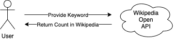

我明确地选择了这个简单的例子，以便学习围绕着为所有组件构建系统，而不是关注 API 的复杂性。

从这里，我们扩展我们的系统，使其可以从 **iOS** 、 **Android、**和 **web** ( **React** )进行访问。最重要的是，我们有一个中间服务器(使用 **Node.js** )并使用 **GraphQL** 作为通信手段，以形成一个我们完全控制的完整系统。

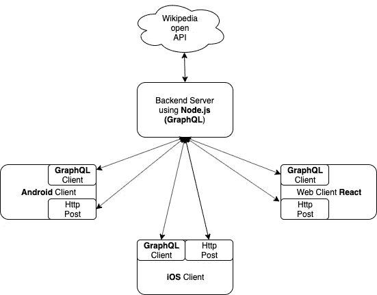

或者在图表中，您将能够获得基于以下组件构建的系统。

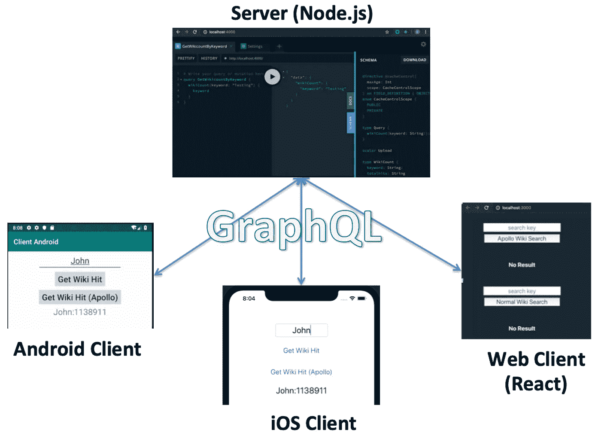

你可以在下面得到整个系统的代码( **iOS，Android，React，Node.js，Graphql**

[](https://github.com/elye/demo_graphql_fullstack_mobile) [## elye/demo _ graph QL _ full stack _ mobile

### 此时您不能执行该操作。您已使用另一个标签页或窗口登录。您已在另一个选项卡中注销，或者…

github.com](https://github.com/elye/demo_graphql_fullstack_mobile) 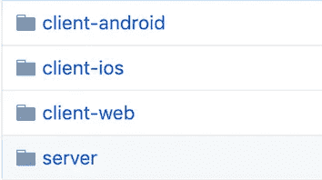

# Node.js 服务器

首先，我有一个 *Node.js* 服务器。要运行它，只需转到*服务器*文件夹，并键入`yarn start`。(如果你不确定什么是纱线，可以看看[这篇博客](https://medium.com/@elye.project/know-yarn-before-learning-node-js-bf39a50fb27f))。

> 注意:在`yarn start`之前，你需要先运行`yarn install`来安装包

> `🚀 Server ready at [http://localhost:4000/](http://localhost:4000/)`

Node.js 是在机器上设置的最简单的服务器之一。没有的话只需要 *npm* 或者*纱*安装即可。

之后，在您希望创建 Node.js 服务器的文件夹中，使用`npm init`或`yarn init`命令创建一个合适的包，其中 *package.json* 将被初始化。

修改您的包以包含一个要运行的 *start* 脚本:

```
{
  "name": "simpleserver",
  "version": "1.0.0",
  "description": "Simple Server with Graphql",
  "main": "index.js",
  "dependencies": {
    "apollo-datasource-rest": "^0.6.6",
    "apollo-server": "^2.9.9",
    "graphql": "^14.5.8"
  },
  "devDependencies": {},
  "scripts": {
 **"start": "node src/index.js",**
    "test": "No test"
  },
  "author": "author (author@gmail.com)",
  "license": "Apache-2.0"
}
```

一旦有了正确的 JavaScript 代码，就可以使用`npm start`或`yarn start`来启动节点服务器。

要了解 Node.js 的基础知识，请参考:

[](https://www.w3schools.com/nodejs/default.asp) [## Node.js 教程

### 我们的“Show Node.js”工具使学习 Node.js 变得容易，它显示代码和结果。var http =…

www.w3schools.com](https://www.w3schools.com/nodejs/default.asp) 

## 维基百科 API

我们创建的 Node.js 服务器是为了在 Wikipedia open API 和所有客户端(Web、iOS 和 Android)之间形成一个中间服务，以便它只为向客户端发送数据提供服务。

它的功能是获取关键字并执行对维基百科开放 API 的提取，如下所示。

API 是[https://en.wikipedia.org/w/api.php](https://en.wikipedia.org/w/api.php)，具有以下参数:

```
“action” =  “query”,
“format” =  “json”,
“list” = “search”,
"srsearch" = <Something to Provide>
```

[https://en.wikipedia.org/w/api.php?action=query&format = JSON&list = search&Sr search = Networking](https://en.wikipedia.org/w/api.php?action=query&format=json&list=search&srsearch=Networking)会生成下面这个。注意，`totalhits`是我们想要得到的。

```
{   batchcomplete: "",
    continue: {
       sroffset: 10,
       continue: "-||"
    },
    query: {
       searchinfo: {
 **totalhits: 399303**
       }, ...
```

## GraphQL 服务

我们希望 Node.js 服务器不仅能以静态 JSON 格式提供从维基百科获得的全部结果，还能以动态格式提供。这里的动态意味着，数据的内容(需要什么信息)由客户端决定。这可以通过使用[图表 QL](https://graphql.org/) 来实现。

一个简单的例子是，如果您启动了 GraphQL 服务器，您可以决定它可以获得的支付数据格式。下面是两个例子(左边是查询，右边是结果)

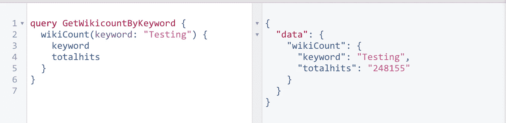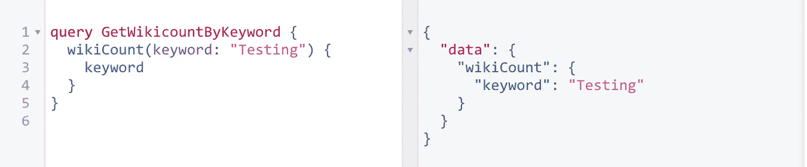

> 上面视图是从 https://electronjs.org/apps/graphiql[的 GraphiQL 工具获得的](https://electronjs.org/apps/graphiql)

## 阿波罗服务器

为了从我们的 *Node.js* 服务器启用 GraphQL 服务，我们使用了 [*Apollo GraphQL* 库](https://www.apollographql.com/)。

在 https://www.apollographql.com/docs/tutorial/introduction/有一个教程。有关代码的服务器部分，请参考第 0 节到第 3 节。

总的来说，我创建的简单的 *Node.js* 服务器如下所示

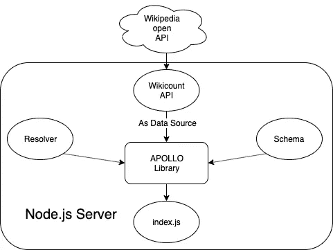

至于模式，我们将其定义如下:

```
const typeDefs = gql`
  type Query {
    wikiCount(keyword: String!): WikiCount
  }
  type WikiCount {
    keyword: String!
    totalhits: String
  }
`;
```

我们有一个解析器查询，如下所示:

```
async getWikiCountByKeyword({ keyword }) {
  const response = await this.get('api.php',
      [["action", "query"], 
       ["format", "json"], 
       ["list", "search"], 
       ["srsearch", keyword]]);
  return this.wikiCountReducer(
      keyword, response.query.searchinfo.totalhits);
}
```

更多信息，请参考 GitHub 中的代码。

这样，当您使用浏览器访问该网站时，您将会看到如下内容，显示可用的服务。

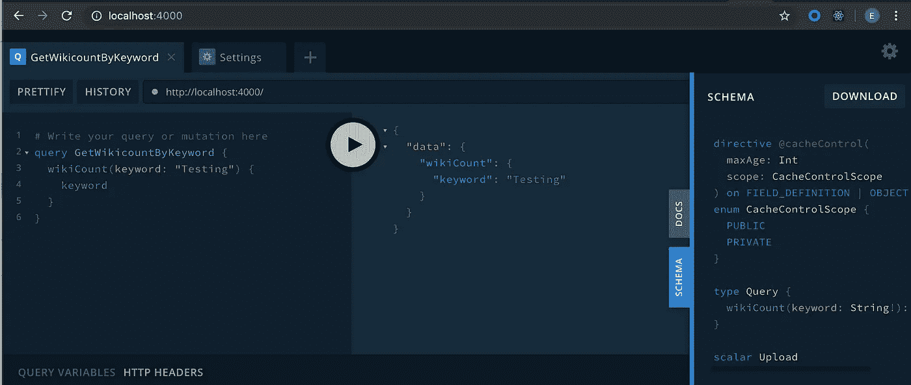

左边是您的输入查询，请求您想要的输出。中间是结果(按下播放按钮后生成)。右边是我们在 *Node.js* 服务器中定义的模式。

# React Web 客户端

接下来，我们来看看 Web 客户端。

我们可以使用任何 web 客户端，只要它们能够执行 POST 请求。这里我只关注使用 *React* ，因为它也是用 *JavaScript* 编写的，并且很好地补充了 *Node.js* 。

要启动 *React* Web 客户端，只需转到 *client-web* 文件夹，并执行命令`yarn start`

它将自动启动浏览器并自动打开`localhost:3000`站点，用户界面如下所示。

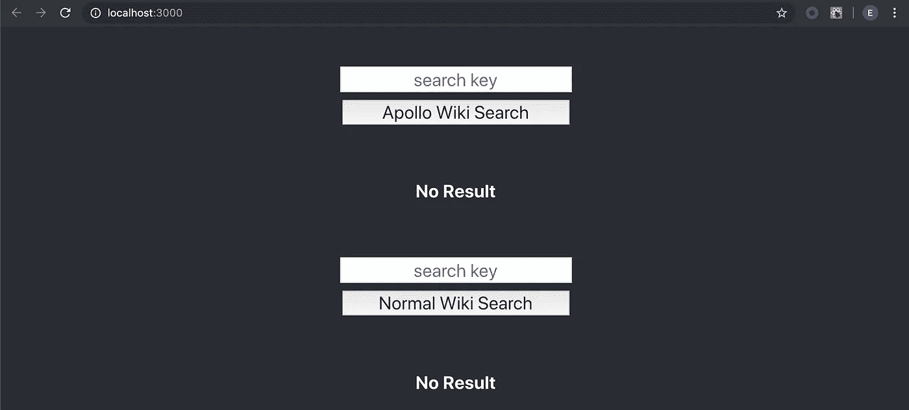

我实现了两种抓取方法。一种是使用 Apollo GraphQL 客户端 react 包库。另一个只是常规的 POST 请求。

> 要学习 React，参考这个网站[https://reactjs.org/tutorial/tutorial.html](https://reactjs.org/tutorial/tutorial.html)，让你创建一个简单的游戏。

## 阿波罗网络客户端

在 https://www.apollographql.com/docs/tutorial/introduction/可以找到 *React* 的官方 Apollo Web 客户端教程。关于我们代码中提到的 Web 客户端，请参考第 5 到 6 节。

在我们的代码中，我们首先将`ApolloClient`包装在我们的应用程序中。

```
const cache = new InMemoryCache();
const link = new HttpLink({
    uri: ***SERVERURL*** });

const client = new ApolloClient({
    cache,
    link
});

ReactDOM.render(
    <ApolloProvider client={client}>
        <App/>
    </ApolloProvider>, ***document***.getElementById('root')
);
```

然后在获取端，首先我们定义查询(即`GET_WIKI_HIT`)

```
const GET_WIKI_HIT = gql`
    query GetWikicountByKeyword($keyword: String!) {
        wikiCount(keyword: $keyword) {
            keyword
            totalhits
        }
    }
`;
```

然后我们有一个获取函数，它结合了整个搜索框、按钮和结果文本的创建。它使用了一种 *React Hook* 方法，这种方法会根据状态而改变。

> 为了更好地理解 React Hook，请参考 POST Web Client 方法。

```
export default function FetchApollo() {
        const [keyword, setKeyword] = React.useState("");
        const {data, loading, error} = 
            useQuery(GET_WIKI_HIT, {variables: {keyword: keyword}});

        let result
        if (keyword === "") result = "No Result";
        else if (loading) result = "loading"
        else if (error) result = error.message;
        else result = 
            data.wikiCount.keyword + ":" + data.wikiCount.totalhits;

        return (
            <div>
                <div><SearchBox caption={"Apollo Wiki Search"} 
                     onSubmit={(keyword) => 
                     setKeyword(keyword)}/></div> {loading && keyword !== "" ?
                    (<Loading />) :
                    (<div><SearchResult value={result}/></div>)
                }

            </div>
        );
}
```

## HTTP Post Web 客户端

除了使用 Apollo 客户端帮助获取 GraphQL 结果，我们还可以使用传统的 HTTP Post，正如在 https://graphql.org/learn/serving-over-http/中提到的

简而言之，这是一个 post 请求，JSON 主体为:

```
{
  "query": "...",
  "operationName": "...",
  "variables": { "myVariable": "someValue", ... }
}
```

所以对于我们的查询，我们做如下:

```
const query = `
query GetWikicountByKeyword($keyword: String!) {
    wikiCount
        (keyword: $keyword) {
            keyword 
            totalhits
        } 
}`// and const body = {
    query: query,
    variables : { keyword }
};
```

我还使用 React 钩子方法按照中的指导执行获取

[](https://www.robinwieruch.de/react-hooks-fetch-data) [## 如何用 React 钩子取数据？- RWieruch

### 在本教程中，我想向您展示如何通过使用状态和效果挂钩在 React with Hooks 中获取数据。我们会…

www.robinwieruch.de](https://www.robinwieruch.de/react-hooks-fetch-data) 

# Android 客户端

让我们继续移动客户端。首先，我们来看看 Android。

Android 也有两种方法，1 .HTTP Post 方法；2.Apollo GraphQL 库方法。

> 但是首先，要使用它，您需要将`[*ENTER_YOUR_HOST_HERE*](http://ENTER_YOUR_HOST_HERE:4000)`更改为您的本地主机 IP。您可以在终端上使用`*ifconfig*`命令找到它。

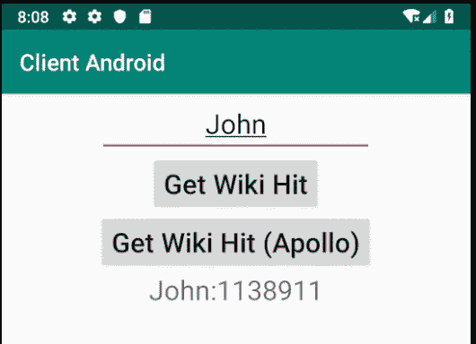

## HTTP Post Android 客户端

我指的是基本网络(检查 Android 端)

[](https://medium.com/better-programming/learn-ios-android-networking-e19808f554a7) [## 学习 iOS/Android:网络

### 探索 Alamofire (iOS)和 okHttp (Android)

medium.com](https://medium.com/better-programming/learn-ios-android-networking-e19808f554a7) 

与教程的不同之处在于，我执行的是 POST 而不是 GET。

我形成如下的查询:

```
companion object {
    private val queryString = """
        query GetWikicountByKeyword(${"$"}keyword: String!){ 
            wikiCount(keyword: ${"$"}keyword) {
                keyword 
                totalhits
            }
        }
        """.*trimIndent*().*replace*("\n", "")
}
```

然后我手动创建要发布的 JSON 主体。注意，我将请求和标题都设置为`application/json`。

```
val params = HashMap<String, String>()
**params["query"] = queryString
params["variables"] = "{\"keyword\": \"${searchText}\"}"**
val body = JSONObject(params)
    .toString().*toRequestBody*(**"application/json; charset=utf-8"**.*toMediaType*())

val httpUrl = httpUrlBuilder.build()
val request = Request.Builder()
    .header(**"Content-Type", "application/json"**)
    .url(httpUrl)
    .post(body)
    .build()
val response = httpClient.newCall(request).execute()
```

> 注意:对于上面的代码，我使用了`‘com.squareup.okhttp3:okhttp:4.2.2’`，它在设置类型等方面有整洁的 Kotlin 扩展函数。

## 阿波罗安卓客户端

这是通过按照中的步骤完成的

[](https://www.apollographql.com/docs/android/essentials/get-started/) [## 开始

### Apollo-Android 是一个符合 GraphQL 的客户机，它从标准的 GraphQL 查询生成 Java 模型。这些模型…

www.apollographql.com](https://www.apollographql.com/docs/android/essentials/get-started/) 

让我在下面陈述几个重要的步骤。

**准备模式和 GraphQL 文件**

为了让 Apollo 客户端工作，我们需要*模式*和 *graphql 文件*用于稍后的自动代码生成。

要有一个 *schema.json* 文件，您需要有一个`[apollo-codegen](https://github.com/apollographql/apollo-tooling#usage)`，它可以使用命令获得。

```
yarn global add apollo
```

> 如果你想了解*纱线*的话，可以看看这个博客

之后，你的机器上应该有`apollo`可以使用。

然后只需输入下面的命令，从我们的服务器中提取出 *schema.json* 。它基本上是我们在服务器中定义的模式的 JSON 格式。

```
apollo schema:download — endpoint=http://localhost:4000 schema.json
```

现在，手动创建所有查询 GraphQL 文件。在我们的例子中，我们只有一个。

```
query GetWikicountByKeyword($keyword: String!){
    wikiCount(keyword: $keyword) {
        keyword
        totalhits
    }
}
```

把它们放在下面的文件夹里。

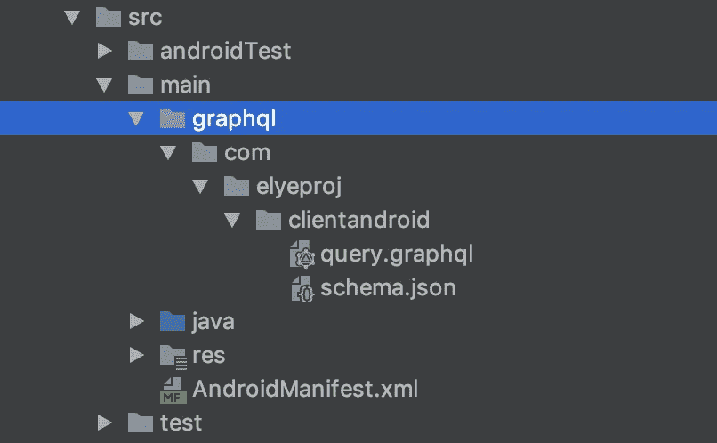

**设置代码自动生成依赖关系**

之后，添加下面的**项目*****build . gradle***

```
classpath 'com.apollographql.apollo:apollo-gradle-plugin:1.0.0'
```

然后在**app*****build . gradle***的头部分添加以下内容

```
apply plugin: 'com.apollographql.android'
```

> 这两个工具将允许基于 graphql 查询和模式自动生成特定的 apollo 查询代码。它将在*app/build/generated/source/Apollo/class*文件夹中生成。

**设置库依赖关系**

现在将以下内容添加到您的**应用程序*build . gradle***

```
implementation 'com.apollographql.apollo:apollo-runtime:1.0.0'
implementation "com.apollographql.apollo:apollo-android-support:1.0.0"
```

执行同步，您就可以开始编码了。

**提取器代码**

首先，让我们从 *OkHttp* 创建网络客户端，并设置 *ApolloClient* 。

```
object ApolloConnector {
    private const val SERVER_URL = "http://ENTER_HOST_HERE:4000"
    fun setupApollo(): ApolloClient {
        val okHttpClient = OkHttpClient.Builder().build()
        return ApolloClient.builder()
           .serverUrl(BASE_URL).okHttpClient(okHttpClient).build()
    }
}
```

然后在代码的获取部分，设置自动生成的类`GetWikicountByKeywordQuery`，如下所示。然后检索结果或提取错误消息。

```
ApolloConnector.setupApollo().query(
    // Autogenerated Query Class
 **GetWikicountByKeywordQuery
        .builder()
        .keyword(keyword)
        .build()**
)
    .enqueue(object : ApolloCall.Callback<**GetWikicountByKeywordQuery**.Data>() {
        override fun onResponse(response: 
            Response<**GetWikicountByKeywordQuery**.Data>) {
            response.data()?.wikiCount?.*run* **{** showApolloResult("${keyword()}:${totalhits()}")
            **}** ?: showApolloResult("No Result")
        }

        override fun onFailure(e: ApolloException) {
            showApolloResult(e.*localizedMessage*)
        }
    })
```

# iOS 客户端

现在我们来看看 iOS。与 Web 客户端和 Android 客户端类似，iOS 也有两种方法，1。阿波罗 GraphQL 库方法:2.HTTP Post 方法

> 但是首先，要使用它，您需要将`[*ENTER_YOUR_HOST_HERE*](http://ENTER_YOUR_HOST_HERE:4000)`更改为您的本地主机 IP。你可以在你的终端上使用`*ifconfig*`命令找到它。

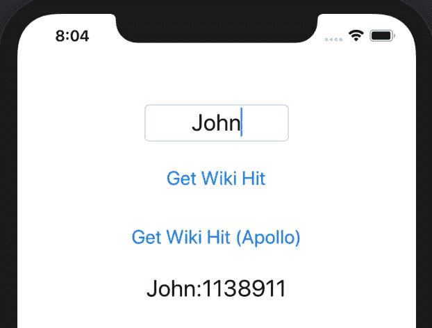

## HTTP Post Android 客户端

我指的是基本网络(查看 iOS 端)

[](https://medium.com/better-programming/learn-ios-android-networking-e19808f554a7) [## 学习 iOS/Android:网络

### 探索 Alamofire (iOS)和 okHttp (Android)

medium.com](https://medium.com/better-programming/learn-ios-android-networking-e19808f554a7) 

与教程的不同之处在于，我执行的是 POST 而不是 GET。

我只需要设置需要的 JSON 查询，如下所示。

```
let search = """
    query GetWikicountByKeyword($keyword: String!)
    { wikiCount
        (keyword: $keyword) {
          keyword
          totalhits
        }
    }
    """let parameters: Parameters = [
      "query": search,
      "variables": "{ \"keyword\": \"\(searchText)\" }"
    ]
```

然后执行正常的提取，如下所示

```
request = Alamofire.SessionManager.default.request(
      ViewController.baseUrl, method: .post, 
           parameters: parameters, encoding: JSONEncoding.default)
      .responseData { (resData) -> Void in
        self.view.stopLoading()switch (resData.result) {
        case let .success(data):
          let swiftyJsonVar = JSON(data)
          let countObj = 
            swiftyJsonVar["data"]["wikiCount"]["totalhits"]
          let keywordObj = 
            swiftyJsonVar["data"]["wikiCount"]["keyword"]
          guard
            let count = countObj.rawValue as? String,
            let keyword = keywordObj.rawValue as? String,
            count.isNumber
            else {
              self.view.showResult(data: "No data found")
              return
          }
          self.view.showResult(data: "\(keyword):\(count)")
        case let .failure(error):
          self.view.showResult(data: error.localizedDescription)
        }
    }
```

## 阿波罗 iOS 客户端

使用 Apollo iOS 客户端的主要参考是使用下面的。我使用 Cocoapod 依赖管理系统链接到这个库。

> 参考[这篇博客](https://medium.com/@elye.project/learn-ios-android-dependency-management-5893300342d0)了解更多关于*椰子的细节*。

[](https://www.apollographql.com/docs/ios/installation/) [## 装置

### Apollo iOS 需要最新的 Xcode，可以从 Mac App Store 安装。

www.apollographql.com](https://www.apollographql.com/docs/ios/installation/) 

像在 Android 中一样，我们也需要有 *schema.json* 和各自的 *GraphQL 查询*。我们按照 Android 部分的**准备模式和 GraphQL 文件**一节中的描述来生成它们。不同的是，我们把它们和主代码放在同一个文件夹里。

**设置代码自动生成依赖关系**

为了使用 *schema.json* 和相应的 *GraphQL 查询*来生成所需的代码，我们需要在构建阶段添加以下内容

```
SCRIPT_PATH="${PODS_ROOT}/Apollo/scripts"**cd** "${SRCROOT}/${TARGET_NAME}""${SCRIPT_PATH}"/run-bundled-codegen.sh codegen:generate --target=swift --includes=./**/*.graphql
```

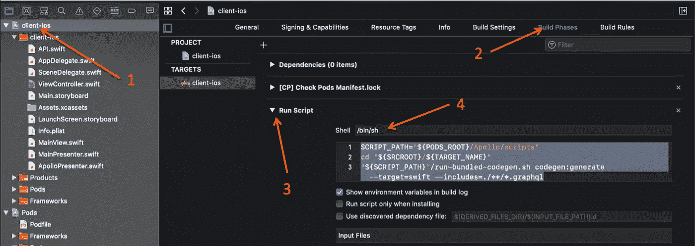

有了这个，当编译开始时，它将生成一个文件名`API.swift`，其中定义了类`GetWikicountByKeywordQuery`。

**提取器代码**

有了生成的代码，现在您可以执行如下抓取

```
private let view: MainView
  private let apollo = ApolloClient(url: URL(string: ViewController.baseUrl)!)
  private var watcher: 
     **GraphQLQueryWatcher**<**GetWikicountByKeywordQuery**>?init(view: MainView) {
    self.view = view
  }func fetchData(searchText: String) {
    watcher = **apollo.watch**(query: 
      **GetWikicountByKeywordQuery**(keyword: searchText)) { result in
      self.view.stopLoading()
      switch result {
      case .success(let graphQLResult):
        guard
          let count = graphQLResult.data?.wikiCount?.totalhits,
          let keyword = graphQLResult.data?.wikiCount?.keyword,
          count.isNumber
          else {
            self.showResult(data: "No data found")
            return
        }
        self.showResult(data: "\(keyword):\(count)")
      case .failure(let error):
        self.showResult(data: error.localizedDescription)
      }
    }
  }
```

# 一个系统启动了！

就是这样。现在你有了一个完整的系统。

需要注意的是，使用 Apollo 客户端(用于 iOS、Android 和 Web)，它已经内置了缓存机制。因此相同的获取不会再次发送请求。然而，这种方法依赖于 GraphQL 库。

原生 HTTP POST 请求更加传统，尽管我提供的例子没有缓存机制。

注意，这些是建立一个完整系统的基础。请参考相应的站点和域，了解它提供的更多高级功能。

我希望这给你一个好的开始。我要感谢 [Frank Tan](https://medium.com/u/22ad527b5a1a?source=post_page-----cb74d2c400fe--------------------------------) ，他最初让我接触了阿波罗图书馆，并阐述了我在这一领域的学习。

感谢阅读。你可以在这里查看我的其他话题。

关注我的 [*中的*](https://medium.com/@elye.project) *，* [*推特*](https://twitter.com/elye_project) *，* [*脸书*](https://www.facebook.com/elyeproj/) 或 [*Reddit*](https://www.reddit.com/user/elyeproj/) 获取关于移动开发等相关话题的小技巧和学习。~Elye~