# 用 Autocode + Block Kit Builder 构建一个 Slack App 私下问候新成员

> 原文：<https://levelup.gitconnected.com/build-a-slack-app-to-greet-new-members-privately-with-autocode-block-kit-builder-30abad01008f>

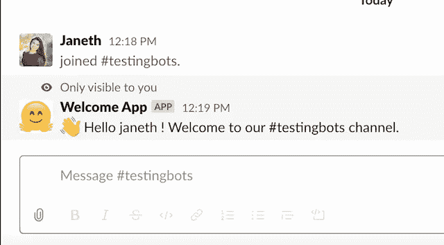

在[面向制造商的 API](https://medium.com/better-programming/apis-for-makers-9670719e7f25)中，我们开始学习 API、应用程序接口，以及如何使用它们来传输和操作数据、自动化工作操作、巩固通信以及扩展平台和工具的功能，如 [Slack](https://slack.com/) 和 [Typeform](http://Typeform.com) 。

在本指南中，我们将继续探索[Slack API](http://Slack.com)。只需几个步骤，我们将创建一个 Slack 应用程序，在新用户加入 Slack 频道时私下欢迎和指导他们。我们将轻松完成设置过程，您将能够返回进行修改，并添加您自己的风格和自定义消息，以获得独特的 workspace onboarding 体验！

我们将使用 [Autocode](http://Autocode.com) 为我们的应用程序准备一切。我们不必设置服务器和基础设施——最棒的是，我们的代码会自动生成，如果我们需要，可以立即编辑🙌🏼

# 你事先需要什么

*   [1x 松弛团队](http://Slack.com)
*   [1x 标准库账户](http://Stdlib.com)
*   1x *创意与大胆的灵魂*

# 我们开始吧！

我们的 Slack 应用程序将发布一条消息，这条消息只有当用户加入频道时才可见！在下面的截图中，请注意 Welcome App 的消息只对刚刚加入#testingbots 频道的 Janeth 可见。

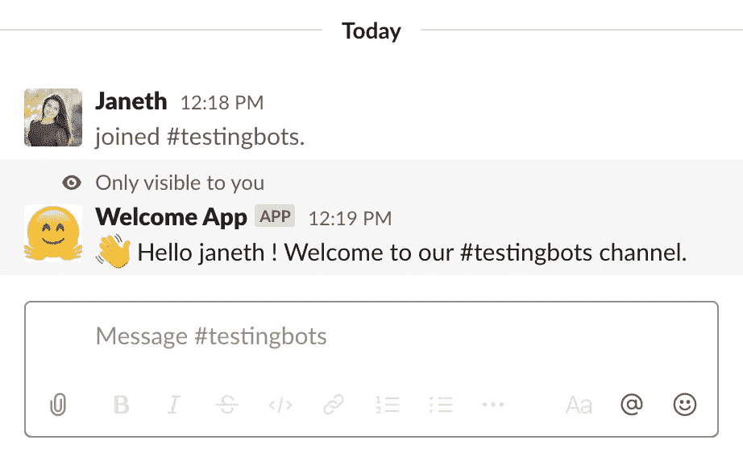

仅对频道中的新成员可见

# 第 1 部分:登录到标准库的 Autocode

前往标准库上的[自动编码](http://Autocode.com)并登录或创建一个**免费**账户。如果你有一个标准图书馆帐户，点击**已经注册**并使用你的标准图书馆凭证登录。

您会注意到用于构建 webhooks、计划任务、Slack slash 命令和条带工作流的预构建模板。选择“**空白原型新代码”**

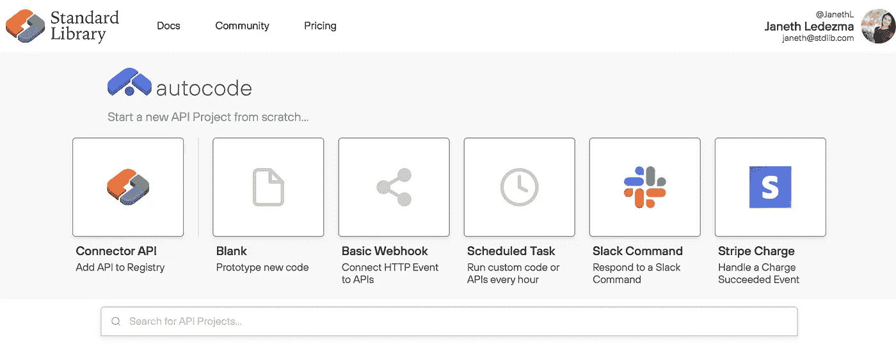

你将被重定向到一个编码界面，但我们将使用 Maker 模式来设置我们的 Slack 应用程序。选择左边的**切换到制作器模式(Beta)** 按钮。

Maker Mode 是一个像 Zapier、IFTTT 和其他自动化工具一样的工作流构建器，有一些重要的区别。Maker 模式指导、教授和介绍 maker 代码，而不是将其全部抽象掉。

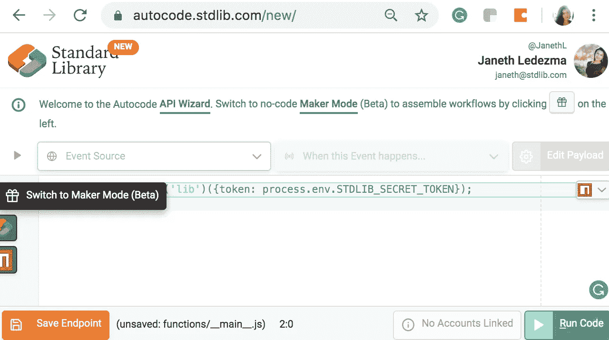

一旦进入 Maker 模式，您会注意到 Autocode API 向导——一个下拉菜单界面，用于使用标准库注册表上的 API 快速设置工作流和自动化。当您与 Autocode 的 API 向导交互时，您将能够在右侧看到自动生成的代码。

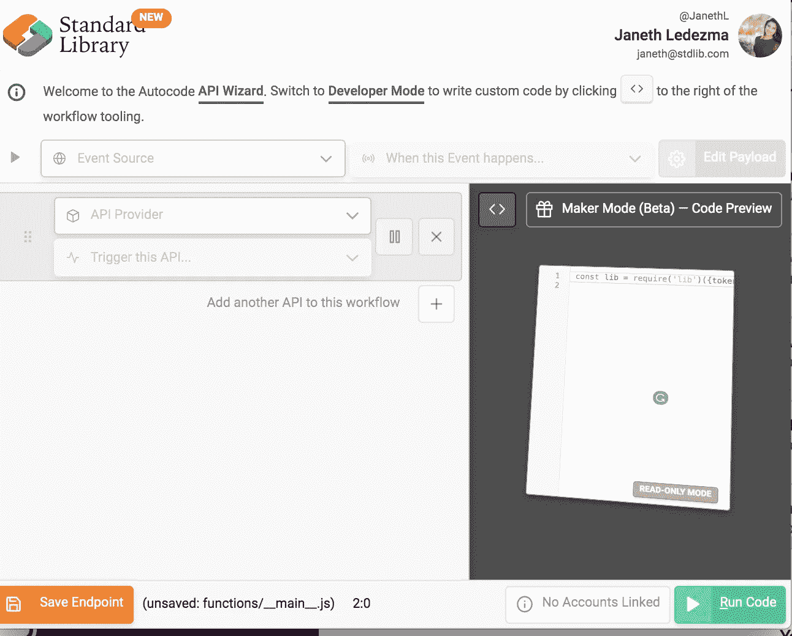

# 第 2 部分:在自动编码 API 向导上配置 Slack APIs

在第一个下拉菜单中，选择 **Slack** 作为您的**事件**源**和 **member_joined_channel** 作为**事件。****

当您做出此选择时，Autocode 会在您的工作流程中添加两个额外的步骤。

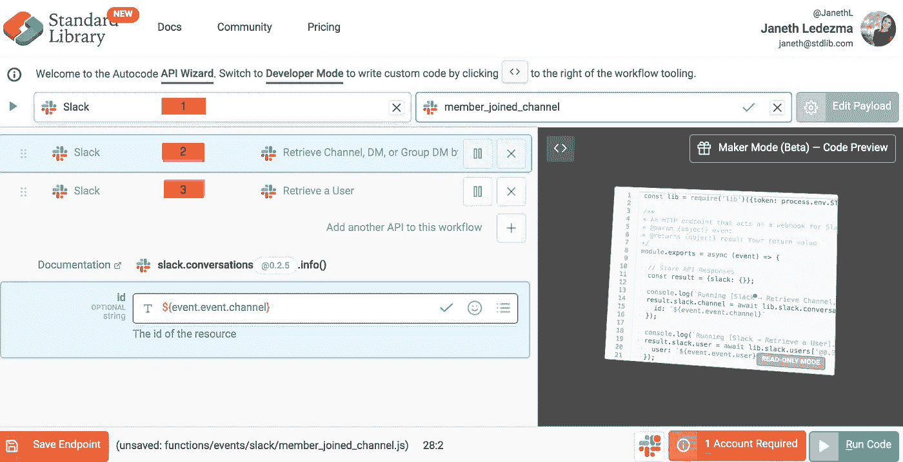

第一步是设置一个 HTTP 端点，作为 Slack `member_joined_channel`事件的 webhook。当一个新成员加入一个通道时，该事件的有效负载信息从 Slack 发送到 HTTP 端点。端点内的代码随后执行并可以使用这些信息。

步骤#2 向`[lib.slack.conversations[‘@0.2.5’]](https://stdlib.com/@slack/lib/conversations/)` API 发出 HTTP GET 请求，并使用`[info](https://stdlib.com/@slack/lib/conversations/#info)`方法检索通道对象，该对象包含有关通道的信息，包括名称、主题、目的等，并将其存储在`result.slack.channel`中。检索频道信息的参数自动设置为`${event.event.channel}` —保持不变。

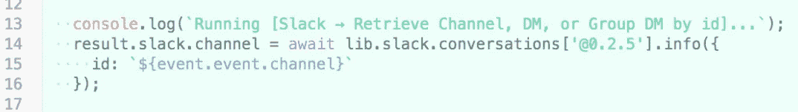

开发人员模式下自动生成代码的视图

步骤#3 还向`[lib.slack.users[‘@0.3.32’]](https://stdlib.com/@slack/lib/users/)`发出一个 HTTP GET 请求，并使用`[retrieve](https://stdlib.com/@slack/lib/users/#retrieve)`方法获取包含用户信息的用户对象，并将其存储在`result.slack.user`中。检索用户信息的参数自动设置为`${event.event.user}` —保持原样。

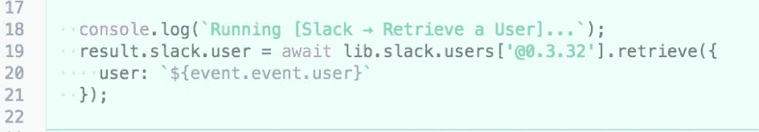

开发人员模式下自动生成代码的视图

*参数就像是我们在调用 API 时需要填充的空白处——这是我们向 API 提供执行操作所需信息的一种方式，就像使用提供的参数来获取对象一样。*

# 第 3 部分:设置私有松弛消息

**通过选择`+`按钮，将最终 API 添加到该工作流程**中。选择 **Slack** 作为您的 API 提供者，选择**从您的 Bot** 创建一个新的临时消息作为将被触发的 API。

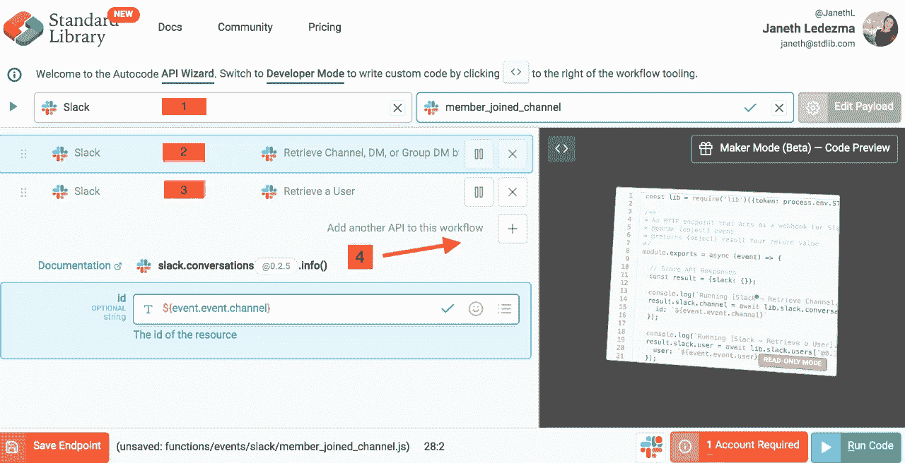

我们工作流中的这一步使用`[ephemeral.create](https://stdlib.com/@slack/lib/messages/#ephemeral-create)`方法向`[lib.slack.messages[‘@0.5.11’](https://stdlib.com/@slack/lib/messages)]`发出 HTTP POST 请求，以创建并发布一条只有新成员才能看到的消息。

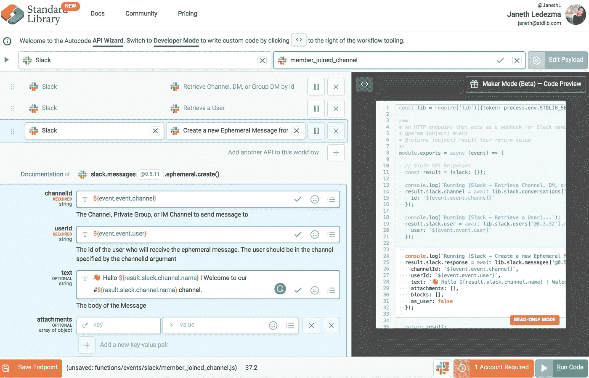

使用以下参数配置 API 调用:

`channelId:${event.event.channel}`

`userId:${event.event.user}`

`text: 👋 Hello ${result.slack.channel.name} ! Welcome to our #${result.slack.channel.name} channel.`

# 第 4 部分:更仔细地检查我们的开发人员模式代码

点击生成的代码切换到**开发者模式。**

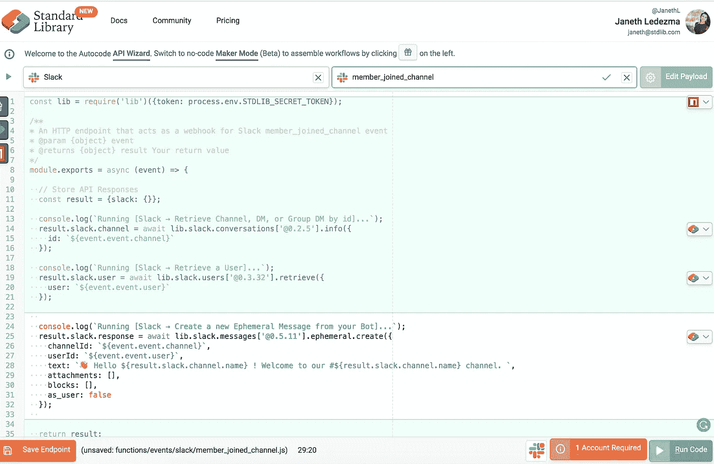

第一行代码导入了一个名为“lib”的 [**NPM**](https://www.npmjs.com/package/lib) 包，以允许我们与标准库之上的其他 API 进行通信:

`const lib = require(‘lib’)({token: process.env.STDLIB_SECRET_TOKEN});`

第 3–7 行是一个注释，作为文档，允许标准库对我们的函数进行类型检查调用。如果调用没有提供正确(或预期类型)的参数，它将返回一个错误。

**第 8 行**是一个函数(`module.exports)`，它将导出我们在第 8–37 行找到的全部代码。一旦我们部署了我们的代码，这个函数将被封装到一个 HTTP 端点(API 端点)中，它将自动向 Slack 注册，这样每次发生`member_joined_channel`事件时，Slack 都会发送事件有效负载供我们的 API 端点使用。

**第 24–32 行**使用传入的信息(参数)创建并发布您的消息:`channelId`、`UserId`、`Text.`

你可以在这里阅读更多关于 API 规范和参数的内容:[https://docs . stdlib . com/connector-APIs/building-an-API/API-specification/](https://docs.stdlib.com/connector-apis/building-an-api/api-specification/)

# **第 5 部分:链接松弛帐户&部署您的工作流**

在我们可以部署我们的代码现场，我们需要链接选择 **1 帐户所需的**红色按钮，这将提示您链接一个松弛帐户。

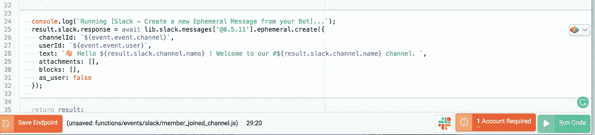

从身份管理屏幕中选择**链接资源**。

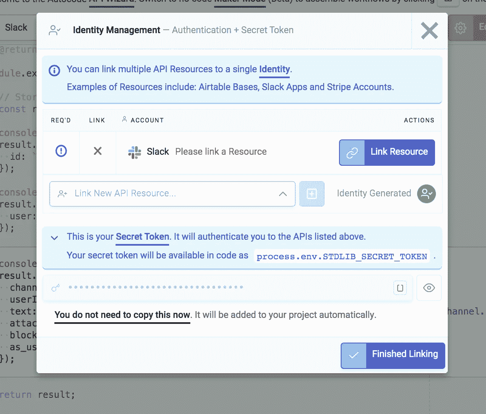

如果您已经使用标准库构建了 Slack 应用程序，您将看到现有的 Slack 帐户，或者您可以选择**链接新资源**来链接新的 Slack 应用程序**。**

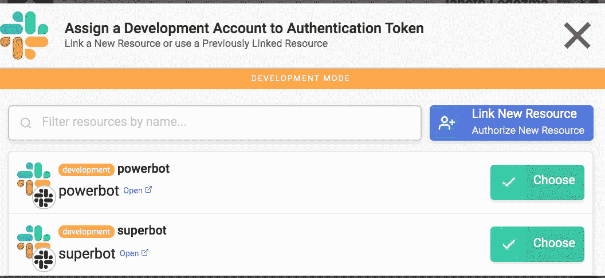

选择**安装标准库应用**。

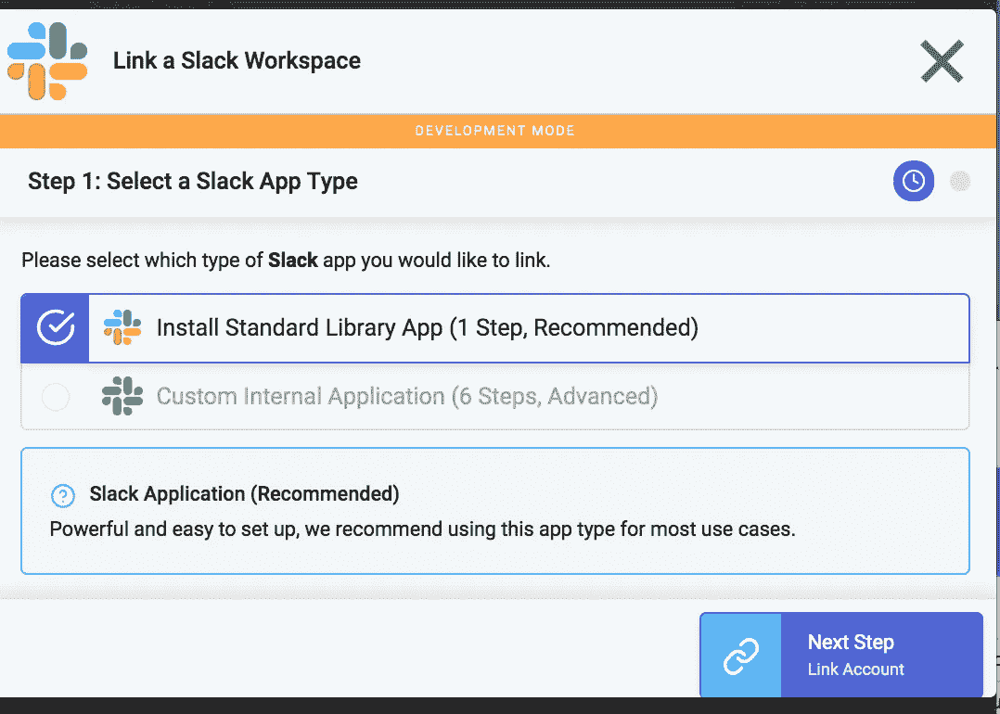

您应该会看到一个 OAuth 弹出窗口，如下所示:

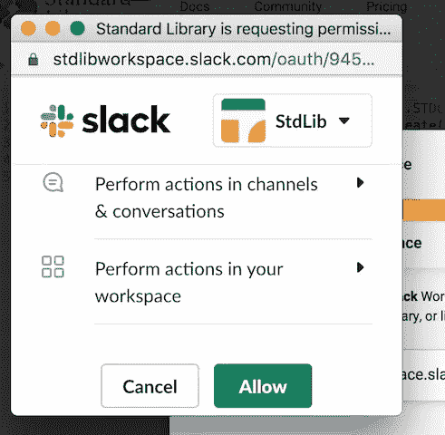

选择**允许**。你可以选择用名称和图片定制你的 Slack 应用。

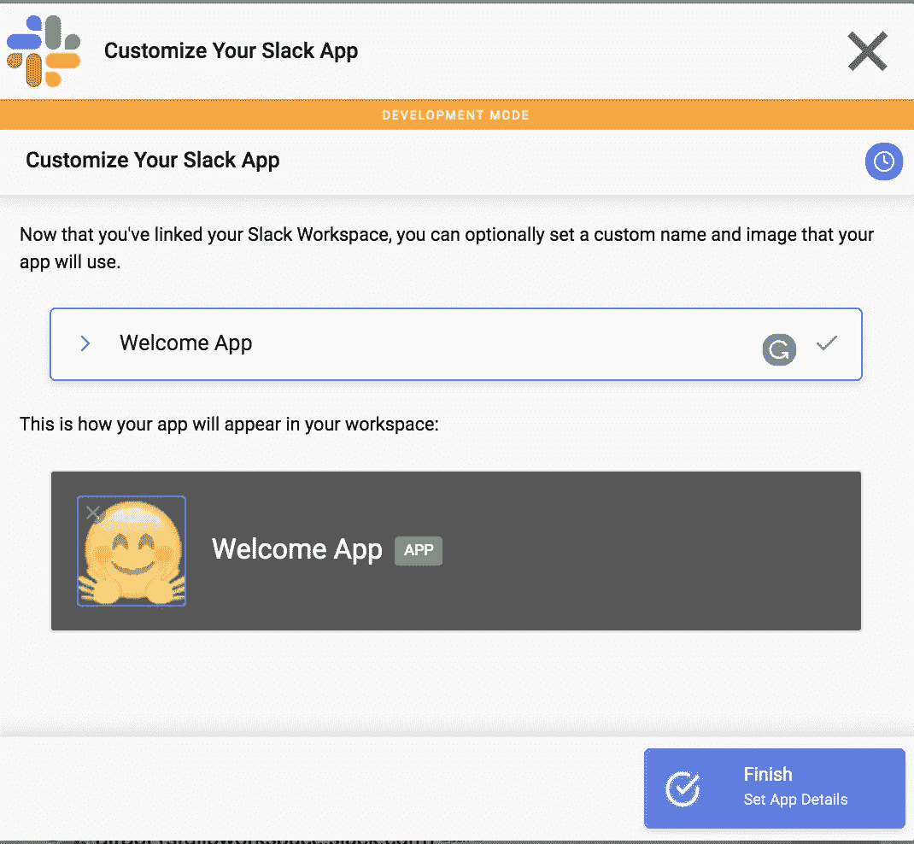

选择**完成**。绿色复选标记确认您已正确链接您的帐户。点击**完成**的链接。

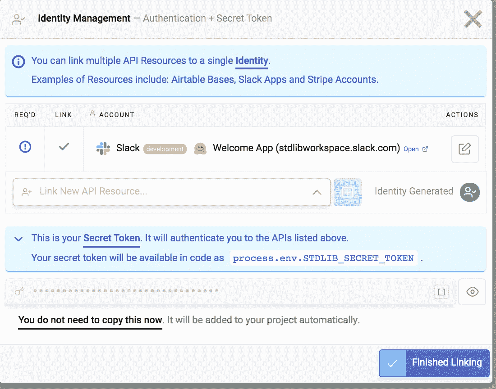

选择橙色的**保存端点**按钮。

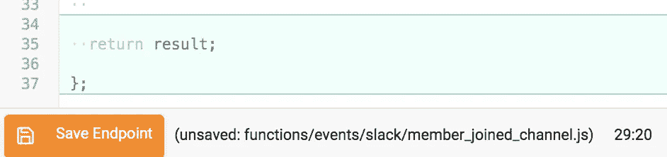

给你的项目起个名字**保存 API 项目**。

太好了！您刚刚保存了您的第一个项目。Autocode 会自动设置一个项目支架，将您的项目保存为 API 端点，但它尚未部署。

这意味着您的端点尚未激活，无法响应 HTTP 请求或事件。要将您的 API 部署到云中，选择文件管理器左下角的**部署 API** 。

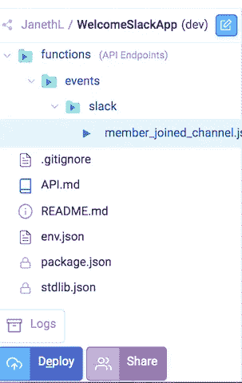

# 🚀恭喜你。您的应用已上线

通过加入或离开工作区中的任何频道来测试您的 Slack 应用程序。如果你已经设置好了一切，你应该会收到 Slack 应用程序的热烈欢迎。

# 额外收获:使用积木套件生成器定制您的信息

是时候发挥创意，使用 Block Kit Builder 将您的个性添加到 Slack 应用程序中了。

[**Block Kit Builder**](https://api.slack.com/block-kit)是 Slack 的可视化原型开发工具，使制作者无需编写代码就能创建丰富的交互式消息设计。制作者可以从预先构建的模板中进行选择，并编辑代码或使用构建组件。一旦设计就绪，将 JSON 复制并粘贴到 Autocode 项目的`blocks`部分。

将鼠标悬停在[此链接](https://api.slack.com/tools/block-kit-builder?mode=message&blocks=%5B%7B%22type%22%3A%22section%22%2C%22text%22%3A%7B%22type%22%3A%22mrkdwn%22%2C%22text%22%3A%22*%F0%9F%99%8F%F0%9F%8F%BD%20Thank%20you%20for%20joining%20our%20community%20of%20Makers%20and%20Developers.%20%5Cn%20%5Cn%20%F0%9F%98%8D%20%20It%27d%20be%20awesome%20if%20you%20could%20introduce%20yourself%20in%20our%20%23general%20channel.%5Cn%20%20%5Cn%20Tell%20us%20who%20you%20are%20and%20what%20projects%20you%20are%20working%20on.%20Also%20feel%20free%20to%20ask%20any%20question%20regarding%20building%20with%20APIs%20on%20Standard%20Library.%20%5Cn%20%5CnOnce%20you%20are%20done%20telling%20us%20about%20yourself%20you%20may%20return%20and%20check%20out%20tutorials%2C%20blog%20posts%2C%20and%20upcoming%20events.%20%5Cn%20%5Cn%20Happy%20Building!%20%F0%9F%A4%97%20%F0%9F%91%B7%20%F0%9F%9A%80%20%20%22%7D%7D%2C%7B%22type%22%3A%22divider%22%7D%2C%7B%22type%22%3A%22section%22%2C%22text%22%3A%7B%22type%22%3A%22mrkdwn%22%2C%22text%22%3A%22%20%F0%9F%91%A8%F0%9F%8F%BD%F0%9F%92%BB%20*Tutorials*%20%20%22%7D%7D%2C%7B%22type%22%3A%22section%22%2C%22text%22%3A%7B%22type%22%3A%22mrkdwn%22%2C%22text%22%3A%22*Introducing%20Autocode*%20%5Cn%20Watch%20this%2010%20minute%20video%20to%20learn%20how%20easy%20it%20is%20to%20build%20integrations%20with%20APIs%20on%20Standard%20Library%22%7D%2C%22accessory%22%3A%7B%22type%22%3A%22button%22%2C%22text%22%3A%7B%22type%22%3A%22plain_text%22%2C%22text%22%3A%22Watch%20Now%22%2C%22emoji%22%3Atrue%7D%2C%22url%22%3A%22https%3A%2F%2Fyoutu.be%2Fha3C0X3Vyi0%22%7D%7D%2C%7B%22type%22%3A%22section%22%2C%22text%22%3A%7B%22type%22%3A%22mrkdwn%22%2C%22text%22%3A%22*APIs%20for%20Makers*%20%5Cn%20A%20high-level%20overview%20of%20how%20APIs%20work%20and%20a%20step%20by%20step%20example%20of%20how%20to%20connect%20two%20different%20pieces%20of%20software%3A%20Slack%20and%20Typeform%22%7D%2C%22accessory%22%3A%7B%22type%22%3A%22button%22%2C%22text%22%3A%7B%22type%22%3A%22plain_text%22%2C%22text%22%3A%22Read%20Now%22%2C%22emoji%22%3Atrue%7D%2C%22url%22%3A%22https%3A%2F%2Fmedium.com%2Fbetter-programming%2Fapis-for-makers-9670719e7f25%22%7D%7D%2C%7B%22type%22%3A%22divider%22%7D%2C%7B%22type%22%3A%22section%22%2C%22text%22%3A%7B%22type%22%3A%22mrkdwn%22%2C%22text%22%3A%22%3Acalendar%3A%20%7C%20%20%20*UPCOMING%20EVENTS*%20%20%7C%20%3Acalendar%3A%20%22%7D%7D%2C%7B%22type%22%3A%22section%22%2C%22text%22%3A%7B%22type%22%3A%22mrkdwn%22%2C%22text%22%3A%22%6003%2F20%60%20*Slack%20app%20%2B%20API%20%20Workshop%20for%20Makers%20%26%20Developers*%20_%20Maker.dev%20(SF%20Chapter)%20%40%20SlackHQ%205%3A30%20pm%20-%208%3A30%20pm_%22%7D%2C%22accessory%22%3A%7B%22type%22%3A%22button%22%2C%22text%22%3A%7B%22type%22%3A%22plain_text%22%2C%22text%22%3A%22RSVP%22%2C%22emoji%22%3Atrue%7D%2C%22url%22%3A%22https%3A%2F%2Fwww.meetup.com%2FMaker-dev-SF-Chapter%2Fmembers%2F%3Fsort%3Djoin_date%26desc%3Dtrue%22%7D%7D%2C%7B%22type%22%3A%22section%22%2C%22text%22%3A%7B%22type%22%3A%22mrkdwn%22%2C%22text%22%3A%22%6003%2F20%60%20*No%20Code%20March*%20_%20Learn%20how%20to%20build%20with%20Autocode%2C%20Bubble%2C%20Airtable%20%2B%20more%20%40%20Galvanize%206%3A00%20pm%20-%208%3A00%20pm_%22%7D%2C%22accessory%22%3A%7B%22type%22%3A%22button%22%2C%22text%22%3A%7B%22type%22%3A%22plain_text%22%2C%22text%22%3A%22RSVP%22%2C%22emoji%22%3Atrue%7D%2C%22url%22%3A%22https%3A%2F%2Fwww.eventbrite.com%2Fe%2Fno-code-sf-meetup-tickets-97328910391%22%7D%7D%5D)中并复制 URL，即可访问我的模板设计。将其粘贴到新标签的地址栏中。您应该会看到如下所示的模板:

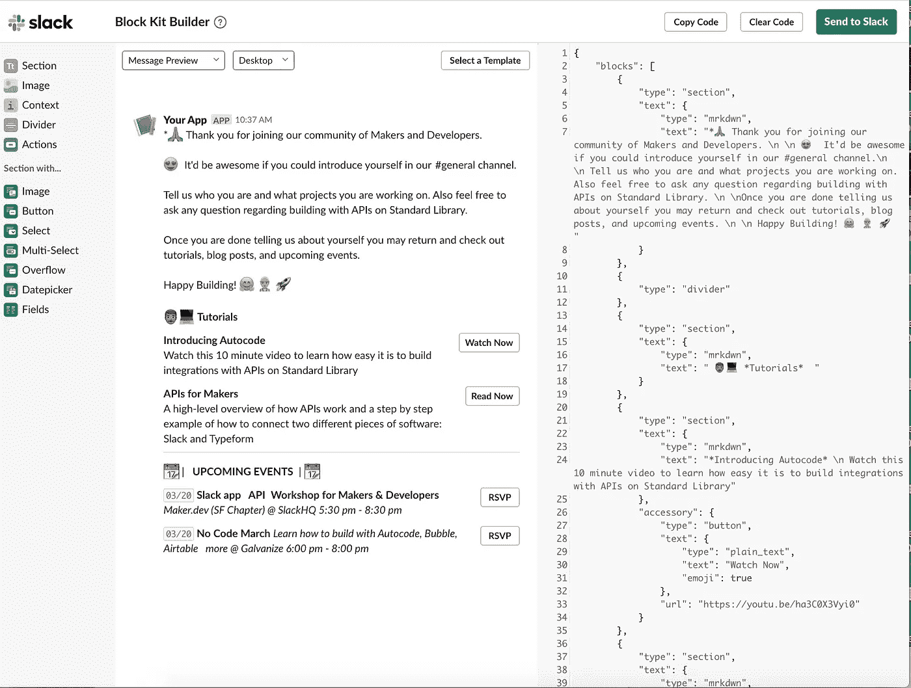

仅选择并复制**括号`[]`内的**对象。

通过将代码直接粘贴到 Autocode 的接口上，将对象设置为`blocks`键的值，如下所示:

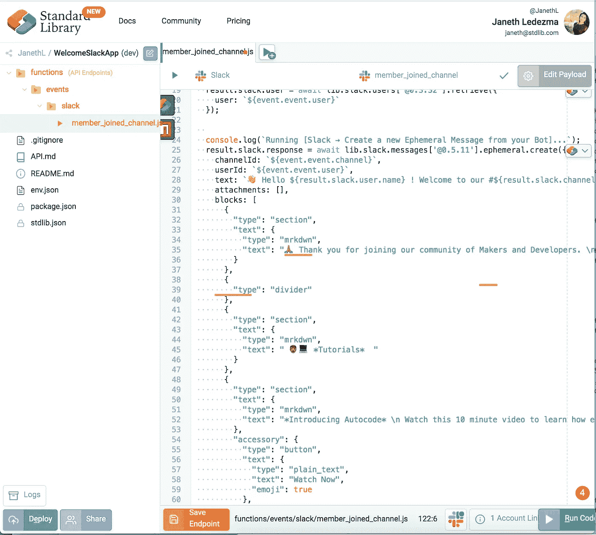

选择**保存端点**和**部署**按钮以实时推送您的更改🚀

当您测试您的应用程序时，您应该会看到更新的欢迎消息。

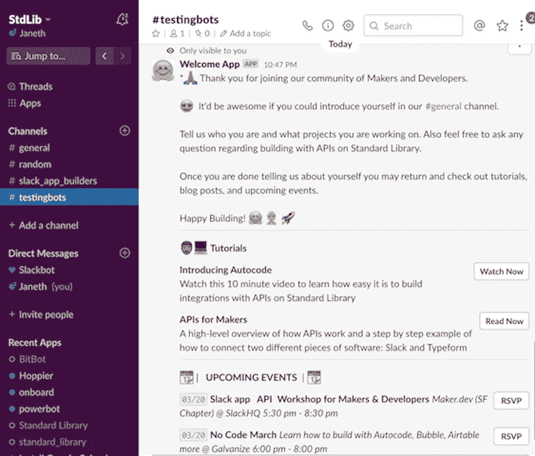

# 🙌🏼而**就是这样！**

现在，您已经拥有了为工作区的新用户打造独特入职体验所需的所有工具！

我希望这篇文章对你有所帮助，向你展示了在标准库上使用 Autocode 创建一个私有的 Slack 应用欢迎程序是多么容易。

如果你注意到文章中有任何可以改进的地方，请告诉我！

我希望您能在这里**发表评论**，**给我发电子邮件到 Janeth [at] stdlib [dot] com** ，或者在 Twitter 上关注标准库， [@StandardLibrary](https://twitter.com/StandardLibrary) 。如果你有什么令人兴奋的东西想让标准图书馆团队展示或分享，请告诉我——我很乐意帮忙！