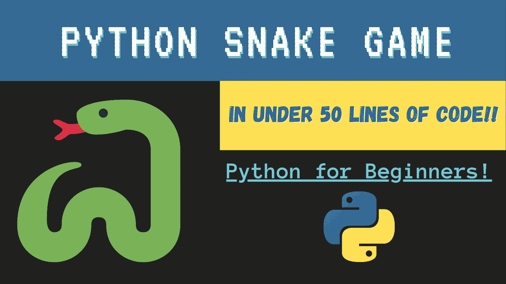

# 用不到 50 行代码用 Python 构建一个贪吃蛇游戏

> 原文：<https://levelup.gitconnected.com/build-a-snake-game-in-python-in-under-50-lines-of-code-faed4bfc5acf>



学 Python？享受如何在您的终端上构建一个超级简单的贪吃蛇游戏的快速教程！

## **先决条件:**

*   Python 3
*   您最喜欢的文本编辑器
*   Python ***诅咒*** 库(通过运行安装: ***pip 安装 windows-诅咒)***

**底部链接 Github 库。**

## 首先，让我们导入必要的库:

```
**import** curses**from** curses **import** KEY_RIGHT, KEY_LEFT, KEY_UP, KEY_DOWN**from** random **import** randint
```

## 接下来，我们需要初始化游戏窗口:

```
curses.initscr() **#initialize screen** window = curses.newwin(30, 60, 0, 0) **#create new window H=30, W=60** window.keypad(True) **#enable keypad**
curses.noecho() **#turn off automatic echoing of keys to the screen** curses.curs_set(0)
window.nodelay(True) **#do not wait for the user input**
```

## 现在，让我们为键、分数、蛇和食物坐标设置一些全局变量。我们还将展示第一种食品:

```
**#initiate values** key = KEY_RIGHT
score = 0**#initialize first food and snake coordinates** snake = [[5,8], [5,7], [5,6]]
food = [10,25]**#display the first food** window.addch(food[0], food[1], 'O')
```

## 接下来，我们需要写出蛇在游戏窗口中移动并随着它吃更多食物而成长的逻辑:

```
while key != 27: **# While they Esc key is not pressed** window.border(0)
  **#display the score and title** window.addstr(0, 2, 'Score: ' + str(score) + ' ') window.addstr(0, 27, ' SNAKE! ') **#make the snake faster as it eats more** window.timeout(140 - (len(snake)/5 + len(snake)/10)%120)
  **#refreshes the screen and then waits for the user to hit a key**
  event = window.getch()
  key = key if event == -1 else event

  **#Calculates the new coordinates of the head of the snake.** snake.insert(0, [snake[0][0] + (key == KEY_DOWN and 1) + (key == KEY_UP and -1), snake[0][1] + (key == KEY_LEFT and -1) + (key == KEY_RIGHT and 1)]) **#Exit if snake crosses the boundaries (Uncomment to enable)**
  if snake[0][0] == 0 or snake[0][0] == 29 or snake[0][1] == 0 or  snake[0][1] == 59: break **#Exit if snake runs over itself**
  if snake[0] in snake[1:]: break

  **#When snake eats the food**
  if snake[0] == food:
    food = []
    score += 1
    while food == []:
      **#Generate coordinates for next food** food = [randint(1, 28), randint(1, 58)]
      if food in snake: food = []
    window.addch(food[0], food[1], 'O') **#display the food** else:
    last = snake.pop()
    window.addch(last[0], last[1], ' ')
  window.addch(snake[0][0], snake[0][1], '#') **#add food to snakes tail**
```

## 最后，如果游戏失败或退出，结束游戏并显示分数(这需要在 while 循环之外):

```
curses.endwin() **#close the window and end the game**
print("\nScore: " + str(score))
```

## 希望你喜欢这个教程！还有其他想看的简单游戏吗？让我知道！

**链接到代码:**[https://github.com/Carla-Codes/simple-snake-game-python/](https://github.com/Carla-Codes/simple-snake-game-python/)

**在推特上关注我的糟糕科技笑话**:[https://twitter.com/CarlaNotarobot](https://twitter.com/CarlaNotarobot)