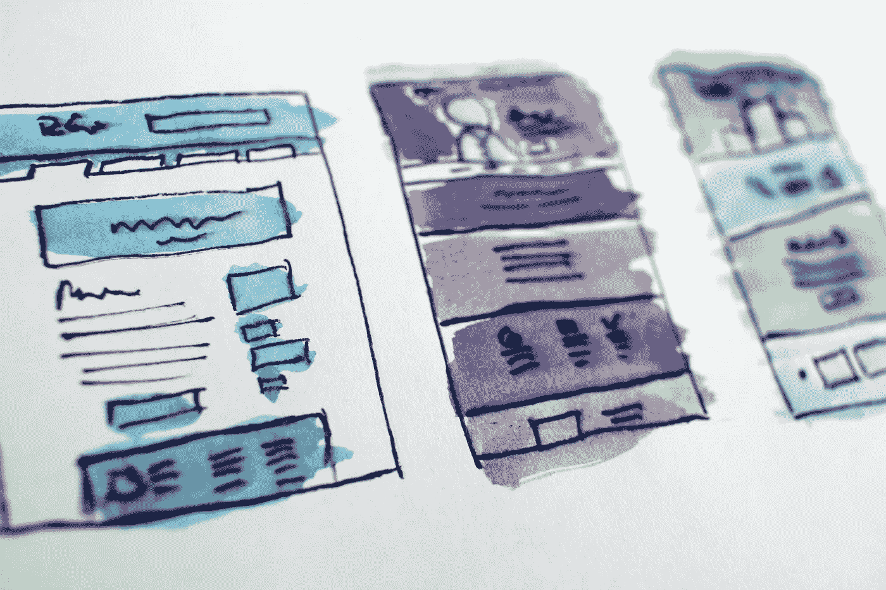

# 在 5 天内建立一个软件开发者组合网站

> 原文：<https://levelup.gitconnected.com/build-a-software-developer-portfolio-website-in-5-days-de3f86d1efee>

## 为新程序员创建作品集网站的终极指南


# 作品集网站是程序员的必备工具

该网站有两个目的——第一是突出开发人员过去可能参与的任何项目，第二是通过设计和构建 portfolio 网站本身来展示开发人员的编码技能。

这是对开发者内心的审视。初级开发人员和高级开发人员以完全不同的方式构建他们的网站，从页面布局，组件思维，或构建视觉识别。一个好的组合网站不仅展示了开发人员的审美，还展示了他们的编码哲学——他们是极简主义者还是极大主义者，他们喜欢大胆的选择还是简洁的线条？

这篇文章的目标很简单——每天将这个过程分解成小的、可实现的、切实的目标。五天的持续时间是一个指导原则——这些步骤可以一起完成，也可以在几周内完成。

我们开始吧！

# 第一天:回归基础

今天，有四个目标——创建一个厉害的 LinkedIn 页面。一个未完成的 LinkedIn 搭配一个漂亮的投资组合就像穿着你最破旧的运动鞋搭配一件定制的燕尾服。如果一家公司想招聘一名开发人员，他们可能会同时考虑 LinkedIn 和 portfolio 网站。

1.  **跟着这个** [**教程**](https://docdro.id/txHp0pB) 做一个杀手级的 LinkedIn 个人资料。
2.  确保**将相关编程技能**添加到概要文件中——HTML/CSS、SQL、ES6、项目管理、Ruby on Rails、React、Python、Django。请你的朋友、同事、训练营的学生等认可这些技能，或者写一封 LinkedIn 推荐信。
3.  **列出你想在投资组合网站上链接的所有社交链接**，比如 GitHub、Medium、LinkedIn、Instagram。保持这些链接的一致性——给每个简介添加一张漂亮的照片和一段简短的简历。

# 第二天:领域

一旦 LinkedIn 的个人资料看起来很专业，下一步就是处理网站本身。通常，开发者或企业家会纠结于小细节，比如购买域名，或者设置标题字体。今天的目标是*吃青蛙*(不，[不是字面上的](https://blog.noisli.com/what-it-means-to-eat-the-frog/))。吃青蛙意味着首要任务是把最不愉快的事情解决掉。今天，这项任务是领域，以及

1.  **为你的网站选择一个域名**并购买该域名。一些有用的提示:使用。我，。dev 或. io 域。请勿使用。因为它经常被标记为垃圾邮件。你的名字对于域名来说是一个很好的开始，不要想太多。😉
2.  **清理过去的项目**。portfolio 站点是展示过去工作的绝佳机会——这些应用程序不需要完美，但它们应该显示出你是一个怎样的开发人员。如果你已经开发了一个移动应用程序，也许你可以把这个应用程序的屏幕录像拍摄下来，然后转换成 gif 格式。确保每个项目(如果它连接到公共存储库)都有一个自述文件、一个项目描述和至少一些好的提交消息(如果你是那种每条消息都是`fixed bug`我在看着你的开发人员)。

对于每个项目，请执行以下操作:

*   写下域名、项目标题和简短描述
*   获取登录页面和任何其他相关页面的屏幕截图。
*   写一段文字描述项目的挑战和解决方案。你可以在这里或者这里[找到一些灵感](https://www.ankitasatija.com/let-s-dutch)。



# 第三天:让我们开始编码

该域名已被购买。过去的项目看起来更干净。LinkedIn 的个人资料非常专业。是时候开始对站点进行编码了。

1.  **开始头脑风暴** —你想如何向互联网世界呈现自己。你真的喜欢粉红色吗？你更喜欢极简主义吗？网站[严重吗](http://dejan.works/work/)？或者它有很多表情符号💩🍕🙏🙅‍♂️?是为了炫耀作为后端开发者的技能吗？[前端](http://driesvanbroeck.be/)？[双双](https://benbate.com/)？
2.  **设置托管。有许许多多的虚拟主机提供商，你可能已经有一个最喜欢的了。我最喜欢的虚拟主机(当不需要数据库和 Docker 的时候)是 Netlify。它易于使用，附带免费的 SSL 和域支持，并支持连续部署(这意味着每个`git push origin master`将自动推送到 Netlify 站点)**
3.  **让你的发展有一个良好的开端**。我创建了这个 [HTML 样板](https://github.com/maltyeva/html-template)来启动一个简单的 HTML/CSS 站点的开发。如果你正在寻找更有趣的东西，我推荐你构建一个 Jekyll 或者 Gatsby 框架。记得执行 HTTPS！

# 第四天:设计，设计，设计

也许你是一个后端开发人员。也许，设计不是你的强项。这完全没问题。当然，每个全栈开发人员都可以编写 HTML/CSS(嗯，至少我希望如此)，但是为一个网站创建一个有凝聚力的外观需要实践和设计眼光。如果你真的被困在一个网站设计上，我创建了一个[极简代码笔](https://codepen.io/maltyeva/pen/ebJrOP)，但是这里是我关于创建一个漂亮的设计组合的最佳技巧。

1.  **获得灵感**。如果你刚刚起步，从 Behance 或你朋友的开发组合中获得灵感并不可耻(只是不要直接复制它们，那是不好的形式)。
2.  **使用类似 Bootstrap 或材料设计的设计框架**。永远不要使用像素作为边距和填充——使用相对距离来使网站具有响应性。
3.  **挑选一种主色**和两种补色。使用类似 [Canva](https://www.canva.com/colors/) 的调色板生成器获取灵感。当有疑问时，坚持黑白分明。

# 第五天:元数据

最后一天的目标是给网站添加正确的元数据。毕竟，如果没有人能够在网上搜索，投资组合网站有什么用？

1.  **将你的网站连接到** [**谷歌分析**](http://analytics.google.com/)——然后，将分析跟踪代码粘贴到网站的`<head>` 中。
2.  在你所有的社交网站上添加你的网站组合链接——Medium、Twitter、LinkedIn、GitHub 等。
3.  将这些元标签添加到您站点的`<head>`中。以下是我的，供参考:

```
<title>Maria Schuessler</title> 
<meta charset="utf-8" /> 
<meta name=”description” content="Full-Stack Developer and Digital Product Manager, based in Shanghai, China"> 
<meta name=”keywords” content="Maria Schuessler, developer,Ruby on Rails, RoR,HTML,JavaScript"> 
<meta name="author" content="Maria Schuessler">
```

# 你完了！

也许你的网站仍在建设中，或者你能够按照这些步骤来创建一个作品集。我对本教程的希望是将软件开发人员组合分解成易于理解的步骤，以展示作为开发人员的你和你的项目。在这里找到作品集教程的第二部分！在下面分享你的作品集，我很乐意看看并分享我的反馈！

# 分级编码

感谢您成为我们社区的一员！ [**订阅我们的 YouTube 频道**](https://www.youtube.com/channel/UC3v9kBR_ab4UHXXdknz8Fbg?sub_confirmation=1) 或者加入 [**Skilled.dev 编码面试课程**](https://skilled.dev/) 。