# 使用强化学习|从零开始的机器学习(第八部分),在后启示录世界中构建一个出租车驾驶代理

> 原文：<https://levelup.gitconnected.com/build-a-taxi-driving-agent-in-a-post-apocalyptic-world-using-reinforcement-learning-machine-175b1edd8f69>

## 了解如何构建自动驾驶出租车代理。从头开始构建 MDP，并使用 Python 中的 Q-learning 解决它！


> TL；博士为自动驾驶出租车问题搭建了一个简单的 MDP。接载乘客，避免危险，并在指定地点让他们下车。建立一个代理，并使用 Q-learning 解决问题。

你醒了。这是一个阳光明媚的日子。你的伴侣还在你旁边睡着。你花一分钟去欣赏美景，甚至微笑。

你的肚子在咕咕叫，所以你站起来四处看看。头奖！你看到的是你们俩昨晚周年纪念晚餐的剩菜。你花一分钟去抓你的某个隐私点。是啊，多么美妙的早晨！你有三分之一的豆子罐头，六个月前才过期。太好吃了！

虽然你为没有给睡在你床上的人留下任何食物而感到难过，但你还是穿好衣服准备去工作。“你打算怎么办？不是吃饭和工作！?"—那些想法似乎不再有帮助了。该上车了！

你试图通过无线电联系张诗钟，但没有成功。哦，吉米上周失踪了，他的双胞胎兄弟可能也失踪了。奇怪，你不记得上次眼睛湿润是什么时候了。

自从*事件*以来，发生了很多变化。街道每周都变得越来越危险，但是人们仍然需要交通工具。您收到一个提货请求，并查看了异常地图。你犹豫地接受。你的地图两个月前更新过。

你完成了任务，得到了半罐的荣誉。那对夫妇真大方！这就为制造无人驾驶出租车的想法留出了时间。你甚至有了一个名字——*安全驾驶室*。你读过很多关于这个叫埃隆·努斯克的疯子的报道，他试图在*事件*发生之前制造全自动驾驶汽车。

你开始挠头。这是可能的还是只是幻想？毕竟，如果你完成了这件事，你就可以每隔一天吃一次了。进入强化学习。

[谷歌合作笔记本中的完整源代码](https://colab.research.google.com/drive/1FMo6Lpf1UtO1blfMyA4yznzDN7tlgIWm)

# 强化学习

强化学习(RL)关注的是产生算法(代理)，试图实现一些预定义的目标。这一目标的实现依赖于选择一系列行动——对好的行动给予奖励，对坏的行动给予惩罚——强化点由此而来。在具有状态的环境中，代理行为给出奖励和一组动作。

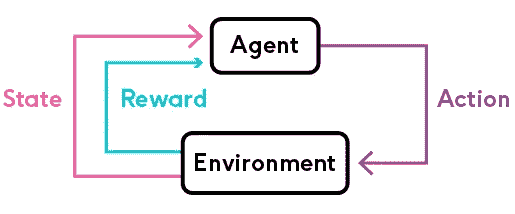

来源:[https://phrasee.co/](https://phrasee.co/)

深度强化学习(使用深度神经网络来选择行动)最近取得了一些伟大的成就:

*   [玩雅达利游戏](https://www.cs.toronto.edu/~vmnih/docs/dqn.pdf)
*   [玩毁灭战士](https://www.youtube.com/watch?v=oo0TraGu6QY)
*   [主宰围棋比赛](https://deepmind.com/blog/alphago-zero-learning-scratch/)

## 马尔可夫决策过程

马尔可夫决策过程(MDP)是 RL 问题的数学表述。MDP 满足马尔可夫性质:

马尔可夫属性——当前状态完全代表环境(世界)的状态。也就是未来只取决于现在。

MDP 可以由( *S* ， *A* ， *R* ， *P* ， *γ* 来定义，其中:

*   *S* —一组可能的状态
*   *—一组可能的动作*
*   **R*——给出奖励的概率分布(状态，动作)对*
*   *给定(状态，动作)对，任何状态成为新状态的可能性的概率分布。也称为转移概率。*
*   **γ* —奖励折扣系数*

*贴现因子 *γ* 允许我们注入这样的启发:现在的 100 美元比 30 天后的 100 美元更有价值。折扣系数为 1 时，未来奖励的价值与当前奖励的价值相同。*

*对未来奖励打折扣的另一个原因是:*

> *“从长远来看，我们都会死”——j . m .凯恩斯*

## *学问*

*以下是学习在 RL 环境中是如何发生的:*

*对于时间步长 *t* =0，直到完成:*

1.  *环境给你的代理一个状态*
2.  *您的代理选择一个操作(从一组可能的操作中)*
3.  *随着新的状态，环境给予奖励*
4.  *继续下去，直到目标或其他条件得到满足*

*这一切的目的是什么？找到一个函数*π*∑，称为最优策略，它使累积折扣报酬最大化:*

*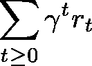*

*其中 *rt* 是在步骤 *t* 接收的奖励，而 *γt* 是在步骤 t *t* 的折扣因子。*

*策略 *π* 是将状态 *s* 映射到动作 *a* 的函数，我们的代理认为这是给定状态下的最佳选择。*

## *价值函数*

*价值函数给出了代理人将获得的最大预期未来报酬，从某个状态 *s* 开始，遵循某个策略 *π* 。*

*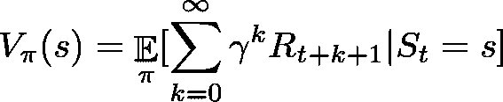*

*存在一个**最佳值函数**，其对于所有状态都具有最高值。定义为:*

*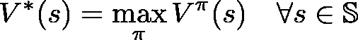*

## *q 函数*

*类似地，让我们定义另一个被称为 *Q* 的函数(状态-动作值函数)，它给出了从状态 *s* 开始，采取动作 a *a* ，并遵循策略 *π* 的预期回报。*

*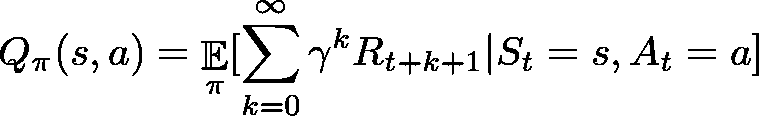*

*你可以把*Q*-函数看作给定状态下某个动作的“质量”。我们可以将最优*Q*-函数定义为:*

*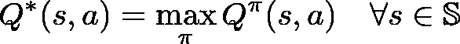*

*两个最优函数*V*∫和*Q*∫之间存在关系。它由下式给出:*

*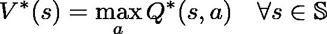*

*即在 *s* 开始时的最大期望总报酬是所有可能行动中*Q*∫(*s*， *a* )的最大值。*

*我们可以通过选择状态 *s* 下给出最大报酬*Q*∫(*s*， *a* )的行动 *a* 来找到最优策略*π*∫:*

*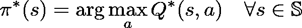*

*到目前为止，我们定义的所有功能之间似乎都有协同作用。更重要的是，我们现在可以为给定的环境构建一个最佳的代理。实践中能做到吗？*

## *q 学习*

*Q-Learning 是一种用于[时间差(TD)学习](https://en.wikipedia.org/wiki/Temporal_difference_learning)的非策略算法。证明了通过足够的训练，它以概率 1 收敛于任意目标策略的动作值函数的近似。它学习最优策略，甚至当使用探索性(一些随机性)策略(偏离策略)选择动作时。*

*给定一个状态 *s* 和动作 *a* ，我们可以用自身(递归)来表示 *Q* ( *s* ， *a* ):*

*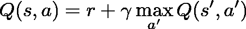*

*这就是**贝尔曼方程**。它将最大未来奖励定义为代理在状态 *s* 收到的奖励 *r* ，加上状态 *s* 对于每一个可能的动作的最大未来奖励。*

*我们可以使用贝尔曼方程将*Q*-学习定义为*Q*∫的迭代近似:*

*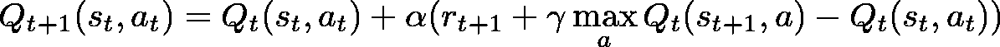*

*其中 *α* 是学习率，其控制考虑的先前和新 Q 值之间的差异。*

*下面是我们要实现的通用算法:*

1.  *初始化一个 *Q* 值表*
2.  *遵守初始状态 *s**
3.  *选择动作 *a* 并行动*
4.  *观察奖励 *r* 和新状态 *s**
5.  *使用 *r* 和来自 *s* 的最大可能奖励更新 *Q* 表*
6.  *将当前状态设置为新状态，并从*步骤 2* 开始重复，直到一个终端状态*

*注意*Q*-学习只是解决 RL 问题的一种可能的算法。这里是其中一些的比较。*

## *探索与开发*

*你可能已经注意到我们浏览了选择行动的策略。您实施的任何策略都必须选择尝试新事物或使用已知事物的频率。这就是所谓的勘探/开发权衡。*

*   *探索——寻找关于环境的新信息*
*   *利用——利用现有信息最大化回报*

*记住，我们的 RL 代理的目标是最大化期望的累积回报。这对我们的自动驾驶出租车意味着什么？*

*最初，我们的驾驶代理对接送乘客的最佳驾驶路线几乎一无所知。它也应该学会避免异常现象，因为它们对业务不利(乘客往往会消失，甚至更糟)！在这段时间里，我们期望进行大量的探索。*

*在获得一些经验之后，代理可以越来越经常地使用它来选择一个动作。最终，所有的选择都将基于学到的东西。*

# *在后世界末日的世界里开车*

*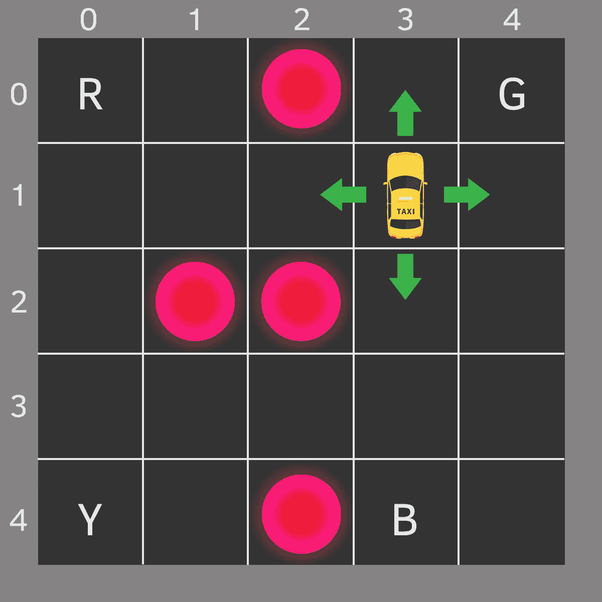*

*你的搭档画了这张地图。每个街区代表城市的一个小区域。异常用亮圈标出。四个字母是“安全区”，接送发生的地方。*

*让我们假设你的车是这个城市中唯一的交通工具(不太夸张)。我们可以把它分成一个 5x5 的网格，这样就有 25 个可能的出租车位置。*

*当前滑行位置是(行，列)坐标中的`(3, 1)`。接送地点为:`[(0,0), (0,4), (4,0), (4,3)]`。异常点在`[(0, 2), (2, 1), (2, 2), (4, 2)]`。*

## *环境*

*我们将使用 [OpenAI 的健身房](https://gym.openai.com/)将我们的城市地图编码到自动驾驶代理的环境中。这个健身房到底是什么？*

> *Gym 是一个开发和比较强化学习算法的工具包。它支持教导代理从[行走](https://gym.openai.com/envs/Humanoid-v2/)到玩游戏如 [Pong](https://gym.openai.com/envs/Pong-ram-v0/) 或 [Pinball](https://gym.openai.com/envs/VideoPinball-ram-v0/) 的一切。*

*健身房最重要的实体是环境。它提供了一个统一且易于使用的界面。以下是最重要的方法:*

*   *`reset` -重置环境并返回随机初始状态*
*   *`step(action)`——采取行动，前进一步。它返回:*

*观察——环境的新状态*

*奖励——采取行动获得的奖励*

*完成—大多数环境被划分为定义明确的剧集，如果`done`为`True`，则表明该剧集已经完成*

*info —关于环境的附加信息(可能对调试有用)*

*   *`render` -渲染环境的一帧(用于可视化)*

*环境的完整源代码在笔记本里。在这里，我们来看看健身房的注册:*

*注意，我们设置了一个`timestep_limit`，它限制了一集的步数。*

## *行为空间*

*我们的代理遇到 500 个州(5 行 x 5 列 x 5 个乘客位置 x 4 个目的地)中的一个，它选择一个动作。以下是可能的操作:*

1.  *南方*
2.  *北方*
3.  *东方*
4.  *西方的*
5.  *收集*
6.  *摘下*

*您可能会注意到，在上图中，出租车在靠近城市边界时无法执行某些操作。我们将用-1 对此进行处罚，如果出现这种情况，我们将不会移动出租车。*

## *感受一下环境*

*让我们看看我们的编码环境:*

*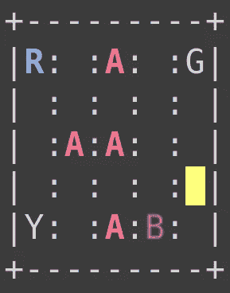*

```
*Action Space Discrete(6)
State Space Discrete(500)*
```

*下面是数字映射的操作:*

*   *0 =南方*
*   *1 =北方*
*   *2 =东部*
*   *3 =西方*
*   *4 =拾取*
*   *5 =衰减*

## *构建代理*

*我们的代理有一个与环境交互的简单界面。这是:*

*当我们希望代理人做出决定并采取行动时，我们将使用`choose_action`方法。然后，在观察到奖励和来自环境的新状态后，我们的代理将使用`learn`方法从它的行为中学习。*

*让我们看一下实现:*

*`__init__`有趣的部分是我们的 Q *Q* 表的初始化。最初，它全是零。我们可以用其他方法初始化它吗？*

*我们的策略相当简单。我们从 0 和 1 之间的均匀分布中抽取一个随机数。如果这个数字小于ε，我们想探索，我们采取随机行动。否则，我们会根据现有知识采取最佳行动。*

*学习包括使用 *Q* 学习等式更新 *Q* 表，并在情节完成时降低探索率 *ϵ* 。*

# *培养*

*现在我们的代理已经准备好行动，我们可以在我们创建的环境中训练它。让我们为 50k 集培训我们的代理，并记录一段时间内的集奖励:*

*在了解任何有关环境的信息之前，让我们先来看看我们的代理驾驶:*

*回想一下，我们在注册环境时设置了`timestep_limit`，这样我们的代理就不会无限期地停留在一个剧集中。*

# *估价*

*让我们来看看随着培训的进行，奖励的变化:*

*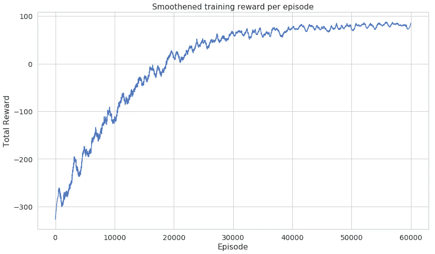*

*注意，使用 [savgol_filter](https://docs.scipy.org/doc/scipy/reference/generated/scipy.signal.savgol_filter.html) `savgol_filter(rewards, window_length=1001, polyorder=2)`平滑学习曲线*

*回想一下，我们的探索率应该随着代理的学习而降低。看一看:*

*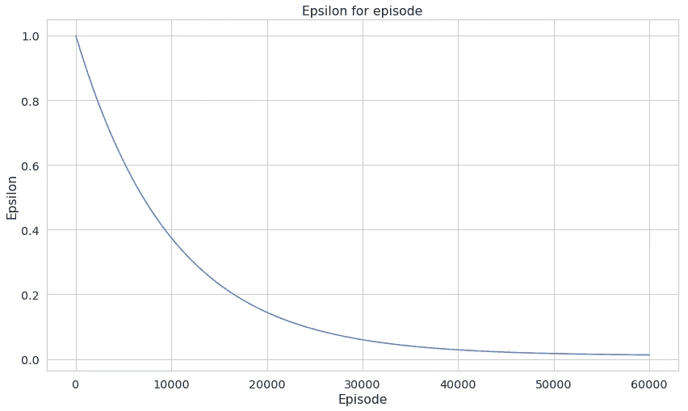*

*下面是我们将如何测试我们的代理并记录进度:*

*注意，我们希望我们的代理只使用它所拥有的经验，所以我们设置了`explore=False`。以下是每集的总报酬:*

*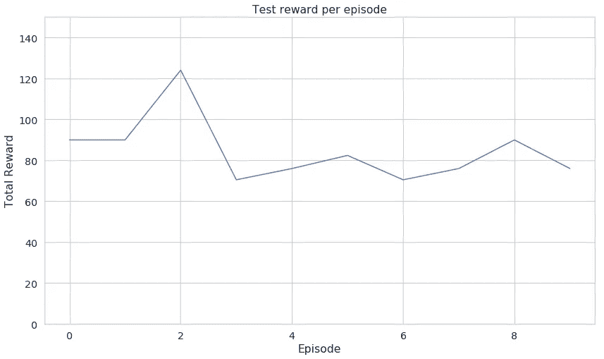*

*我知道这张图表可能无法让你很好地了解代理人的能力。这是它在城市中行驶的视频:*

*很好，对吧？看起来它学会了避开异常情况，接送乘客。*

# *结论*

*恭喜你建立了自动驾驶出租车代理。你已经学会了如何*

*   *基于 OpenAI 的健身房提供的环境构建您自己的环境*
*   *实施并应用*Q*-学习*
*   *建立一个代理，学习接送乘客和避开危险区域*

*[谷歌合作笔记本中的完整源代码](https://colab.research.google.com/drive/1FMo6Lpf1UtO1blfMyA4yznzDN7tlgIWm)*

*你能增加城市的规模吗？代理还学得好吗？在下面的评论里告诉我进展如何！*

**最初发表于*[*https://www.curiousily.com*](https://www.curiousily.com/posts/build-self-driving-taxi-using-reinforcement-learning/)*。**

*喜欢你读的吗？你想了解更多关于机器学习的知识吗？提升你对 ML 的理解:*

*[](https://leanpub.com/hmls) [## 从零开始实践机器学习

### “我不能创造的，我不理解”——理查德·费曼这本书将引导你走向更深的…

leanpub.com](https://leanpub.com/hmls)*