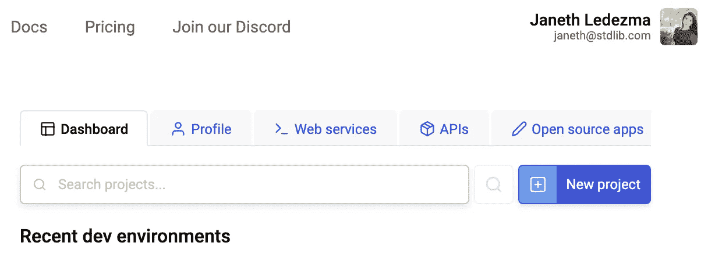

# 在 Autocode 上用 HTML 画布、CSS 和 JavaScript 构建一个俄罗斯方块游戏

> 原文：<https://levelup.gitconnected.com/build-a-tetris-game-with-html-canvas-css-and-javascript-on-autocode-132c8346e60c>

你好，有抱负的软件工程师！如果你正在读这篇文章，你很可能已经踏上了成为一名开发者的旅程。祝贺你承诺开始新的职业生涯！👏🏼

在[大会 12 周软件工程训练营](https://janethl.medium.com/my-journey-to-becoming-a-software-engineer-91415b5e1210)的旅程开始时，我承诺写博客和写教程。在前两周，我学习了 HTML、CSS、Javascript、DOM 操作和 API。在我们的第三周，我们有五天的时间来应用我们的知识，并构建一个我们选择的游戏。我知道这将是一个艰难但有趣的挑战。我们在两周内学到了很多，我觉得我没有足够的时间来分离关注点和综合材料。我花了 5 天时间复习、阅读在线教程，并计划我的方法。就这样，我得以重现我最喜欢的童年游戏——**俄罗斯方块**！

在本指南中，我将带您完成构建俄罗斯方块游戏的第一部分，以便您可以重新创建自己的游戏，并继续练习 JavaScript、DOM 操作和样式技能。


我们将首先设置我们的 CSS、HTML 和 JavaScript 文件，然后我将逐行解释 JavaScript 文件的代码。

在开始之前，请务必浏览以下帮助我应对这一挑战的资源:

## 先决条件:

*   👉🏽 [HTML](https://www.w3schools.com/html/html_intro.asp) —超文本标记语言通过标注标题、标题、段落、链接、按钮等元素告诉浏览器在我们的网站上显示什么内容。
*   👉🏽 [HTML5 Canvas](https://www.w3schools.com/html/html5_canvas.asp) — `<canvas>`是一个 HTML 标签，用于通过脚本(通常是 JavaScript)动态绘制图形。这是一个来自 W3schools 的很棒的教程，它帮助我发现了更多构建在 canvas 标签中的方法。
*   👉🏽 [CSS](https://www.w3schools.com/css/default.asp) —级联样式表。如果 HTML 是一组告诉浏览器显示什么的指令，CSS 告诉它如何显示。CSS 可以改变文本字体、大小、颜色和页面上各种元素的布局，等等。
*   👉🏽[HTML DOM(文档对象模型)](https://www.w3schools.com/js/js_htmldom.asp) —当一个网页被加载时，浏览器创建一个页面的 **D** 文档 **O** 对象 **M** 模型。使用 HTML DOM，JavaScript 可以访问和更改 HTML 文档的所有元素。


*   👉🏽JavaScript 是一种功能强大的语言，有多种用途。在本教程中，我们将使用 JavaScript 通过 DOM 选择和操作 HTML 元素，并附加事件侦听器，当按钮或按键被按下时，事件侦听器将运行 JavaScript 函数。我建议看看我以前的教程👉🏽[预先在 Autocode](/solving-coding-challenges-with-javascript-functions-on-autocode-8bd8ae059f6f) 上用 JavaScript 函数解决编码难题。

## 我们将做什么:

**-第一步:在**[**Autocode**](http://Autocode.com) **上建立自由账户-第二步:在**[**Autocode**](http://Autocode.com) **上建立 index.html 文件-第三步:在**[](http://Autocode.com) ****上建立 style.css 文件-第四步:在**上建立 tetris.js 文件**

**在我们完成步骤 1 到 4 之后，我们将回顾代码。我将重点解释我们的`tetris.js`文件，因为我希望你对 [HTML](https://www.w3schools.com/html/html_intro.asp) 和 [CSS](https://www.w3schools.com/css/default.asp) 有基本的了解。**

**如果您完全是新手，请查看我在先决条件下列出的资源。如果您对任何代码有任何疑问，请联系我们！我会很乐意回答。**

**让我们开始编码吧！🧑🏽‍💻👩🏽‍💻🚀**

# **步骤 1:在 Autocode 上设置一个免费帐户**

**我们将在 [Autocode](http://autocode.com/) 上构建我们的游戏。虽然 Autocode 针对构建后端、API 和自动化进行了优化，但它也是一个完整的在线代码编辑器，可以呈现和托管我们的 HTML、CSS 和 JavaScript 文件。Autocode 使得发布我们的游戏变得非常简单，并且可以通过网络访问，而不用担心通过第三方服务设置主机。**

**前往 Autocode.com 注册一个免费账户。选择将托管您的项目的子域，并设置密码。**

**注册后，导航到您的**项目管理**仪表板，然后点击**新项目。****

****

**你将被带入 [Autocode 的](http://autocode.com/) IDE。您将在左侧栏菜单中看到一个项目支架，其中已经包含一个名为`www`的目录(文件夹),用于添加我们的项目资产和网页。此目录中的文件将自动转换为静态网页和资源。**

**让我们从点击示例文件`hello.html`开始。**

****

# **步骤 2:在 Autocode 上设置 index.html 文件**

**突出显示并删除`hello.html`文件中的所有示例代码。我们将添加我们的代码。**

****

**让我们将 HTML 文件重命名为`index.html`。右击`hello.html`文件并选择`rename file.`**

****

**像这样输入完整的路径名:`www/index.html`**

****

**现在将下面的代码复制并粘贴到您的`index.html`文件中。**

**像这样:**

****

**选择绿色的**运行**按钮。 [**Autocode**](http://autocode.com) 会提示你给你的项目命名。**

**请记住，您给项目起的名字将是自动生成的 URL 的一部分，以便通过网络访问您的游戏；我推荐这样一个名字:`tetris-game.`。**

****

**点击**保存新项目。****

**恭喜你。您已经为游戏部署了 HTML 页面。 [Autocode 的](http://autocode.com)工具允许您在端点查看器窗口中预览您创建的页面:**

****

**您还可以通过单击代码编辑器左下角的链接，在 web 上实时检查您的页面。**

**很好，我们已经创建了游戏的基本视图，但是现在我们需要给它一些颜色和风格。**

**让我们建立我们的 CSS 页面！**

# **步骤 3:在 Autocode 上设置 style.css 文件**

**右键单击右侧的`www`目录，选择`New file.`**

****

**在命名文件`www/style.css`时输入完整路径名。像这样:**

****

**选择**创建文件。您应该看到一个空的。css 文件准备好 CSS 代码。****

**将以下代码复制并粘贴到您的`style.css`文件中。**

**您的自动代码的 IDE 应该看起来像这样:**

****

**太好了！点击右下角的橙色**保存**按钮保存这些更改。**

**回到你的`index.html`文件中。**

**在`index.html`内点击绿色**运行**按钮一次。我们准备好预览我们对`index.html`页面所做的样式了。**

****

**当您单击为您的项目自动生成的 URL 时，您应该看到您的样式 HTML 页面在不同的选项卡中弹出。像这样:**

****

# **步骤 4:在 Autocode 上设置 tetris.js 文件**

**太好了！我们现在有了一个风格化的 HTML 页面来显示我们的游戏。你会注意到我们的按钮不起作用了。这是因为我们还没有添加 Javascript 逻辑。**

**是时候添加一些 JavaScript 来创建我们的游戏了。**

**在您的`www`目录中创建一个`tetris.js`文件，就像我们对`index.html`和`style.css`文件所做的那样。如下命名文件时添加完整路径名:`www/tetris.js`**

**将以下代码复制并粘贴到文件中。**

**您的`tetris.js`文件应该如下所示:**

****

**点击右下角的橙色**保存**按钮保存您的`tetris.js`文件。我们已经准备好预览我们添加到游戏中的功能。返回`index.html.`点击绿色**运行**按钮。**

**您可以通过单击端点查看器窗口上的**开始**按钮来测试游戏的功能。**

****

**或者，你可以点击自动生成的网址来测试你的游戏从一个新的标签。使用 **A** 和 **D** 键旋转您的俄罗斯方块，并使用**向下**、**向左、**和**向右**箭头键相应地移动方块。**

****

**做得很好，坚持到教程的这一步！是时候回顾一下我们的代码了！**

# **审查 index.html 和 style.css 代码**

## **将`index.html`链接到`style.css`和`tetris.js`:**

**我们必须将我们的`.css` `.js`文件链接到`.html`文件，以便它们能够相互交流。**

**我们将`.css`文件与 HTML 文件放在同一个文件夹中，因此我们通过使用`<head>`元素中的`[<link>](https://www.bitdegree.org/learn/html-link-tag)`元素将 CSS 链接到 HTML，如下所示:**

```
<link rel="stylesheet" href="style.css">
```

**我们也导入街机风格的字体[在第 10 行按 Start 2p](https://fonts.google.com/specimen/Press+Start+2P) 。在导入和链接我们的文件后，该字体现在可以在`style.css`文件中使用。**

****

**在第 40 行的`index.html`文件末尾，我们使用`<script>`元素添加了对 JavaScript 文件的引用:**

```
<script src="tetris.js"></script>
```

****

**现在就交给你了`**style.css**` **文件:****

****

**在我们的`style.css` 文件中，我们将`family-font`属性定义为`<h2>` `<h3>` `<h4>` `<p>`元素的`Press Start 2P, monospace`；以及 id 属性为`#instructions2` `#start` `#reset.`的按钮元素**

# **回顾我们的 tetris.js 代码**

## **第 1–7 行使用 HTML DOM 方法访问元素:**

****

**让我们从分析我们的`tetris.js`文件中的前七行代码开始。**

**这里我们[为画布、按钮和模态定义变量](https://www.w3schools.com/js/js_const.asp)来通过 Javascript 操作 DOM。**

**为了访问 HTML 页面中的元素，我们总是从访问`document`对象开始。对象充当一个接口，允许我们对 HTML 文档进行编程。**

****

**我们使用 HTML DOM 方法`[getElementById()](https://www.w3schools.com/js/js_htmldom_methods.asp)`来访问画布。**

```
const canvas = document.getElementById("tetris");
```

**然后我们使用内置对象`[getContext()](https://www.w3schools.com/graphics/canvas_drawing.asp)`，它将为我们提供在画布上绘图的属性和方法。**

```
const ctx = canvas.getContext(“2d”)
```

**我们使用方法`[getElementById()](https://www.w3schools.com/js/js_htmldom_methods.asp)`来访问我们的`<button>`和`<modal>`元素。方法`[getElementByClassName()](https://www.w3schools.com/jsref/met_document_getelementsbyclassname.asp)`让我们可以访问第一个`<close>`元素。**

```
const span = document.getElementsByClassName("close")[0];
```

**在**第 9 行，**我们使用[方法](https://www.w3schools.com/tags/canvas_scale.asp) `[s](https://www.w3schools.com/tags/canvas_scale.asp)cale()`将画布的宽度和高度缩放 20。尝试将其注释掉，然后再次部署以测试会发生什么！*你可能需要放大才能看到落下的俄罗斯方块。**

```
ctx.scale(20,20);
```

## **使用`[AddEventListener(](https://www.w3schools.com/jsref/met_document_addeventlistener.asp)) method`的第 11–32 行**

**我们使用方法`[addEventListener()](https://www.w3schools.com/jsref/met_document_addeventlistener.asp)`对启动、复位、指令和关闭`<button>`元素进行编程。让我们分析每个事件监听器:**

****

****第 11 -14 行 start button . addevent listener()****

```
startButton.addEventListener("click", () => {
  update();
  startButton.style.display = "none";
});
```

**这里我们给`startButton`添加了一个事件监听器，这样每次点击按钮时都会调用这个函数。这个`update()`函数负责绘制和放下俄罗斯方块。一旦`startButton`被点击，按钮就会消失，因为我们已经将`display`属性设置为`none`。**

****第 16–18 行 reset button . addevent listener()****

```
resetButton.addEventListener("click", () => {
  location.reload();
});
```

**这里我们给`resetButton`添加了一个事件监听器，这样每次点击按钮时都会调用`reload()` 方法。`[reload()](https://www.w3schools.com/jsref/met_loc_reload.asp)`方法用于重新加载当前文档。**

****第 20–22 行指令 Button.addEventListener()****

```
instructionsButton.addEventListener("click", () => {
  modal.style.display = "block";
});
```

**我们给`instructionsButton`添加了一个事件监听器，这样每次点击按钮时，都会出现模态，因为我们已经将`display`属性设置为`block.`**

****第 24–32 行 span.addEventListener()****

**这里我们有两种方法来关闭当指令按钮被点击时出现的模态。**

```
span.addEventListener("click", () => {
  modal.style.display = "none";
});
```

1.  **我们添加了一个事件监听器，用于当`<close>`元素被点击时，并将模态显示样式设置为`none`。**

```
window.onclick = function (event) {
  if (event.target == modal) {
    modal.style.display = "none";
  }
};
```

**2.我们使用`[.onClick()](https://www.w3schools.com/jsref/event_onclick.asp)`方法来检测窗口中的任何区域何时被点击，并添加`if`语句来检查我们的模态是否打开。如果它是打开的，当我们窗口的任何部分被点击时，我们将模态显示样式设置为`none`。**

****第 34–38 行:创建俄罗斯方块****

****

**字母 I、L、J、T、O、S 和 Z 类似于俄罗斯方块的形状。最终，我们将添加所有七个部分；现在，我们开始用 S 形俄罗斯方块画出游戏的功能。**

```
const piece = [
    [0, 0, 0],
    [0, 1, 1],
    [1, 1, 0],
]
```

**我们可以通过声明一个变量`piece`并给它分配一个填充了 0 和 1 的数组的值来构建这一部分。数字 1 将代表彩色细胞。我们添加了一行额外的 0，以方便我们旋转棋子。**

****第 40–53 行为我们的游戏创建场地****

**接下来，我们创建一个字段，允许我们绘制下落的棋子并跟踪我们的棋子堆栈。**

**我们使用 2D 阵列，也称为矩阵，来表示我们的场。我们的区域由单元格组成，这些单元格将填充数字`0-7.`我们将使用`0`来表示空单元格，并使用`1–7` 来表示每个俄罗斯方块/颜色。**

**首先，编写一个函数来创建我们的矩阵，它接受宽度和高度并用`0`填充我们的行。**

**我们为 matrix 初始化一个空数组，我们使用一个 [while 循环](https://www.w3schools.com/js/js_loop_while.asp)来告诉我们的函数，只要高度不为 0，我们就将高度减少 1，并推入一个新的宽度为`w`的数组，并用`0.`填充它。我们使用`[fill()](https://flexiple.com/fill-javascript-array/#:~:text=The%20fill()%20method%2C%20fills,the%20whole%20array%20is%20filled.&text=One%20thing%20to%20keep%20in,modifies%20the%20original%2Fgiven%20array.)` [数组方法](https://flexiple.com/fill-javascript-array/#:~:text=The%20fill()%20method%2C%20fills,the%20whole%20array%20is%20filled.&text=One%20thing%20to%20keep%20in,modifies%20the%20original%2Fgiven%20array.)用一个静态值填充我们的单元格。**

```
function createMatrix(w, h) {
  const matrix = [];
  while (h--) {
    matrix.push(new Array(w).fill(0));
  }
  return matrix;
}
```

**然后我们通过使用`createMatrix()`函数并传入宽度`12`和高度`20.`来创建游戏的`field`**

**这样来查看我们的`console.log()` `field`字段:**

```
const field = createMatrix(12, 20);
console.log(field)
```

**在浏览器中打开您的开发人员工具，并检查您的控制台。您将看到我们创建的字段。**

****

**在这个 2D 数组中，我们用一个数字数组来表示一个有 12 个元素的行，用一个 20 行的数组来表示字段。**

**我们还可以使用`[console.table()](https://www.w3schools.com/jsref/met_console_table.asp)`方法在控制台中以表格的形式查看字段。**

****

****第 52–55 行添加玩家****

```
const player = {
  pos: { x: 5, y: -2 },
  piece: piece,
};
```

**我们声明了一个`player`变量，并在`x = 5`和 `y = -2`处定义了它的位置，因为我们希望第一个俄罗斯方块从我们的区域上方的中心落下。我们还给玩家一个俄罗斯方块`piece`。**

****第 57–66 行绘制俄罗斯方块****

```
function drawPiece(piece, offset) {
  piece.forEach((row, y) => {
    row.forEach((value, x) => {
      if (value !== 0) {
        ctx.fillStyle = "blue";
        ctx.fillRect(x + offset.x, y + offset.y, 1, 1);
      }
    });
  });
}
```

**这里我们创建一个`drawPiece()`函数来绘制第一个俄罗斯方块。**

*   **我们使用`forEach()`方法来获取每个`row`和`y`索引。**
*   **然后我们迭代该行，并使用`forEach()`获取值和`x`索引。**
*   **我们添加一个条件语句`if`来检查值是否不等于`0.` ，如果不等于`0`，那么我们绘制单元格`blue`。如果是`0`，我们就跳过它。**
*   **我们添加了`offset`，这样我们就可以在编程按键时移动棋子。**

****第 68–73 行重复绘制棋子****

```
function draw() {
  ctx.fillStyle = "black";
  ctx.fillRect(0, 0, canvas.width, canvas.height);
  drawPiece(field, { x: 0, y: 0 });
  drawPiece(player.piece, player.pos);
}
```

**我们创建了一个`draw()`函数来绘制我们的棋子，并将玩家的棋子和位置传递给`drawPiece()`函数。**

*   **这个`draw()`函数也会在`update()`函数内被调用来反复绘制我们的游戏。**
*   **我们必须清理我们的能量场；否则，每次调用函数时都会绘制我们的部分。为此，我们从 x 坐标 0 和 y 坐标 0 开始将 `ctx.fillstyle`设置为`black`，并包含整个画布的宽度和高度。**
*   **在同一个`draw()`函数中，我们再次使用`drawPiece()`从 x 坐标 0 和 y 坐标 0 开始绘制单元格。**

****第 76–96 行使用 requestAnimationFrame()并删除我们的片段****

```
let dCounter = 0;
let dropInterval = 500;
let lastTime = 0;function update(time = 0) {
  const deltaTime = time - lastTime;
  lastTime = time;
  dCounter += deltaTime;
  if (dCounter > dropInterval) {
    player.pos.y++;
    if (collide(field, player)) {
      player.pos.y--;
      join(field, player);
      player.pos.y = 0;
    }
    dCounter = 0;
  }draw();
  requestAnimationFrame(update);
}
```

**这里我们创建了负责启动游戏的`update()`函数。它调用了`draw()`函数和`requestAnimationFrame()`方法。**

**首先，我们定义了一个变量`dCounter`,默认为`0`,以帮助我们将部分移回顶部。我们添加了一个设置为`500`毫秒的`dropInterval`变量，这样我们的棋子每 1/2 秒掉一次。为了得到我们的帧之间的时间差(`deltaTime`)，我们设置一个变量`lastTime`等于`0.` `DeltaTime`对于动画来说是一个有用的变量，它包含了前一帧的开始和当前帧的开始之间的时间差，以毫秒为单位。**

*   **我们使用`[requestAnimationFrame()](https://developer.mozilla.org/en-US/docs/Web/API/window/requestAnimationFrame)`通过抓取时间并默认为 0 来丢弃棋子。**
*   **然后，我们将丢弃计数加到前一帧和当前帧之间的差值上。**
*   **我们添加一个 if 语句来检查`dCounter`是否大于`dropInterval.`如果是，那么我们将我们的玩家棋子位置沿 y 轴(y++)移动。**
*   **如果棋子掉落并碰撞，这意味着该棋子接触到了屏幕底部或另一个棋子，因此我们将玩家的棋子沿 y 轴上移一位。**
*   **然后我们将玩家的棋子放在最上面重新开始**

****第 98–106 行 join()函数****

```
function join(field, player) {
  player.piece.forEach((row, y) => {
    row.forEach((value, x) => {
      if (value !== 0) {
        field[y + player.pos.y][x + player.pos.x] = value;
      }
    });
  });
}
```

**这里我们创建了`join()`函数来打印玩家的棋子位置。它将玩家的棋子位置复制到场上。**

****线 108–119 碰撞检测****

```
function collide(field, player) {
  const b = player.piece;
  const o = player.pos;
  for (let y = 0; y < b.length; y++) {
    for (let x = 0; x < b[y].length; x++) {
      if (b[y][x] !== 0 && (field[y + o.y] && field[y + o.y][x + o.x]) !== 0) {
        return true;
      }
    }
  }
  return false;
}
```

**我们创建了一个`collide()`函数来检查我们的域上哪里的方块不为零。**

*   **我们将棋子和位置赋给变量`b` & `o`，保存我们棋子的位置**
*   **我们使用 for 循环遍历行(y)来迭代玩家棋子位置**
*   **我们使用 for 循环来遍历 x**
*   **我们添加一个条件语句来检查播放器的棋子位置是否不为零，以及`fields`行(y)是否存在。**
*   **如果字段行(y)不存在，它将被视为冲突**
*   **如果存在，则抓取子(x)，如果不为零(则碰撞)，则返回`true`**
*   **如果条件不为`0`，则返回 false**

****121–132 线旋转件****

```
function rotate(piece, control) {
  for (let y = 0; y < piece.length; y++) {
    for (let x = 0; x < y; x++) {
      [piece[x][y], piece[y][x]] = [piece[y][x], piece[x][y]];
    }
  }
  if (control > 0) {
    piece.forEach((row) => row.reverse());
  } else {
    piece.reverse();
  }
}
```

**这里我们创建一个`rotate()`函数，它接受一个`piece`和一个`control`。该功能使用`[reverse()](https://developer.mozilla.org/en-US/docs/Web/JavaScript/Reference/Global_Objects/Array/reverse)` [方法](https://developer.mozilla.org/en-US/docs/Web/JavaScript/Reference/Global_Objects/Array/reverse)将棋子的行`(y)`转换成列。**

****第 134–195 行添加关键控件****

**这部分对我来说很有挑战性。在您尝试之前，请查看本教程，它解释了如何使用`addEventListener()`方法编程按键来监听`keydown`事件。**

**[](https://www.freecodecamp.org/news/javascript-keycode-list-keypress-event-key-codes/) [## JavaScript 键码列表 Enter、Space、Backspace 等键的按键事件键码

### JavaScript 键盘事件帮助您捕获用户与键盘的交互。像许多其他 JavaScript 事件一样…

www.freecodecamp.org](https://www.freecodecamp.org/news/javascript-keycode-list-keypress-event-key-codes/) 

我们使用带有`if..else`语句的方法`addEventListener()`设置一个事件监听器，以检测何时按下键 **37** (左箭头)、键 **39** (右箭头)、键 **40** (下箭头)、键 **65** (A)和键 **68** (D)。你可以使用以下网站找到任何关键的代码:https://keycode.info/很快。

# 挑战自我😎

*   用 if 语句再创建 6 个块
*   创建一个函数来随机选择一个块
*   向块添加颜色
*   在屏幕上添加游戏
*   使用 for 循环对已填充的行进行计数，并在填满后清除行
*   添加一个更新分数的函数
*   使用来自 [Autocode 的标准库](https://autocode.com/lib/utils/sms/)的 SMS API 添加 SMS 功能，挑战朋友以击败您的高分

## 谢谢你和我一起建设！🥳

我们做到了！我希望这是一种有趣的方式来回顾我们的 CSS、HTML、DOM 操作、JavaScript 和逻辑创建。我鼓励你继续完善这个游戏。如果我能帮上什么忙，请尽管开口。我的电子邮件是 ledezmajane@berkeley.edu。也可以发微博 [@ms_ledezma](https://twitter.com/ms_ledezma) 。**