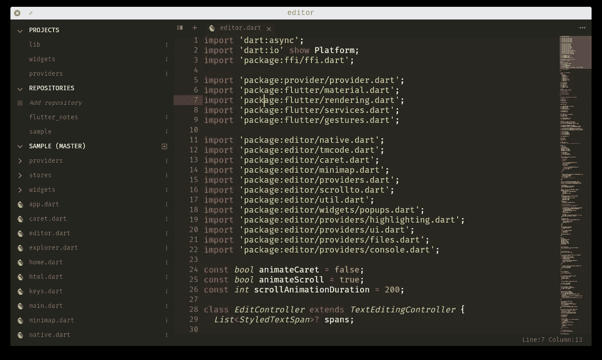
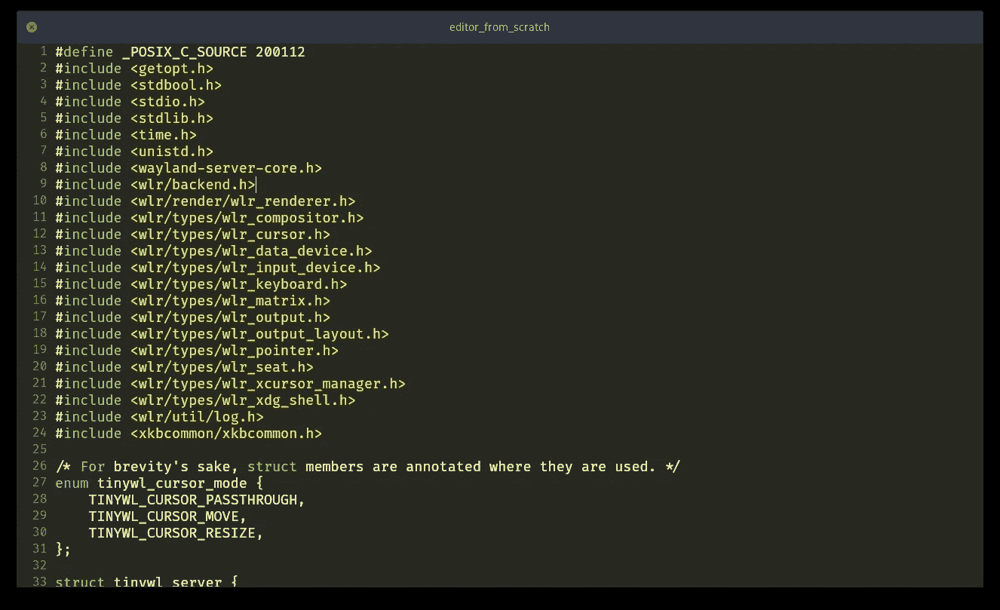

# 用 Flutter UI 在 1000 行代码下构建一个文本编辑器

> 原文：<https://levelup.gitconnected.com/build-a-text-editor-with-flutter-ui-under-1000-lines-of-code-5a9dd2a053da>

# ***挑战***

*构建一个 1000 行代码下的跨平台文本编辑器。*

一个不到 1000 行代码的跨平台文本编辑器已经完成，尽管是针对终端——见 [***Kilo***](https://github.com/antirez/kilo) 及其许多分支和变体。现在，如果我们采用一个像[***Flutter***](https://flutter.dev/)这样的现代 UI 框架，让它负责文本缓冲、文件存储、输入处理和视图渲染，然后重用大多数 Kilo 的文本编辑逻辑，我们应该能够在达到 1K 之前制作一个有大量多余行的文本编辑器。

*等等……如果你是刚接触 Flutter 的开发者，就不要再看这篇文章了，去 Flutter 网站或者读一个 Flutter 教程吧。你不会后悔的。(继续之前需要了解颤振知识)*

我最近发表了 [***阿修罗代号***](https://play.google.com/store/apps/details?id=com.munchyapps.ashlar)*为安卓上的谷歌 Play 商店。这是一个用 Flutter UI 编码的现代文本编辑器，混合了 Dart 和本地 c/cpp 语言。*

**

*Linux 中的 Ashlar 代码*

*这个应用程序有超过 1K 的线路。然而，去掉所有多余的功能和吸引眼球的东西——与 VSCode 兼容的主题和语法突出显示、小地图、文件资源管理器、选项卡式视图、开沟器、文件图标、git 集成、查找和替换、无限撤销，以及完全保留在 Dart 语言中——就无法实现带有 FFI、 ***1K LOC*** 的原生编码。*

*前提是声音。一公里挑战肯定会很有趣。*

# ****裸骨 App****

*一个简单可行的文本编辑应用程序应该能够加载一个文本文件，并在一个可滚动的视图中显示其内容。然后它应该允许编辑内容——在可移动的光标下插入和删除文本。它还应该允许基于光标的文本选择、复制、剪切和粘贴。然后，当然，将文件保存到存储器中。*

# ****文档和视图****

*我们的编辑器将有两个主要的直观组件或类——一个保存文本文件内容和所有编辑逻辑的*文档*,一个在显示器或设备上呈现文档的*视图*。它还监听键盘和触摸或鼠标输入来操纵文档。*

*实际上，在文档和视图之间应该有一个子组件或服务——一个过滤器或类似的蒸馏器——在将文本传递到视图进行渲染之前，它获取文本并对其部分进行修饰或着色——一个*荧光笔*或*装饰器*组件。我们以后可能会也可能不会处理这个特性，因为这个特性不在基本框架声明中。如果我们没有某种语法荧光笔，我们的编辑器会很无聊。*

# ****文档****

*文本文档实际上可以只是字符的集合。换句话说，在 Dart 语言中，整个文档只能存储在一个*字符串*中。然而，我们希望我们的组件是直观的。文本文档通常显示为可垂直滚动的文本。在源代码编辑器中，行甚至用数字显示。因此，我们的文档应该包含一个由*字符串、*组成的列表，每一行都可以通过其行号位置方便地访问。*

```
*class Document {
   List<String> lines = [];
}*
```

*我们还将有*光标*结构来告诉我们闪烁的插入符号应该在哪里，以及所有的文档操作在哪里进行。*

```
*class Cursor {
   int line;
   int column;
   int anchorLine;
   int anchorColumn;   
}*
```

# ****光标****

*在我们操作文档内容之前，我们应该能够首先操作光标。毕竟，这是执行内容操作的地方。我们的*游标*类将有这些方法:*

```
*bool moveCursor(int line, int column, bool keepAnchor);
bool moveCursorLeft(bool keepAnchor);
bool moveCursorUp(bool keepAnchor);
String selectedText();
void clearSelection();*
```

*将光标向左、向右移动到行首、行尾、文档开头等位置。*

**KeepAnchor* 只是一个标志，表示我们是否随光标移动锚线和锚列。这就是我们如何选择文本的。因此，光标也可以代表文档中的文本范围。*

# ****文本编辑****

*文本编辑函数调用将在或相对于当前光标位置，或光标的当前行和列位置执行。*游标*类也会有这些方法:*

```
*void insertText(String text);
void deleteText(int numberOfCharacters = 1);
void copy();
void cut();
void paste();*
```

# ****视图****

*视图是呈现文档的地方。它是显示在设备上的表示。*

*在 Flutter 中呈现文本可编辑文档非常容易。旋舞毕竟是****谷歌免费开源的 UI 框架……”。它拥有我们在屏幕上画东西所需要的一切。*****

**我们的文档包含一个字符串列表，可以很容易地映射到一个 Flutter *List* 小部件，显示为一个 *Text* 小部件列表。**

**我们将使用 Flutter *的 RichText* ，它允许我们设计或格式化我们的线条。这对于突出显示选定的文本和绘制插入符号是必要的，当然，如果我们语法突出显示我们的代码。**

**我们将使用*列表视图*。*构建器*让编辑器很有表现力。*列表视图*。 *builder* 是一个可滚动的小部件，它只渲染和构建屏幕上可见的小部件，尽可能将它们保存到缓存中。默认情况下，它是优化的。使用这个小部件，当我们编辑大型文档时，这个应用程序会像我们编辑代码片段时一样迅速，而无需我们进行任何优化。**

```
**class View {
   Document document; Widget build(context) {
      return ListView.builder(
         itemCount: document.lines.length,
         itemBuilder: (context, index) {
              return RichText(text: document.lines[index]);
         }
      );
}**
```

# ****荧光笔****

**在 Flutter 中设置文本样式非常简单。取一段文字；将它分割成连续的文本段；将样式应用于每个跨度；然后将这些文本范围传递给 *RichText* 进行渲染。**

```
**#1 Block of text: 'The quick brown fox jumped over the lazy dog.'; #2 Spans: [ 'The quick', 'brown', 'fox', 'jumped over the lazy dog.' ];#3 Styled Spans: [
  TextSpans('The quick', color: 'Grey'),
  TextSpans('brown', color: 'Brown'),
  TextSpans('fox', fontWeight: 'Bold'),
  TextSpans('jumped over the lazy dog.', decoration: 'underline')
];#4 RichText(spans: [...StyleSpans]);**
```

**这个概念很直观，很容易理解。**

***RichText* 小部件负责文本布局，可以自动换行从视窗溢出的文本。**

# ****第一个里程碑****

**因此，在这一点上，我们有了表示文档的代码和操作其内容的方法。我们有一个视图小部件，可以在我们的应用程序中直观地显示文档。**

***等等…为什么不用 Flutter 的 TextField 或者文本编辑控制器？***

**在继续之前，让我回答一个越来越明显的问题。Flutter 没有任何现有的小部件来处理我们目前已经完成的工作吗？**

**在 Flutter 框架中确实存在一个 *TextField* 小部件。一些 Flutter 插件扩展了*文本域*来支持语法高亮显示。**

**在测试了 *TextField* 小部件并查看了其中一些插件后，我相信 *TextField* 并不是为编辑大型文档而设计的。例如，加载 sqlite3.c，一个包含超过 200，000 行的合并代码到普通的 *TextField* 小部件中，会使应用程序变慢。甚至以没有任何格式的纯文本形式滚动文件，也会使应用程序没有响应。**

***TextField* 也不支持多光标编辑甚至行号的“*modern”*特性。添加功能并不简单。如果我们的应用程序旨在加载和运行一个 200，000 行的文档，那么它应该能够在任何文件大小下运行良好。**

**因此，从零开始制作一个编辑器是目前比较容易的途径。**

**回到我们的第一个里程碑:**

****

**从头开始编辑 v0.1**

```
**git clone [https://github.com/icedman/editor_from_scratch](https://github.com/icedman/editor_from_scratch)
flutter pub get
flutter run -v**
```

# ****挑战完成****

**754 行代码，包括空格。**

**这篇文章倾向于为我们的编辑器简化结构和代码。但是已经达到这一步的开发人员几乎肯定可以通过 github 项目中的 754 行代码学到一些令人困惑的东西。**

**我们的原始应用程序检查我们的目标中的所有内容，以获得最小编辑器应用程序:**

*   **加载文本文件**
*   **在可滚动的视图中显示其内容—带有行号**
*   **显示光标或插入符号，并通过箭头键或鼠标移动它**
*   **在光标下插入和删除文本**
*   **拥有复制、剪切和粘贴的基本文本选择**
*   **保存更改**
*   **它还可以毫不费力地打开 sqlite3.c**

**该应用程序还有一个额外的功能，即基于关键词的简单语法高亮显示。**

**一些目前缺少的必备功能是:撤销-重做、自动滚动到光标、移动设备的虚拟键盘支持以及单词搜索和替换。一些不错的功能包括:多光标，UTF 8，自动缩进，更好的语法荧光笔。**

**由于有 250 行多余的代码，这些特性中的一些仍然是可行的。**

# **下一个里程碑**

**一个更加完整的编辑器版本是 flutter _ editor——具有多光标编辑功能，以及基于 flutter _ highlight 语法的高亮编辑器，可从以下网址获得:**

```
**[https://github.com/icedman/flutter_editor](https://github.com/icedman/flutter_editor)**
```

**然而，一个更完整的应用程序是安卓版的 Ashlar Code T1，这款应用程序在 PlayStore 有免费版本[Ashlar Code Lite T3。](https://play.google.com/store/apps/details?id=com.munchyapps.ashlar.lite)**

# ****结论****

**在有人完全用 Flutter 创建一个完整的代码编辑器实现之前，这只是一个时间问题。为什么这很重要？或者，当我们今天已经有了许多令人惊奇的代码编辑器和 ide 时，为什么还要重新发明轮子呢？**

**大约十年前，Atom 编辑器——GitHub 的编辑器——使用电子和网络技术变得非常流行。它是一个真正的“可黑客攻击的编辑器”,具有基于 javascript 的扩展 API，人们很喜欢它。但它也是跨平台的。这是一个伪装成本地桌面应用的网络应用。Atom 的流行引发了编辑器的 ***革新*** 。它为当今最流行的编辑器之一——Visual Studio 代码提供了基础和技术。**

**Visual Studio 代码、Atom、括号和其他*现代*编辑器——利用 Web、HTML、Javascript 和本地代码接口技术的组合——正接近在所有平台上运行，移动是最后一个障碍。**

**然而，这些现代编辑所依赖的网络技术已经被推到了极限。优化和性能正接近顶峰。在移动设备上运行的最后一个障碍仍然是一个目标。**

**因此，我们有颤振。**

> **Flutter 改变了应用程序开发流程。从单一代码库构建、测试和部署漂亮的移动、web、桌面和嵌入式应用。— flutter.dev**

**Flutter 框架为实现在每个平台上运行单一代码库的圣杯提供了可能性，移动平台是优先考虑的。**

**在我们的移动设备上使用我们在桌面上使用的相同编辑器来编写代码只是一个时间问题。如果从头开始创建一个 **1KLOC 编辑器**的练习已经展示了什么的话，那就是 Flutter 使跨平台应用程序开发真正成为可能。**

***等等……为什么我们要在移动设备上随时随地保存这些代码？…不幸的是，7 分钟的阅读时间到了。***