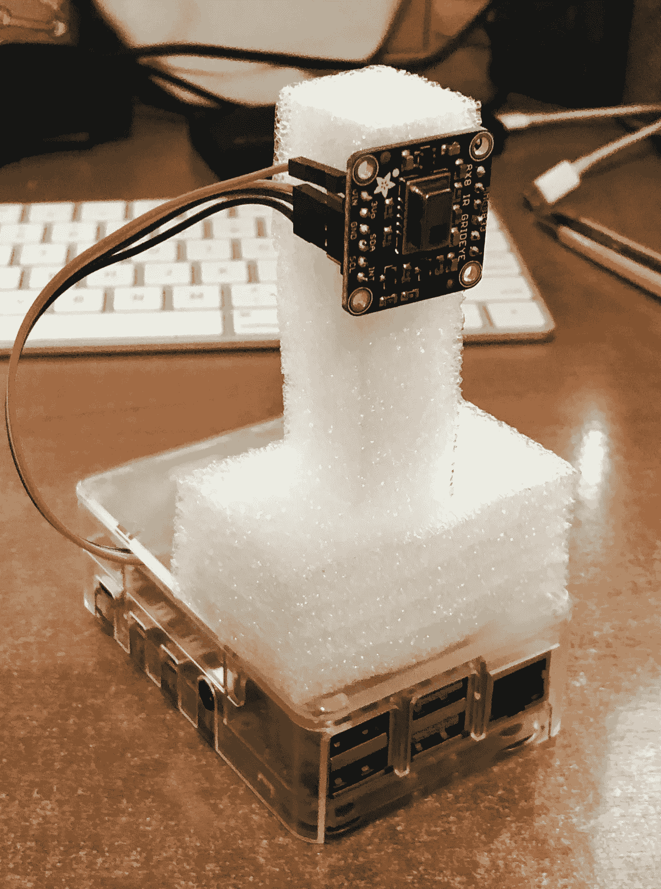

# 用 Raspberry Pi 制作热感相机，然后开始

> 原文：<https://levelup.gitconnected.com/build-a-thermal-camera-with-raspberry-pi-and-go-8f70451ad6a0>

## 使用 Go 使用低成本传感器和 Raspberry Pi 4 创建一个简单的热感相机

在过去的几个月里，新冠肺炎病毒的传播席卷了世界许多地方(尤其是亚洲),影响了许多人生活的许多方面，包括我的生活。我不再每天通勤上班，尽可能在家工作。不必要的会议被取消(这是一件好事)，其他会议大多通过视频或音频会议进行。[像会议这样的大部分大型活动都被推迟](https://www.channelnewsasia.com/news/singapore/novel-coronavirus-singapore-major-events-cancelled-12417726)以避免人群聚集，这增加了新冠肺炎传播的风险。

为了业务的连续性，[我的团队被分成了 A 队和 B 队](https://www.mom.gov.sg/covid-19/general-advisory-for-workplace-measures)，他们每隔一周轮流使用办公室，而且两者都不见面。此外，当进入几乎每栋办公楼时，每个人的体温都会被检查，如果他们发烧，就不允许他们进去，而是建议他们去看医生。

在最近的一次管理会议上，我们讨论了如何处理进入岛上各个办公室的人流(包括员工和游客)。检查温度主要由保安人员通过非接触式温度计来完成。然而，这是一种费力费时的方法，当人们前往办公室时，这就出现了一个瓶颈，讽刺的是，这导致人们聚集在一起。


扫描温度(鸣谢:[https://www . straits times . com/Singapore/spore-firms-ramp-up-efforts-contain-spread-of-virus](https://www.straitstimes.com/singapore/spore-firms-ramp-up-efforts-to-contain-spread-of-virus))

其中一个建议是使用热成像仪进行大规模筛查，这很快得到了同意。然而，只有人流量大的办公室才会配备，因为它们不便宜。每套可以卖到数万美元！我的一个同事开玩笑说，他想在他的个人办公室里安装一个，以便检查每个经过的人。

当然，这让我立即开始思考。

# 树莓派拯救世界

去年 12 月，我写了一篇文章，讲述了我如何通过将一个树莓 Pi4 作为 USB 设备连接到 iPad Pro 上，将它用作开发设备。当然，这只是开始。Pi4 不仅仅是一台小型电脑。它现在也将是我的新热屏蔽器的基础。


我的覆盆子 Pi4(有一个明亮的新案例)(鸣谢:张秀雄)

对于这个项目，我将主要使用 Go，它将在 Pi4 上编译和运行。它将:

1.  从 [AMG8833 热感相机传感器](https://www.adafruit.com/product/3538)读取数据。
2.  将数据转换成温度读数。
3.  基于读数生成热图像。

为了显示读数，该软件还将充当网络服务器，并在网页上连续显示图像。此外，由于 Pi4 是无头运行的，热感摄像机软件将作为 systemd 服务启动和运行。

如果一切顺利，结果应该是这样的。这是我坐在离镜头 1 米左右的沙发上举起右手的截图。


iPhone 上 Safari 热感相机输出的截图(鸣谢:张秀雄)

# 热感相机硬件

这个想法是建立一个真正便宜的热感相机来进行温度筛选。对于硬件，我只是重复使用我现有的 Pi4，并将其连接到 AMG8833 热感相机传感器。

[AMG8833](https://www.adafruit.com/product/3538) 是目前最便宜的热感相机传感器之一(略高于 60 新元，或 39.95 美元)。传感器本身是一个来自松下的 8×8 红外传感器阵列，返回 I2C 上空 64 个单独的红外温度读数。它可以测量 0°C 到 80°C 范围内的温度，精度为+-2.5°C，并且可以在 7 米的距离内探测到人(探测意味着它可以感知温差)。它可以每秒生成 10 帧(或每 100 毫秒生成一帧)。


Adafruit AMG8833 热感相机传感器(鸣谢:张秀雄)

AMG8833 的引脚连接非常简单。我将只使用 6 个引脚中的 4 个。

*   **Vin**–这是电源引脚。传感器使用 3.3V，因此我将其连接到 Pi4 上相应的 3.3V 引脚(引脚 1)
*   **3Vo**–这是 3.3V 输出，我不会使用它。
*   **GND**–这是电源和逻辑的共同基础。我将它连接到 Pi4 上的接地引脚(引脚 9)。Pi4 上有多个接地引脚，您可以使用其中任何一个。
*   **SCL**–这是 I2C 时钟引脚，我们将其连接到 Pi4 上相应的 SCL 引脚(引脚 5)。
*   **SDA**–这是 I2C 数据引脚，我们将其连接到 Pi4 上相应的 SDA 引脚(引脚 3)。
*   **INT**–这是中断输出引脚。它是 3V 逻辑，用于检测传感器视觉路径中的物体何时移动或改变。我没在用它。


这是连接引脚后的样子。


将 AMG8833 安装到我的 Pi4 上(鸣谢:Chang Sau Sheong)

为了竖起热感相机，我拿了一些废弃的泡沫包垫，雕刻了一个脚手架迷你塔来支撑它。



用一些废弃的泡沫包装垫建造一个脚手架塔

我们完事了。它看起来有点破旧，但也可以用。

# 热感相机软件

接下来让我们看看软件是如何工作的。

对于这个项目，我使用了 2 个外部库。第一个是`amg8833`项目，我从[https://github.com/jweissig/amg8833](https://github.com/jweissig/amg8833)那里拿的。项目本身就是 [Adafruit 的 AMG88xx 库](https://github.com/adafruit/Adafruit_AMG88xx/)的一个端口。第二个库是一个纯 Golang 图像调整库[https://github.com/nfnt/resize](https://github.com/nfnt/resize)。其余的都来自 Go 标准库。

## 变量和参数

我们从使用的变量以及从命令行捕获的参数列表开始。

变量和参数

我们来看看变量。`amg`是使用`amg8833`库的传感器接口。我使用`frame`来存储从传感器捕获的调整过大小的图像，然后 web 服务器使用它来提供给 web 页面。`frame`是一个 base64 编码的字符串。

`colors`切片是图像中使用的所有颜色的列表。该变量在此声明，但在`heatmap.go`文件中填充。`grid`是从 AMG8833 8x8 传感器读取的 64 个浮点温度读数的数组。

当我从命令行启动软件时，我从用户那里获取了一些参数。`refresh`是捕捉和显示图像的刷新率。默认情况下是 100 毫秒。`minTemp`和`maxTemp`是我们希望在图像上显示的最小和最大温度范围。`newSize`是浏览器上显示的最终图像的宽度。

最后，`mock`参数用于确定我们实际上是从传感器捕获还是使用模拟数据。我在开发软件的时候用了这个，因为它更容易测试。

## 主要的

我首先检查用户是想要使用模拟数据还是从传感器捕获的实际数据。如果用户想从传感器捕捉，我初始化`amg`，然后在`startThermalCam`上启动一个 goroutine。

`startThermalCam`功能很简单，它只是将温度读数抓取到`grid`中，然后等待`refresh`中定义的一段时间。

其余的`main`功能只是设置网络服务器。我只有 2 个 web 服务器处理程序。第一个用于 web 页面，第二个返回从热感相机捕获的图像。

主要功能

## 网

第一个处理程序`index`使用`public/index.html`模板，向其传递`refresh`值。它还触发一个 goroutine，开始在`frame`变量中生成帧。

`getFrame`处理程序获取这个帧(base64 编码的字符串)并将其推送到浏览器。

HTTP 处理程序

`generateFrames`函数不断生成图像并将其放入`frame`变量。该图像编码为 PNG 文件，然后进一步编码为 base64 字符串，显示为[数据 URL](https://developer.mozilla.org/en-US/docs/Web/HTTP/Basics_of_HTTP/Data_URIs) 。

生成帧以填充帧变量

## 创建图像

`createImage`是主要动作的地方。记住，传感器在`grid`变量中以 64 个温度读数的数组形式捕获数据。由此创建一个图像很简单。

首先，我使用`image`标准库创建一个新的 RGBA 图像。然后，对于每个温度读数，我找到并得到我想要的相应颜色的索引，并用它从`colors`数组中得到十六进制颜色整数。

初始化颜色十六进制整数数组

这样，我从整数中获取红色、绿色和蓝色值，并将其设置到图像的`Pix`属性的连续元素中。如果你还记得我之前写的[](https://medium.com/sausheong/a-gentle-introduction-to-genetic-algorithms-c5bc15827e2d)**遗传算法简介的故事，`Pix`是一个用 4 个字节表示一个像素的字节数组(R、G、B 和 A 各用一个字节表示)，红色、绿色和蓝色的字节正好适合它们，当循环结束时，我们得到了一个 8 像素乘 8 像素的热图像！**

**当然，这太小了，不能在屏幕上显示，所以我们使用`resize`库来调整图像的大小，使其更合适。请注意，这不仅仅是使像素变大，我们还使用了一种算法(特别是 [Lanczos 重采样算法](https://en.wikipedia.org/wiki/Lanczos_resampling))来创建放大后更加平滑的图像。**

**实际上创造了图像**

## **在浏览器上显示**

**最后一点是在浏览器上显示它。下面是显示图像的 HTML 模板。**

**HTML Go 模板**

**如果您不熟悉 Go，那么`{ . }`只是浏览器显示的最终 HTML 中被替换的值。在这种情况下，它是图像刷新频率的值(以毫秒为单位)。**

**就这样，软件部分完成了！**

## **运行软件**

**让我们来看看如何运行软件。请记住，这将在 Pi4 上运行。**

****

**在 Pi4 上运行软件**

**这张截图上较大的窗口正在 VNC 进入 Pi4，而旁边较小的浏览器正在我的 MacBook Pro Safari 浏览器上运行。我坐在椅子上，举起右手。**

## **让它成为一种服务**

**软件可以运行，但是我们需要从命令行启动它。作为一个物联网设备，这是不行的。它应该在设备通电时启动，我们不应该需要登录到设备，启动命令行并键入命令来启动它！**

**这意味着热感摄像机软件应该在启动时作为服务运行。为此，我将把它做成一个 [systemd 服务](https://www.freedesktop.org/wiki/Software/systemd/)。以下是步骤:**

1.  **去目录`/lib/systemd/system`**
2.  **用以下内容创建一个名为`thermalcam.service`的文件(这是单元文件)。请记住，您需要有 sudo 权限才能这样做。重要的部分是指定将要执行的命令的`ExecStart`**

```
[Unit]
Description=Thermal Camera[Service]
Type=simple
ExecStart=/home/sausheong/go/src/github.com/sausheong/thermalcam/thermalcam -min=27.75 -max=30.75 -f=50 -s=480[Install]
WantedBy=multi-user.target
```

**3.授予文件必要的权限:**

```
$ sudo chmod 644 /etc/systemd/system/thermalcam.service
```

**4.现在您可以启动服务了:**

```
$ sudo systemctl start thermalcam
```

**5.您可以在此处查看状态:**

```
$ sudo systemctl status thermalcam
```

**如果有效的话，你应该得到这样的东西。您可以使用`systemctl`启动或停止服务。**

****

**检查软件是否作为服务运行**

**6.最后，为了确保服务在 Pi4 通电时启动:**

```
$ sudo systemctl enable thermalcam
```

**现在，您可以将热感相机放在任何地方，Pi4 一开机，软件就会启动！这是我电视机旁边架子上的摄像机。我使用电池组为 Pi4 供电，但我也可以拔下 USB 电源适配器来做同样的事情。**

****

**由便携式电池组供电的热感相机(鸣谢:张秀雄)**

**让我们看看这在 iPhone Safari 浏览器上是什么样子。**

**我坐在沙发上，举起右手，然后举起左手(手机浏览器上的摄像头输出)**

# **进一步的想法**

**你可能会注意到图像质量并不惊人。这是意料之中的，传感器毕竟只是一个 8×8 的网格。有了 64 个数据点，要搞清楚细节就不那么容易了。肯定有更好的热感相机传感器。以下是我从四处打探中发现的一些:**

1.  **https://www.flir.com/products/lepton/(超过 100 美元，所以超出了我的价格范围)**
2.  **mlx 90640—[https://www.adafruit.com/product/4407](https://www.adafruit.com/product/4407?gclid=CjwKCAiAhc7yBRAdEiwAplGxX3zeYNXXXz14gDaAiHkFxwvwfvJW4dQ5gQiMhEVA1CnPIXAx2jBN3BoChFIQAvD_BwE)(我看的时候已经没货了)**

**我有一种感觉，MLX90640 会更好，毕竟它是一个 32x24 像素的传感器，有 768 个数据点，比 AMG8833 多 12 倍。不幸的是，我找不到一个，因为我到处看都没有货。**

**该软件可以检测人，但它不能真正用于热筛选，因为它需要调整到正确的温度进行筛选。不幸(或幸运)的是，我没有任何办法做到这一点。**

**到目前为止，我只把它用于热成像，你可以想出用它可以做的其他事情，比如探测人或者探测某些设备是否太热等等。**

**请自便！**