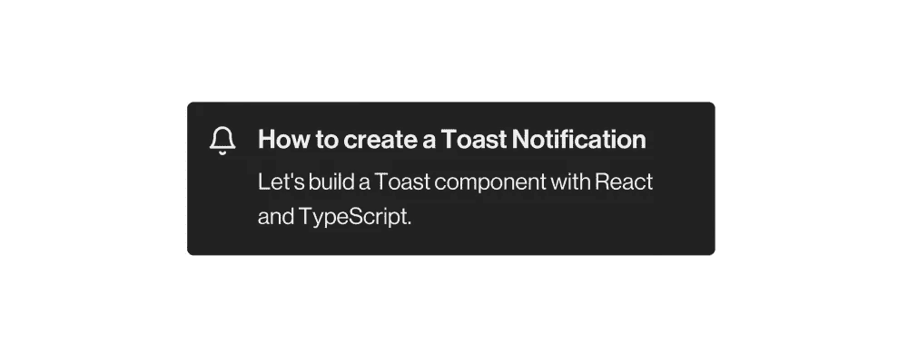
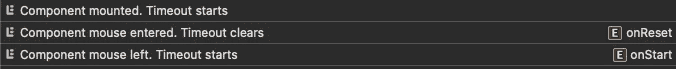

# 用 React 和 TypeScript 构建一个 Toast 通知组件。

> 原文：<https://levelup.gitconnected.com/build-a-toast-notification-component-with-react-and-typescript-5bc67d9b96b0>

带有文本“如何创建 Toast 通知”的 Toast 通知示例

Toast 是 web 应用程序的一个常用组件，用于提供与用户操作相关的反馈。这些弹出窗口是非破坏性元素，位于屏幕底部。根据实现的不同，可以忽略这个元素的可见性。然而，它通常带有自动隐藏机制，在特定时间间隔后触发。

根据您的需要，各种组件库已经提供了复杂程度更高的 Toast 元素。让我们创建一个轻量级和可访问的 Toast 系统，它可以在您的定制组件库中使用。

# 要求

我们的组件将解决三个主要的工程问题。

1.  **渲染** —组件应该能够在不需要手动放置 DOM 的情况下进行渲染。因此，迎合了开发者的体验。
2.  **显示** — Toast 应该从 react 组件树中的任何地方触发。还应该导出一个显示和隐藏元素的函数。
3.  **隐藏** —当组件可见时，它应该在特定间隔后自动隐藏。如果光标放在顶部，该间隔可以中断。

通过很好地定义我们的需求，我们可以开始为我们的需求构建正确的解决方案。

# 履行

> 以下实现不包括同时呈现的多个祝酒词。如果你对这样的话题感兴趣，请留下评论。

让我们定义一组适用于我们的吐司的核心 CSS 样式。对于我们的系统，我们不会定义所有可能的位置属性(底部中心、底部右侧等。).相反，我们将把组件放在视口的左下方。

我们使用值为`transform`的 CSS 属性`will-change`来预先通知浏览器发生的动画。选择`transform`而不是动画`bottom`属性是有意的。

通过这样做，我们主动避免了昂贵的布局计算。 [Matthew Costello](https://medium.com/u/72fdaedf1f27?source=post_page-----5bc67d9b96b0--------------------------------) 有一篇关于 CSS 布局&复合属性差异的优秀[文章。](https://medium.com/@matthew.costello/frontend-web-performance-the-essentials-0-61fea500b180)

让我们分别定义两个利用`ReactDOM.render` & `ReactDOM.unmountComponentAtNode`的函数`ShowToast` & `HideToast`。这些函数满足上一节中概述的前两个要求。

`ShowToast`函数转发定义组件行为的属性。带有 HTML id 属性的第二个参数是将我们的 Toast 组件放在 DOM 树中的任何位置。如果没有找到元素的 id，我们通过编程创建一个`div`并将其附加在`body`的底部。

我们已经创建了一个组件生命周期来满足我们的最终需求。一旦组件安装完毕，我们触发一个`setTimeout`，它将在一个特定的时间框架(默认为 4.5 秒)后自动删除该元素。当光标进入我们的目标时，生命周期可以被中断。当光标离开时，它将继续运行，从而重新开始生命周期。

控制台日志展示了当光标进入和离开我们的目标元素时调用的显式函数。

元素拥有所有相关的鼠标事件监听器。就可访问性而言，HTML 元素有一个隐式的`role=”status”`，表示用户操作的结果。为了获得更广泛的兼容性，建议显式添加角色属性。

最后，我们使用的是`window`名称与`setTimeout`和`clearTimeout`名称的间隔变体。如果需要服务器端呈现，建议使用 NodeJS 替代方案。

带有文本“Trigger”的按钮，当单击它时显示我们的 Toast 组件。4.5 秒后吐司隐藏。

# 结论

请随意修改上述实现以符合您的规范。您可以找到本项目中使用的参考资料的链接，以及下面几个令人惊叹的开源库。

希望这篇文章对你自己的 React 项目有所帮助！

# 参考

*   [构建烤面包组件](https://web.dev/building-a-toast-component/)
*   [输出:HTML 的原生 live region 元素](https://www.scottohara.me/blog/2019/07/10/the-output-element.html)
*   [Typescript —使用 setTimeout(节点 vs 窗口)的正确版本](https://www.thecodeteacher.com/question/16465/TypeScript---use-correct-version-of-setTimeout-(node-vs-window))

# 开源 toast 库

*   [react-hot-toast —镇上最好的 react 通知](https://react-hot-toast.com)
*   [反应——干杯——NPM](https://www.npmjs.com/package/react-toastify)

# 请与他人分享这篇文章，并给予一些掌声👏🏻在下面。

*通过鼓掌和关注，你可以帮助其他人发现这些内容，并激发更多关于可访问性、React、JavaScript 和 TypeScript 的文章的写作！*

# 分级编码

感谢您成为我们社区的一员！在你离开之前:

*   👏为故事鼓掌，跟着作者走👉
*   📰查看[升级编码出版物](https://levelup.gitconnected.com/?utm_source=pub&utm_medium=post)中的更多内容
*   🔔关注我们:[Twitter](https://twitter.com/gitconnected)|[LinkedIn](https://www.linkedin.com/company/gitconnected)|[时事通讯](https://newsletter.levelup.dev)

🚀👉 [**加入升级人才集体，找到一份神奇的工作**](https://jobs.levelup.dev/talent/welcome?referral=true)