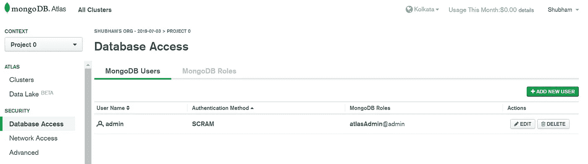
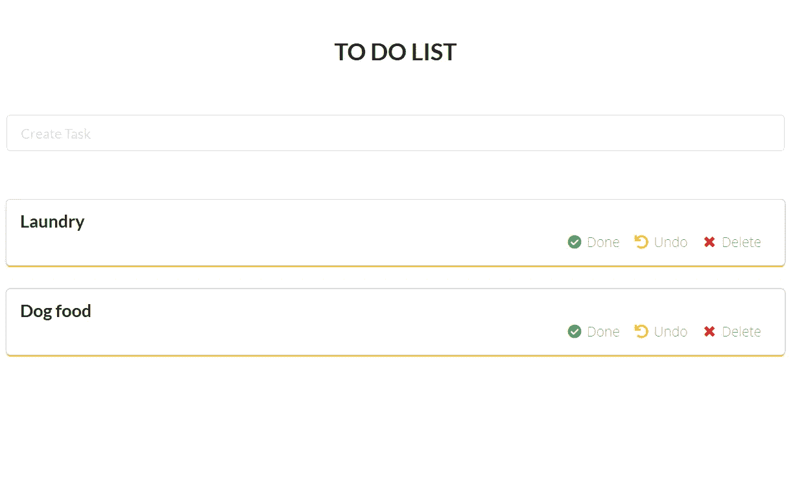

# 在 Golang、MongoDB 和 React 中构建 Todo 应用程序

> 原文：<https://levelup.gitconnected.com/build-a-todo-app-in-golang-mongodb-and-react-e1357b4690a6>

## 如何在 Golang 中创建 todo 应用程序的完整分步教程


[采用 Canva 设计的盖子](https://canva.7eqqol.net/KD6B9)

本教程的主要目的是获得 Golang 的实践经验。当我学习 Golang 时，我意识到很少有教程和文章能给你完整的端到端实践体验。

这是完整代码的 [GitHub 链接](https://github.com/schadokar/go-to-do-app/)。

> 查看我在 [schadokar.dev](http://schadokar.dev/) 上的其他教程

在本教程中，我们将构建一个 todo 应用程序，其中服务器将在 Golang 中，数据库将在 MongoDB 中，前端将在 React 中。

1.  **服务器—转到**
2.  **数据库— MongoDB**
3.  **前端—反应**

我假设你已经安装了 Go 并且对它有一个基本的了解。如果你没有，我会解释所有的步骤，并会提到相关主题的参考。

> **注意:**这个项目是在 GOPATH 之外开发的，因此本地导入正在工作。

创建一个项目目录，并给它一个合适的名称。

我在用`go-todo`。

让我们首先创建服务器。

## Golang 的服务器

在`go-todo`中创建一个`server`目录。

`server`目录结构将是:

```
go-todo
  - server
    - middleware
      - middleware.go
    - models 
      - models.go
    - router 
      - router.go
    - main.go
```

在服务器中，我们需要 2 个依赖项:第一个用于连接 MongoDB，第二个用于创建 RESTAPIs。

我们将使用 MongoDB 官方的 [MongoDB Go 驱动程序](https://github.com/mongodb/mongo-go-driver)。

要安装它，请在终端或命令窗口中运行以下命令。

```
go get go.mongodb.org/mongo-driver
```

其次，为路由器安装`gorilla/mux`包。`mux`是 Golang 中最受欢迎的路由器包之一。

要安装它，请在终端或命令窗口中运行以下命令。

```
go get -u github.com/gorilla/mux
```

## **型号**

一旦两个包都成功安装，创建一个`models`目录和`models.go`文件并粘贴下面的代码。

```
package modelsimport "go.mongodb.org/mongo-driver/bson/primitive"type ToDoList struct {

  ID     primitive.ObjectID `json:"_id,omitempty" bson:"_id,omitempty"` Task   string             `json:"task,omitempty"`
  Status bool               `json:"status,omitempty"`
}
```

第一行是这个文件的包名。要了解更多关于软件包的信息，请点击此[链接](https://medium.com/rungo/everything-you-need-to-know-about-packages-in-go-b8bac62b74cc)。

第二行是来自`mongo-driver`包的`import`原语。

为了定义数据如何存储在数据库中，我们必须为它创建一个`model`。在 Golang 中，我们对此使用`struct`类型。

在`ToDoList`我们有 3 个领域:

1.  ID:这个 objectID 将由 MongoDB 生成
2.  任务:测试
3.  状态:`true`或`false`

MongoDB 中 id 的类型是`Object(id)`。

> 注意:ToDoList 在导出时必须是大写的。

## **中间件**

在`server`目录下创建一个名为`middleware`的新文件夹，并在其中创建一个新文件`middleware.go`并将下面的代码粘贴到其中。

中间件. go

让我解释一下它的功能。所有大写的函数都被导出，并将在我们稍后要写的`router.go`中使用。

*   `**init()**` **:** 在整个程序生命周期中只运行一次。在 init 函数中，将建立到 MongoDB 的连接。查看 StackOverflow 上的这个[答案，了解更多关于 init 的信息。](https://stackoverflow.com/a/49831018/9790416)
*   `**GetAllTask**` **:** 首先设置头来处理 cors 问题，然后调用`getAllTask()`函数。它使用一个`bson`包从 MongoDB 获取数据。使用`*bson.M*` *其中 M 是 BSON 文档的无序、简洁表示。它通常应该用于序列化 BSON。*以`primitive.M`类型返回的所有文件。包`primitive`包含类似于 Go 原语的类型，因为 BSON 类型可以没有直接的 Go 原语表示。
*   `**CreateTask**` **:** 首先解码请求体，并存储在`models.ToDoList`类型中。它是从一个`models`包里进口的。然后会调用`insertOneTask`函数，将任务插入到集合中。
*   `**TaskComplete**` **:** 这是一个更新请求，根据任务 ID 更新任务的状态。为了从 URL 获取`params`,我们使用了`mux`包。使用`mux`，将任务 id 作为字符串发送给`taskComplete`函数。MongoDB 将 ID 分配给 ObjectID 格式的数据。为了从任务 ID(字符串)中获取 ObjectID，我们使用了`primitive`包的方法`ObjectIDFromHex`。它将返回`ObjectID`。`updateOne`方法需要 3 个参数`context`、`filter`和`update`。`context`是`Background`你可以通过此[链接](https://golang.org/pkg/context/#Background)了解更多关于上下文包的信息。第二个参数是`filter`，按 id 过滤，第三个参数是`update`，其中状态更新为`true`。
*   `**UndoTask**` **:** 与 TaskComplete 相同，只是将任务的状态更新为`false`
*   `**DeleteTask**` **:** 是删除请求。首先，它将从 URL 获取任务 id，然后将其传递给`deleteOneTask`。它将检索任务的`ObjectID`,然后根据 id 从集合中删除任务。
*   `**DeleteAllTask**` **:** 顾名思义，它从集合中删除所有任务。

中间件完成了。

**MongoDB 设置**

首先设置 MongoDB 连接。

在这里，我使用 MongoDB Atlas 进行演示。您可以注册免费层，它给你 512MB 的存储空间，这对于学习来说绰绰有余。

[报名](https://docs.atlas.mongodb.com/getting-started/)MongoDB 图集。按照链接说明进行操作。

一旦集群准备好了，就需要做一些事情。

首先，白名单你的 IP 地址。

*   点击“安全”下的“网络访问”。
*   点击“添加 IP 地址”并选择“添加当前 IP 地址”。这将只允许您的计算机与之交互。


白名单 IP 地址

第二，创建用户。你可以在这个[链接](https://docs.atlas.mongodb.com/getting-started/#create-a-mongodb-user-for-your-cluster)中了解更多关于用户的信息。

*   点击“安全”下的“数据库访问”并创建一个新用户。
*   我有`admin`作为用户。



atlas 用户

现在，是时候获取连接字符串了。

*   转到“集群”，点击“连接”，然后“连接您的应用程序”。
*   复制连接字符串并粘贴到`middleware.go`的`connectionString`中


连接字符串

## 路由器

在`server`目录下创建一个`router`文件夹，然后在其中新建一个文件`router.go`。将下面的代码粘贴到文件中。

路由器

首先，我们从`middleware`包中导入所有的任务函数。

其次，我们使用`mux`包来创建路线。

*   第 11 行:使用`mux.NewRouter()`创建路由器的新实例
*   第 13 行:`GET`从数据库中获取所有任务的方法。在`Methods`中，第一个参数是`Method`，这里是`GET`和第二个`OPTIONS`，这是为了处理`cors`。
*   第 14 行:`POST`在 DB 中创建任务的方法。
*   第 15 行:`PUT`方法在 DB 中将任务的状态更新为`true`。任务的 id 作为 URL 中的参数传递。
*   第 16 行:`PUT`方法在 DB 中将任务的状态更新为`false`。任务的 id 作为 URL 中的参数传递。
*   第 17 行:`DELETE`从 DB 中删除任务的方法。任务的 id 作为 URL 中的参数传递。
*   第 18 行:`DELETE`方法从 DB 中删除所有任务。
*   第 19 行:返回`router`实例。该路由器将在`main.go`中提供服务

## main.go

在`server`目录下创建一个`main.go`文件。将下面的代码粘贴到其中。

```
package mainimport (
    "fmt"
    "log"
    "net/http"
    "./router"
)func main() { r := router.Router() fmt.Println("Starting server on the port 8080...") log.Fatal(http.ListenAndServe(":8080", r))
}
```

进口`net/http`包服务于`8080`港的航线，`./router`进口`router`包。

创建一个`router`包的实例。

```
r := router.Router()
```

在`8080`端口上服务/托管应用程序。

```
http.ListenAndServe(":8080", r)
```

一个`log`包用于跟踪日志。

从`server`目录打开终端，运行下面的命令来服务服务器。您将看到图像输出。

```
go run main.go
```


服务

您可以使用`POSTMAN`来测试 API。

## 反应中的前端

我们使用`create-react-app`模块作为这个项目的样板。你可以在这里了解更多。

从项目目录运行下面的命令`go-todo`

```
npx create-react-app client
```

安装需要一段时间。完成后，为项目安装以下依赖项。从`client`目录打开终端。

1.  Axios: 用于与服务器 rest APIs 交互。
2.  **semantic-ui-react:** 是一个很棒的 react 组件库，可以快速搭建一个前端。参考此[链接](https://react.semantic-ui.com/)了解更多信息。

```
npm install axiosnpm install semantic-ui-react
```

语义 UI React 提供 React 组件，而语义 UI 以 CSS 样式表的形式提供主题。将样式表添加到`public`文件夹内的`index.html`中。从这个[链接](https://react.semantic-ui.com/usage)查看语义 UI 版本。

```
<link rel="stylesheet" href="//cdn.jsdelivr.net/npm/semantic-ui@2.4.2/dist/semantic.min.css"/>
```

更新`title`标签中的标题。这将是浏览器中选项卡的标题。保存`index.html`

```
<title>ToDo App</title>
```

转到`src`文件夹并打开`App.js`。删除其中的内容并粘贴下面的代码。

```
import React from "react";
import "./App.css";// import the Container Component from the semantic-ui-react
import { Container } from "semantic-ui-react";// import the ToDoList component
import ToDoList from "./To-Do-List";function App() {
  return (
    <div>
      <Container>
        <ToDoList />
      </Container>
    </div>
  );
}
export default App;
```

在`src`文件夹中创建一个新文件`To-Do-List.js`。这个组件将是前端。

你可以从 [GitHub](https://github.com/schadokar/go-to-do-app/blob/master/client/src/To-Do-List.js) 下载这个组件。

您可以保存该文件，然后它就可以运行了。

**运行应用程序**

*   打开终端，从服务器目录启动`server`。

```
go run main.go
```

*   打开终端，从客户端目录启动 react 应用程序。

```
npm start
```

*   转到`http://localhost:3000`


指数

*   **创建任务**


创建任务

*   **点击** `Done`完成任务


任务完成

*   **撤销任务**


撤消任务

*   **删除任务**



删除任务

# 恭喜🎉

恭喜你！你只需在 Golang 中创建一个待办事项应用程序。

完整的代码。这是 [Github 链接。](https://github.com/schadokar/go-to-do-app/)

> 如果你喜欢这个教程，你可以在[我的博客上阅读我的最新教程。](https://schadokar.dev) *📑*

[](https://gitconnected.com/learn/golang) [## 学习围棋-最佳围棋教程(2019) | gitconnected

### Go 是一种静态类型的命令式编译语言。然而，与许多编译编程语言不同，Go 是…

gitconnected.com](https://gitconnected.com/learn/golang)