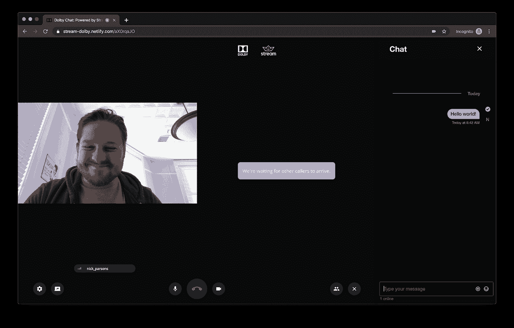
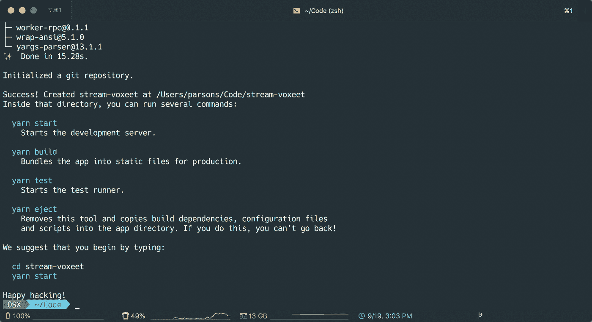
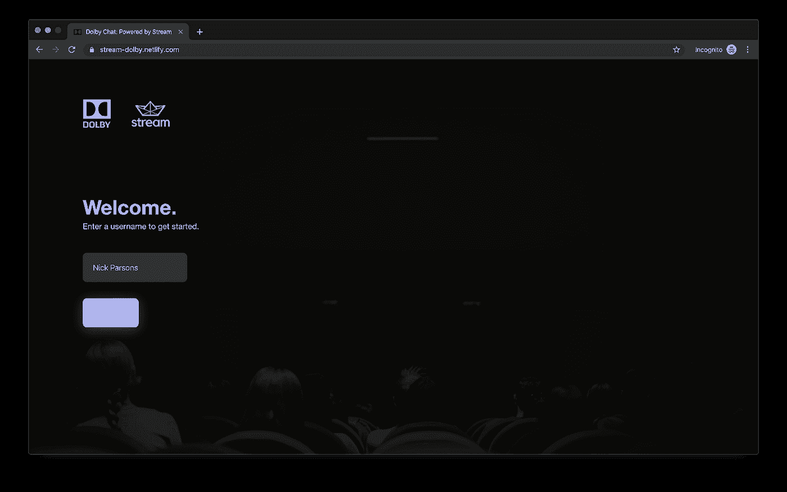

# 使用 Dolby Voxeet 构建视频会议应用程序，并使用 React 进行流聊天

> 原文：<https://levelup.gitconnected.com/build-a-video-conferencing-app-using-dolby-voxeet-and-stream-chat-901e9180d38c>

随着最近推出的[流聊天](https://getstream.io/chat/)，这里的团队一直在与供应商合作，为各种平台添加实时聊天和消息。我们收到了一些语音和视频聊天的请求，在环顾市场后，与 [Voxeet](https://www.voxeet.com/) (最近被杜比收购)合作是一个明确的选择。证据就在布丁中，所以我们使用流聊天和 Voxeet 为一个实时视频会议应用程序构建了一个全功能的概念证明。

随着最近[流聊天](https://getstream.io/chat/)的推出，这里的团队一直在与供应商合作，为各种平台添加实时聊天和消息。我们收到了一些语音和视频聊天的请求，在环顾市场后，与 [Voxeet](https://voxeet.com) (最近被 [Dolby](https://dolby.com) 收购)合作是一个明确的选择。证据还在酝酿中，所以我们使用 Stream Chat 和 Voxeet 作为 React 的 web 应用程序，为一个实时视频会议应用程序构建了一个全功能的概念证明。

我们之所以决定使用 Voxeet，而不是其他竞争对手，例如 Twilio 的可编程视频平台，主要是出于以下原因:

*   [Voxeet](https://voxeet.com) 是视频领域的行业领导者，提供流行语言的 SDKs 您可以选择 JavaScript、iOS (Swift)或 Android (Java)
*   可预测且慷慨的[定价](https://www.voxeet.com/pricing/)完全合理的模式——基于语音和视频的时长
*   他们的[文档](https://developer.voxeet.com/getstarted/javascript/getstarted-javascript/)是为开发人员编写的，重点是如何集成——包括开始时很好的示例教程
*   它们提供了一个 React 集成，可与[流聊天 React 组件](https://getstream.github.io/stream-chat-react/)完美配合，使开发人员能够轻松访问底层 Voxeet API 并将其与流聊天连接

此外，我们的初步测试表明，与 Twilio 相比，Voxeet 的延迟大大降低，并且在实时视频(及其视频会议 API)方面提供了更高的清晰度。有了更好的文档，我们提前知道我们将能够执行而不会遇到任何问题。

在这篇文章的其余部分，我们将概述我们如何在不到一周的时间内着手构建一个类似于 [Zoom](https://zoom.us/) (视频通信工具)的竞争对手。我们将使用 Voxeet 进行实时视频(通过 [WebRTC](https://webrtc.org/) )以及[流聊天](https://getstream.io/chat/)进行实时聊天/信息传递。

> ***注*** *:* 你可以在这里找到位于[的演示。前端 UI 的完整代码可在](https://stream-dolby.netlify.com/) [GitHub](https://github.com/GetStream/stream-dolby-voxeet) 上获得。如果您想使用后端 API 运行演示，请参见这个 [GitHub repo](https://github.com/GetStream/stream-dolby-voxeet-api) 。

# 先决条件

要完全遵循本教程，您需要确保对以下内容有一个适当的理解:

您还需要确保您的计算机上安装了以下软件:

此外，您需要创建以下服务的免费帐户:

*   [Heroku](https://signup.heroku.com/login) (用于托管 API-free 层)
*   [流](https://getstream.io/chat/)(实时聊天功能——14 天免费试用)
*   [Voxeet](https://developer.voxeet.com/dashboard/register) (用于视频会议——自由层)

# 入门指南

# 建筑

这个应用程序的构建相当简单。它需要两个主要元素——前端 UI 和后端 API。如果你想更进一步，你可以在 Netlify 上托管前端 CRA 应用程序，在 Heroku 上托管 API，只需几分钟。

# 步骤 1:前端用户界面

首先，确保你已经用 [Stream](https://getstream.io/chat/) 和 [Voxeet](https://developer.voxeet.com/dashboard/register) 建立了一个账户，并且你已经有了每个账户的所有密钥和令牌，你将需要以下内容:

接下来，在您的终端中运行`npx create-react-app stream-voxeet`。完成后，为了安全起见，将流 API 密钥和来自相关仪表板的 Voxeet 密钥添加到项目根目录下的一个`.env`文件中。

在您的`.env`文件中，您将需要以下环境变量:

*   反应 _ 应用 _ 流 _ 键
*   REACT_APP_VOX_KEY
*   反应 _ 应用 _ 声音 _ 秘密

回到您的终端，安装项目所需的依赖项:

最后，在应用程序的根目录下创建一个`jsconfig.json`文件。复制并粘贴以下内容:

现在我们的项目已经设置好了，让我们进入代码编辑器并开始构建。

# 第二步:设置

首先，我们将设置 Redux 存储、中间件和样式化组件主题，并删除 CRA 样板文件提供的默认设置。

您将希望*移除`App.js`和`index.js`文件中这些资产的导入*，以及从`App.js`中去除所有样板标记——只留下父`div`。

然后，在您的`/src`目录中创建以下目录:

## 风格

**颜色**:

**断点**:

接下来，我们将导入这些变量来帮助填充我们的样式组件主题。然后，我们将创建一个`colorUtils.js`文件，并将以下代码粘贴到其中:

现在，我们可以在`styles/theme.js`中把这些都放在一起——这个主题将在我们所有的样式组件中可用，并且可以通过`withTheme` HOC 访问。

最后，我们将创建`styles/global.js`。这个文件实际上是我们之前删除的`index.css`的替代文件。请注意，我们稍后还将导入两个额外的文件来覆盖 stream-chat-react 和 voxeet 的样式。

我们将很快在我们的`App.js`中把这一切联系在一起，但首先，我们将建立我们的 Redux 商店。

## Redux

在您的数据目录中，添加一个名为`createReducer.js`的文件，其中包含以下代码:

以下代码将把 Voxeet reducer 挂接到我们的 Redux 存储，并使`Conference`组件能够正确工作。我们还将在数据目录中创建一个`rootSaga.js`文件；然而，现在，我们将把它留为空白，以后再来讨论它。

接下来，让我们在`data/createStore.js`中创建 Redux store 本身，以便将它们联系在一起——我们将在 Voxeet 组件中添加所需的 thunk 中间件，以及 redux-saga 中间件，稍后当我们向应用程序添加简单的身份验证以及一些其他有趣的东西时，我们将使用该中间件。

我们现在准备开始包括 Voxeet 的组件，稍后还将包括流聊天。然而，您现在应该从上面的文件中获得两个缺失的导入。一个是我们马上要创建的会议屏幕。另一个是`utils/history.js`。

通过以这种方式导入`history`，我们可以将它传递给上面文件中的`Router`，它将与 react-router v4 的`BrowserRouter`操作相同。我们也可以在我们的传奇中(以及我们代码中的任何地方)导入它，以便在不使用`<Link />`的情况下以编程方式导航，或者在`history`属性不可访问的区域导航。

以下是历史实用程序的代码:

# 步骤 3:初始化 Voxeet

我们将从创建会议屏幕开始，视频通话将在这个屏幕上进行。在您的`screens`目录中创建`Conference/Conference.js`，在您的编辑器中打开它并粘贴以下内容:

您现在应该能够转到`http://localhost:3000/test`查看完全正常的视频通话屏幕。Voxeet 组件棒极了。开箱即用，Voxeet 为其 SDK 和 API 提供了所有可用特性的完整功能。

现在，我们只能通过覆盖默认 CSS 来控制 Voxeet UI 的样式，用户将拥有随机生成的用户名和 id。所以，让我们解决这个问题。

传递给这些道具的组件将分别取代聊天抽屉和底部动作栏。`ConferenceRoom`将从 Redux 传递必要的状态作为道具，允许我们使用定制组件来改变调用的状态。此外，它将帮助我们提供一个自定义的聊天 UI，我们将在教程的后面使用流聊天！

经过以上更改，您现在应该会看到会议屏幕的主包装器在浏览器中将是全高全宽的，底部的操作栏将会消失。我们现在可以开始构建我们的自定义调用 UI 了。

现在，我们可以让这个文件为空，因为我们首先需要一些其他组件，然后我们可以在 ActionButtons 栏本身中使用它们。

回到`src/components`让我们用下面的代码创建一个名为 Icons 的新目录和一个`Icon.js`文件:

这个文件创建了一个可重用的`Icon`组件，我们可以用它来生成一组一致的 SVG 图标。然后，我们可以像使用任何其他 react 组件一样使用这些图标。`Icon`组件还提供了额外的功能——比如通过`size`道具控制图标高度/宽度的能力(同时保持一致性，如果我们正确设置`viewBox`的话),以及用`color`道具改变颜色的能力。

为了速度和方便起见，我们使用了[材质图标](https://material.io/resources/icons/)——将它们转换到我们的新图标组件中使用轻而易举。为了避免重复，这里有一个链接指向一个包含完整图标文件夹的 [ZIP 文件](https://stream-blog.s3.amazonaws.com/blog/wp-content/uploads/25a67b81dacb3a644d546a8295caaa04/icons.zip)，你可以直接放入你的`components`目录。

最后，我们准备创建我们的自定义动作栏！

回到`screens/Conference/components/ActionsButtons.js`，我们现在可以添加以下内容:

目前，我们正在将`unreadCount`道具设置为回退到`0`，因为我们还没有在任何地方定义它。一旦我们建立了流聊天，我们将从我们的 Redux 存储中提取这些数据。

所有其他属性都由 Voxeet `ConferenceRoom`组件提供，并由默认的`ActionsButtons` UI 在内部使用，以有条件地改变按钮的状态——所以我们也将这样做。这种状态取决于用户的麦克风或摄像头是否被禁用、聊天抽屉是否打开等参数。

请注意，我们在 UI 中保留了一些默认的 Voxeet 视图，如设置(用于控制输入/输出设备，以及用于查看所有活动参与者的`AttendeesList`)。

现在剩下要做的就是将我们全新的`ActionsButtons`导入到`ConferenceRoom`中，如下所示:

现在，在您的浏览器中，您应该会在屏幕底部看到我们的自定义通话 UI！您可以挂断电话，禁用您的摄像头或麦克风，与其他参与者共享您的屏幕，更改您的 I/O 设置，查看参与者列表，最后但同样重要的是，切换聊天抽屉。这将是空的，但我们很快会回来。

我们还想覆盖一些 Voxeets CSS，使会议屏幕与应用程序的其余部分相匹配。为了简洁起见，下面是我们完成版本的完整 CSS 文件——您可以随意调整任何您认为合适的值。

现在剩下要做的就是跳转到`styles/global.js`并添加下面两行来将我们的覆盖导入到全局 CSS 文件中:

# 步骤 4:设置后端 API 和身份验证

在设置我们的聊天组件之前，我们将通过首先设置应用程序的后端 API 和身份验证来简化事情。

这个项目的后端很简单，Voxeet 的 react 组件为您处理所有与 Voxeet 相关的后端功能。我们需要做的就是传入用户数据，这意味着我们只需要为流聊天生成一个令牌。

您可以在这里下载样板文件，并按照下面的部分让后端和认证流程在您的应用程序中工作。或者，您可以点击 Heroku 按钮，立即将完整的 API 代码部署到 Heroku，或者点击此处查看完成的 API 报告。

> **注意**:如果您选择使用 Heroku 自动部署，您可以安全地跳过下一部分，直接构建认证流程。

让我们开始编写后端代码吧！

幸运的是，许多工作已经通过提供的样板 API 完成了。我们需要做一些小的改变，让它按照我们想要的方式工作。

在您的前端存储库之外，从您想要存储 API 代码的目录在您的终端中运行下面的命令。

然后，运行`cd stream-voxeet-api && yarn`并在编辑器中打开`stream-chat-voxeet`目录。

我们首先将`env.example`重命名为`.env`，并将之前保存的流密钥和秘密插入到正确的变量中。完成后，它应该看起来像这样:

现在，让我们回到终端，运行`yarn dev`来启动开发服务器。repo 使用 nodemon 在您进行更改时自动刷新，同时保持服务器活动。

可选地，您将在第 **28** 行看到 repo 使用 robohash 为用户生成一个头像。在我们的最终版本中，我们使用了 ui-avatars.com，因为它生成的图像更适合我们的设计，但是你可以在这里放入任何你认为合适的头像生成 URL。

后端就这样了！

您可以测试 Postman(或者您选择的 REST 客户机)是否工作正常，方法是让服务器运行，并向`http://localhost:8080/v1/token`发出 POST 请求，其中主体是以下对象:

如果成功，您将在响应正文中看到以下内容:

厉害！我们现在可以开始构建我们的登录表单，并在我们的应用程序中验证用户。

让你的 API 服务器暂时运行，回到你的编辑器中的前端代码。

我们还需要 Axios 周围的这个小包装实用程序向我们的后端发出请求，并将其保存在`src/utils/fetch.js`中的项目文件中

## 构建认证流程

**输入**:

**按钮**:

**正文**:

现在我们已经拥有了使用 Formik 和 Yup 构建我们的`LoginForm`组件所需的所有组件，这些组件是我们在本教程开始时安装的。

Formik 是一个很棒的库，允许我们用 React 轻松构建复杂的表单，而 Yup 提供了一个很好的、强大的方法来验证我们的输入值。在本教程中，我们不会利用 Formik 的全部潜力，但是如果您在完成本教程后决定构建这个项目，这将为您快速、轻松地构建任何形式奠定坚实的基础。

我们从从 T4 进口 T2 和 T3 开始。组件`<Formik />`将是我们渲染函数中的根元素，我们从 props 传入我们的`onSubmit`处理程序，以及第 24 行 getter 函数中定义的一些初始值，最后，我们的`this.renderForm`函数作为组件的子元素。

我们也在进口`validationSchema.js`——这就是 Yup 的用武之地。语法非常容易掌握，不仅文档容易理解，而且 Yup 还提供了有用的助手来验证电子邮件、电话号码等，以及传递自定义正则表达式验证器的选项，并可以轻松设置错误消息，如果条件不满足，这些消息将被传递到输入组件中。

在表单组件旁边的`LoginForm`目录中创建验证文件，并粘贴以下代码:

现在，回到`LoginForm.js`内部，您会看到我们正在将我们的 Yup 模式作为`validationSchema`道具传递给 Formik。此时，我们的表单将完全可操作，但是还没有呈现到 DOM 的任何地方，也没有将它的值发送到后端。

让我们快速跳转到`App.js`并更新文件来呈现我们的登录路径。

现在，当您导航到 [http://localhost:3000/](http://localhost:3000/) 时，您应该看到我们的登录页面呈现在屏幕上，并带有登录表单。您也可以填写表单，单击下面的按钮并打开您的控制台来查看表单的输出。

我们现在需要一种方法将表单数据发送到后端，检索我们的令牌，并在将它们发送到会议屏幕之前验证用户。是时候来点还原魔法了！🧙‍♂️

我们将从创建动作创建者和动作类型开始。您可以在下面找到相关的片段，它们将保存在我们项目的`data/auth`中。

**数据/授权/类型. js** :

**data/auth/actions.js** :

现在，在`auth/sagas/index.js`中添加以下代码:

`redux-saga`还提供了一些助手，比如`takeEvery`(用在上面的代码片段中)，它将动作类型作为第一个参数，将传奇作为第二个参数。每次动作被触发，传奇就会开始。

让我们快速分析一下这是怎么回事。

*   我们从 redux-saga 导入`all`、`call`和`put`助手，如果我们的登录操作没有提供会议别名，我们还导入`shortid`来生成会议别名。
*   然后，我们从 utils 目录导入`history`和`fetch`。
*   我们还导入了我们的`LOGIN`动作类型，这样我们就可以在以后的故事中触发一个成功动作或错误动作。
*   接下来，我们定义我们的 saga 并析构它的第一个也是唯一的参数，该参数将始终是我们解雇的动作创建者(`loginRequest`)，这意味着我们可以从动作中提取值并在我们的 saga 中使用它们，在本例中，是可选的会议别名和表单数据。
*   然后，我们打开一个 try/catch 块，对用户名进行一些简单的格式化，以确保在运行 fetch 调用之前，它全部是小写的并且不包含空格(我们使用 regex 将它们替换为' _ ')。
*   我们使用`call`助手，并将 fetch 作为第一个参数传入。将传递以下所有参数以获取自身。
*   Axios(因此我们的 fetch util)从服务器返回响应体作为`data`键，所以我们也要对其进行析构，以便从响应中提取令牌和用户对象。
*   接下来，我们将这些值存储在 localStorage 中，这样我们就可以跨会话持久化用户(稍后当我们到达我们的 reducer 时会详细介绍)，然后检查动作数据中是否出现了`conferenceAlias`。如果不是，我们使用`shortid`生成一个。
*   最后，我们使用`all`助手来并行运行两个 saga 助手。第一个是`put`，它将触发我们的成功动作以供缩减器使用；第二个是`call`，其中我们通过`history.push`将用户导航到会议屏幕。
*   我们还使用 catch 块中的`put`来触发`LOGIN.ERROR`动作，并将消息传递给减速器。

既然我们的登录传奇已经准备好了，我们需要确保我们确实在运行传奇，以便它可以监听`LOGIN.REQUEST`动作。我们将通过在初始化 Redux 存储时创建的根 saga 中使用另一个 saga 助手(`fork`)来实现这一点。

在您的编辑器中打开`data/rootSaga.js`,将其修改为如下代码片段:

接下来，在`data/auth`中创建一个`reducer.js`文件，并向其中添加以下代码:

reducer 将处理`LOGIN.SUCCESS`动作，并将用户令牌和配置文件数据保存到 Redux 存储中。我们正在传递一些初始状态，默认值设置为从`localStorage`中提取值——如果它们不存在，它们将返回 null，因此使应用程序处于未验证状态，可以登录。

现在，我们可以在组件中使用这些数据来创建一个会议屏幕路由的包装器，以防止未经身份验证的用户访问它。在您的`src/containers`目录中，创建一个名为`AuthedRoute.js`的新文件，并在下面的代码片段中粘贴:

上面的组件负责保护我们的路由免受未授权用户的访问，并在授权请求正在进行时显示一个加载屏幕。它还会将`conferenceAlias`参数传递给`location.state`，这样，如果用户试图在没有登录的情况下访问会议，它会存储 id，这样我们就可以通过检查位置状态中的值并将其传递给我们之前设置的动作创建者来重定向他们。

对于加载屏幕，将以下文件添加到`screens/LoadingScreen.js`:

最后，让我们回到我们的`screens/Login/Login.js`文件，并做以下更改:

最后，我们在类中添加了一个新方法，`renderWelcome`,它呈现了一个略有不同的 UI，显示了用户头像和一个“开始视频通话”按钮来发起通话。我们在渲染函数中有条件地调用 that 或`renderLogin`,这取决于用户是否经过身份验证。

现在，我们的后端已经就绪，我们的登录屏幕已经完全运行，我们可以通过用 Stream 构建我们的聊天实现来完成我们的应用程序了！🎉

# 第五步:流式聊天

如果您点击了我们之前构建的通话 UI 中的聊天按钮，您肯定会注意到，打开抽屉会将视频移到左边，但抽屉本身是不可见的。所以现在是开始集成流聊天和构建自定义抽屉的最佳时机，我们可以将它传递到我们的`ConferenceRoom`中。

首先，您需要添加下面的`Portal` util，它是使用 Reacts 内部门户实现构建的。如果您以前没有使用过门户，它们基本上允许您在树中的任何地方定义组件，但是可以在当前父层次结构之外的任何地方将它呈现到 DOM 中。我们将使用门户在主体内部呈现一个聊天抽屉——在应用程序的其余部分之上。

最后，我们需要创建我们的`chat`减速器，并将其导入到我们的根减速器中。下面是缩减器的代码，后面是显示根缩减器的代码片段。

现在，进入我们的聊天抽屉！

这里发生了很多事情——所以这里有一个分类。

首先，在我们的构造函数中，我们定义了我们的默认状态，还设置了`this.chatClient`来包含我们的`StreamChat`实例，并向它传递我们在教程开始时设置的`.env`变量。然后，在`componentDidMount`中，我们调用`this.chatClient.setUser`并传入一个表示我们的`user`的对象，我们使用 Redux 选择器将它拉入 props。

我们还在这里初始化了一个监听器，它在`message.new`事件时触发。每次在通道中发送新消息时，回调将运行并使用我们的`setUnreadCount`动作创建器更新我们的未读计数。

接下来，在我们的渲染函数中，我们渲染了`stream-chat-react`组件，这些组件将为我们的 UI 提供动力，并为我们处理大量的状态管理。

我们用`Chat`组件包装一切，并将`this.chatClient`传递给客户端道具。在其中，我们呈现了从`this.state`传递给我们的`channel`的`Channel`组件，随后是`Window`，它将包装我们聊天 UI 的视觉方面。然后，在我们的`Window`内部，我们渲染`ChatHeader`、`MessageList`、`MessageInput`。

回到`screens/Conference/components`内部，创建`ChatHeader.js`并添加以下代码片段:

这就是我们需要一个完全可操作的聊天 UI 的一切！

但是我们还没有完成…

我们需要包含来自`stream-chat-react`的 CSS 文件。当然，从库中导出的默认文件是有响应的。然而，由于我们是在一个 375 像素宽的包装器 div 中呈现聊天组件，这带来了一些问题。

因为 CSS 媒体查询对窗口的大小作出反应，而不是父 div 的大小，所以诸如`padding`和`max-width`这样的属性将是不正确的——使用它对整个视窗的值，而不管容器的大小。为了解决这个问题，我们将去掉媒体查询，只使用移动设备大小的定义。

将上述文件放在您的`public`目录中，然后在`public/index.html`中您可以像这样导入文件:

我们还需要沿着屏幕底部跳回我们为自定义呼叫 UI 制作的`ActionsButtons.js`组件，并将其连接到我们的 redux 存储，以便我们可以检索未读计数并相应地显示通知标记:

# 最后的想法

在本教程中，您已经成功构建了一个功能完整的视频会议应用程序。想了解更多关于 Voxeet 的信息，请访问他们的网站:https://voxeet.com。

如果您有兴趣将聊天添加到您的应用程序中，Stream Chat 可以满足您的需求 React 组件(我们在本教程中使用过),以及用于 JS、iOS、Android 和大多数其他流行编程语言的 SDK 和库。

编码快乐！✌️