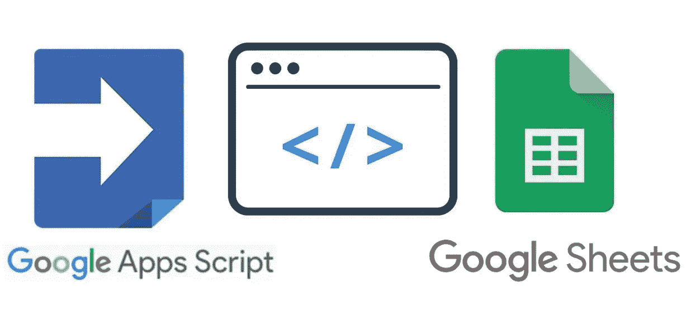

# 基于参数构建一个 Web API，使用 Google Apps 脚本从电子表格中检索 JSON 数据

> 原文：<https://levelup.gitconnected.com/build-a-web-api-based-on-parameters-that-retrieves-json-data-from-a-spreadsheet-using-google-apps-20a3a8f89f6d>



图片来源:海·凯尔(YouTube)

你好，学习者！

本文延续了我之前的文章“如何构建一个 Web API，使用 Google Apps 脚本 从 Google 电子表格中检索 JSON 数据”，展示了如何基于一些参数使用 Google Apps 脚本从 Google 电子表格中检索 JSON 数据。参数可以包括电子邮件 id、密钥 id、姓名或任何其他可以用来在 Google 电子表格中定位行的信息。让我们了解一下它是如何工作的。

**以下步骤将指导我们完成整个过程:**

**步骤 1:** 打开你的 Google Apps 脚本编辑器，编写下面的 **doGet()** 函数。

```
var email;
var sheetname;function doGet(event) {sheetname = event.parameter['sheetname'];
email = event.parameter['email'];var data = getJsonData(sheetname, email); 
 return buildSuccessResponse(data, 1);
}
```

在上面的代码中，email**和 **sheetname** 已经被声明为全局变量。**事件**变量传入 **doGet()** 函数；这是一个变量，我们将从中获取已经从前端传递到 Web API URL 的参数及其值*(稍后我们将看到如何检索 Web API URL)*。在上面的示例代码中，可以看到**事件**变量有两个参数: **sheetname** 和 **email** 。这些参数是使用**参数**属性获得的。参数属性可以通过放置一个点*()*之后的**事件**变量，并在[ ]括号内定义键字符串。请参考下面的示例代码。**

```
event.parameter['sheetname'];
```

现在我们有了 Web API URL 参数及其值。我们将把它们传递给 **getJsonData()** 函数，然后声明我们将从中检索数据的 Google 电子表格 id 和 sheetname。

如下面的示例代码所示，我们可以看到如何将参数传递给 **getJsonData()** 函数。

```
getJsonData(sheetname, email);
```

**步骤 2:** 作为该步骤的一部分，我们将为 **getJsonData()** 函数创建 Google Apps 脚本，并定义电子表格的电子表格 id 和电子表格名称。请参考下面的示例代码。

```
function getJsonData(sheetname, email){

 var spreadSheetId='YOUR_SPREADSHEET_ID';

 var ss = SpreadsheetApp.openById(spreadSheetId);
 var sheet = ss.getSheetByName("YOUR_SHEETNAME");

 var json_data = getData(sheetname, email);

  return json_data; 
}
```

在上面的示例代码中，我们已经定义了 Google 电子表格 ID 和名称，我们将从中获取数据。让电子表格工作的顺序是，首先我们需要编写**电子表格 id** ，然后应用 **SpreadsheetApp** 库函数，接着是 **openbyId** 来访问电子表格，然后编写我们从中获取数据的电子表格名称。

然后我们调用 **getData()** 函数，并传递 **sheetname** 和 **emai** l 参数来检索 JSON 格式的基于条件的数据。

**第三步:**在这一步中，我们将编写带有参数化条件的 **getData()** 函数的代码。这个函数将有与字符串化我们从电子表格中得到的数据相关的代码。让我们看看下面的代码。

```
function getData(sheet){

  var jo = {};
  var i =0;
  var rows2 = sheet.getDataRange().getValues();
   Logger.clear();
//  ===============Get data=================
  var rows2=[];
  var rangeData = sheet.getDataRange();
  var values = rangeData.getValues();
  var lastColumn = rangeData.getLastColumn();
  var lastRow = rangeData.getLastRow();
  var data=[];
  var x=0,y=0;
  for(i = 0; i<lastRow; i++){
    data[x]=[];

    for(var j=0; j<lastColumn; j++ ){ // Here we are matching values with eamil  parameter// values[i][2] will have data of emails in second column of your 
// spreadsheet 
      if(email == values[i][2]){ 
        data[x][j]= values[i][j];
        y=1;
      }
    }
    if(y==1){ x=x+1; y=0; }

  }
  return data;  
}
```

在上面声明的函数中，我们使用了很少的库函数。请参见下面的定义:

**getDataRange():** 获取有数据的电子表格的范围。

**getValues():** 获取电子表格中选定范围的值。

**getLastColumn():** 获取电子表格的最后一列。

**getLastRow():** 获取电子表格的最后一行。

然后使用**电子邮件**参数根据相同的电子邮件值过滤数据。我们使用 **value[i][2]** ，因为它定义了电子表格中包含电子邮件的第二列。

**第四步:**在这一步中，我们只需要定义前面在示例代码顶部的 **doGet()** 函数中声明的 **buildSuccessResponse()** 函数。

```
function buildSuccessResponse(data, pages) {
  var output = JSON.stringify({
    status: 'success',
    data: data,
    pages: pages
  });

  return ContentService.createTextOutput(output).setMimeType(ContentService.MimeType.JSON);
}
```

在上面的代码中，我们传递了从 **getJsonData()** 函数获得的整个数组。由于 stringnify 是获取 JSON 格式的数组数据的过程，所以我们还可以传递一些参数，比如数据是否已经成功发送到 Web API，以及更多的参数。

**第 5 步:**我们现在处于 API 构建过程的末尾。你所要做的就是使用谷歌脚本编辑器右上角的选项**“Deploy”**，将整个代码部署为一个 web API。完成此操作后，您将看到如下 Web API URL:

```
[https://script.google.com/macros/s/AKfycbyS6P2P2TUGBfqmFTrTfourZK97fB5JnVxyWTz32St8y1UwgdaYYK6jBIq1JqR1qpsi/exec](https://script.google.com/macros/s/AKfycbyS6P2P2TUGBfqmFTrTfourZK97fB5JnVxyWTz32St8y1UwgdaYYK6jBIq1JqR1qLlZ/exec)
```

以上可见的 URL 仅用于演示目的，它不是一个有效的 URL。在这个 URL 中，您需要传递我们从 **doGet()** 函数收到的那些参数——**sheet name**和 **email** 。现在让我们看看它如何与 Web API URLs 一起使用。

```
[https://script.google.com/macros/s/AKfycbyS6P2P2TUGBfqmFTrTfourZK97fB5JnVxyWTz32St8y1UwgdaYYK6jBIq1JqR1qpsi/exec](https://script.google.com/macros/s/AKfycbyS6P2P2TUGBfqmFTrTfourZK97fB5JnVxyWTz32St8y1UwgdaYYK6jBIq1JqR1qLlZ/exec)?sheetname=YOUR_SHEETNAME&email=YOUR_EMAIL_VALUE
```

上面你可以看到我们增加了 ***？sheet name = YOUR _ sheet name&EMAIL = YOUR _ EMAIL _ VALUE，*URL 后的**，用来包含 Web API URL 的参数，并且我们可以通过添加&操作符来添加更多。

如果你有兴趣学习 Google Apps 脚本和自动化你的 Google Workspace？必须试试这本**电子书**上的 [**谷歌应用套件脚本:初学者指南**](https://www.amazon.com/dp/B0BTJC9X5R)

通过阅读这篇文章，我希望您能够构建自己的 Web API，这样您就可以根据参数从 Google 电子表格中将数据提取到您的网页中。

如果你有任何问题，请留下评论。我很乐意帮忙。

快乐学习！