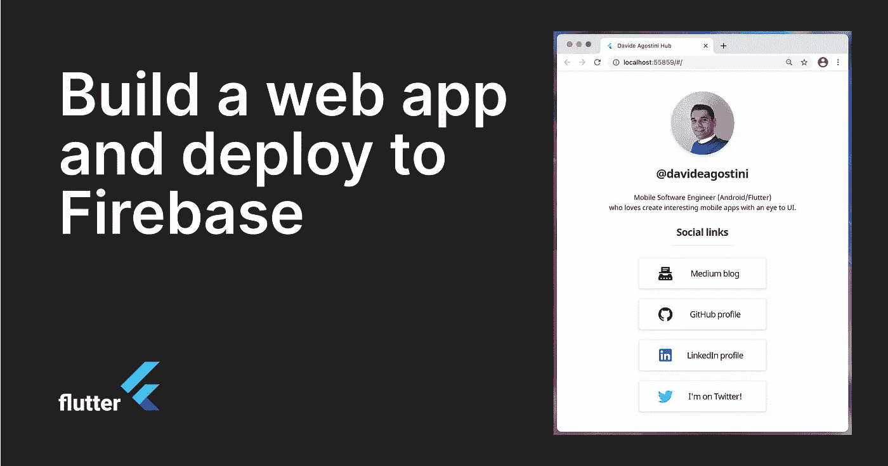
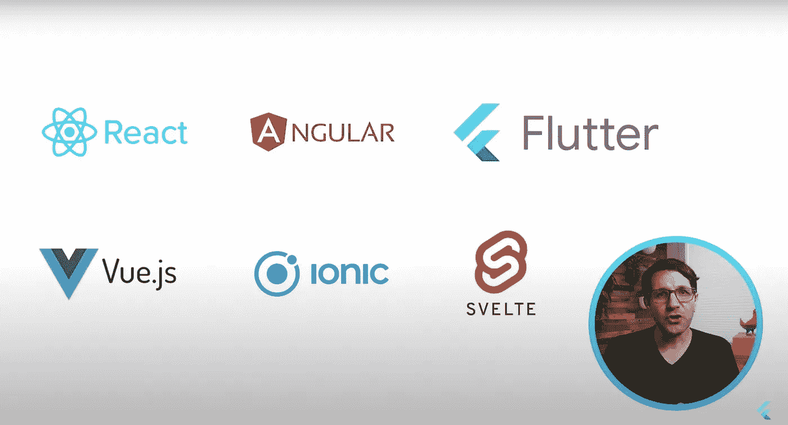
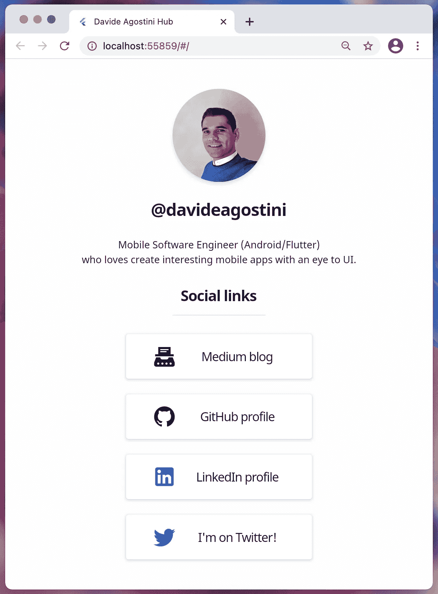
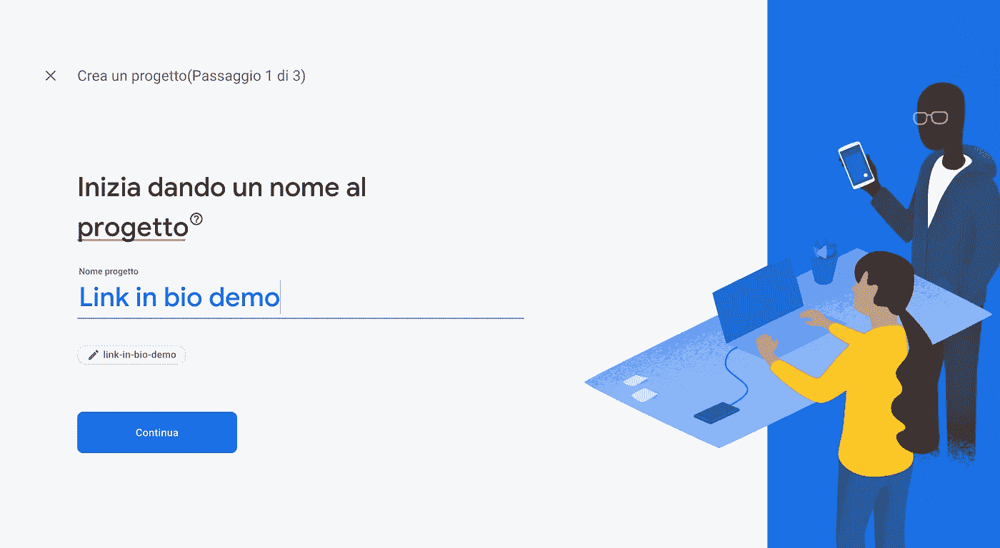
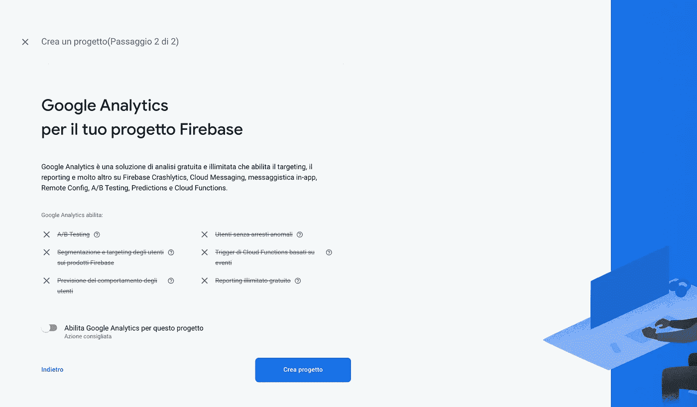
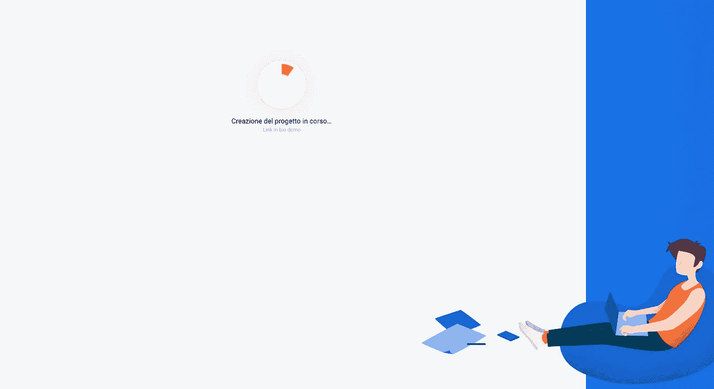
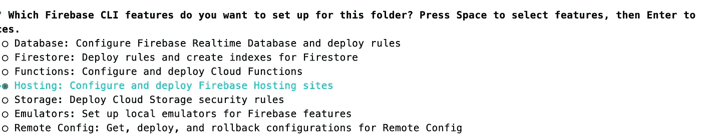
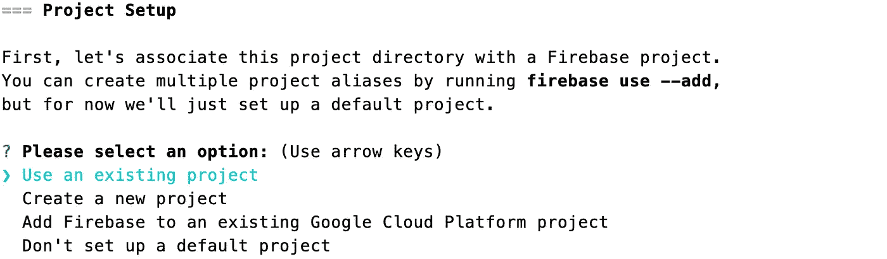
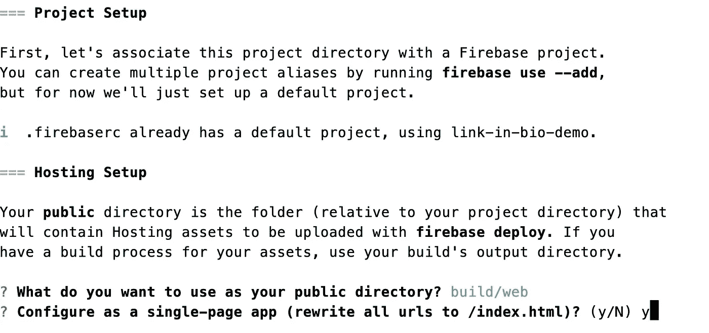

# 用 Flutter 构建一个 web 应用程序，并将其部署到 Firebase 主机上

> 原文：<https://levelup.gitconnected.com/build-a-web-app-with-flutter-and-deploy-it-to-firebase-hosting-3ee020b0e3db>

随着 2021 年 3 月 3 日新发布的 Flutter 2.0，对 **web 平台**的支持已经变得稳定。

通过这种引入，Flutter 团队在 web 平台的支持下将代码的可重用性推向了另一个层次。

> 我们对 Flutter 的愿景是成为一个可移植的 UI 框架，用于在任何平台上构建漂亮的应用程序体验。今天，作为 [Flutter 2](https://medium.com/flutter/whats-new-in-flutter-2-0-fe8e95ecc65) 的一部分，我们宣布 Flutter 的网络支持已经达到了稳定的里程碑。

在本教程中，在快速介绍了 Flutter world 之后，我展示了一些使用场景和一些 web 特性，我们将看到如何构建一个简单的 web 应用程序并将其部署到 Firebase Hosting。

# 目录

*   Flutter web 简介
*   一些使用场景
*   颤振腹板特征
*   构建简单的 web 应用程序
*   部署到 Firebase 主机

# 作为前端 web 框架的颤振

Flutter 是另一个前端框架选项，像 *Angular* 、 *Vue* 、 *React* 、 *Svelte* 、 *Ionic* 一样，允许开发人员开发丰富的用户界面，而不会忽略跨所有平台的质量和用户体验，并将其部署为渐进式 web 应用程序。

web 开发的选项

# 一些使用场景

Flutter 的 web 支持在以下情况下最有价值:

*   **渐进式网络应用(PWA):** 在浏览器中运行的真实应用，可以与底层设备的硬件进行通信。包括安装、离线支持以及丰富的用户体验。
*   **单页面应用程序(SPA):** 提供丰富的客户端呈现的用户体验。
*   **移动应用:**将现有的 Android 或 iOS 应用移植到网络，实现两种体验的代码共享。

# 颤振腹板特征

*   **性能:**通过结合使用 DOM、Canvas 和 WebAssembly，Flutter 可以提供跨现代浏览器的可移植、高质量和高性能的用户体验。
*   **特定于网络的功能和部件:**在浏览器中运行的 Flutter 应用程序应该感觉像一个网络应用程序。允许 Flutter 帮助您充分利用 web 的一些特性: [**超链接**](https://pub.dev/documentation/url_launcher/latest/link/Link-class.html) *，* [**文本自动填充**](https://api.flutter.dev/flutter/widgets/AutofillGroup-class.html) *，* [**自定义 URL 策略**](https://flutter.dev/docs/development/ui/navigation/url-strategies) *，* [**PWA 清单**](https://developer.mozilla.org/en-US/docs/Web/Manifest)
*   **支持台式机外形规格**

# 构建 web 应用程序

现在是时候构建一个 web 应用程序来体验这个框架的全部功能了。该应用程序很简单，类似于[**Linktree**](https://linktr.ee/)*，*一种在 Instagram、Twitter 或其他社交网站上列出你的个人资料中所有社交链接的服务。

最后的结果

## 主文件

从本质上来说，这个应用程序是由一个`SingleChildScrollView`小部件组成的，其中插入了组成我的页面的其他小部件。

**SingleChildScrollView**widget 是一个可以滚动单个 widget 的框。

在小部件内部，有一个固定大小的*容器*，我在其中插入了图像。为了创建一个圆形的图像，我对容器进行了装饰。特别是，我使用了一个*盒子装饰*，带有一个圆形和一个盒子阴影。

我的**图片**被插入到*资产*文件夹中，然后被列在 *pubspec.yaml* 中

pubspec.yaml

然后我使用*文本*小部件插入用户名和简短描述。然后插入一个我创建的名为 **SocialButton** 的自定义小部件，这将在下一节描述。

主文件

## 社交按钮小部件

**SocialButton** 小部件本质上是一个定制的 *TextButton* 小部件，当用户点击按钮时，我会将*图标*、*标签、*和 *url* 传递给它。
在我的*文本按钮上，*我应用了一个**自定义样式**来改变背景和前景色、文本样式、填充和高度。

为了在用户点击按钮时打开一个新标签，我使用了一个名为 [**url_launcher**](https://pub.dev/packages/url_launcher) 的 Flutter 插件来启动一个 url。支持 iOS、Android、web、Windows、macOS 和 Linux。😉

自定义社交按钮小部件

# 部署到 Firebase 主机

现在，应用程序已经完成，可以部署到云服务上了。在这种情况下，我决定使用 Firebase 托管，但也可以使用其他服务，如 GitHub 页面或谷歌云托管。

有四个简单的步骤:

## **1。创建 Firebase 项目**

转到 Firebase 控制台，点击**+添加新项目。**为您的项目添加一个名称，然后单击继续。

创建项目并指定名称

禁用 Google Analytics，因为它对本演示不重要，然后单击**创建项目。**

创建项目禁用谷歌分析

几秒钟后，您的项目就准备好了！

创建项目最后一步

## 2.I **安装 firebase-tools cli**

Firebase CLI 提供了各种工具，用于管理、查看和部署 Firebase 项目。

`npm install -g firebase-tools`

更多信息请参考 [**Firebase CLI 参考**](https://firebase.google.com/docs/cli) 。

**注意:**你的机器上需要安装 [**Node.js**](https://nodejs.org/en/) 。

## 3.我为你的颤振项目初始化 Firebase 主机

导航到 Flutter 应用程序的根目录，运行以下命令来执行登录:

`firebase login`

这将打开一个网页，可以在其中插入您的凭据以对系统进行身份验证。接受所有权限。成功消息会通知您操作的结果。

然后初始化 Firebase 项目并运行以下命令:

`firebase init`

这将询问您希望为该文件夹设置哪些 Firebase CLI 功能。用箭头键移动并按下'*空格'*按钮选择**火焰托管**，然后点击'*回车'*确认您的选择。

项目设置:Firebase 托管

然后选择'*使用现有项目'*,点击回车。

项目设置:使用现有项目

当终端询问“*你想用什么作为你的公共目录”*时，插入`build web`并按回车键。

项目设置:宿主设置

最后，会有一条消息通知您操作的结果。✔火焰基地初始化完成！

## 4.**构建并部署应用**

要构建您的应用程序发布:

`flutter build web`

这将在`/build/web`文件夹中创建必要的文件。

在构建过程运行结束时:

`firebase deploy`

在这个过程的最后，文件被上传到 Firebase 的 URL 上。**点击托管网址，享受你的第一个项目。**🎊 🎉 🥂

访问网页 app:[**https://link-in-bio-demo . web . app**](https://link-in-bio-demo.web.app)

希望这篇教程对你接下来的 app 开发有所帮助。在结束之前，我建议你喜欢并分享这篇文章，并留下评论。

下节课再见。😉

整个项目可以在我的 GitHub 上找到。

 [## davideagostini/link_in_bio

### 在快速介绍了 Flutter world 之后，我展示了一些使用场景和一些 web 特性，我们将看到如何构建一个…

github.com](https://github.com/davideagostini/link_in_bio.git) 

## 我博客上的其他帖子

 [## 在 Flutter 中构建著名的井字游戏

### 在这篇文章中，我将探索如何为著名的游戏井字游戏构建 UI 和业务逻辑。我将使用…

levelup.gitconnected.com](/build-the-famous-tic-tac-toe-game-in-flutter-8c6464869bca)  [## 在 Flutter 中构建漂亮的 UI

### 增强下一个 Flutter 移动应用程序设计的快速介绍指南

davideagostini.medium.com](https://davideagostini.medium.com/building-beautiful-ui-in-flutter-8e75277aa980)