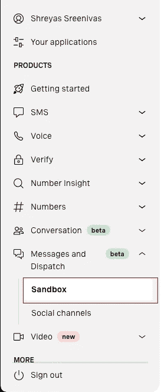
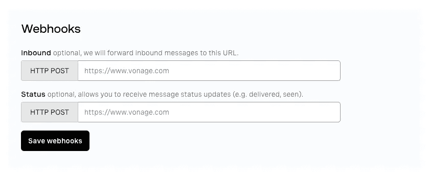

# 构建一个 WhatsApp 和 Messenger GraphQL 机器人来查找医院床位

> 原文：<https://levelup.gitconnected.com/build-a-whatsapp-and-messenger-graphql-bot-to-find-hospital-beds-a30cbaaf8261>

COVID 影响了我们所有人，但有些人比其他人影响更大。人们曾经面临并将继续面临的一个主要问题是医院床位的短缺。几个月前，我创建了一个 [GraphQL API，它返回印度多个城市和地区](https://bedav.org/playground)的床位可用性。这些数据是从官方网站上刮下来的，并被规范化为统一的格式，然后以 GraphQL API 的形式公开。

*请注意，该数据仅适用于印度的部分城市。*

您还可以在 [GraphQL Playground](https://bedav.org/playground) 中探索 API。

使用 Bedav API 和 Vonage Messages API，我们将构建一个聊天机器人，使用 JavaScript 与 WhatsApp 和 Facebook Messenger 一起工作。这个聊天机器人的功能是帮助用户在一个城市中搜索医院，找到一家有空床位的医院，并提供关于该医院的其他信息，如电话号码和地址。我们还将创建一个命令，用户可以用它来获得去医院的方向。

# 先决条件

1.  [节点和 npm](https://nodejs.org/en/download/)
2.  [一个 Vonage 账户](https://dashboard.nexmo.com/sign-up)

# 项目设置

尽管可以在[GitHub 库](https://github.com/shreyas44/bedav-vonage)中找到这方面的代码，但还是建议您遵循本教程，并将该库仅用作参考。

## 初始化 NPM 并安装依赖项

首先创建一个新文件夹，初始化 npm 并在其中创建一个`src`文件夹:

我们将使用 Express 创建我们的 webhooks 和服务器。 [Axios](https://www.npmjs.com/package/axios) 将用于向消息 API 发送请求，而`graphql-request`将用于向 Bedav GraphQL API 发送请求。您可以通过运行以下命令将它们与其他实用程序一起安装:

最后，将 Nodemon 作为一个 dev 依赖项安装，这样我们就不必在每次进行更改时重启节点服务器:

让我们也给我们的`package.json`添加一个脚本来启动我们的 Nodemon dev 服务器:

# 创建网页挂钩

在我们进入任何代码之前，什么是 webhooks？Webhooks 本质上是一个 URL，每次执行某个动作或事件时都会调用它。Webhooks 可以被认为类似于回调，然而，它们最常用于分离和独立的应用程序之间的交互。在我们的例子中，我们需要公开两个 webhooks:一个在用户发送消息时触发，另一个在来自 API 的消息有状态更新时触发(例如，当用户阅读您发送的消息时)。

首先，让我们在`src/app.js`中设置 Express，这里有我们的主要 Express 应用程序和负责处理命令的主要函数:

接下来，让我们添加两个端点，一个用于消息 webhook，另一个用于状态 webhook:

# 安装和设置 Ngrok

Ngrok 让你通过使用一个临时的 URL 将你的 webhooks 暴露在互联网上来测试它们。要开始使用 ngrok，你可以去他们的网站[创建一个账户](https://ngrok.com/)。完成并登录后，您应该会在他们的仪表板上看到安装和连接您的帐户的说明。

现在我们已经安装并配置了 ngrok，让我们通过运行`npm run dev`来启动我们的开发服务器。通过运行`./ngrok http 3000`，使用 ngrok 为我们的本地服务器创建一个公共 URL。这个命令告诉 ngrok 为运行在`localhost:3000`上的服务器创建一个 HTTP 代理。

# 配置消息沙箱

登录到 Vonage 仪表板，前往*消息下的*沙箱*部分，发送*。

要创建 WhatsApp 沙盒，请在 WhatsApp 部分点击*添加到沙盒*。Vonage 沙盒需要验证您的身份，为此，您可以按照仪表板中给出的步骤进行操作。您可以按照类似的步骤为 Facebook Messenger 创建沙箱。

您现在已经成功激活了 WhatsApp 沙盒！但是等等，我们还没完呢。我们仍然需要为 Vonage 提供 webhooks 所在的 URL。如果您向下滚动沙盒页面，您应该会看到类似下面的 Webhooks 部分:

第一个是将位于路线`webhooks/inbound`上的`inbound` webhook，因此将该字段设置为`https://<your-ngrok-https-url>/webhooks/inbound`。类似地，将`status` webhook 的 URL 设置为`https://<your-ngrok-https-url>/webhooks/status`。我们现在已经完成了沙盒和测试环境的设置！

> 注意:每次重启 ngrok，你都会得到一个新的不同的 URL，你必须在 Vonage 仪表板中手动更改。

# 向用户发回消息

我们将需要一个助手函数，它将用于向用户发回消息。

首先，我们需要设置我们的 Vonage API 凭证，以便我们可以使用 Messages API。这些凭证将存储在环境变量中。在文件夹的根目录下创建一个`.env`文件。为了将环境变量加载到节点环境中，我们将使用`dotenv`包。添加下列字段:

完成后，将以下代码添加到`app.js`的顶部，以添加环境变量:

在`src`文件夹中创建一个名为`utils.js`的新文件。这将包含我们的实用功能，如格式化和发送消息给用户。

我们将请求 Messages REST API 发送一条消息。在消息沙箱的情况下，API 的 URL 将是`https://messages-sandbox.nexmo.com/v0.1/messages`。我们将使用 Axios 来发送请求。我们可以使用`auth`选项来添加我们的 API 凭证，如下所示:

消息类型是动态的，因为当用户请求去医院的方向时，我们将发送类型为`location`的消息。在 WhatsApp 上，类型为`location`的消息会附上谷歌地图上该地点的缩略图以及提供的姓名和地址。

# 创建命令

现在我们可以开始创建我们的命令了:

1.  `help` -获得所有可用命令的菜单
2.  `cities` -获取所有可用城市的列表
3.  `search <hospital-name> in <location>` -搜索特定位置的医院。例如，`search sakra in bangalore`在班加罗尔搜索名为 Sakra 的医院。
4.  `get directions to <hospital-id>` -使用特定 ID 获取去医院的路线。比如`get directions to 87`会发送 ID 为 87 的医院的位置。

# 入站消息处理程序

让我们创建一个在`/webhooks/inbound`处理对`inbound` webhook 的请求的函数。这个函数解析用户发送的消息，并将消息传递给用户试图使用的命令的处理程序。它发回适当的消息并返回状态代码 200。

> 注意，webhook 必须用状态码 200 来响应，否则 Messages API 将继续向 webhook 发送请求，直到它得到 200 响应。

我们使用正则表达式来检查用户是否试图使用`search`或`directions`命令，然后将消息传递给适当的处理程序。如果消息是`help`、`hi`或`hello`，则向用户发送帮助消息。如果消息是`cities`，则将可用城市列表发送给用户。最后，如果消息与任何命令都不匹配，将向用户发送一条无效消息。

现在，让我们修改入站 webhook 端点处理程序以使用`handleInbound`函数。

# 帮助和欢迎命令

当用户第一次给我们的服务发消息时，我们需要一条消息来问候他们。这个消息应该包含关于我们的机器人做什么和可以使用的不同命令的信息。我们还需要一条帮助消息，每当用户不知道该做什么并键入`help`时，就会发送这条消息。这些消息可以是相似的。

Bedav API 只有某些地区的医院信息。我们还需要一条消息来给出信息可用的地区列表。

如在`handleInbound`函数中实现的，当用户键入 *hi* 、 *hello* 或 *help* 时，发送帮助消息，当用户键入*city*时，发送关于可用城市的消息。

因为这两个消息都是常量，所以我们可以在顶层创建一个常量对象来定义所有的固定消息。我们还使用`outdent`删除字符串中多余的空格，这些空格在代码中应该是缩进的。将代码追加到 *utils.js* :

# 设置 GraphQL 客户端

为了简化对 GraphQL API 的查询，我们将使用`graphql-request`库。为了设置 GraphQL 客户端，我们创建了一个`GraphQLClient`实例，并提供了 GraphQL API 的 URL。

# 创建一些实用函数

API 文档中对`hospitalId`字段的描述中提到，这是一个 Base64 编码的字符串，可以解码成`Hospital:<hospitalId>`，其中`hospitalId`是医院唯一的整数。出于您将在下一节中看到的原因，让我们创建两个实用函数:一个用于获取医院 ID 的号码，另一个用于将一个整数编码成形式为`Hospital:<hospitalId>`的 Base64 字符串。我们将使用之前添加到项目中的`js-base64`库来处理`base64`编码的字符串。

# 搜索命令

## 格式化字符串的实用函数

让我们再创建两个实用函数来格式化医院数据，一个用于格式化单个医院，另一个使用该函数来格式化一组医院。

不是每个医院都有 ICU、HDU 和普通病房的床位，也不是所有医院都有氧气和呼吸机。如果医院没有这些可用的，我们可以从消息中省略这些信息。如果可用总量为零或可用字段的值为空，则医院没有特定类型的可用床位、氧气或呼吸机。

我们还打印医院 ID，因为用户必须在 get directions 命令中提供医院的 ID。我们还向用户显示了括号中的床位占用百分比。

如果没有床、呼吸机或氧气，则仍留有空白行。为了解决这个问题，我们创建了另一个助手函数来删除这些空行。

为了检查空行，我们使用一个简短的正则表达式来检查该行是否有多个空格字符:

接下来，创建用于格式化医院列表的函数，方法是遍历所有医院，获取该医院的格式化字符串，并在每个医院之间添加一个空行:

## 命令处理程序

所有的 GraphQL 查询都将存储在`src`文件夹中的`queries.js`文件中。

我们使用下面的 GraphQL 查询来搜索某个位置的医院，并检索所需的数据。locality 字段的`name`参数用于告诉 API 我们正在查询哪个位置的数据。`hospitals`字段的`first`参数指定我们希望 API 返回多少家医院，而`searchQuery`参数提供搜索查询。

> 注意，我们不需要用`gql`标签包装我们的 GraphQL 查询。但是，使用正确的扩展和工具，我们可以得到一些漂亮的语法高亮和类型检查。

接下来，我们需要将位置名称映射到形式为`<city/district_name>-<state_name>`的`locality`字段的`name`参数。[从`city/district`到地区`name`的映射](https://bedav.org/locality_mapping.json)可以用 JavaScript 转换成下面的对象:

用户为搜索某个位置的医院而输入的文本将采用以下格式。让我们创建`handleSearch`函数，它从用户的消息中获取搜索查询和位置。该函数负责运行搜索查询并将适当的响应发送回用户:

# 获取方向命令

剩下要实现的最后一个命令是 get directions 命令。命令的格式是`get directions to <hospital-id>`。

首先，创建将获取医院信息的查询，该信息是向用户发送医院位置所必需的:

现在，让我们创建一个`handleDirections`函数，它将根据用户的请求向医院发送路线。如果用户正在使用 WhatsApp，我们会发送一条类型为`location`的消息，其中包含医院的名称和地址。由于 Messenger 上没有类型为`location`的消息，我们发送类型为`text`的消息，其中包含一个指向医院位置的 Google Maps 链接:

就这样，我们结束了！你可以在沙盒中自己尝试所有的命令，它应该看起来像下面这样！

# 下一步是什么

*   现在，我们的 webhook 对整个互联网开放。我们需要一种方法来确保只有 Vonage 消息 API 可以访问端点。阅读更多关于使用 JWT 令牌限制访问的信息。
*   如果你对机器学习感兴趣，你可以使用自然语言处理让机器人使用起来更自然。
*   在获取路线命令中使用医院 ID 不是最佳的用户体验。取而代之的是，尝试执行一个命令，让用户输入他想去的医院的名称。如果有多家医院名称相似，则返回一个医院列表及其 ID，并要求用户输入他们想要获取路线的医院的 ID。

教程的最终代码可以在 GitHub 上找到[。](https://github.com/shreyas44/bedav-vonage)

*最初发布于*[*https://learn . vonage . com/blog/2021/03/25/build-a-whatsapp-and-messenger-graph QL-bot-to-find-hospital-beds/*](https://learn.vonage.com/blog/2021/03/25/build-a-whatsapp-and-messenger-graphql-bot-to-find-hospital-beds/)