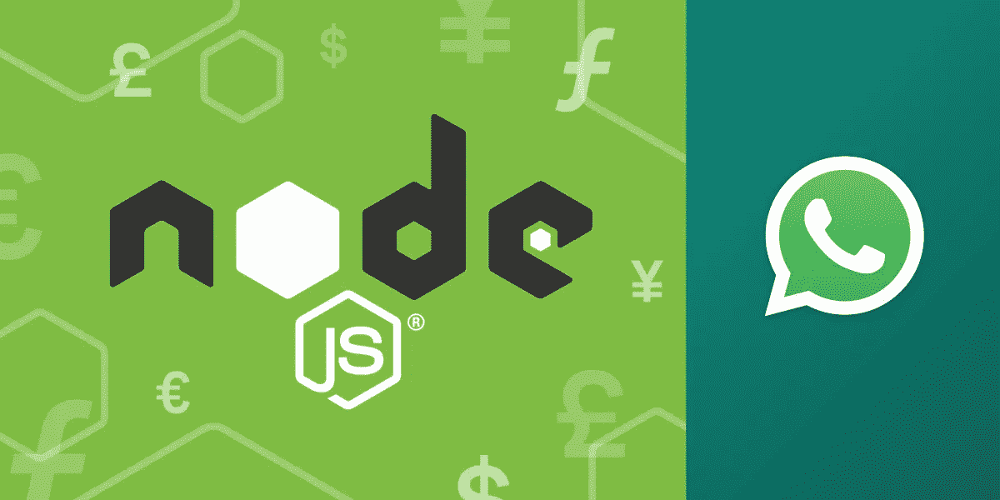
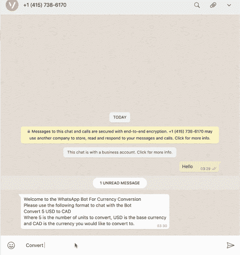
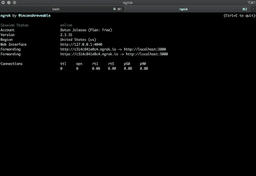
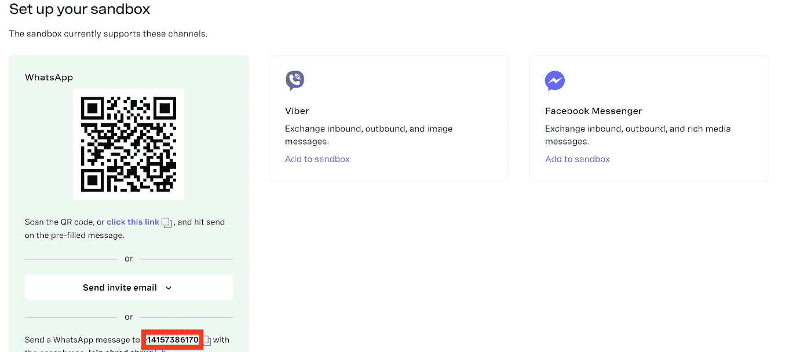
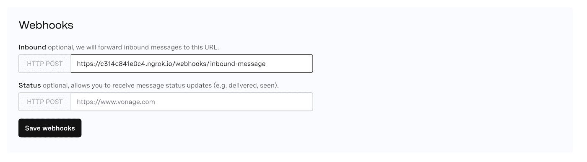

# 用 Node.js 构建一个 WhatsApp 货币转换 Bot

> 原文：<https://levelup.gitconnected.com/build-a-whatsapp-currency-conversion-bot-with-node-js-e4f458d292e9>

在本教程中，我们将了解如何使用 Node.js & Vonage 构建一个简单的 WhatsApp 聊天机器人。机器人将负责将基础货币中的任何给定数量的单位转换为首选货币中的等值货币。

该机器人将使用 Vonage 的[消息 API](https://developer.nexmo.com/messages/overview) 和节点框架 [Express](https://expressjs.com/) 构建。

这里有一个我和机器人聊天的例子:

# 先决条件

*   节点. js
*   Ngrok 允许你将你的本地网络服务器暴露在互联网上。要了解更多关于如何用 Ngrok 设置您的本地环境，您可以[查看我们的文档](https://developer.nexmo.com/tools/ngrok)。
*   要么是 WhatsApp 商业账户，要么是设置 Messages API 沙箱，就像我们在本教程中将要做的那样，将号码加入白名单。

# Vonage API 帐户

要完成本教程，您将需要一个 [Vonage API 帐户](http://developer.nexmo.com/ed?c=blog_text&ct=2020-09-09-build-a-whatsapp-currency-conversion-bot-with-node-js)。如果你还没有，你可以今天就[注册](http://developer.nexmo.com/ed?c=blog_text&ct=2020-09-09-build-a-whatsapp-currency-conversion-bot-with-node-js)并开始用免费信用点数进行构建。一旦你有了一个帐户，你可以在 [Vonage API 仪表板](http://developer.nexmo.com/ed?c=blog_text&ct=2020-09-09-build-a-whatsapp-currency-conversion-bot-with-node-js)的顶部找到你的 API 密匙和 API 秘密。

首先将存储库克隆到您的本地机器:[https://github.com/Dotunj/vonage-whatsapp-bot](https://github.com/Dotunj/vonage-whatsapp-bot)。

接下来`cd`进入项目的目录，运行下面的命令来安装项目的依赖项:

# 建造机器人

每当我们的 Bot 在 WhatsApp 上收到消息时，Vonage 都会向一个端点发出 HTTP Post 请求。该请求将包含一个消息负载。

上面，我们在`/webhooks/inbound-message`定义了一个路由，它使用 Node.js 事件模块发出`inbound-message`事件，然后向 Vonage 返回 200 响应。

Node.js 事件模块包括用于引发和处理事件的`EventEmitter`类。你可以在 Node.js [这里](https://blog.logrocket.com/handling-and-dispatching-events-with-node-js/)了解更多关于处理和调度事件的信息。

每次发出`inbound-message`事件时，也会触发`eventEmitter.on()`方法。该函数注册了一个监听器函数，该函数简单地调用了传入消息有效负载的`performCurrencyConversion()`方法。

`standardResponse`功能是一个通用的响应，告知用户如何与机器人通信。

`performCurrencyConversion()`方法负责解密发送给机器人的消息内容，并将响应发送回用户。

使用`split()`将接收到的消息内容转换成一个数组。根据我们商定的消息格式，数组中包含的项目数应该是 5。

如果在消息内容被拆分成一个数组之后，该数组中包含的项目少于 5 个，那么将向用户发回一个标准响应，通知他们如何使用 Bot。

如果消息内容的长度检查成功，我们现在可以安全地假设数组的第 1、第 2 和第 4 个索引中包含的项目将是单位、基础货币和您想要转换的货币。

# 用比特币基地转换

现在我们已经有了基础货币和您要转换的货币，我们可以进行检查以确保这些货币代码是有效的，并且受[比特币基地](https://www.coinbase.com/)的支持。

比特币基地 API 提供了处理货币和汇率的端点。你可以在这里阅读更多关于比特币基地 API 的信息。

这就是`getCurrencyCode()`函数的用武之地。

它接受`baseCurrency`和`toCurrency`，然后对`https://api.coinbase.com/v2/currencies`进行 API 调用，以获取所有受支持货币的列表。然后进行检查，以确保在支持的货币列表中可以找到`baseCurrency`和`toCurrency`代码。

如果找不到或找不到其中任何一个，则向用户发回响应，通知他们提供有效的货币代码。

接下来，在用`getCurrencyCode()`函数验证货币代码之后，调用`getBaseExchangeRate()`方法。

这个方法也接受`baseCurrency`和`toCurrency`。

然后对`https://api.coinbase.com/v2/exchange-rates`端点进行 API 调用，将`baseCurrency`代码作为`currency`查询参数的值进行传递。

此端点返回一个基础货币单位的汇率。接下来，我们要做的就是返回`toCurrency`的等价利率。

下面是使用 USD 作为`baseCurrency`调用端点时收到的响应示例:

在获得基本汇率后，我们所要做的就是将单位乘以基本汇率，以获得用户试图转换成的货币的等值金额，然后将该值四舍五入到两位小数。然后向用户发回一个响应，通知他们汇率。

`sendWhatsAppMessage()`函数通过 WhatsApp 向用户发回响应。

向指定了`from`、`to`和`message`字段的`https://messages-sandbox.nexmo.com/v0.1/messages`端点发出 HTTP POST 请求。

`from`字段是 WhatsApp API 沙箱号。我将很快向您展示如何获得它，我们将把它作为环境变量的一部分添加进来。`to`字段是发送初始消息的号码，它是从消息有效载荷中获得的。

为了使用 API 进行身份验证，我们指定了我们的 Vonage API 密钥以及秘密密钥。同样，我们将很快获得这些值，并将它们作为环境变量的一部分添加进来。

# 设置 Ngrok

因为我们的应用程序目前是本地的，所以无论何时我们的 Bot 收到消息，Vonage 都无法向我们刚刚创建的端点发送 POST 请求。我们可以使用 Ngrok 来建立一个临时的公共 URL，这样我们的应用程序就可以通过 web 访问了。

要启动该应用程序，请从终端运行以下命令:

在应用程序运行时，在第二个终端窗口上运行以下命令来启动 ngrok:

在这个命令中，`3000`指的是您的 Express 应用程序当前正在监听的端口。

现在，您应该会看到一个类似于下图的屏幕:

请注意第二个转发 URL，因为这将用于配置我们的 Vonage Webhook。

我们将在这个演示中使用 [Vonage WhatsApp 沙盒](https://developer.nexmo.com/messages/concepts/messages-api-sandbox)，因为在你能够在生产中使用他们的 API 之前，你的业务需要得到 WhatsApp 的批准。

去 Messages API 沙箱把你的 WhatsApp 号码加入白名单，这样我们就可以测试这个机器人了。

要添加您的 WhatsApp 号码，以便您可以开始接收和发送消息，您可以通过 WhatsApp 扫描二维码，或者点击显示给您的链接，然后点击预填消息上的发送。记下 WhatsApp 沙盒的编号，因为我们很快就会将它添加到我们的环境变量中。

接下来，在同一个屏幕上，通过粘贴我们前面提到的 Ngrok URL 来配置入站 Webhook 的 URL。不要忘记在 URL 的末尾添加`/webhooks/inbound-message`。

前往你的[仪表板设置](https://dashboard.nexmo.com)页面，记下你的`API Key`和`API Secret`。

# 添加环境变量

既然我们已经注意到了我们的 Bot 将需要的所有环境变量及其值，现在我们可以将它们添加到我们的项目中。从项目目录的根目录中，创建一个`.env`文件，并添加以下值:

不要忘记用我们前面提到的实际值替换 xxxx。

# 测试

你可以通过使用 WhatsApp 从智能手机向它发送消息，来测试这个机器人的功能。

# 结论

在本教程中，我们看到了如何构建一个简单的 WhatsApp 聊天机器人，使用比特币基地提供的汇率进行货币转换。本教程可以作为学习如何使用 Vonage 的 messages API 通过 WhatsApp 收发消息的入门指南。

# 推荐进一步阅读:

*   [使用 WhatsApp 建立简单的客户支持渠道](https://www.nexmo.com/blog/2020/08/12/build-a-simple-customer-support-channel-with-whatsapp)
*   [用 Deno 和 Azure 搭建语音翻译 App](https://www.nexmo.com/blog/2020/06/09/build-a-speech-translation-app-on-deno-with-azure-and-vonage)
*   [如何用 Node.js 发送 WhatsApp 消息](https://www.nexmo.com/blog/2020/04/15/send-a-whatsapp-message-with-node-dr)
*   [用 Node.js 到处传递消息](https://www.nexmo.com/blog/2020/05/27/messaging-everywhere-with-node-dr)

*原载于*[*https://www . NEX mo . com/blog/2020/09/09/build-a-whatsapp-currency-conversion-bot-with-node-js*](https://www.nexmo.com/blog/2020/09/09/build-a-whatsapp-currency-conversion-bot-with-node-js)