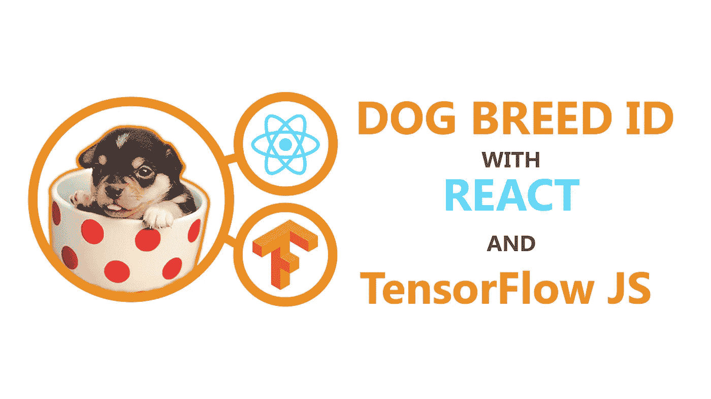
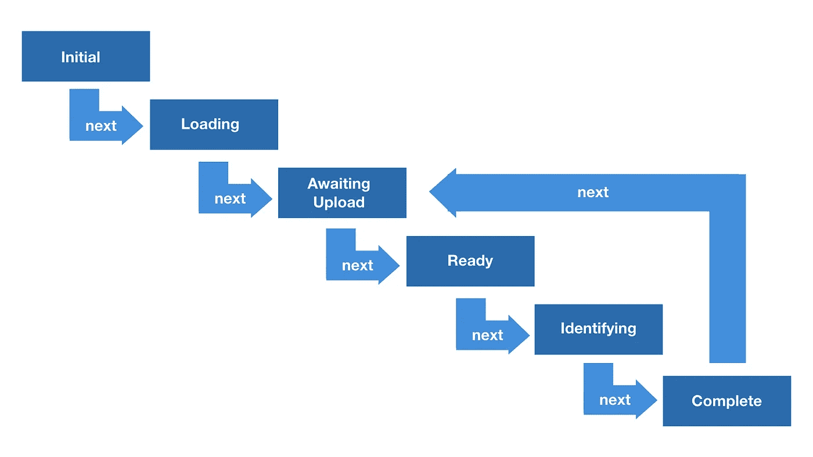

# 用 React 和 TensorFlow JS 在几分钟内构建一个狗分类器

> 原文：<https://levelup.gitconnected.com/build-ad-dog-classifier-with-react-and-tensorflow-js-in-minutes-f08e98608a65>



如果你喜欢通过视频学习，请点击这里查看我的 Youtube 教程:

您可以在这里找到完整的代码:

[https://github.com/jonnyk20/dogscope-react](https://github.com/jonnyk20/dogscope-react)

想象一下玩 Pokemon Go，但不是抓 Pokemon，而是抓狗…在现实生活中。

这是我在构建 [Dog Scope](https://apps.apple.com/us/app/dog-scope/id1469847835) 时想到的奇怪想法，尽管这是一个毫无用处的应用程序，但它是我的第一个机器学习项目，它帮助我理解了使用 Tensorflow 等机器学习工具来识别使用移动设备的物体(和动物)是多么容易。

为了向您展示它有多简单，请允许我带您了解如何构建类似的东西，一个在 React 应用程序中使用 Tensorflow JS 的狗品种分类器。

本教程是为那些至少对 React 有一点熟悉的人准备的，希望对 ES6 语法和 React 钩子也有所了解。

此外，如果不这样做，虽然您不会太费劲，但是如果您熟悉 reducers 和有限状态机，您会更好地理解所使用的模式。

让我们开始吧…

# 设置

**设置 React App**
我们将使用 [create-react-app](https://github.com/facebook/create-react-app) 快速启动并运行。
`npx create-react-app dog-scope`

**安装包**
我们需要两个额外的包，一个用于 TensorFlow.js，另一个用于我们将用来分类的模型 MobileNet。

```
npm i -S [@tensorflow/tfjs](http://twitter.com/tensorflow/tfjs) [@tensorflow](http://twitter.com/tensorflow)-models/mobilenet 
```

然后，您可以启动 react-app 以确保它正在工作:

```
npm run start
```

**清除样板文件**
我们希望从一个空白的石板开始，首先清除`src/App.js`以便它返回一个空的 div:

```
import React from ‘react’;
import ‘./App.css’;const App = () => {
 return <div></div>;
}export default App;
```

至于 CSS，我们也想替换它。我这里有一些基本的风格，你可以从它们开始，但是你可以根据自己的喜好随意改变它们。我只建议不要改变`input`的风格，稍后我会解释为什么。

```
body {
 color: white;
 background: black;
}div {
 display: flex;
 flex-direction: column;
 text-align: center;
 align-items: center;
 padding: 30px;
}input {
 width: 0.1px;
 height: 0.1px;
 opacity: 0;
 overflow: hidden;
 position: absolute;
 z-index: -1;
}button,
label,
ul {
 width: 300px;
 box-sizing: border-box;
 border: solid 1px white;
 background: black;
 color: white;
 font-size: 24px;
 margin: auto;
 padding: 10px;
}img {
 width: 300px;
 margin-bottom: 25px;
}ul {
 list-style: none;
 padding: 10px;
 margin-bottom: 25px;
}
```

# **布置状态机**

这是我们应用程序的流程，由 6 个状态表示。



这是一个相对简单的流程，但是因为会有特定于特定状态的特定 UI，所以我们不想用一堆布尔逻辑来阻塞我们的组件，比如:

```
const showImage = modelLoaded && imageUploaded || identificationComplete
```

我们不需要为每个变量 UI 元素编写这样的表达式，而是要构建一个简单的状态机，它包含描述什么 UI 是状态的一部分的属性，以及控制一个状态如何转换到另一个状态的规则。让我们在组件上声明我们的状态:

```
const stateMachine = {
 initial: “initial”,
 states: {
 initial: { on: { next: “loadingModel”, text: ‘Load Model’ } },
 loadingModel: { on: { next: “modelReady”, text: ‘Loading Model’ } },
 modelReady: { on: { next: “imageReady”, text: ‘Upload Image’ } },
 imageReady: { on: { next: “identifying” }, text: ‘Identify Breed’, showImage: true },
 identifying: { on: { next: “complete”, text: ‘Identifying…’} },
 complete: { on: { next: “modelReady” }, text: ‘Reset’, showImage: true, showResults: true }
 }
};
```

我们的状态机有以下内容:

*   **陈述:**我们的应用程序可以处于的 6 个阶段，每个阶段都可以有具体的特征:(例如展示和图像)。我们的应用程序，在任何给定的时刻，只能占据一个状态
*   **转换:**可以触发我们的应用程序从一种状态转移到另一种状态的事件。谢天谢地，我们简单的应用程序只需要一个事件，“下一个”。每个状态的`on.next`值是当应用程序处于该状态时，每当触发“下一个”事件时，应用程序将转换到的状态的名称。

我们将使用一个 reducer 在每次事件触发时返回一个新的状态。对于任何使用过 redux 的人来说，这看起来非常熟悉。在您的`stateMachine`对象的正下方添加以下函数；

```
const reducer = (currentState, event) =>
 stateMachine.states[currentState].on[event] || stateMachine.initial;
```

每次事件被触发时，它都会经过 reducer，导致基于映射确定的规则返回一个新的状态。例如，如果您当前的状态是`loadingModel`，并且触发了`next`事件，那么将返回(并因此转换到)的状态是`stateMachine.states[‘loadingModel’].on[‘next’]`，也就是`modelReady`。

我们将利用 React 的`useReducer`钩子将它连接到我们的组件，所以让我们导入它。

```
import React, { useReducer } from “react”;
```

然后，在`App`组件体内添加该行；

```
const [appState, dispatch] = useReducer(reducer, stateMachine.initial);
```

`appState`将是一个表示当前应用程序状态的字符串，而`dispatch`是一个将事件发送到我们的 reducer 中的函数，目的是触发转换并返回一个新状态。让我们确认一下，但是通过点击按钮触发`next`事件来测试一下。在空的`div`内，添加以下内容:

```
<button onClick={() => dispatch(“next”)}>{appState}</button>
```

按钮应该首先显示`initial`，当你点击它时，它应该改变到不同的状态，一直到`complete`，然后回到`modelReady`。

在继续之前，让我们将`next`事件保存到一个函数中，以便于参考。将这一行添加到`useReducer`调用的正下方。

```
const next = () => dispatch(“next”)
```

# 添加功能

既然我们的状态已经被恰当地布置好了，我们可以给每个状态添加一些真正的功能了。例如，按钮应该显示不同的文本和不同的行为。将这些信息保存在上面声明的状态机对象中是理想的，但是因为其中一些函数使用了`dispatch`，所以我将创建另一个对象来避免循环引用。在我们的函数体中，让我们添加以下对象:

```
const buttonProps = {
 initial: { text: “Load Model”, action: () => {} },
 loadingModel: { text: “Loading Model…”, action: () => {} },
 modelReady: { text: “Upload Image”, action: () => {} },
 imageReady: { text: “Identify Breed”, action: () => {} },
 identifying: { text: “Identifying…”, action: () => {} },
 complete: { text: “Reset”, action: () => {} }
 };
```

`text`属性只是文本，所以从技术上讲，它们可以放入组件外的`stateMachine`对象中，但是为了清楚起见，我在这里添加了它们，以便将按钮相关的属性放在一个地方。

现在，我们的按钮可以更改为使用这些动态属性:

```
<button onClick={buttonProps[appState].action}>
 {buttonProps[appState].text}
</button>
```

如果你现在点击它，什么都不会改变。我们需要为每个状态添加相关的功能。

**1。初始**
初始按钮点击应该触发模型加载。所以我们需要:
—调用`next`事件转换到`modelLoading`状态
—加载模型
—保存到组件状态
—调用‘下一个事件转换到

我们将需要使用`useState`钩子来存储模型，所以首先让我们在文件的顶部导入它。

```
import React, { useReducer, useState } from “react”;
```

我们首先还需要 MobileNet 来下载模型。在 React 导入的正下方添加下面一行。这个文件中不需要导入`[@tensorflow/tfjs](http://twitter.com/tensorflow/tfjs)`。

```
import * as mobilenet from ‘[@tensorflow](http://twitter.com/tensorflow)-models/mobilenet’;
```

然后，在组件主体内部，声明我们将用于存储模型的 hook。将它添加到`next`函数声明的正下方。

```
const [model, setModel] = useState(null)
```

现在我们拥有了`load`功能所需的一切。下面我们来创建`useState`调用。您会注意到函数体的每一行是如何与我们上面概述的 4 个步骤之一相对应的

```
const load = async () => {
 next()
 const mobilenetModel = await mobilenet.load();
 setModel(mobilenetModel)
 next()
}
```

剩下要做的最后一件事是将`load`函数添加到`buttonProps`中相应的状态对象中。

```
const buttonProps = {
 // …
 initial: { text: ‘Load Model’, action: load }
 // …
}
```

**2。loadingModel**
在这个状态下没有任何动作要做，因此没有代码要写！

**3。这是用户提交国防部图像的阶段。一旦上传，需要发生以下情况:
—提示用户上传图像
—一旦上传，我们将其转换为对象 url
—使用所述对象 url 作为`img`文件的`src`属性以显示预览
—调用`next`以转换到`imageReady`状态**

对于这一步，我们需要添加几个 UI 元素，一个文件输入和一个图像。让我们从输入开始。因为文件输入很难以一种可靠的方式进行样式化，所以我们在这里添加的内容被 css 隐藏了(这就是为什么你可能不想改变这一部分)。要触发输入，我们只需给它附加一个 ref，使用它并在调用我们的`load`函数时触发一个`click`事件。

首先，我们回到我们的`React`进口，加上`useRef`；

```
import React, { useReducer, useState, useRef } from “react”;
```

然后，在组件主体的顶部附近(在其他钩子下面调用也可以)，声明您的输入 ref。

```
const inputRef = useRef();
```

现在让我们添加输入元素。你可以把它放在`div`里面，就在`button`的下面。

```
<input type=”file” accept=”image/*” capture=”camera” ref={inputRef}></input>
```

属性将在移动设备上打开我们的相机。

在编写处理上传文件的函数之前，我们需要一个
钩子来存储我们将从图像创建的文件 URL。让我们将以下内容添加到函数体的挂钩中:

```
const [imageUrl, setImageUrl] = useState(null);
```

现在让我们创建`handleUpload`函数。上传的文件将是一个数组，但是我们只能处理一个图像，所以我们将提取数组中的第一个项目。将此函数添加到组件主体。

```
const handleUpload = event => {
 const { files } = event.target;
 if (files.length > 0) {
 const url = URL.createObjectURL(files[0])
 setImageUrl(url)
 next();
 }
}
```

然后，我们可以将该函数作为`onChange`属性添加到输入中:

```
<input
 /// … props we added before
 onChange={handleUpload}
/>
```

`handleUpload`由用户提交文件触发，但文件输入提示本身需要打开。因为我们的 css，input 元素不可见但仍然存在，所以我们可以用它的 ref 用 javascript 点击’它；

在你的`actionButton`对象里。将以下内容添加到`modelReady`状态对象中:

```
const actionButton = {
 // …
 modelReady: {
 text: ‘Upload Image’,
 action: () => inputRef.current.click()
 }
 // …
}
```

这一步的最后一部分是显示图像的预览。以便用户可以看到它被正确上传。为此，我们将向我们的 jsx 添加一个`img`元素，并将`src`设置为我们保存到状态的`imageUrl`。我们还将在分类步骤中使用这个图像，因此我们需要一个 ref 来方便地访问它。在另一个 ref 声明下面添加下面一行:

```
const imageRef = useRef();
```

我们只想在某些状态下显示此元素。幸运的是，我们可以通过引用之前在`stateMachine`状态中定义的`showImage`属性来避免布尔汤。

让我们通过在组件的`return`语句上方添加以下内容来轻松访问它；

```
const { showImage = false } = stateMachine.states[appState]
```

现在在`button`上方的`div`内添加图像:

```
{ showImage &&
 
}
```

此时，您应该能够加载您的应用程序，点击上传图像，然后在完成后看到显示的图像。

下一步是最重要的部分，实际上也是最容易的。我们终于可以使用一些机器学习魔法了。

**4。imageReady**

首先，让我们添加一些状态来显示我们的结果。使用其他挂钩将以下内容添加到函数体中:

```
const [results, setResults] = useState([])
```

现在，让我们编写我们的`identify`函数:

```
const identify = async () => {
 next();
 const results = await model.classify(imageRef.current);
 setResults(results)
 next();
}
```

…并将其添加到我们的`actionButton`对象中:

```
const actionButton = { 
 // …
 identify: { text: ‘identify’, action: identify }
 // …
}
```

你可以重新加载应用程序并尝试点击它。从一个简单的`console.log`测试中，我们可以看到我们的结果看起来像这样。

```
[
 { className: ‘labrador’, probability: 0.353224 }
 { className: ‘corgi’, probability: 0.1242244 }
]
```

我们希望将每个对象转换成一个用户友好的列表项，所以让我们创建一个函数来完成这个任务。在组件外部，添加以下函数:

```
const formatResult = ({ className, probability}) => (
 <li key={className}>
 {`${className}: %${(probability * 100).toFixed(2)}`}
 </li>
)
```

这很好，但是用户看不到任何东西，所以让我们改变它。首先，让我们在获得`showImage`的同一行中从`stateMachine`中取出`showResults`属性:

```
const {
 showImage = false,
 showResults = false
} = stateMachine.states[appState];
```

现在我们的组件可以很容易地知道何时显示结果，让我们添加一些 jsx 来允许它这样做。将此`ul`添加到图像正下方。

```
{ 
 showResults && (
 <ul>{results.map(formatResult)}</ul>
 )
}
```

**5。识别**
——在这个阶段不需要任何操作，所以同样没有代码要写

**6。完成**
这是最后一步，也是最简单的一步。这里需要做的只是重置，包括以下内容:
—清除结果
—清除图像 url
—调用`next`转换到`modelReady`(用户将能够上传新图像)
将此函数添加到组件主体:

```
const reset = () => {
 setResults([])
 setImageUrl(null)
 next();
}
```

最后，将最后一个函数添加到`actionButton`:

```
const actionButton = { 
 // …
 complete: { text: ‘Reset’, action: reset }
 // …
}
```

你现在应该能够上传照片，分类狗品种，并在屏幕上看到结果，重置，然后上传和分类新的图片。

## 奖励步骤

为了保持重点，我在本教程中省略了一些内容，但是您可能需要考虑:

*   **错误处理:**如果模型没有返回结果，或者下载失败会发生什么。
*   **附加状态转换。**能够从任何状态‘重置’到开始将是有用的，而不仅仅是最后一个状态。
*   **部署。**在你的电脑上安装一个动物识别应用程序有什么意义？您需要部署它，以便可以在现实世界中使用它。部署，因为我们使用了`create-react-app`，有无数种方法可以让你的应用在几分钟内部署完毕。这里有一篇[伟大的文章](https://blog.bitsrc.io/8-react-application-deployment-and-hosting-options-for-2019-ab4d668309fd)，作者是[wose Lotanna](https://medium.com/u/cb0ab32a7733?source=post_page-----f08e98608a65--------------------------------)，它走过了其中的 8 条，所以你可以挑选。

如果您像我一样选择部署到 Heroku，请遵循以下步骤:

*   [创建一个 Heroku 账号](https://www.heroku.com/)
*   [安装并登录 heroku CLI](https://devcenter.heroku.com/articles/heroku-cli)
*   在应用程序的目录中运行以下命令:

```
git init
heroku create -b [https://github.com/mars/create-react-app-buildpack.git](https://github.com/mars/create-react-app-buildpack.git)
git add .
git commit -m “react-create-app on Heroku”
git push heroku master
heroku open
```

我们正在使用的模型 mobilenet 不仅可以识别狗的种类，还可以识别大约 1000 种不同的动物和物体，因此它是图像分类应用程序的一个很好的工具。然而，可能有你想要分类的物体和动物不在列表中。我正在编写一个教程，介绍如何构建和训练定制的机器学习模型，所以请关注我(在这里或者在 Youtube 或 Twitter 上)，这样你就可以第一个知道它什么时候准备好了。

同时，如果你有任何问题，请随时联系我。感谢阅读！