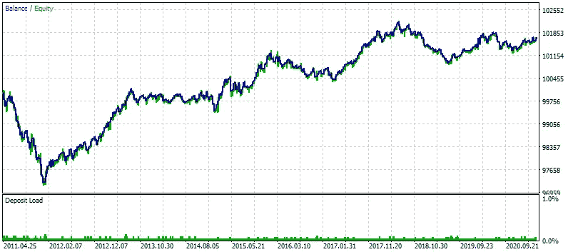
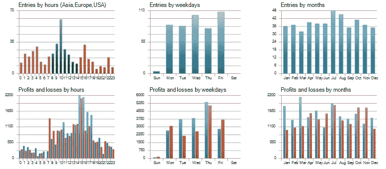
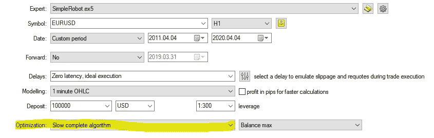
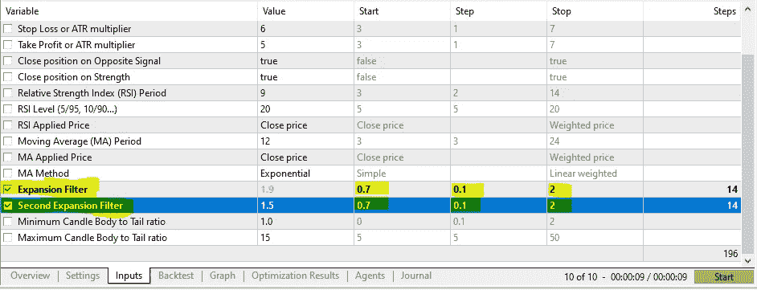
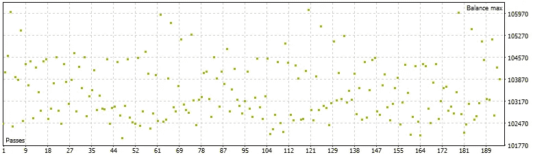
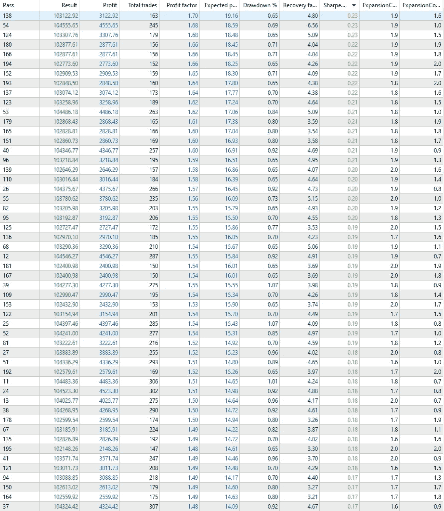
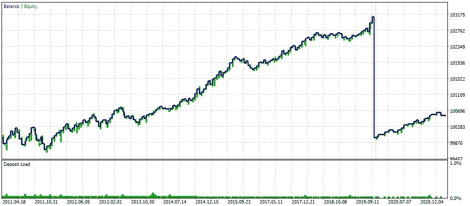
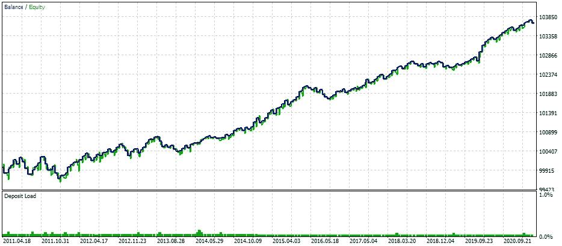

# 用 C#构建生成量化交易策略的人工智能(第 2 部分)

> 原文：<https://levelup.gitconnected.com/build-ai-for-generating-quant-trading-strategies-in-c-part-2-87cef6fccc3c>

这是系列教程的第二篇:构建自动生成 quant 交易策略的人工智能，你可以查看下面的其他文章:

 [## 用 C#构建生成量化交易策略的人工智能(第 1 部分)

### 让我以一个问题开始:你听说过 Citadel LLC，文艺复兴科技，两个适马，或者，也许，D. E…

levelup.gitconnected.com](/part-one-building-ai-for-generating-quant-trading-strategies-in-c-8cc2afb88955)  [## 用 C#构建生成量化交易策略的人工智能(第 3 部分)

### 这是系列教程的第三篇文章:为自动生成 quant 交易策略构建人工智能，为…

levelup.gitconnected.com](/build-ai-for-generating-quant-trading-strategies-in-c-part-3-da04c0fdd90f) 

我们已经在 Metatrader 5 交易终端(MQL5 语言)中编写了一个基本策略，并在历史价格数据上进行了测试，现在让我们更深入地研究所有优化和验证策略可靠性的最佳实践。现在的策略非常基本，我们需要更多的数据点和外部输入参数，让我们添加一些:

这些外部输入参数让我们可以在不修改源代码的情况下更改/优化策略设置。在右侧，注释描述了每个输入的含义，如您所见，我们有 ATR、RSI 和 MA 指标的输入，让我们准备一些必要的变量来处理它们的值:

MQL4 语言有一种更简单的方法来使用函数的返回值获得指标值，但 MQL5 方法更有效，而且一旦一切都设置好了，首先我们需要在机器人启动时分配唯一的句柄，这发生在`OnInit()`函数中:

我们还需要在分配指示器句柄之前或之后，为我们的`CTrade`对象(`trade`)分配一个唯一的幻数，为此我们使用了之前创建的输入参数`MagicNumber`，这样我们可以在外部修改它，而无需修改源代码:

现在已经设置了指示符句柄，但是我们还没有处理指示符值，为此我们首先需要访问指示符并将所有值复制到相关的缓冲区数组，然后将缓冲区数组设置为序列，为了避免重复做同样的事情，我创建了一个简单的函数，只需一行代码就可以完成:

以及一些处理日常事务的附加功能:

最后一部分是使用所有这里面的一个交易逻辑(`OnTick()`函数)，让我们收集一切以便使进一步的访问尽可能简单:

现在，让我们使用这些数据点来定义购买和销售标准:

完整的源代码如下所示:

现在点击`F7`编译机器人，我们将在 MetaTrader 5 终端内部做更多的测试和优化…

使用默认参数对过去 10 年期间进行的第一次回溯测试如下所示:

# 最佳化

优化是尝试不同的输入参数组合，以找出潜在的最有利可图的组合。如果做得好，你可以相对较快地找到自动化策略的最佳设置，否则，机器人可能会在历史价格数据上显示出色的结果，在演示(纸质)或实时账户上显示糟糕的结果。如果你熟悉统计学，你就不太可能犯常见的错误，但是如果你不熟悉，这里有一个基本的清单:

*   如果你在 10 年内测试你的策略，总是在之前的 9 年或 8 年内优化它，留下最近/过去的 1-2 年左右只是为了验证，这被称为前瞻性测试。
*   确保你至少有 500-1000 笔假设交易(取决于策略)，否则优化毫无意义，完全是浪费时间！
*   一旦你为你的策略找到了最佳的设置，你应该验证这些设置在未来是否有效，而不仅仅是在一个优化的时间段。这就是我们保持不变的 1 或 2 年(远期测试期)派上用场的地方，用你刚刚发现的最佳设置测试机器人 1-2 年，你将得到的结果将最接近未来的真实交易结果。
*   前向和后向测试结果之间的相似性越大，就越好——你的策略就越可靠，并且从理论上讲，会持续更长时间。

为了优化策略的不同输入，进入策略测试器(`CTRL+R`)并更改最后一个参数(高亮显示)，如下所示:

然后转到策略输入所在的输入选项卡，选择要优化的输入，为每个输入设置起始值、步长值和终止值:

在本例中，起始值为 0.7，将按步长值递增，直到达到值 2(停止值)，每个输入产生 14 个不同的设置。

测试人员将用这些设置的总共 196 种组合(14)来测试您的策略，并向您显示结果，优化图如下所示:

和一个列表:

让我们选择具有最佳夏普比率的一个并进行测试—右键单击它，然后选择`Run Single Test,`这是对前 9 年的回溯测试，后面是对最近 1 年的前向测试:

让我们把这两个时期结合起来:

这种策略基本上检查所有的框，甚至更多:

*   正向测试成功确认了优化结果；
*   盈利期为 10 年，而不是几个月或几年；
*   前向测试结果不仅相似，而且比后向测试结果好得多——这是稳健性和巨大潜力的明显标志。
*   它很简单，没有过度优化和过度复杂，可能在所有市场条件下对所有经纪人和账户类型都有效；

# 风险免责声明:

> 就本教程而言，我不是一名合格的持牌投资顾问，也不提供个人投资建议，本文中提供的所有信息仅用于信息和教育目的。
> 
> *在做出任何和所有投资决定之前，进行自己的尽职调查，并咨询有执照的财务顾问。任何投资、交易、投机或基于本文中的任何信息做出的决定，无论是明示的还是暗示的，都由您自己承担风险，无论是财务风险还是其他风险。*
> 
> *交易(包括人工交易和算法交易)有很大的亏损风险，并不适合所有人。金融证券的估值可能会波动，因此，你可能会失去比你原来的投资更多。季节性和地缘政治事件的影响已经被计入市场价格。*
> 
> *杠杆交易意味着微小的市场波动将对您的交易账户产生巨大影响，这可能对您不利，导致巨大损失，也可能对您有利，导致巨大收益。*
> 
> 如果市场对你不利，你可能会遭受比你存入账户的金额更大的损失。

如果你喜欢这篇文章，请点击那个按钮，这样更多的人将能够找到它！

为了避免拿你自己的钱冒险，这里有一个为你注册提供无存款奖励的经纪人名单:

[**【140 美元来自 FBS**](https://fbs.com/promo/trade-100usd?ppu=193551) **:** 该经纪公司受 IFSC 监管，是历史最悠久的机构之一，自 2009 年开始运营。

**要求:**

*   注册一个有 140 美元的新账户
*   利用 1:500 的杠杆，让你的利润最大化
*   你可以提取所有利润

**可用市场:**加密货币、股票、差价合约、金属、商品、外汇

[**【tick mill】30 美元**](https://secure.tickmill.com/redirect/index.php?cii=15604&cis=1&lp=https%3A%2F%2Ftickmill.com%2Fpromotions%2Fwelcome-account%2F) :受 FSA 监管，该经纪商自 2015 年开始运营。

**要求:**

*   [用 30 美元注册一个新账户](https://secure.tickmill.com/redirect/index.php?cii=15604&cis=1&lp=https%3A%2F%2Ftickmill.com%2Fpromotions%2Fwelcome-account%2F)
*   使用高达 1:500 的杠杆来最大化您的利润
*   在 5 手交易后提取利润
*   最高取款金额是 300 美元

**可用市场:**股票指数，石油，贵金属，债券，外汇。

[**【Roboforex】30 美元**](http://www.roboforex.com/clients/promotions/welcome-program/?a=arag) :受 CySEC 和 IFSC 监管，Roboforex 自 2009 年开始运营，是当今交易者中最受欢迎和信任的经纪商之一。

**要求:**

*   [开立账户](http://www.roboforex.com/clients/promotions/welcome-program/?a=arag)并存入 10 美元以验证您的支付方式(可随时提取)并获得 30 美元作为礼物
*   **利润可无限制提取**
*   如果你交易了必要数量的手，你也可以提取 30 美元

**可用市场:**股票(所有纽交所、纳斯达克和美国证券交易所股票+德国和中国上市公司)、股票差价合约(所有股票的差价合约，*【美国上市股票每笔交易费 1.5 美元)*、指数、ETF、商品、金属、能源商品、加密货币、加密指数、外汇。

你想知道我是做什么的吗？我是 Proxify Network 的高级软件开发人员。

现在 Proxify 正在寻找新的开发人员，所以我想在这里分享一些我的经历——与我在职业生涯中尝试的其他事情相比:
1️⃣友好和专业的 Proxify 团队以及他们对每个候选人的关注程度
2️⃣招聘过程非常简单，可以充分展示你的技能
3️⃣，最重要的是，Proxify 是寻找远程工作的理想方式，有无数的项目和公司可供选择。

在这里申请加入我在 Proxify:[https://bit.ly/3hd64mN](https://bit.ly/3hd64mN)

**谢谢你，我希望能在教程的下一部分见到你:**

 [## 用 C#构建生成量化交易策略的人工智能(第 3 部分)

### 这是系列教程的第三篇文章:为自动生成 quant 交易策略构建人工智能，为…

levelup.gitconnected.com](/build-ai-for-generating-quant-trading-strategies-in-c-part-3-da04c0fdd90f) 

祝您愉快！