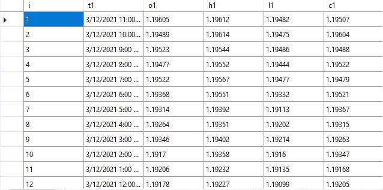
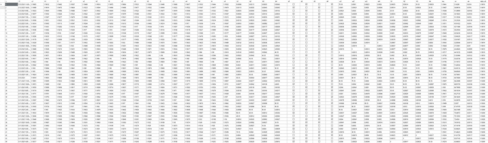

# 用 C#构建生成量化交易策略的人工智能(第 3 部分)

> 原文：<https://levelup.gitconnected.com/build-ai-for-generating-quant-trading-strategies-in-c-part-3-da04c0fdd90f>

T 这是系列教程的第三篇:构建自动生成 quant 交易策略的 AI，你可以查看下面的其他文章:

 [## 用 C#构建生成量化交易策略的人工智能(第 2 部分)

### 这是系列教程的第二篇:构建自动生成 quant 交易策略的人工智能…

levelup.gitconnected.com](/build-ai-for-generating-quant-trading-strategies-in-c-part-2-87cef6fccc3c)  [## 用 C#构建生成量化交易策略的人工智能(第 4 部分)

### 如何将 MetaTrader 5 的历史价格数据导出到 CSV？

turmanauli.medium.com](https://turmanauli.medium.com/build-ai-for-generating-quant-trading-strategies-in-c-part-4-cfb3024483d4) 

我们到底在哪里？嗯，我们已经建立了一个基本的 MetaTrader 5 机器人，对其进行了改进，并根据最佳实践使其更加健壮，这意味着，简而言之，机器人应该在真实的市场条件下表现得相当好，最大程度地减少我们不想要的惊喜。

我们可以使用额外的数据点来进一步改善逻辑，但这不是本文的目的，这是人工智能应该做的，因此我们将建立一个人工智能，它至少会复制我们在第二篇文章中所做的一切，这将使我们有机会使人工智能核心足够强大，以自动使用额外的数据点，并生成比我们更好的自动化交易系统。

下一步是用 C#创建一个`Tester` 类，测试人员将能够接受所有数据点，包括交易逻辑，复制 MetaTrader 5 策略测试程序并输出结果。我们的目标是让我们的`Tester`类输出与 MetaTrader 5 strategy tester 完全相同的结果。

我们为什么需要这个？因为人工智能应该能够测试和确认它生成的交易逻辑的盈利能力，并做出自己的相关决定，所以最终产品应该已经经过测试和验证。

总的来说，我可以现实地将整个旅程分为以下复杂程度:

*   **自动化交易策略的测试**——我们在第二篇文章中使用预定义的输入值进行的手动测试；
*   **优化** —自动生成不同的输入值并对它们进行测试，以选择最佳的、更有利可图的组合，我们也这样做了，但是是手动的。
*   **遗传优化** —遗传优化算法并不测试所有可能的组合，而是只测试基于先前测试的最有希望的组合，它主要用于节省不必要的输入组合的时间，特别是当输入组合很多时。
*   **自我优化** —自我优化算法通常嵌入机器人本身，它们运行自己的优化，自动选择最佳设置以适应不断变化的市场条件。
*   **自动化策略构建** —混合了从头开始的策略编码和优化，在这种情况下，我们不仅改善了输入值，还改善了核心逻辑本身，这是一种源代码生成人工智能的形式，适用于从头开始构建、优化和验证策略所需的基本数量的特定任务。
*   **Quant AI**——虽然自动化策略构建器算法能够在很短的时间内(5 分钟而不是数周的手动研究、编码、测试和优化)生成比人更健壮的策略源代码，但应用于定量研究的纯机器学习完全是另一回事。为了给你一个更好的视角，这个列表中的所有项目对他们能够完成的事情的限制越来越少，这个项目没有限制。

如果我没有过分夸大任何事情，并且有了这些知识和技能，你将在这一系列教程中获得比任何大学毕业生在职业生涯中平均能赚的更多的钱(我还没有做出这样的承诺，我仍然没有做出任何承诺，但这是我正在努力做的事情)，为什么我要花时间免费教你这些呢？毕竟，你可能听过这样一句话:

> 能做的，就做；不会的，教。

这是我的版本:

> 能做的，就做；不会的，教；教书的人，可以。

任何人都可以做一些事情，这真的不是问题，问题是你还不能做什么，掌握一个领域的能力的最好方法是学习，应用和解释，这是我们的大脑如何最好地工作。

想象一下，你把你到目前为止学到的最好的技能和知识教给别人，不管那是什么，你真的真的很擅长的东西，你为社会、你的城市、你的国家、整个世界提供了最好的价值，你的大脑变得指数级地更有能力。

只要你不断地学习新的东西，应用这些知识，并教授…好吧，你明白了！

事实是，研究表明，如果人们花钱接受教育，他们通常会更有动力去学习和应用知识…

抱歉。

回到我们的`Tester`班。在 Visual Studio 或您选择的 IDE 中创建一个新项目，并创建一个名为`Tester.cs.`的新类

我们需要以下属性:

*   totalPips(双精度)
*   利润因子(双精度)
*   贸易总额(国际)
*   购买逻辑(字符串)
*   sellLogic(字符串)
*   slDistance(双精度)
*   tpDistance(双精度)
*   buyOpenPrices(列表<double>)</double>
*   采购价格(列表
*   买入限价(列表<double>)</double>
*   sellOpenPrices(列表<double>)</double>
*   销售价格(列表
*   销售限制价格(列表

结果如下:

`buyLogic`和`sellLogic`是 JSON 字符串，它们将被测试人员识别为交易逻辑，类似于在编译后的程序中以二进制代码的形式执行源代码，只要我们可以修改这些属性的值，我们基本上就可以修改正在运行的(已经编译的)程序，而不必即时更改源代码并重新编译它，这不是以前从未做过的事情，但仍然非常酷！

接下来，我们需要基本的功能来组装 MetaTrader 5 策略测试器逻辑，比如检查止损或止盈是否被触及:

这些函数非常基本但是可靠:它们将历史价格数据中的特定价格作为参数，如果该价格高于/低于任何止损或获利，则对未平仓交易列表进行相关的更改。

如果我们想让他们更现实，他们都必须采取第二个论点:价差——买卖价格之间的差异，基本上它是如何工作的，当止损被触发时，你失去止损金额+价差，当止盈被触发时，你获得止盈金额，但价格必须达到止盈+价差，换句话说，价差总是对你不利。

MetaTrader 5 使我们能够对真实的历史价差进行测试，以获得更高的准确性。当我们导出 OHLC(开盘价、盘高、盘低、收盘价)价格数据时，它也会导出实际价差(以及其他数据)，我们将利用这一点，最终，现在，让我们继续前进…

一开始，我们创建了`buyLogic`和`sellLogic`属性，它们将买卖交易逻辑(开始买卖交易的标准)存储为 JSON 字符串，下面是它们的工作方式:

我们从一个**和**属性开始，它的值是一个列出标准的数组，这个[AND]数组中列出的所有标准都应该满足才能打开一个买入/卖出头寸，然而，有些项目不仅仅是字符串，它们还是具有**或**属性的其他对象，它们的值也是一个列出标准的数组。至少要满足这些[或]标准中的一个，职位才能空缺。

概括地说，逻辑的基本部分存储为字符串，它们可以是 AND 或 or 数组的一部分，并且所有或其中一个数组项应该分别得到满足，以便打开一个位置。

有关如何使用这些 JSON 字符串的更多信息，请查看下面列出的文章:

*   [在 C#中将 JSON 动态反序列化为动态对象的完整指南](https://turmanauli.medium.com/a-complete-guide-for-serializing-json-to-dynamic-objects-on-the-fly-in-c-7ab4799f648d)
*   [在 C#中迭代动态对象](https://medium.com/codex/iterating-through-a-dynamic-object-in-c-a3c604141569)

一旦我们检索到基本的字符串逻辑，我们需要区分和处理它的组成部分:比较运算符(>，

These functions take raw strings as well as operator variables as a reference, they additionally output an array of sides with 2 items inside, here’s a function that wraps the whole thing up:

【 is a property of PriceEngine class storing all the price data imported from MetaTrader 5 in a DataTable format, looks like this:

The idea here is to convert (deserialize) JSON strings into objects using Newtonsoft.json NuGet package, iterate through it, and output a final 【 or 【 boolean value for opening or not opening a position respectively.

The principle behind this is simple: 【 and 【 JSON strings basically contain a source code, which we should be able to modify, add new parts, or remove without having to change the actual source code and recompile the program. As we can’t modify the source code of an already compiled and launched program, we do this instead.

We use a couple of functions in order to iterate through the object we generated from those 【 and 【 JSON strings:

Finally, here’s the function that wraps everything up:

Strategy builder will use the test function multiple times, therefore we need to reset some of the properties to their initial values:

Source code of a complete 【 class (everything is 100% verified and working):

# RISK DISCLAIMER:

> *就本教程而言，我不是一个合格的持牌投资顾问，也不提供个人投资建议，本文中提供的所有信息仅用于信息和教育目的。*
> 
> *在做出任何和所有投资决定之前，进行自己的尽职调查并咨询有执照的财务顾问。任何投资、交易、投机或基于本文中的任何信息做出的决定，无论是明示的还是暗示的，都由您自己承担风险，无论是财务风险还是其他风险。*
> 
> *交易(无论是手动交易还是算法交易)都有很大的损失风险，并不适合所有人。金融证券的估值可能会波动，因此，你可能会失去比你原来的投资更多。季节性和地缘政治事件的影响已经被计入市场价格。*
> 
> *杠杆交易意味着微小的市场波动将对您的交易账户产生巨大影响，这可能对您不利，导致巨大损失，也可能对您有利，导致巨大收益。*
> 
> 如果市场对你不利，你可能会遭受比你存入账户的金额更大的损失。

你想知道我是做什么的吗？我是 Proxify Network 的高级软件开发人员。

现在 Proxify 正在寻找新的开发人员，所以我想在这里分享一些我的经历——与我在职业生涯中尝试的其他事情相比:
1️⃣友好和专业的 Proxify 团队以及他们对每个候选人的关注
2️⃣招聘过程非常简单，可以充分展示你的技能
3️⃣，最重要的是，Proxify 是寻找远程工作的理想方式，有无数的项目和公司可供选择。

在这里申请加入我在 Proxify:[https://bit.ly/3hd64mN](https://bit.ly/3hd64mN)

**在币安进行的所有交易终身享受 10%的折扣:**币安是世界上收费最低的加密货币交易所，支持迄今为止最多样的加密交易或投资方式:

*   [现货交易](https://www.binance.com/en/register?ref=P5O06MBF)；
*   [点对点(P2P)交易](https://www.binance.com/en/register?ref=P5O06MBF)；
*   [保证金(最高 10 倍杠杆)交易](https://www.binance.com/en/register?ref=P5O06MBF)；
*   [加密期货交易](https://www.binance.com/en/register?ref=P5O06MBF)；
*   [加密转换](https://www.binance.com/en/register?ref=P5O06MBF)及更多…

当你投资任何加密货币时，你可以通过允许保证金(杠杆)交易的借贷获得额外的无风险被动收入，它带有一个强大的[在线(web)平台](https://www.binance.com/en/register?ref=P5O06MBF)、 [Windows](https://www.binance.com/en/download?ref=P5O06MBF) 、 [Mac](https://www.binance.com/en/download?ref=P5O06MBF) 、 [Linux 软件](https://www.binance.com/en/download?ref=P5O06MBF)，以及面向软件开发者的 [Android](https://www.binance.com/en/download?ref=P5O06MBF) 和 [iOS 应用](https://www.binance.com/en/download?ref=P5O06MBF) + [币安 API](https://www.binance.com/en/download?ref=P5O06MBF) 。

[币安](https://www.binance.com/en/register?ref=P5O06MBF)不仅费用最低，而且是为数不多的支持交易 **Dogecoin** 的平台之一，就交易量和允许交易的加密货币而言，是世界上最大的加密交易所。

**存款选项包括:**

*   将任何上市加密货币直接加密存入您的币安钱包；
*   使用您的信用卡/借记卡购买加密货币；
*   通过银行转账(SWIFT 或 SEN)存入 35 种不同的法定货币。

> ***现在，当您从*** [***此链接***](https://www.binance.com/en/register?ref=P5O06MBF) ***注册时，您可以获得每笔交易额外 10%的折扣。***

如果你喜欢这篇文章，请点击那个按钮，这样会有更多的人能找到它！

谢谢您，祝您愉快，下次再见:

 [## 用 C#构建生成量化交易策略的人工智能(第 4 部分)

### 如何将 MetaTrader 5 的历史价格数据导出到 CSV？

levelup.gitconnected.com](/build-ai-for-generating-quant-trading-strategies-in-c-part-4-cfb3024483d4)