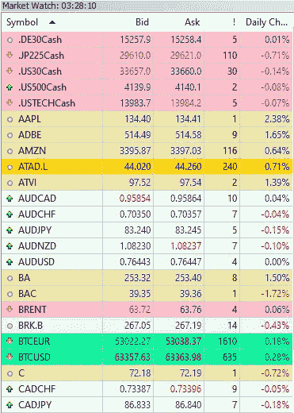
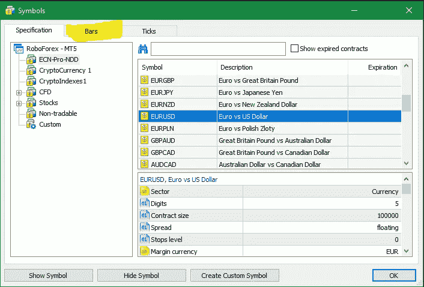
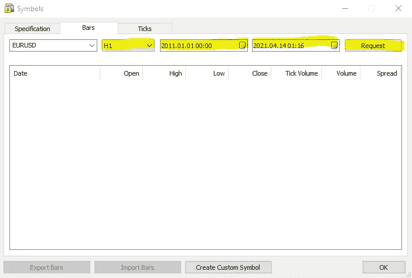
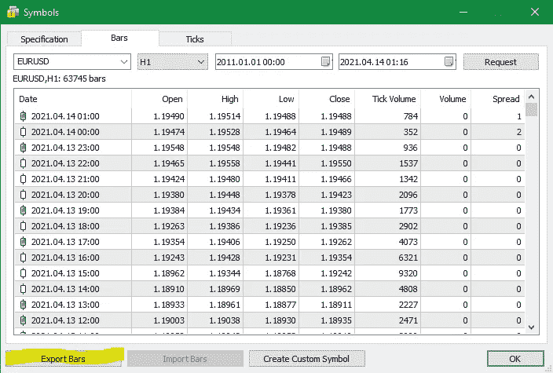

# 用 C#构建生成量化交易策略的人工智能(第 4 部分)

> 原文：<https://levelup.gitconnected.com/build-ai-for-generating-quant-trading-strategies-in-c-part-4-cfb3024483d4>

## 如何将历史价格数据从 MetaTrader 5 导出到 CSV

T 这是系列教程的第四篇文章:构建自动生成量化交易策略的人工智能，你可以从这里访问上一篇文章:

 [## 用 C#构建生成量化交易策略的人工智能(第 3 部分)

### 这是系列教程的第三篇文章:为自动生成 quant 交易策略构建人工智能，为…

levelup.gitconnected.com](/build-ai-for-generating-quant-trading-strategies-in-c-part-3-da04c0fdd90f) 

`Tester`类已经准备好了，它将在以后被强化学习算法使用，但是，我们需要为测试者生成数据点。

首先，让我们从 MetaTrader 5 交易终端导出 OHLC 价格数据:

1.  启动你的 MT5 终端，如果**市场观察**窗口不可见，进入主菜单>查看>市场观察或`CTRL+M`。看起来是这样的:

2.右键单击您选择的仪器并选择符号，将出现一个新窗口:

3.切换到上面屏幕截图中突出显示的条形选项卡，选择时间范围、开始日期、结束日期，然后单击请求:

4.单击“导出条”按钮，将 CSV 文件保存到您想要的任何位置:

如您所见，我们有蜡烛线开盘价、开盘价、最高价、最低价、收盘价、分笔成交点、成交量(实际上我们没有外汇对的真实成交量，这就是为什么它总是 0)和价差值，我们将在 C#的 PriceEngine 类中导入和处理它们，计算每日 OHLC(开盘价、最高价、最低价、收盘价)值，一些指标值，如 RSI、ATR 等。

我希望能在本教程的第 5 部分见到您:

 [## 用 C#构建生成量化交易策略的人工智能(第 5 部分)

### 智能人工智能附加策略的快速原型和验证

levelup.gitconnected.com](/build-ai-for-generating-quant-trading-strategies-in-c-part-5-479fb00745ae) 

你想知道我是做什么的吗？我是 Proxify Network 的高级软件开发人员。

现在 Proxify 正在寻找新的开发人员，所以我想在这里分享一些我的经历——与我在职业生涯中尝试的其他事情相比:
1️⃣友好和专业的 Proxify 团队以及他们对每个候选人的关心程度
2️⃣招聘过程非常简单，可以充分展示你的技能
3️⃣，最重要的是，Proxify 是寻找远程工作的理想方式，有无数的项目和公司可供选择。

在这里申请加入我在 Proxify:[https://bit.ly/3hd64mN](https://bit.ly/3hd64mN)

谢谢您，祝您愉快！