# 用 C#构建生成量化交易策略的人工智能(第 5 部分)

> 原文：<https://levelup.gitconnected.com/build-ai-for-generating-quant-trading-strategies-in-c-part-5-479fb00745ae>

智能人工智能附加策略的快速原型和验证

这是系列教程的第五篇文章:构建自动生成 quant 交易策略的人工智能，你可以在这里阅读之前的文章:

 [## 用 C#构建生成量化交易策略的人工智能(第 4 部分)

### 如何将 MetaTrader 5 的历史价格数据导出到 CSV？

levelup.gitconnected.com](/build-ai-for-generating-quant-trading-strategies-in-c-part-4-cfb3024483d4) 

我在写这篇文章之前做了功课，创建了一个强化学习算法来复制我为 Metatrader 5 创建和验证算法策略的所有过程。

它比我做的策略好一点点，在很短的时间内。尽管为了提高最终策略的质量，要么我应该从图表和指标中提供大量数据，然后运行人工智能数周，要么实际上手动构建更多、不同和更好的策略，然后将所有这些方法教给人工智能。

除非你有一台超级计算机供你使用……事实上我们都有，我们不仅可以租一台超级计算机，还可以租一台量子计算机，在阅读了关于如何使用它的 python 库的文档后，在上面运行 python 代码，这是令人兴奋的时刻，但这有点过头了。在这篇文章中，我们将快速原型化、提炼和验证不同金融工具的更多策略，以使人工智能更快、更智能、更高效。

在的情况下，你还在想，这里有一些工作程序的图片，它在 4-5 分钟内提出了我们在以前的文章中构建的策略。正如我上面提到的，人工智能生成的策略实际上稍微好一点，但如果它可以变得更好，这不是目标吗？

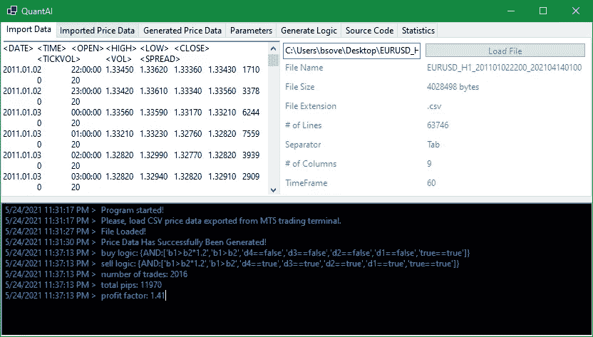

正如您在控制台中看到的，它生成了买入逻辑、卖出逻辑、交易数量、总利润(点数)和利润系数，您可以在下面看到导入的(原始)价格数据:

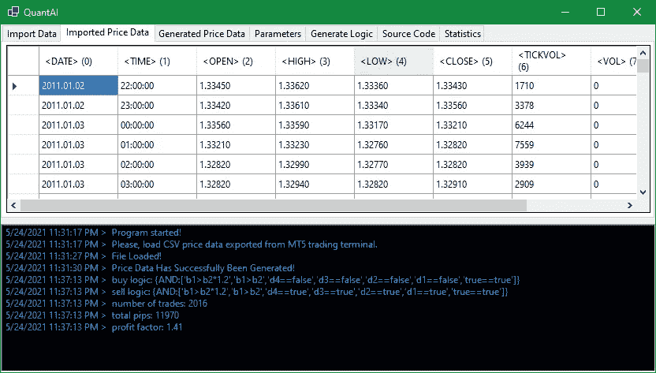

并生成价格数据，计算移动平均线、RSI、ATR 和其他值，与 Metatrader 5:

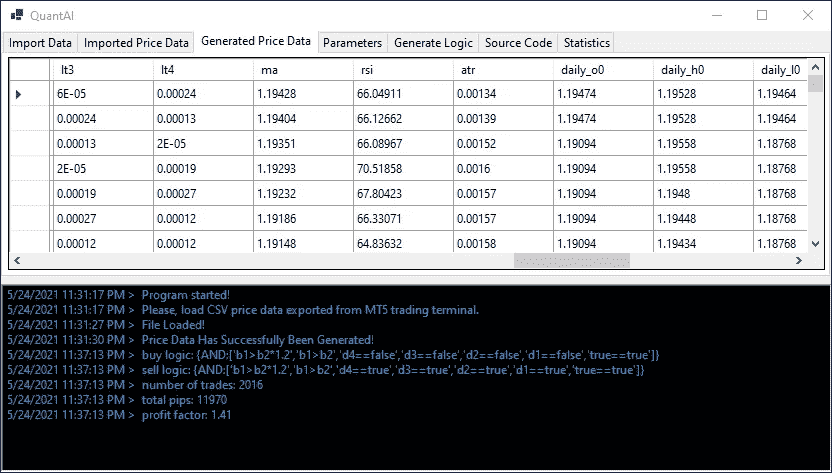

这样，生成的 mq5 源代码将在 Metratrader 5 策略测试器中给出完全相同的结果，这是至关重要的，因为我们使用 AI 生成的机器人最终将在 Metatrader 5 中运行。

正如我在之前的文章中所说，我不知道有任何交易平台比 Metatrader 5 更强大，用于构建和测试算法交易策略，而且我之前为 Metatrader 4，NinjaTrader，JForex，IB TWS(使用 API)构建过交易机器人和指标，更不用说一个场外交易平台本身了。但对于非常快速的原型开发，还有另一个平台——trading view，它带有内置的策略测试器和 Pinescript 编程语言。如果我们想出了一个有利可图的策略，我们仍然需要在 Metatrader 5 中验证它，但是如果这个策略在 Teamviewer 中不有利可图，那么它在 MT5 中就几乎没有机会有利可图。

让我们从 dogecoin 开始，这是一个年轻的不饱和市场，所以在每个人都加入之前，许多非常简单的策略都会对它起作用，你可以在 Pinescript 中看到一个超级简单的 RSI 交叉策略:

以及 DOGEUSD 15 分钟图表上的快速测试结果:

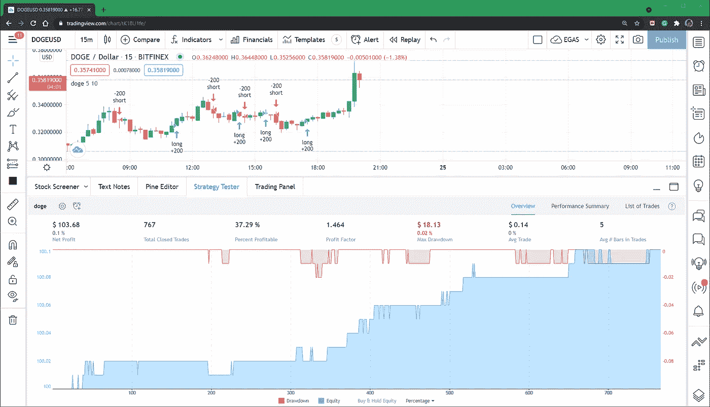

别忘了交易是要收费的。例如，币安密码交易所拥有世界上最低的交易费用，每笔交易将收取 0.1%的标准交易费用。其他交易所通常会向你收取更高的费用。顺便说一下，如果你从这个链接注册，你可以在每笔交易中获得 10%的额外费用折扣。

让我们在 Tradingview 策略测试器中添加 0.1%的交易费，看看会发生什么:

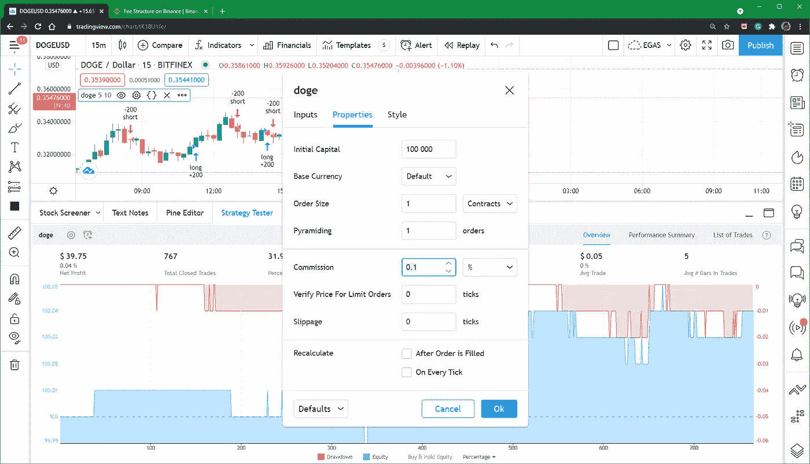

仍然有利可图，但利润减少:

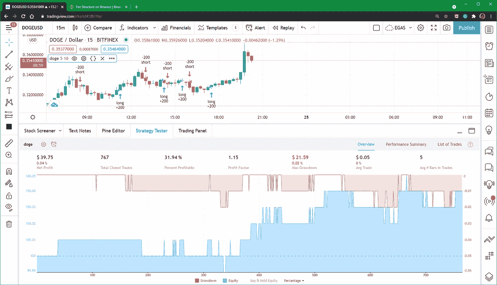

我们需要一些魔法…没问题:

RSI(相对强度指数)指标是一个 RS(相对强度)指标，由 0-100 个下限和上限限定。我分别添加了一个 **rsi_limit** 输入，将它进一步限制为 20–80，结果如下:

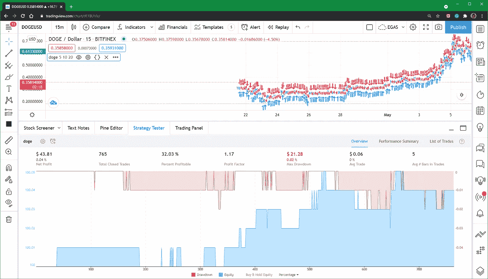

让我们将 **rsi_limit** 输入值设置为 40:

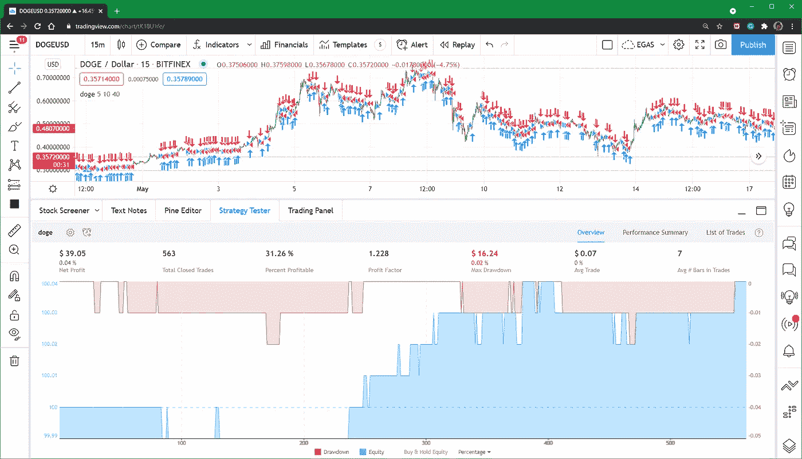

**rsi_limit** 输入值= 45:

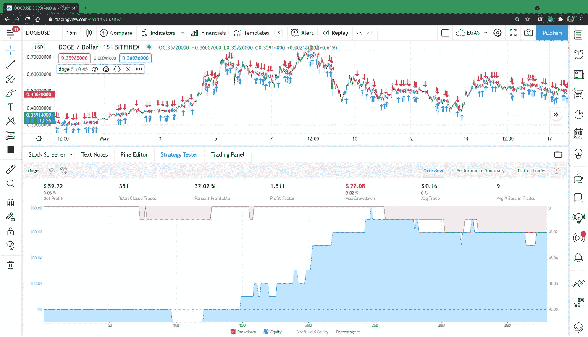

让我们试试 55:

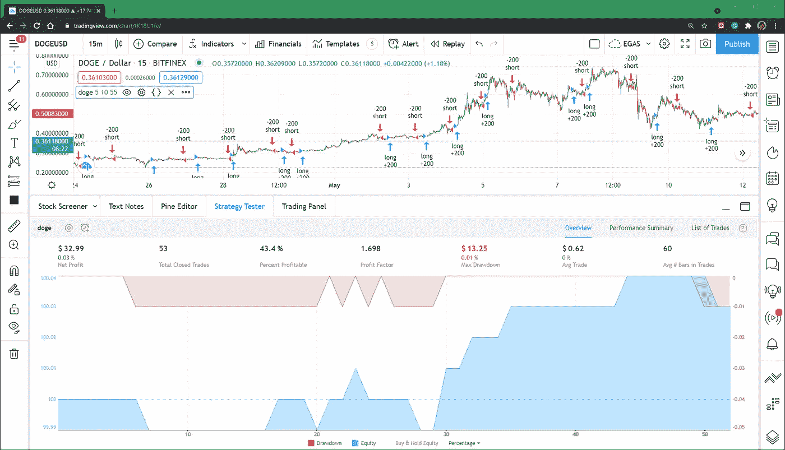

有个问题:如何区分**曲线拟合**和**改进的交易逻辑**？首先，曲线拟合是一种调整你的函数以更好地拟合现有数据点的方法，如果你有少量的数据点(在这种情况下是交易)，曲线拟合发生的机会就会增加。正如你所看到的，我们越是提高盈利能力(利润系数(总利润除以总损失))，交易数量就显著下降。

现在假设你只有两个基于特定市场进入标准的交易，一个是盈利交易，另一个是亏损交易，你可以通过增加一个专门为它创建的标准来过滤亏损交易，你现在只有一个盈利交易，但是**并不意味着你的策略在未来会产生 100%的盈利交易**。

那么你认为 50 次交易足以得到一个准确的画面吗？好吧，不用说更多的细节，我可以直接告诉你，即使 500 次交易也不够，我不是保守。

Al 虽然我们刚才所做的在很大程度上可能是曲线拟合的产物，但这并不比我们使用初始版本的策略所获得的结果更好，原因如下——我特意一步一步地增加了 **rsi_limit** 输入(我没有展示每一步，但这就是我所做的)。**我不只是选择一个产生最佳结果的随机值**，几乎所有随后增加的 **rsi_limit** 值都会产生越来越好的结果，这是要记住的一件非常重要的事情。

因为有许多其他因素在起作用，我们仍然需要确认我们的交易逻辑至少在 1000 或 1500 笔交易中持续产生类似的结果。Tradingview 只能让我们访问 15 分钟图表上 1 个月的数据，这也是我们需要用更多数据来验证 Metatrader 5 中的策略的原因之一。

验证过程本身有自己的规则，强烈建议只为 2011-2015 年期间创建和优化交易逻辑，然后在 2016-2020 年对其进行“前瞻性测试”，这不仅排除了曲线拟合的负面影响，还排除了其他因素，如市场行为随时间的演变。如果你 2016 年至 2020 年的结果与 2011 年至 2015 年的结果几乎相同或更好，那么只要许多人不采用相同的策略，并且总体市场行为没有显著变化，你就应该期待未来在真实账户上的稳定回报。

如果你使用的是刷单/高频交易(HFT)策略，它会带来额外的风险，但以后会更多。

B 在我们进入下一个策略概念之前，值得注意的是，例如，如果 10 个相对简单的策略对 DOGE/USD 这样的不饱和金融工具有效，在这种情况下，当你转向一个更饱和的工具，更多的人用不同的手动或算法交易策略交易时，流动性通常会增加，波动性会降低，我们的 10 个策略要么产生更少的利润，要么开始产生亏损，你需要一个更复杂、更微妙和更创新的方法来击败竞争对手。

现在让我们试试几条均线( **MA 交叉**策略):

*   **图表:** DOGEUSD，1 小时
*   **交易费用:** 0.1%

**双马**策略:

*   **图表:** DOGEUSD，1 小时
*   **交易费用:** 0.1%

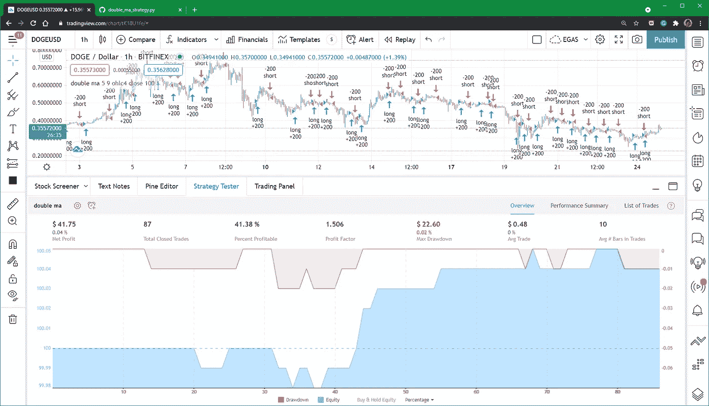

**同样策略，2 小时图**:

*   **图表:** DOGEUSD， **2 小时**
*   **交易费用:** 0.1%

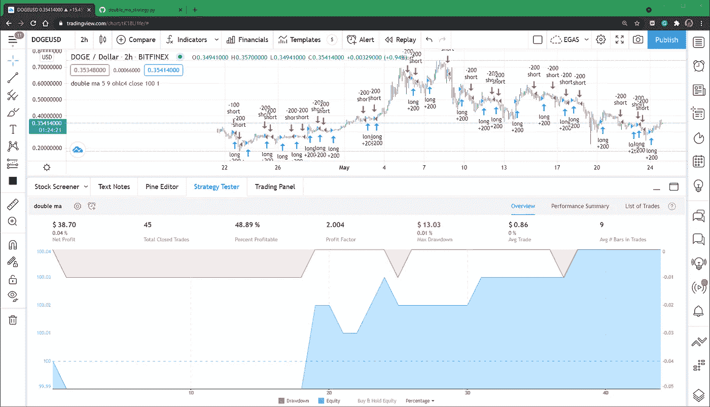

**同样策略，3 小时图:**

*   **图表:** DOGEUSD， **3 小时**
*   **交易费用:** 0.1%

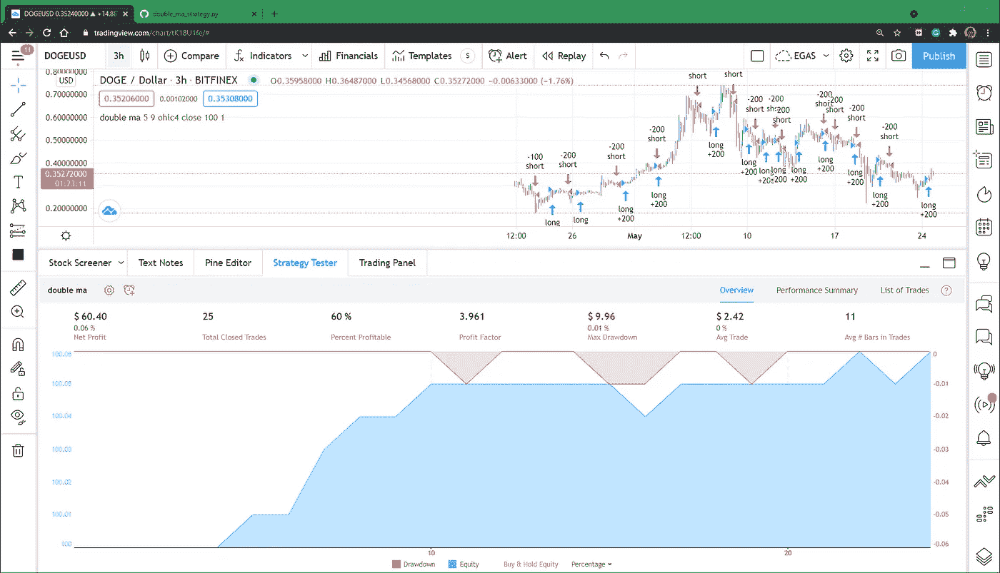

感谢阅读！

你想看一些中等魔术吗？点击并按住鼓掌按钮，看看会发生什么:)

你也想要很多免费的东西吗？查看下面的链接:

> 这些包含附属链接，如果您使用它们，我可能会收到报酬

你想知道我是做什么的吗？我是 Proxify Network 的高级软件开发人员。

现在 Proxify 正在寻找新的开发人员，所以我想在这里分享一些我的经历——与我在职业生涯中尝试的其他事情相比:
1️⃣友好和专业的 Proxify 团队以及他们对每个候选人的关注程度
2️⃣招聘过程非常简单，可以充分展示你的技能
3️⃣，最重要的是，Proxify 是寻找远程工作的理想方式，有无数的项目和公司可供选择。

在这里申请加入我在 Proxify:[https://bit.ly/3hd64mN](https://bit.ly/3hd64mN)

在几秒钟内部署您的下一个应用:**使用此链接从数字海洋**获得 100 美元的云信用:[https://m.do.co/c/8c5a2698b1a2](https://m.do.co/c/8c5a2698b1a2)

[**【140 美元来自 FBS**](https://fbs.com/promo/trade-100usd?ppu=193551) **:** 这家经纪公司受 IFSC 监管，是历史最悠久、最老牌的机构之一，自 2009 年开始运营。

**要求:**

*   注册一个有 140 美元的新账户
*   利用 1:500 的杠杆，让你的利润最大化
*   你可以提取所有利润

**可用市场:**加密货币、股票、差价合约、金属、商品、外汇

[**【tick mill】30 美元**](https://secure.tickmill.com/redirect/index.php?cii=15604&cis=1&lp=https%3A%2F%2Ftickmill.com%2Fpromotions%2Fwelcome-account%2F) :受 FSA 监管，该经纪商自 2015 年开始运营。

**要求:**

*   [用 30 美元注册一个新账户](https://secure.tickmill.com/redirect/index.php?cii=15604&cis=1&lp=https%3A%2F%2Ftickmill.com%2Fpromotions%2Fwelcome-account%2F)
*   使用高达 1:500 的杠杆来最大化您的利润
*   在 5 手交易后提取利润
*   最高取款金额是 300 美元

**可用市场:**股票指数，石油，贵金属，债券，外汇。

[**【Roboforex】30 美元**](http://www.roboforex.com/clients/promotions/welcome-program/?a=arag) :受 CySEC 和 IFSC 监管，Roboforex 自 2009 年开始运营，是当今交易者中最受欢迎和信任的经纪商之一。

**要求:**

*   [开立账户](http://www.roboforex.com/clients/promotions/welcome-program/?a=arag)并存入 10 美元以验证您的支付方式(可随时提取)并获得 30 美元作为礼物
*   **利润可无限制提取**
*   如果你交易了必要数量的手，你也可以提取 30 美元

**可用市场:**股票(所有纽交所、纳斯达克和美国证券交易所股票+德国和中国上市公司)、股票差价合约(所有股票的差价合约，*【美国上市股票每笔交易费 1.5 美元)*、指数、ETF、商品、金属、能源商品、加密货币、加密指数、外汇。

[**币安的所有交易终身享受 10%的折扣:**](https://www.binance.com/en/register?ref=P5O06MBF) 币安是世界上收费最低的加密货币交易所，支持迄今为止最多样的加密交易或投资方式:

*   现货交易；
*   点对点(P2P)交易；
*   保证金(高达 10 倍杠杆)交易；
*   加密期货交易；
*   加密转换和更多…

当你投资任何加密货币时，你可以通过允许保证金(杠杆)交易的借贷获得额外的无风险被动收入，它带有一个强大的[在线(web)平台](https://www.binance.com/en/register?ref=P5O06MBF)、 [Windows](https://www.binance.com/en/download?ref=P5O06MBF) 、 [Mac](https://www.binance.com/en/download?ref=P5O06MBF) 、 [Linux 软件](https://www.binance.com/en/download?ref=P5O06MBF)，以及面向软件开发者的 [Android](https://www.binance.com/en/download?ref=P5O06MBF) 和 [iOS 应用](https://www.binance.com/en/download?ref=P5O06MBF) + [币安 API](https://www.binance.com/en/download?ref=P5O06MBF) 。

[币安](https://www.binance.com/en/register?ref=P5O06MBF)不仅费用最低，而且是为数不多的支持交易 **Dogecoin** 的平台之一，就交易量和允许交易的加密货币而言，是世界上最大的加密交易所。

**存款选项包括:**

*   将任何上市加密货币直接加密存入您的币安钱包；
*   使用您的信用卡/借记卡购买加密货币；
*   通过银行转账(SWIFT 或 SEN)存入 35 种不同的法定货币。

> ***现在，当您从*** [***此链接***](https://www.binance.com/en/register?ref=P5O06MBF) ***注册时，您可以获得每笔交易额外 10%的折扣。***

最后，我在第 6 部分揭示了一个工作程序的完整源代码及其背后的主要原理，请看:

 [## 用 C#构建生成量化交易策略的人工智能(第 6 部分)

### 最后，在这里…

levelup.gitconnected.com](/build-ai-for-generating-quant-trading-strategies-in-c-part-6-addb194f42fb) 

祝你有美好的一天！