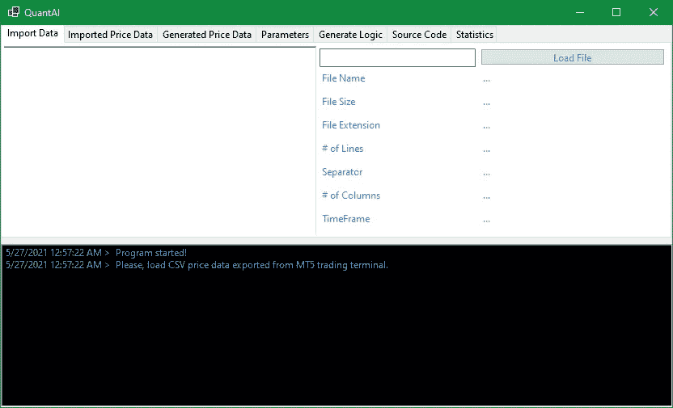

# 用 C#构建生成量化交易策略的人工智能(第 6 部分)

> 原文：<https://levelup.gitconnected.com/build-ai-for-generating-quant-trading-strategies-in-c-part-6-addb194f42fb>

最后，在这里…

嗨，欢迎(再次)光临！在本教程中，我将揭示强化学习软件背后的完整源代码和原理，该软件能够自动创建和测试盈利的算法交易策略。

# 风险免责声明:

> *就本教程而言，我不是一个合格的持牌投资顾问，也不提供个人投资建议，本文(以及本系列教程中的其他文章)提供的所有信息仅用于信息和教育目的。*
> 
> *在做出任何和所有投资决定之前，进行自己的尽职调查，并咨询有执照的财务顾问。任何投资、交易、投机或基于本文中的任何信息做出的决定，无论是明示的还是暗示的，都由您自己承担风险，无论是财务风险还是其他风险。*
> 
> 交易(包括人工交易和算法交易)包含巨大的损失风险，并不适合所有人。金融证券的估值可能会波动，因此，你可能会失去比你原来的投资更多。季节性和地缘政治事件的影响已经被计入市场价格。
> 
> *杠杆交易意味着微小的市场波动将对您的交易账户产生巨大影响，这可能对您不利，导致巨大损失，也可能对您有利，导致巨大收益。*
> 
> 如果市场对你不利，你可能会遭受比你存入账户的金额更大的损失。

如果您是第一次来这里，请随意看看之前的 5 个教程:

 [## 用 C#构建生成量化交易策略的人工智能(第 5 部分)

### 智能人工智能附加策略的快速原型和验证

levelup.gitconnected.com](/build-ai-for-generating-quant-trading-strategies-in-c-part-5-479fb00745ae)  [## 用 C#构建生成量化交易策略的人工智能(第 4 部分)

### 如何将 MetaTrader 5 的历史价格数据导出到 CSV？

levelup.gitconnected.com](/build-ai-for-generating-quant-trading-strategies-in-c-part-4-cfb3024483d4)  [## 用 C#构建生成量化交易策略的人工智能(第 3 部分)

### 这是系列教程的第三篇文章:为自动生成 quant 交易策略构建人工智能，为…

levelup.gitconnected.com](/build-ai-for-generating-quant-trading-strategies-in-c-part-3-da04c0fdd90f)  [## 用 C#构建生成量化交易策略的人工智能(第 2 部分)

### 这是系列教程的第二篇:构建自动生成 quant 交易策略的人工智能…

levelup.gitconnected.com](/build-ai-for-generating-quant-trading-strategies-in-c-part-2-87cef6fccc3c)  [## 用 C#构建生成量化交易策略的人工智能(第 1 部分)

### 让我以一个问题开始:你听说过 Citadel LLC，文艺复兴科技，两个适马，或者，也许，D. E…

levelup.gitconnected.com](/part-one-building-ai-for-generating-quant-trading-strategies-in-c-8cc2afb88955) 

F 首先，我们有一个标准的 windows 设计器生成的界面代码(部分 **Form1** 类):

另一部分总结了一切:

看起来像这样:

还有一个标准的 **Program.cs** 类来加载接口本身:

一旦我们选择了包含从 MetaTrader 5 (MT5)交易终端导出的价格数据的 CSV 文件， **DataManager** 类加载文件内容并进行初步计算，检查数据完整性，自动识别图表时间范围、行数、CSV 分隔符、列数，并将解析后的数据加载到**导入的价格数据选项卡**(数据表格式):

准备好所有的初始数据点后，我们需要正确地计算指标值。 **PriceEngine** 类计算移动平均线、平均真实范围、相对强度指数、每日 OHLC 和其他衍生值，与 MetaTrader 5(经过测试和验证)完全一样，因此这里创建的策略将在 MetaTrader 5 策略测试器中生成完全相同的交易。所有这些数据随后被加载到**生成的价格数据**选项卡中(数据表格式):

有关如何在项目中正确计算技术指标值的更多信息，请查看本教程:

 [## 以编程方式计算可靠 RSI 值的分步指南

### 概观

turmanauli.medium.com](https://turmanauli.medium.com/a-step-by-step-guide-for-calculating-reliable-rsi-values-programmatically-a6a604a06b77) 

接下来，有一个**测试器**类，它测试由 **PriceEngine** 类生成的历史价格数据上的交易逻辑，并返回假设的交易性能和统计数据，我们在本教程系列的第 2 部分中讨论过**测试器**类，这里再次展示，以防万一:

 [## 用 C#构建生成量化交易策略的人工智能(第 2 部分)

### 这是系列教程的第二篇:构建自动生成 quant 交易策略的人工智能…

levelup.gitconnected.com](/build-ai-for-generating-quant-trading-strategies-in-c-part-2-87cef6fccc3c) 

**Tester** 类使用一个更小的 **JSON** 类将存储为 JSON 字符串的交易逻辑反序列化为一个动态对象:

然后，它遍历通过反序列化 JSON 字符串生成的动态对象，以便遍历交易逻辑，并在满足进/出条件时做出交易决策。有关如何在 C#中迭代动态对象的更多信息，请查看本教程:

 [## 在 C#中迭代动态对象

### 如果我们事先知道一个对象的结构，那么遍历该对象以获得它的实际值是相对容易的，但是对于…

medium.com](https://medium.com/codex/iterating-through-a-dynamic-object-in-c-a3c604141569) 

F 最后，我们有了 **Builder** 类，其中驻留了我们的强化学习逻辑，它逐标准地构建交易策略:

H 下面是其工作原理的简短版本:**构建器**类向测试器实例的`buyLogic`和`sellLogic`属性添加进入标准，运行测试器并保存交易统计数据。

然后，它添加其他标准，再次运行测试器，如果当前结果比以前的结果好，则保留标准(并保存当前的交易统计数据以供比较)，否则，它们被丢弃(并加载以前的交易统计数据)。

同样，新的标准被添加到现有的列表中，进行测试，并根据它们是否改善了结果来保留或丢弃。一遍又一遍。

还有更多，但我想保持这篇文章的长度合理，我尽力给你看最有趣的部分。请随意查看以前的教程以获得更多的见解，或者只是在您的机器上编译代码并开始创建婴儿算法策略。请在评论中告诉我你的想法！

感谢您的阅读，一如既往，您可以查看下面的链接，为您的下一个项目免费获取一些东西:

# 免责声明:

> *这些包含附属链接，如果你使用它们，我可能会收到报酬*

嘿，你想知道我是做什么的吗？我是 Proxify 网络的高级开发人员。

现在 Proxify 正在寻找新的开发人员，所以我想在这里分享一些我的经历——与我在职业生涯中尝试的其他事情相比:
1️⃣友好和专业的 Proxify 团队以及他们对每个候选人的关心程度
2️⃣招聘过程非常简单，可以充分展示你的技能
3️⃣，最重要的是，Proxify 是寻找远程工作的理想方式，有无穷无尽的项目和公司可供选择。

在这里申请加入我的代理:[https://bit.ly/3hd64mN](https://bit.ly/3hd64mN)

在几秒钟内部署您的下一个应用:**使用此链接从数字海洋**获得 100 美元的云积分:[https://m.do.co/c/8c5a2698b1a2](https://m.do.co/c/8c5a2698b1a2)

[**【140 美元来自 FBS**](https://fbs.com/promo/trade-100usd?ppu=193551) **:** 这家经纪公司受 IFSC 监管，是历史最悠久的机构之一，自 2009 年开始运营。

**要求:**

*   注册一个有 140 美元的新账户
*   利用 1:500 的杠杆，让你的利润最大化
*   你可以提取所有利润

**可用市场:**加密货币、股票、差价合约、金属、商品、外汇

[**【tick mill】30 美元**](https://secure.tickmill.com/redirect/index.php?cii=15604&cis=1&lp=https%3A%2F%2Ftickmill.com%2Fpromotions%2Fwelcome-account%2F) :受 FSA 监管，该经纪商自 2015 年开始运营。

**要求:**

*   注册一个有 30 美元的新账户
*   使用高达 1:500 的杠杆来最大化您的利润
*   在 5 手交易后提取利润
*   最高取款金额是 300 美元

**可用市场:**股票指数，石油，贵金属，债券，外汇。

[**【Roboforex】30 美元**](http://www.roboforex.com/clients/promotions/welcome-program/?a=arag) :受 CySEC 和 IFSC 监管，Roboforex 自 2009 年开始运营，是当今交易者中最受欢迎和信任的经纪商之一。

**要求:**

*   [开户](http://www.roboforex.com/clients/promotions/welcome-program/?a=arag)存入 10 美元验证您的支付方式(可随时提取)并获得 30 美元作为礼物
*   **利润可无限制提取**
*   如果你交易了必要数量的手，你也可以提取 30 美元

**可用市场:**股票(所有纽交所、纳斯达克和美国证券交易所股票+德国和中国上市公司)、股票差价合约(所有股票差价合约)*【美国上市股票每笔交易费 1.5 美元】*、指数、ETF、大宗商品、金属、能源商品、加密货币、加密指数、外汇。

[**币安的所有交易终身享受 10%的折扣:**](https://www.binance.com/en/register?ref=P5O06MBF) 币安是世界上收费最低的加密货币交易所，支持迄今为止最多样的加密交易或投资方式:

*   现货交易；
*   点对点(P2P)交易；
*   保证金(高达 10 倍杠杆)交易；
*   加密期货交易；
*   加密转换和更多…

> ***从*** [***此链接***](https://www.binance.com/en/register?ref=P5O06MBF) ***注册，每笔交易额外获得 10%的折扣。***

祝你有美好的一天！