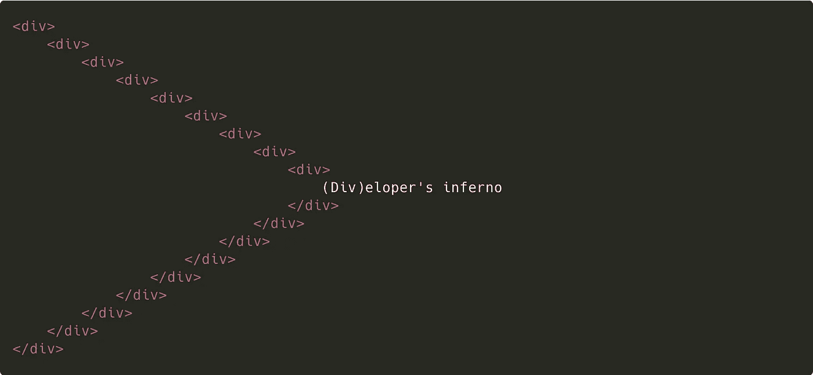
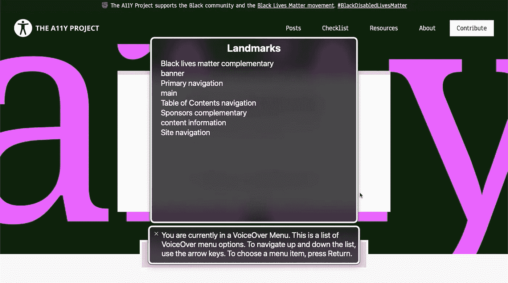
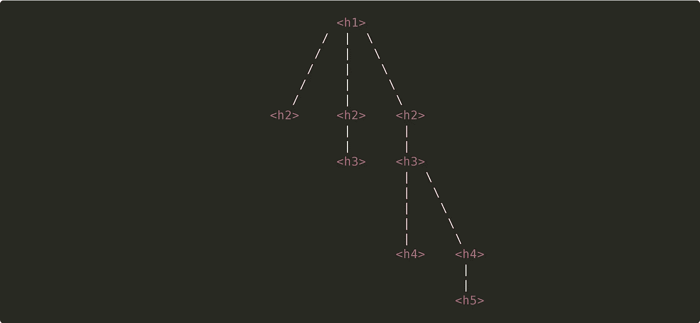
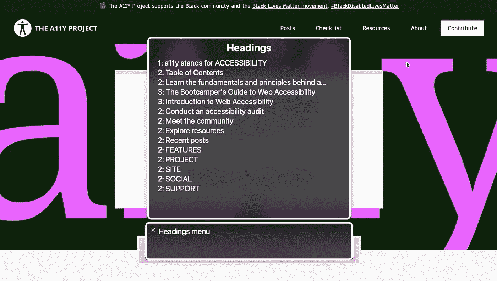

# 使用 ARIA 地标区域和标题构建一个可访问的 HTML 结构。

> 原文：<https://levelup.gitconnected.com/build-an-accessible-html-structure-using-aria-landmark-regions-and-headings-4647d22c2cc7>

9 个嵌套的 HTML div 元素，包含文本“(Div)eloper 的地狱”

辅助技术用户依靠正确使用 HTML 语义元素来轻松导航和识别给定网页中的感兴趣区域。在 [2016 年屏幕阅读器策略调查](https://heydonworks.com/article/responses-to-the-screen-reader-strategy-survey/?utm_campaign=chrome_series_screenreaderstrategysurvey_052517&utm_source=chromedev&utm_medium=yt-desc)中，用户报告称，当浏览不熟悉的网站时，标题层次和地标区域是信息检索的第一手段。

如果不使用地标和标题，我们会严重影响屏幕阅读器用户，迫使他们浏览整个网站来寻找想要的内容。显然，地标、标题级别和标签的不正确使用(*或不使用*)是可达性问题的更深层次的表现。然而，这些问题可以通过相对较少的工程努力来修正。

# HTML 地标

语义 HTML 地标区域标签及其宣布的隐含角色。

标志区域隐式地提供了关于 HTML 元素中分组性质的上下文。屏幕阅读器可以轻松识别页面中所有可用的地标，并向用户展示它们:

*   `<aside>` — `role="complementary"`指独立支撑段。它可能与主要内容相关。
*   `<header>`—`role="banner"`用于定义站点的页眉。它通常包括一个徽标和导航元素，通常位于页面的顶部。
*   `<nav>` —可以找到具有属性`role="navigation"`的父元素的大组导航链接。
*   `<main>` —每个页面的主要内容应该放在带有`role="main"`的元素中。
*   `<section>`—`role="region"`应该用于足够重要的区域，访问者可能希望快速导航到这些区域。
*   `<footer>` —在页面的最底部，我们找到了具有`role="contentinfo"`属性的元素。平时孩子/？/包括有关全球网站的导航项目以及隐私或版权信息。

> 关于地标角色及其语义的详尽列表，请访问 MDN 的 [WAI-ARIA 地标角色](https://developer.mozilla.org/en-US/docs/Web/Accessibility/ARIA/Roles#3._landmark_roles)。

您可以将地标与具有匹配的`role`属性的`div`互换使用。例如，`
`在语义上等同于等价的`<nav>`元素。

## 正确的地标用法

在[a11y.com](http://www.a11yproject.com)上使用 Mac 的画外音(`cmd + f5`)时，我们可以观察到以下地标(`ctrl + alt + u` *结合左右箭头*):

a11y.com 的屏幕截图，其中展示了由 Mac 的 VoiceOver 辅助技术拾取的地标。

给定我们的屏幕阅读器提供的信息，我们可以得出以下结论:文档开头的一个`aside`元素，后面跟着一个包含主`nav`的`header`。此外，我们有一个`main`部分，包含一个`nav`命名的目录，其中有一个`aside`属于赞助商。最后，我们有一个关于站点链接的`footer`和一个`nav`。

我们的推导与 a11y 网站上辨别出的视觉等级相差不远。工程师们还利用`aria-label`进一步增强所述地标的语言表达和意义。屏幕阅读器首先声明`aria-label`，然后是 HTML 元素的显式或隐式`role`属性。例如，`<nav aria-label="Primary">` ( *有隐含的* `role="navigation"`)会被解释为“主导航”。

# 标题级别

可视化一个倒置的文档标题排序树。

标题标签(`<h1>`到`<h6>`)概括了网页上的信息结构。通过使用标题，您可以有效地为屏幕阅读器创建可解释的目录。最终，用户可以快速找到感兴趣的领域，而不会感到沮丧。

标题等级经常被误用，因为它们继承了视觉风格。我们必须避免这样做，并且利用等级的语义。`<h1>`作为文件的标题，传达最高程度的重要性，而`<h2>`可以作为副标题。理想情况下，我们遵循常见的文档写作格式来放置标题:

*   建议每页只在文档中所有其他标题之前放置一个`<h1>`标签。
*   跳级会让人困惑。理想情况下，等级应该基于其固有的编号方案向下级联。你可以把等级想象成一个颠倒的树，主干是你的第一层，下面的树枝是第二层，等等。当关闭一个子部分并打开另一个子部分时，您可以“跳过”等级。
*   您可以在视觉上隐藏标题，以获得更好的辅助功能覆盖率。屏幕阅读器用户可能会选择使用标题进行显式导航，从而可能错过重要的区域。插入隐藏的标题级别，以改善地标区域内的导航体验。

> 屏幕阅读器将按照 HTML 位置的顺序而不是视觉层次来解析标题。

## 伟大的标题位置

我们将再次通过[a11y.com](http://www.a11yproject.com)来观察以下标题层次结构:

a11y.com 截图展示了 Mac 的 VoiceOver 辅助技术拾取的标题级别。

我们可以立即观察到很好的标签，它传达了与每个部分相关的内容的直接含义。此外，带有文本“目录”的`<h2>`无法在网站上看到。这种标记方法使屏幕阅读器能够可互换地选择那些在浏览标题菜单时会被遗漏的标志区域。

最后五个`<h2>`标题使用了一个大写单词。这是一种有意的方法，通过一个列表或一组锚链接来传达关系。

# 实施地标和航向标高

首先，我们必须进行可访问性审计，以进一步了解需要发生的变化的程度。使用屏幕阅读器，并尝试使用地标或标题导航器导航您的网站。如果你用一个不熟悉你的网站的测试者来进行这样的实验会更好，以避免有偏见的结果。收集尽可能多的信息和反馈，以跟踪您的当前状态，并评估您朝着期望的可访问性基线的进展。

首先确定逻辑结构化的内容块，如导航、主要内容和页脚。一旦找到这些区域，用语义 HTML 标记替换它们的外部容器。使用`aria-label`引入附加标签，以便更好地区分和理解上下文。

一旦你的区域被正确分配，确定需要进一步关注的区域，这些区域可能需要用标题级别进行可互换的标记。确保您的标题结构遵循有效的级联，并避免使用默认用户代理样式的标题。重复审核以确认您的增量改进。

# 最后的想法

我们已经足够深入地研究了地标和航向水平及其含义。当应用上述原则时，要意识到潜在的过度(*或在*之下)标签，因为这可能是有问题的。

记住在适用的情况下使用语义 HTML 超越地标区域。希望你现在离私奔者的地狱只有几步之遥。

# 参考资料和进一步阅读

 [## 对屏幕阅读器策略调查的回应

### 去年九月，我决定我想听听关于屏幕阅读器用户如何访问网络的故事。我…

heydonworks.com](https://heydonworks.com/article/responses-to-the-screen-reader-strategy-survey/?utm_campaign=chrome_series_screenreaderstrategysurvey_052517&utm_source=chromedev&utm_medium=yt-desc)  [## WAI-ARIA 角色-可访问性| MDN

### 本页列出了涵盖 MDN 上讨论的所有 WAI-ARIA 角色的参考页面。有关角色的完整列表，请参见使用…

developer.mozilla.org](https://developer.mozilla.org/en-US/docs/Web/Accessibility/ARIA/Roles)  [## 语义和导航内容|网络基础|谷歌开发者

### 您已经学习了启示、语义，以及辅助技术如何使用可访问性树来创建…

developers.google.com](https://developers.google.com/web/fundamentals/accessibility/semantics-builtin/navigating-content)  [## HTML 切片元素

### 使用以下按钮直观地勾勒出页面上的地标和/或标题。显示地标显示标题吧…

www.w3.org](https://www.w3.org/TR/wai-aria-practices/examples/landmarks/HTML5.html)  [## 无障碍地标

### 通过地标，使用屏幕阅读器的盲人用户能够跳转到网页的各个部分。在 HTML 中有…

www.w3schools.com](https://www.w3schools.com/accessibility/accessibility_landmarks.php) 

# 视频解释

# 如果你觉得这篇文章有用，请与他人分享。一些掌声👏🏻下面多多帮忙！

*通过鼓掌，你帮助其他人发现这些内容，并激发更多关于可访问性、设计、反应和 JavaScript 的文章的写作！*