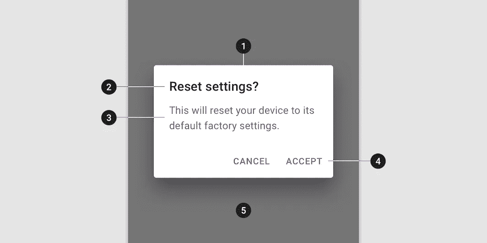
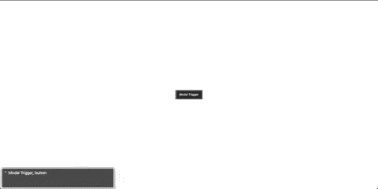

# 用 React 构建一个可访问的模态(对话框)窗口。

> 原文：<https://levelup.gitconnected.com/build-an-accessible-modal-dialog-window-with-react-35f6938e58c4>

展示了一个模态对话框在浏览器上的外观。

对话窗口通常用于将用户的注意力引导到预先定义的动作闭环上。窗口存在于 web 应用程序上下文中的一个单独的层上。对话框的图层作为区分前景活跃元素和惰性背景界面的焦点。对话框之外的内容应该被遮蔽，以便在视觉上辨别新的用户流。

不幸的是，模态经常与黑暗的用户界面(UI)模式联系在一起。我们都有过这样的经历:浏览网站时，定时弹出窗口会打断我们的阅读，并几乎本能地拒绝它们。虽然，知名网站不会过度使用它们，但鉴于它们吸引注意力的性质，它们是不可避免的。它们最终应该谨慎使用，因为不是所有的用户操作都保证中断。

# 要求

对话框的实现可以根据用户的感知和交互方式而变化。例如，警报(成功、警告、错误)消息是对话的子集。然而，从操作上来说，它会短暂地显示一条重要的消息，并在不中断用户流程的情况下自行丢弃。

我们将主要关注需要显式触发来预览和卸载的窗口。

## 解剖

源自谷歌[材质设计](https://material.io/components/dialogs#anatomy)的对话图。

出于本文的目的，我们修改了材料设计团队提出的命名方案，以更好地反映底层的 *className* 基础设施。这种差异本质上纯粹是语言上的。

1.  窗口(Window)——在我们的模式中，围绕所有可交互元素的主容器。理想情况下，我们需要在这个容器中“捕获”键盘焦点，直到模态被处理。
2.  **标题** —包含一个简短的标题，可选地辅以更长的描述。此外，它还可以包含一个带有“X”图标的“关闭”按钮。
3.  **Body** —表单元素和所有与对话框核心用法相关的东西都应该包含在主体中。
4.  **页脚** —大多数可用的动作按钮应该放在页脚，为对话框的目的提供一个清晰的结论。
5.  **遮罩** —我们通过用遮罩模糊其余内容来表达对对话的专注。理想情况下，该掩码包含与不同的“取消”或“关闭”按钮相同的关闭事件处理程序。

## 键盘

在追求可访问的模态对话框的过程中，我们有四个核心方面需要解决。

1.  **捕获焦点** —当对话框挂载时，焦点应该放在我们窗口的容器内。由于动态对话内容，这种方法可能不容易维护。建议使用 **tabIndex={-1}** ，最初关注*窗口*容器。通过这样做，我们使屏幕阅读器能够宣布与我们的对话框相关联的标题和描述。
2.  **Tab** —所有可以获得焦点的元素都应该是可被发现的，并且当 Tab 以旋转的方式被按下时获得焦点。当我们把焦点放在最后一个键盘可访问元素上时，如果再次按下 tab 键，我们将旋转回到 tab 键顺序中的第一个元素。
3.  **Shift** + **Tab** —类似于 **Tab** 我们以循环方式锁定焦点。只是这一次我们将 tab 焦点旋转到 DOM 定义的位置的相反方向。如果第一个键盘辅助元素有焦点，并且我们按下 shift+tab，我们必须将焦点放在 tab 键顺序中的最后一个元素上。
4.  **Escape** —在我们的模态对话框流程中的任何一点，如果用户按下 Escape 键，我们应该立即放弃窗口，焦点应该放在最初触发挂载的元素上。自然，模式的每个触发器都应该是选项卡可访问的。

# 履行

展示了实现到模式对话框的所有可访问的需求。

模态的位置应该在主要内容区域的层次结构之外。React 预构建了[门户](https://reactjs.org/docs/portals.html)，使我们能够在父组件位置之外呈现一个 DOM 节点。我们可以很容易地定义一个名为 **renderPortal** 的可重用函数，以自动化在其层次结构之外呈现 HTMLElement 的过程。

## 键盘事件

首先我们需要解决获得圆形**标签**和**移动** + **标签**焦点的问题。使用健壮的选择器对于找到所有可以接受焦点的 DOM 元素是必不可少的。有七种常用的 HTML 元素可以获得焦点，如下所示。额外的修改需要插入一些特性。**按钮**和**输入**只有在*未禁用*或*只读*时才能选择。最后，我们不应该选择任何有负的 tabindex 的元素。我们可以利用 CSS **:not()** 选择器轻松选择这些组件。

一旦我们有了所有键盘可访问的元素，我们就可以检查焦点当前是放在第一个还是最后一个元素上。根据按下的组合键，我们可以循环移动。

**Event.key** 应该用来确定一个键是否被按下。然而，当组合键时， **event.key** 将转发最后触发的事件。幸运的是，我们不必为 **shift** + **tab** 的情况定义复杂的逻辑。我们可以简单的使用目前所有浏览器都支持的 [**event.shiftKey**](https://developer.mozilla.org/en-US/docs/Web/API/KeyboardEvent/shiftKey) 。

您会注意到，当按下 **Escape** 键时，会调用 **onClose()** 函数，而不会将焦点移动到 trigger 元素。相反，我们将该逻辑移到了 **componentWillUnmount()** 生命周期方法中。

## 式样

我们已经用 **px** 值的四舍五入近似值替换了所有相对单位。请避免在 css 实现中使用硬编码像素。如您所见，我们正在利用*。SCSS* 轻松连接类名。

尺寸定义直接引用自 [Github 的初级](https://primer.style/css/support/breakpoints)设计系统。更具体地说，我们使用相同的断点来调整维度。虽然，这里没有实现移动友好代码，但是可以根据你自己的断点推断出来。

## 情态的

下面可以看到完整的模态植入。

我们决定使用 **this.props.children** 来呈现对话框中的内容。这简化了我们的代码库，然而，根据开发人员的使用情况，它可能会引入副作用。我们建议您使用函数，而不是直接传递子级，以便更好地控制实现。

此外，我们正在使用所有相关的 aria 属性使对话框可访问，从而满足上述要求。

# 结论

我们已经探索了窗口对话框及其含义的多个方面。从键盘可访问性到实现细节等等。要时刻注意使用模态，因为它们会对用户流造成干扰。

# 参考

*   [WAI-ARIA 创作实践 1.1](https://www.w3.org/TR/wai-aria-practices-1.1/#dialog_modal)
*   [对话框解剖-材料设计](https://material.io/components/dialogs#anatomy)
*   [门户—反应](https://reactjs.org/docs/portals.html)
*   [keyboard event . shift key—Web API | MDN](https://developer.mozilla.org/en-US/docs/Web/API/KeyboardEvent/shiftKey)
*   [断点—初级 CSS](https://primer.style/css/support/breakpoints)

[**George Argyrousis**](http://www.linkedin.com/in/george-argyrousis)——*高级软件工程师，沟通前端工程和 UI/UX 设计。高度专注于基于 JavaScript 的网络应用。*