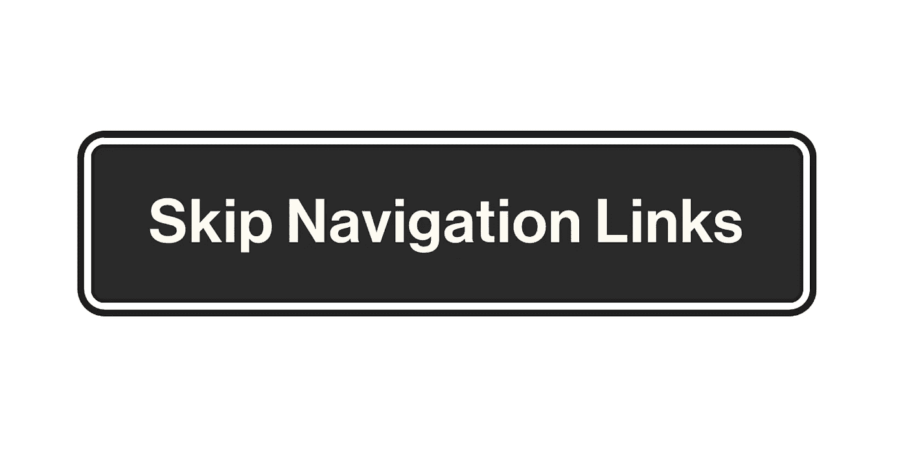
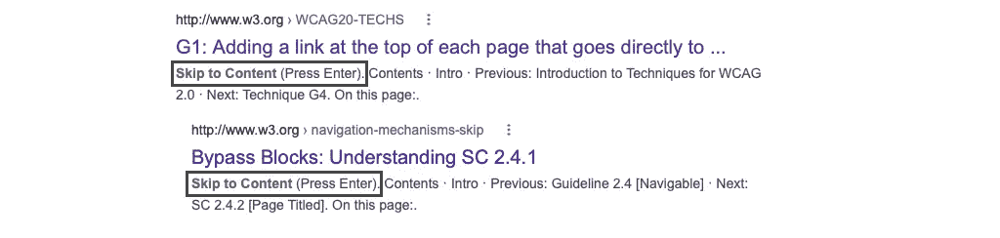

# 使用 React 建立一个可访问的“跳转到内容”锚链接。

> 原文：<https://levelup.gitconnected.com/build-an-accessible-skip-to-content-anchor-link-with-react-140903f3bd7e>

带有内容“跳过导航链接”的 Skiplink 按钮用户界面。

自从 21 世纪初现代网络出现以来，链接对于浏览任何网站都是必不可少的。没有具体的数字来表示任何给定网页中链接的最大数量。然而，假设一个语义 *HTML* 头将有多个锚链接是安全的。毕竟，标题是网站嵌套结构的入口点。虽然拥挤的导航可能不像大量弹出窗口和吸引注意力的广告那样成问题(*)，但对一些访问者来说肯定是乏味的。*

不用鼠标浏览网页并不像人们想象的那样简单。根据网站的实现方式，键盘兼容性甚至可能无法正确实现。有趣的是，行业领导者了解可访问性的重要性以及受影响的更广泛人群。因此，我们可以观察到一个当之无愧的向键盘可访问网络的范式转变。

> 我鼓励你使用你最喜欢的带键盘的社交媒体网络来更好地理解潜在的问题。

每次键盘用户访问一个页面，他们都必须在整个导航中按*键*才能阅读任何有意义的内容。用户体验( *UX* )专业人士通常会发现这样的问题，并使用通常所说的“Skiplink”来解决它。

# Skiplinks

展示了一个 Skiplink 在网站标题导航中的样子。

这样的锚点是用来作为第一个 *HTML* 元素，用户可以 *TAB* 到这个元素。在其他链接被识别之前，它们通常隐藏在标题导航中。一个常见的 *HTML* 实现可能看起来像这样:

你的 *SCSS* 造型可以这样设计:

默认情况下，我们的 Skiplink 有**位置:绝对；**不干扰 *HTML* 的流动。当使用键盘导航时，我们的**。跳转链接**将获得焦点并被插回到**静态**HTML 位置。

我们使用 **transformX** 是因为它在我们转换到聚焦状态时的性能。引导我们使用 transform 的核心假设是由随视口扩展的标题导出的。如果您的标题有静态尺寸，建议使用 **left** 属性。

## 实施陷阱

前面提到的实现对于许多项目来说已经足够了。它肯定会让键盘导航用户感到高兴。但是，如果您对可重用和健壮的工程基础设施感兴趣，建议考虑以下陷阱:

1.  可重用性:通常情况下，标题变化会在你的 web 应用中普遍存在。市场营销和 web 应用程序标题组件服务于不同的需求是很常见的。
2.  **片段(#)导航**:您的 web 应用程序很复杂，可能有数百个页面共享一个通用的 *HTML* 地标结构。实现一个 **id** 属性来匹配你的 skiplink 的 **href** 可能会很繁琐并且容易出错。
3.  **搜索引擎优化( *SEO* )** :你的锚链被网络爬虫解析是不可避免的。不建议隐藏你的 Skiplink，就像 Google 在他们的文章中建议的那样:隐藏文本链接。

谷歌网络爬虫解析 w3.org 网站的链接。

# 反应 Skiplink

我们怎样才能在满足工程师和用户需求的同时减轻 web 应用程序的上述风险呢？

我们可以通过结合使用**document . query selector()**和引入**以编程方式滚动到一个元素来解决片段导航问题。焦点()**在选中的 *HTML* 包装元素上。

SEO 可以通过使用**按钮**而不是锚链接来提高。网站爬虫不容易理解按钮，然而，我们的实现应该是不变的。

不管使用按钮还是锚点，我们都希望创建一个可重用的组件来封装我们想要的功能。很明显，我们需要一个 **onClick** 事件处理程序，它应该被转发给我们的孩子。

我们的*React*+*TypeScript*实现可以在下面找到:

在我们的实现中， **React.cloneElement()** 特别有用。我们正在传递一个额外的 **className** 属性，这在您自己的实现中可能是不必要的。建议使用该属性在多个导入中保持类名一致，而不依赖于子级。

您自己项目的潜在组合可能如下所示:

前述的 *SCSS* 实现仍然适用。

希望 Skiplinks 能在更广的网络范围内被采用和标准化。它们很容易实现，同时不断增强网站的键盘可访问性。

[**乔治·阿吉鲁斯**](http://www.linkedin.com/in/george-argyrousis)——*高级软件工程师，架起前端工程与 UI/UX 设计之间的桥梁。高度专注于基于 JavaScript 的网络应用。*