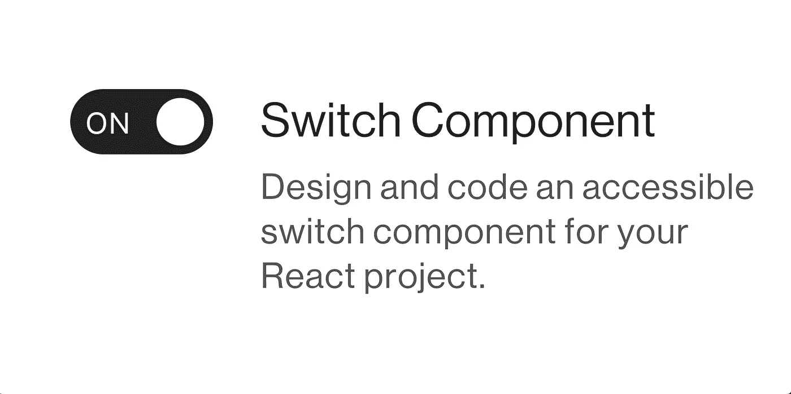

# 用 React 和 Typescript 构建一个可访问的开关组件。

> 原文：<https://levelup.gitconnected.com/build-an-accessible-switch-component-with-react-and-typescript-d455a405aaa>



具有选中状态和描述性标签的开关组件。

由于苹果 iOS 的普及，开关已经成为任何 web 组件库的基本 UI 元素。与需要显式表单提交的复选框不同，开关在相反的状态之间切换时会立即产生效果。

在我们的过程中，我们将考虑有效设计架构的关键挑战。我们的主要责任最终在于可访问性和可重用性。然而，我们不应该在简单性上妥协。从而在外部系统中实现有效而无缝的采用。

# 工程考虑


开关的检查和未检查状态。预览不包括禁用或聚焦状态。

不幸的是，语义 HTML 不支持本地开关元素。我们可以选择一个简单的`<input type="checkbox" role="switch" />`，使用 CSS 声明`appearance: none;`移除所有默认的浏览器样式，并应用我们自己的定制样式。

## 普通 HTML 结构

```
<label for="id_input">
    <input id="id_input" type="checkbox"></input>
    <div class="switch-labels">
        <span>Label</span>
        <p>Description</p>
    </div>
</label>
```

我们应该使用一个`<label />`作为我们的开关容器，用于它与 HTML `<input />`标签的定向耦合。标签有一个独特的属性`for`，允许它们成为匹配输入`id`的别名点击目标，只要它当前存在于文档对象模型(DOM)中。

此外，我们的容器将包含一个`<span />`作为我们的主要标签文本，以及一个可选的`<p>`描述。

## 辅助功能


切换组件的标签焦点状态以及 Mac 的 VoiceOver 公告。

`role="switch"`使屏幕阅读器能够根据复选框输入固有的布尔选择来表达“开”和“关”状态。默认情况下，输入元素是可聚焦的。我们将使用自己的自定义 css 样式进一步增强焦点状态。

文本和描述性标签必须具有与其父容器相对应的唯一分配的`id`属性。我们将在`aria-labelledby`中利用这些属性，通过辅助技术实现正确的公告。

## 定制 SCSS 风格


具有“关闭”状态和弯曲方向的开关组件:行-反向。

我们的布局将使用`display: flex;`和`align-items: flex-start;`来构建——因此垂直地将元素向顶部对齐。因此，我们只需几行 CSS 就可以轻松定制我们的布局。当可用空间不足时，需要一些水平间距`gap: 4px;`来防止文本和开关之间的交叉。

有了 CSS，我们可以使用伪类选择器`:checked`很容易地识别出`<input type="switch" />`何时处于选中状态。我们还将使用`::before`伪选择器来创建一个`position: absolute;`圆形旋钮。适用时，可通过`::before:checked`选择器控制向右动画。

在实施过程中，您将看到开关旋钮圆圈对面的“开”和“关”文本。我们利用`content: attr();`声明将 HTML 属性解析成 CSS。

> 强烈建议使用 CSS 自定义属性或 SCSS 变量，以确保整个设计系统的一致性。

# React & TypeScript 实现

在下面的实现中，我们有意识地决定拥有一个受控组件。我们正在重载`onChange`事件处理程序，并传递一个显式的布尔属性来确定选中或未选中状态。

# 最后的想法

我们充分分析了双态开关触发器，并设计了一个灵活的组件。所使用的大多数原则几乎没有偏见，并且能够容易地被外来主机系统采用。

对于纯 JavaScript 实现，您总是可以删除与 TypeScript 相关的声明。记住在你的 CSS 中使用 REM 单位的设计符号。

# 参考资料和进一步阅读

 [## WAI-ARIA 创作实践 1.1-复选框

### 本文档为读者提供了如何使用 WAI-ARIA 1.1 [WAI-ARIA]创建可访问的丰富…

www.w3.org](https://www.w3.org/TR/wai-aria-practices-1.1/#checkbox) [](https://developer.mozilla.org/en-US/docs/Web/Accessibility/ARIA/Roles/switch_role) [## ARIA:切换角色-可访问性| MDN

### ARIA 角色在功能上与 checkbox 角色相同，只是它不代表“选中”和…

developer.mozilla.org](https://developer.mozilla.org/en-US/docs/Web/Accessibility/ARIA/Roles/switch_role) [](https://developer.mozilla.org/en-US/docs/Web/Accessibility/ARIA/Attributes/aria-labelledby) [## aria-labelledby-Accessibility | MDN

### aria-labelledby 属性标识标记它所应用到的元素的元素。

developer.mozilla.org](https://developer.mozilla.org/en-US/docs/Web/Accessibility/ARIA/Attributes/aria-labelledby) [](https://developer.mozilla.org/en-US/docs/Web/CSS/:checked) [## :checked - CSS:级联样式表| MDN

### 用户可以通过选中/选择一个元素来启用该状态，或者通过取消选中/取消选择该元素来解除该状态…

developer.mozilla.org](https://developer.mozilla.org/en-US/docs/Web/CSS/:checked) [](https://developer.mozilla.org/en-US/docs/Web/CSS/content) [## 内容- CSS:级联样式表| MDN

### content CSS 属性用生成的值替换元素。使用内容属性插入的对象是…

developer.mozilla.org](https://developer.mozilla.org/en-US/docs/Web/CSS/content) 

# 如果你觉得这篇文章有用，请与他人分享。一些掌声👏🏻下面多多帮忙！

通过鼓掌，你可以帮助其他人发现这些内容，并激发更多关于可访问性、设计、反应和 JavaScript 的文章的写作！