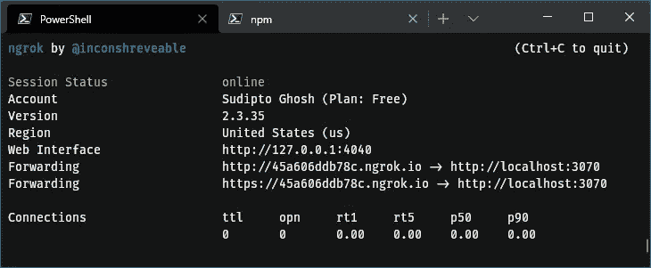
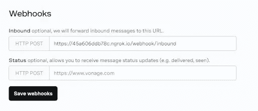
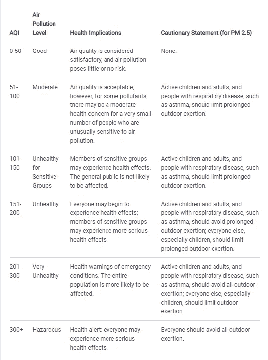
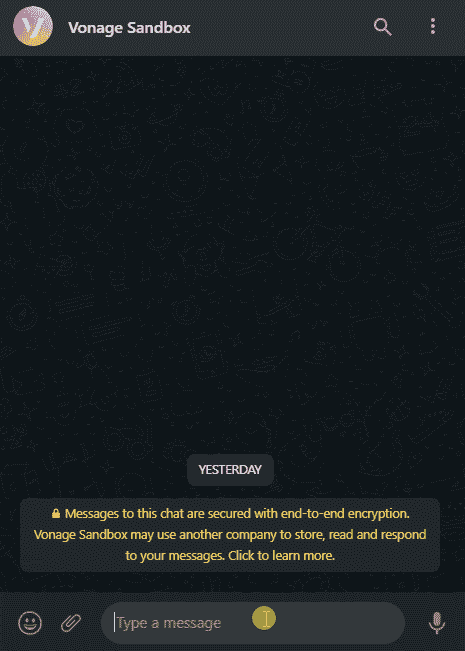
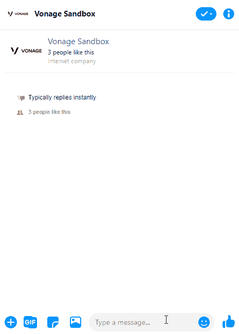

# 使用消息 API 构建空气质量报告服务

> 原文：<https://levelup.gitconnected.com/build-an-air-quality-reporting-service-with-messages-api-5852b53ab070>

您是否考虑过扩展您现有的应用程序来与多个通信渠道进行交互？如果我们可以用这个想法来引起人们对空气污染和气候变化等问题的关注，会怎么样呢？

世界空气质量指数项目是一个始于 2007 年的非营利性项目。他们的任务是促进空气污染意识，并确保获得世界范围的空气质量信息。它们提供 REST APIs 来访问来自全球各地的天气和空气质量监测站的数据。您可以使用其他数据源来构建一个关注社会问题的服务！

在这个例子中，我们将构建一个由 Node.js 提供支持的服务，node . js 是一个 JavaScript 运行时和 [Vonage Messages API](https://www.vonage.com/communications-apis/messages/) ，它将通过 WhatsApp 和 Facebook Messenger 发送给定位置的当前空气质量信息。

我们将要构建的示例的源代码也可以在 [GitHub](https://github.com/sudiptog81/vonage-aqi) 上找到。

# Vonage API 帐户

要完成本教程，您将需要一个 [Vonage API 帐户](http://developer.nexmo.com/ed?c=blog_text&ct=2020-12-02-build-an-air-quality-reporting-service-with-messages-api)。如果您还没有，您可以今天就[注册](http://developer.nexmo.com/ed?c=blog_text&ct=2020-12-02-build-an-air-quality-reporting-service-with-messages-api)并开始使用免费信用点数进行构建。一旦你有了一个帐户，你可以在 [Vonage API 仪表板](http://developer.nexmo.com/ed?c=blog_text&ct=2020-12-02-build-an-air-quality-reporting-service-with-messages-api)的顶部找到你的 API 密匙和 API 秘密。

# 设置开发环境

我们需要为我们的应用程序打开一个`ngrok`隧道，以最小的配置在互联网上公开它。安装`ngrok`后，打开一个终端，执行`ngrok http 3070`，将本地端口 3070 暴露给互联网。确保使用`.env`中的`PORT`变量来覆盖它。将`ngrok`打印的 HTTPS 网址复制到控制台并记下。

现在是时候为应用程序安装所需的依赖项了。执行`npm init -y`创建一个`package.json`文件。我们将使用 express . js——node . js 的一个流行的 web 应用程序框架，Axios——这个项目的一个 HTTP 客户端库，以及 Dotenv——一个管理环境变量的模块。稍后，我们还将利用 Dedent 和 Commander.js 来实现更多功能。通过执行以下命令来安装这些模块:

由于我们会不时地对源代码进行修改，所以我们可以通过安装 Nodemon 来节省一些击键次数，node mon 会持续监视修改并自动重启应用程序。通过执行以下命令将其作为开发依赖项安装

对于本教程，我们的切入点将是一个名为`lib/index.js`的文件。添加或更新`package.json`中的`main`和`script`键，使用 nodemon 执行应用程序:

将主目录中`.env.example`的内容复制到名为`.env`的新文件中。登录到 Vonage API 仪表板后，找到您的 API 密钥和 API 密码，并更新`.env`中的值。在接下来的章节中还会分配一些额外的变量。

# 使用消息 API 接收入站消息

每当 Vonage 在您的虚拟电话号码上或通过其他渠道接收到一条传入消息时，Vonage 服务器就会使用 JSON 有效负载向一个已定义的 webhook 端点发出 HTTP 请求。对于本教程，我们假设应用程序中的`/webhook/inbound`路由将监听所有这样的请求。

为了确保我们收到这个请求，我们需要配置沙盒环境，您可以在 Vonage API 仪表板的“消息和调度”下找到它。将入站消息 Webhook (HTTP POST)设置为`<ngrok-https-url>/webhook/inbound`，并点击“保存 webhooks”。

在同一页面上，链接一个测试帐户以发送邮件。点击 WhatsApp 和 Messenger 频道上的“添加到沙盒”链接。然后扫描手机上的二维码或者点击给定的链接。它通常包括向为沙箱提供的号码或页面发送密码短语。一旦您链接了您的测试帐户并设置了 webhook 端点，您就可以继续了。将仪表板上提到的沙盒电话号码保存到您的地址簿中，以便于访问。

我们将构建一个 Express.js 应用程序来监听端口`3070`上的 webhook 请求。最低要求是接受该路由上的 HTTP POST 请求，并发送一个状态代码`200`。在我们的 Express.js 应用程序中，可以通过`req.body`对象访问这个有效负载。为了查看有效负载请求数据，通过执行`npm run dev`来运行应用程序。

尝试从 WhatsApp 向沙盒号发送一条消息，并在运行应用程序的终端窗口上观察输出。从 Messenger 应用程序向沙盒页面发送另一条消息，并再次观察输出。

上例中显示的输出表明，通过验证`req.body.from.type`可以区分不同的通道。根据渠道的不同，我们还注意到入站消息可能来自电话号码或页面/帐户 ID。发送的消息可以通过请求体中的`req.body.message`对象来访问。

将`VONAGE_NUMBER`的值设置为`req.body.to.number`中接收到的电话号码，将`VONAGE_PAGE_ID`的值设置为`req.body.to.id`中的页面 ID，将`.env`中的相应变量设置为我们正在使用的沙箱。在实践中，这将被一个 WhatsApp 商业账号和链接到 Vonage 应用程序的脸书页面 ID 所取代。

# 使用消息 API 发送消息

使用 Vonage Messages API，向通道发送消息包括向 API 端点发送带有消息对象的 HTTP POST 请求。使用沙箱时，端点为:`[https://messages-sandbox.nexmo.com/v0.1/messages](https://messages-sandbox.nexmo.com/v0.1/messages.)` [。](https://messages-sandbox.nexmo.com/v0.1/messages.)

[消息 API 引用](https://developer.nexmo.com/api/messages-olympus?theme=dark#NewMessage)表明请求必须包含一个值为`Basic base64(apiKey):base64(apiToken)`或`Bearer jwtToken`的`Authorization`头和请求体中的一个消息对象。要使用它，用下面的例子更新您的`/lib/utils.js`文件:

助手函数`sendMessage`将把消息的正文发送到定义的 WhatsApp 号码。可以动态构造消息对象以支持多个通道；您可以在另一个实用函数中实现这一点。

更新你的`/lib/index.js`文件，在 webhook 函数中，用你想发送的消息调用`sendMessage`函数，如下所示:

我们已经为一个对话服务构建了一个框架，它将使用 Messages API 通过 WhatsApp 和 Messenger 发送和接收消息。尝试向 WhatsApp 上的 Vonage 沙盒号码发送消息！

# 从世界空气质量指数 API 获取数据

世界空气质量指数项目为接近实时的空气质量数据提供 JSON APIs。为了访问数据，[注册一个 API 令牌](https://aqicn.org/data-platform/token/)。我们将在此页面上提供的电子邮件地址上收到一个验证链接，该链接会将我们重定向到显示 API 令牌的页面。将`.env`中`AQICN_TOKEN`的值设置为该页面上显示的令牌。

使用 WAQI 搜索 API 为特定城市搜索匹配的空气质量监测站。对`https://api.waqi.info/search/`的 HTTP GET 请求有两个必需的查询参数- `keyword`用作查找电台或城市名称的搜索词，以及`token`引用 WAQI API 令牌。

从 Postman 或失眠症(两者都是用于调试 HTTP API 请求的流行 GUI 应用程序)内部发出请求，我们可以看到对关键字`london`的响应包含每个搜索结果的[有限站元数据](https://aqicn.org/json-api/doc/#api-Search-SearchByName)。

是时候为我们的应用程序实现一个实用函数来获取搜索结果的顶部结果，并使用它来检索预期的数据了。

要从车站获取提要数据，再发出一个 HTTP GET 请求，这次是对 WAQI City/Station 提要 API 的请求。这个 API 的端点是`https://api.waqi.info/feed/<station-url>/`，其中`station-url`对应于由`getStation`返回的`station`对象中的`url`键值。API 令牌也需要作为查询参数。

对于`london`返回的测站请求，返回一个 JSON 对象，其中包含[原始测量值和详细的测站元数据](https://aqicn.org/json-api/doc/#api-City_Feed-GetCityFeed)，如下所示:

实现另一个实用函数来发出这个请求。该函数将从`getStation`获取的`station`对象作为参数，并向 API 查询来自站点的数据。通过添加以下`getStationData`功能来更新`lib/utils.js`:

我们现在可以使用我们的实用函数来查询 WAQI API，在 Vonage Messages API 支持的通道上接收消息，并在处理这些数据后发送回一个有意义的回复。

# 回复相关信息

我们从 WAQI APIs 获得的数据需要进行处理，并使其“可读”。我们可以使用两种不同的模板来报告数据，一种是包含空气质量指数和美国环保署 2016 年健康影响的简要报告，另一种是提及污染物水平和天气信息及其各自测量单位的详细报告。

空气质量污染水平健康影响警告声明(针对 PM 2.5)

*来源:* [*AQI 基础知识，AirNow*](https://www.airnow.gov/aqi/aqi-basics/)

我们还必须从晦涩的缩写中分辨出污染物的名称和不同的天气指标。我们可以参考 [WAQI API 参考](https://aqicn.org/json-api/doc/)并实现实用函数来完成这项工作。我们还可以定义额外的帮助函数，在这些函数中我们可以使用字符串插值方法，并可选地为 WhatsApp 格式化消息。这些助手函数的实现可以在 GitHub 上的源代码中找到。

[Dedent](https://www.npmjs.com/package/dedent) 在处理多行 ES6 JavaScript 模板文字时是一个有用的模块。您可能会发现它在源代码中被大量使用，以保持更好的可读性。

# 用 Commander.js 解析入站消息

解析明确针对服务的消息并对不同的命令采取不同的操作是很有用的。最初为命令行应用程序构建的 [Commander.js](https://github.com/tj/commander.js) 库可用于解析命令和参数的入站消息。

Commander.js 库支持必需的和可选的参数、变量参数和命令别名，并且使任务比手动检查命令和参数容易得多。

# 确保状态为 Webhook 的交货

我们可以建立一个新的路由来监听我们在`/webhook/status`发送消息后发生的事件。确保您将此附加到`ngrok`隧道，并将其保存为 Vonage API 仪表板上的状态 Webhook，然后单击“保存 webhooks”。

下次我们的服务收到消息并回复它时，我们会观察到所发送消息的不同状态。`req.body.status`字段将包含发送 webhook 请求时消息对象转换到的状态。当 Vonage 服务器收到消息时，对象处于`submitted`状态。如果交付确实成功，我们应该收到一个状态值，可能是`delivered`后跟`read`。

如果有错误，状态可能是`rejected`或`undeliverable`，理论上，我们可以单独处理这种情况。请注意，Vonage 做了大量繁重的工作，在消息传递失败的情况下定期重试。

# WhatsApp 和 Messenger 游乐场

确保应用程序正在运行，并且正确的`ngrok`隧道保存在消息沙箱中。拿起你的手机，发送信息到沙盒帐户。这东西真的能用的时候，感觉是不是很好？

# WhatsApp

# 送信人；通信员

# 包扎

这个项目展示了 Vonage APIs 在集成几乎任何应用程序方面的灵活性。我们讨论了 WhatsApp 和 Messenger 的多渠道通信，并在本例中使用了 WAQI APIs。我很好奇看完这篇文章后你会建造什么！

# 进一步阅读

你可以在[GitHub 库](https://github.com/sudiptog81/vonage-aqi)上找到本教程中显示的代码和工作应用程序的完整源代码。

务必在 [Vonage API 开发者](https://developer.nexmo.com/messages/overview)和 [Vonage API 参考](https://developer.nexmo.com/api/messages-olympus)上查看消息 API 的相关文档。进一步了解如何在 Vonage API Developer 上与 [WhatsApp](https://developer.nexmo.com/messages/concepts/whatsapp) 和 [Messenger](https://developer.nexmo.com/messages/concepts/facebook) 进行通信。

如果您没有 Vonage 帐户，[现在就注册一个](https://dashboard.nexmo.com/sign-up)以获得免费积分，并在您的下一个项目中使用 Vonage APIs！在 [Twitter](https://twitter.com/VonageDev) 上联系我们，或者加入[社区 Slack 频道](https://developer.nexmo.com/community/slack)。让我们知道你打算用 Vonage APIs 构建什么！

*最初发布于*[*https://learn . vonage . com/blog/2020/12/02/build-an-air-quality-reporting-service-with-messages-API*](https://learn.vonage.com/blog/2020/12/02/build-an-air-quality-reporting-service-with-messages-api)