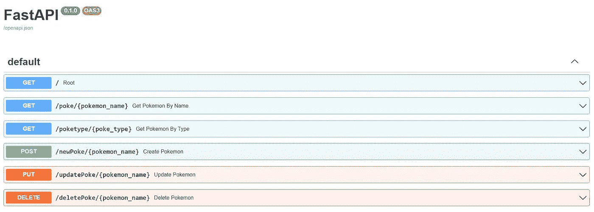
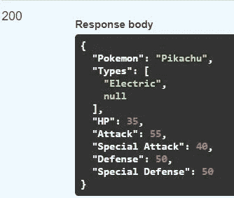
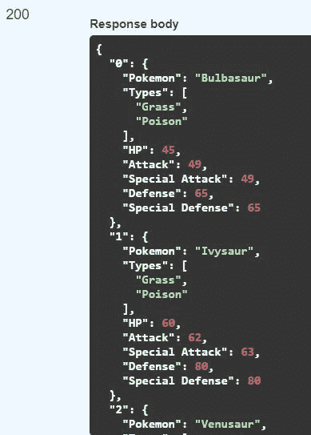
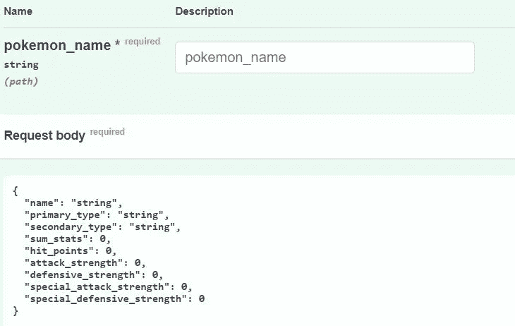
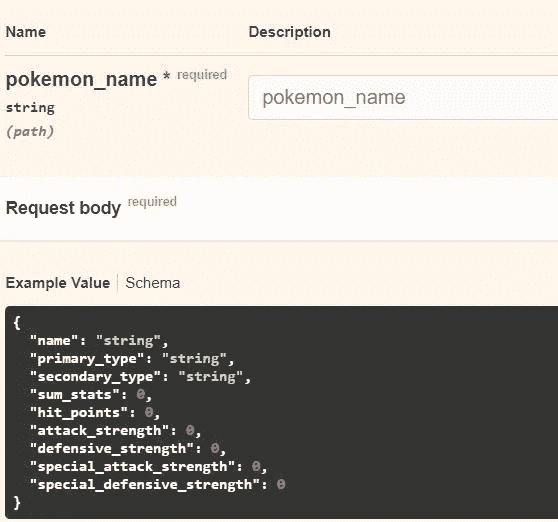
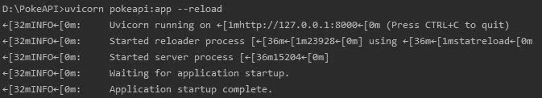

# 从头开始用数据库构建 API

> 原文：<https://levelup.gitconnected.com/build-an-api-with-a-database-from-scratch-9b9a39d7739d>

## 使用 FastAPI 和 Sqlite 的新项目


由[约书亚·索蒂诺](https://unsplash.com/@sortino?utm_source=medium&utm_medium=referral)在 [Unsplash](https://unsplash.com?utm_source=medium&utm_medium=referral) 拍摄的照片

春季学期结束了，暑假开始了，总觉得每年的这个时候都想学点新东西。

我的“暑期学习”清单上的第一项是构建一个 API，因为我以前从来没有机会构建一个，我认为在某个时候我会在工作中这样做，或者至少修改一个现有的 API。

# 简而言之，什么是 API？

> 应用程序编程接口

一个 API 基本上处理用户的*请求*并返回*响应*，就像餐馆的服务员处理你的*订单*并为你提供*食物*一样。

就像在餐馆里一样，API 有一个预先定义的菜单，整个连接都基于它。

# 概观

为了让这个项目更有趣，我决定使用数据库。
我浏览了 Kaggle，寻找能吸引我眼球的东西，毫无疑问，我们将使用口袋妖怪数据集——理想情况下，你会像我意识到有这样的数据集一样兴奋。

你可以从 [Kaggle](https://www.kaggle.com/abcsds/pokemon) 获取数据集。

我们的项目将由两个主要文件组成——一个用于处理数据库调用，另一个用于 API。

**需求** : FastAPI，uvicorn，熊猫

到本文结束时，您将已经创建了以下 API



# 数据库ˌ资料库

创建你的第一个文件，命名为`database.py`，让我们开始编码。

从进口开始

```
from pathlib import Path
import sqlite3
import pandas as pd
```

sqlite3 数据库是一个基于文件的数据库，这意味着首先，我们必须创建一个包含数据集的文件。

```
DB_FILENAME = "poke_db.db"def init_db():
    if not Path(DB_FILENAME).is_file():
        Path(DB_FILENAME).touch()
```

接下来，我们将把下载的数据集加载到我们创建的数据库文件中。

```
def load_csv_to_db():
    init_db()
    conn = sqlite3.connect(DB_FILENAME)
    cursor = conn.cursor()
    cursor.execute('''
        CREATE TABLE IF NOT EXISTS Pokemons (idx int, name text,
        type1 text,type2 text, sum_stats int, hp int, attack int,
        special_attack int, defense int, special_defense int)''') poke_data = pd.read_csv('Pokemon.csv') poke_data.drop(['Speed', 'Generation', 'Legendary'], axis=1,
                    inplace=True) poke_data.columns = ['idx', 'name', 'type1', 'type2', 
                          'sum_stats', 'hp', 'attack',
                          'special_attack', 'defense',    
                          'special_defense'] poke_data.to_sql('Pokemons', conn, if_exists='append',
                      index=False)
```

简而言之，这个函数创建一个名为 Pokemons 的表，并将我们的数据集保存到数据库文件中。
我还省略了一些列——您可以保留它们，并将匹配的列添加到您的表中。

在我们继续讨论数据库查询之前，我要定义一个函数，这个函数在以后会很有用，它会让我们知道我们的表是否存在。

```
def table_exists(cursor):
    cursor.execute('''
        SELECT count(name) FROM sqlite_master WHERE type='table' AND
        name='Pokemons' ''') if not cursor.fetchone()[0]:
        return False
    return True
```

我们将定义的每个 API 调用最终都会查询数据库，因此我们将预先为 API 准备所需的功能。

我们的第一个 API 调用将允许我们通过名称检索 pokemon 的详细信息，因此我们将创建匹配的数据库查询

```
def get_poke_by_name(poke_name):
    conn = sqlite3.connect(DB_FILENAME)
    cursor = conn.cursor() if not table_exists(cursor):
        load_csv_to_db() cursor.execute('''SELECT * FROM Pokemons WHERE name = ?''', 
                    (poke_name,)) return cursor.fetchone()
```

下一个查询将根据口袋妖怪的类型检索它们的列表——每个口袋妖怪都有一个主要和次要类型，我们将能够查询这两种类型或只查询主要类型。

```
def get_poke_by_type(type1, type2=None):
    conn = sqlite3.connect(DB_FILENAME)
    cursor = conn.cursor() if not table_exists(cursor):
        load_csv_to_db() if type2:
        cursor.execute('''
        SELECT * FROM Pokemons WHERE type1 = ? AND type2 = ?''', 
        (type1, type2)) else:
        cursor.execute('''
        SELECT * FROM Pokemons WHERE type1 = ?''', (type1,))

    return cursor.fetchall()
```

以上两个查询的目标是基于一些参数检索口袋妖怪。
接下来的三个查询将负责添加、更新和删除口袋妖怪。

## 添加口袋妖怪

```
def add_poke_to_db(name, type1, type2, sum_stats, hp, attack, 
                   special_attack,defense, special_defense):  

    conn = sqlite3.connect(DB_FILENAME)
    cursor = conn.cursor() if not table_exists(cursor):
        load_csv_to_db() cursor.execute('''
        INSERT INTO Pokemons ('name', 'type1', 'type2', 'sum_stats',  
                          'hp', 'attack', 'special_attack', 
                          'defense', 'special_defense')
                           VALUES (?,?,?,?,?,?,?,?,?)''', 
                           (name, type1, type2, sum_stats, hp, 
                           attack, special_attack, defense, 
                           special_defense))
    conn.commit()
```

上面的函数使用传递的参数向数据库添加了一个新行。为了确保写出数据库的新状态，我们必须提交我们的更改。
如果我们不提交，在添加一个口袋妖怪后，我们将尝试按名称查询它，例如，我们可能会得到一个错误，说找不到口袋妖怪。

## 更新口袋妖怪

```
def update_poke(name, type1=None, type2=None, sum_stats=None,  
                hp=None, attack=None, special_attack=None, 
                defense=None, special_defense=None): conn = sqlite3.connect(DB_FILENAME)
     cursor = conn.cursor() if not table_exists(cursor):
        load_csv_to_db() params = [type1, type2, sum_stats, hp, attack, special_attack,
              defense, special_defense] params_names = ['type1', 'type2', 'sum_stats', 'hp', 'attack',
                    'special_attack', 'defense', 'special_defense'] for param, param_name in zip(params, params_names):
        if param:
            query = '''
                    UPDATE Pokemons SET ''' + param_name + '''    
                    = ? WHERE name = ?'''            cursor.execute(query, (param, name)) conn.commit()
```

由于我们希望只更新口袋妖怪的部分信息，我们将反复检查我们希望更新的参数，并在数据库中这样做。
出于上面提到的同样原因，我们最后使用提交。

## 删除口袋妖怪

```
def delete_poke(name):
    conn = sqlite3.connect(DB_FILENAME)
    cursor = conn.cursor() if not table_exists(cursor):
        load_csv_to_db() cursor.execute('''DELETE FROM Pokemons WHERE name = ?''',  
                       (name,))
     conn.commit()
```

根据口袋妖怪的名字删除一行，这是不言自明的。

# 应用程序接口

在准备好我们将要使用的所有数据库功能之后，最困难的部分已经过去了。我们现在要做的就是简单地包装我们的数据库函数并返回一些状态代码。

让我们创建第二个文件`pokeapi.py`，并继续编码。

从进口开始

```
from typing import Optional
from fastapi import FastAPI, Path, HTTPException, status
from pydantic import BaseModel
from database import get_poke_by_name, get_poke_by_type, 
                     add_poke_to_db, update_poke, delete_poke
```

为了快速了解我们的 API，让我们为 API 的根路径添加一条欢迎消息。

```
app = FastAPI()@app.get("/")
def root():
    raise HTTPException(status_code=status.HTTP_200_OK,  
                        detail="Welcome to PokeAPI")
```

虽然这是一个简短的片段，但我还是会回顾一些概念，因为它们也会在接下来的片段中重复。

首先，`app.get("/")`是做什么的？
它在我们的 API 的根路径中定义了一个 GET 请求—“/”。
当我们访问该路径时，将调用后面定义的函数。

其次，我们将使用 HTTPException 类引发异常，而不是返回一些带有默认状态代码的定制 JSON 消息。
作为一个参数，我们可以传递我们想要返回的状态代码和一些信息性的消息。

现在是我们第一次真正的 API 调用的时候了。

```
@app.get("/poke/{pokemon_name}")
def get_pokemon_by_name(pokemon_name: str = Path(None,  
                       description="Name of the pokemon you'd like 
                                   to retrieve")): pokemon = get_poke_by_name(pokemon_name) if not pokemon:
        raise HTTPException(status_code=status.HTTP_404_NOT_FOUND, 
                           detail="Pokemon not found") return {"Pokemon": pokemon[0],
            "Types": [pokemon[1], pokemon[2]],
            "HP": pokemon[4],
            "Attack": pokemon[5],
            "Special Attack": pokemon[6],
            "Defense": pokemon[7],
            "Special Defense": pokemon[8],
            }
```

为了理解这个片段，让我们先介绍一下路径参数。

路径参数是用户通过请求路径传递的参数。
在我们的函数中，`pokemon_name`是一个路径参数，这意味着如果用户键入`<server>/poke/Pikachu`，我们将进入带有参数`pokemon_name="Pikachu"`的函数`get_pokemon_by_name`。

我们可以通过使用 path 类来指定函数的参数是路径参数。将`None`指定为第一个参数意味着如果没有 pokemon 名称被传递，默认值将是`None`。

在函数体中，我们将首先检查所需的口袋妖怪是否存在，如果不存在，我们将引发一个异常，通知用户我们没有找到它。
如果我们找到了它，我们将使用我们想要检索的信息创建一个定制的 JSON。



口袋妖怪 _name = "皮卡丘"

下一个 API 请求将基于主要和次要类型检索多个口袋妖怪。
我们将允许仅基于主要类型或两种类型进行查询，这意味着次要类型将是可选的。

```
@app.get("/poketype/{poke_type}")
def get_pokemon_by_type(poke_type: str =  
                        Path(None,description="Primary type of the 
                        pokemons you want to query),
                        type2: Optional[str] = None): pokemons = get_poke_by_type(poke_type, type2) if not pokemons:
        raise HTTPException(status_code=status.HTTP_404_NOT_FOUND,
                            detail="No pokemon with this type")
    result = {}
    for idx, pokemon in enumerate(pokemons):
        result[idx] = {"Pokemon": pokemon[0],
                       "Types": [pokemon[1], pokemon[2]],
                       "HP": pokemon[4],
                       "Attack": pokemon[5],
                       "Special Attack": pokemon[6],
                       "Defense": pokemon[7],
                       "Special Defense": pokemon[8],
                       }
    return result
```

这次`poke_type`将是我们的路径参数，我们还有第二个可选参数——您不必像我一样用类`Optional`来指定它，但是它将更具可读性。

就像前面的 API 调用一样，如果我们没有找到任何指定类型的口袋妖怪，我们将返回一些错误异常。

如果我们确实找到了至少一个口袋妖怪，我们将检查我们得到的列表，并返回一个字典，其中的每一项都是包含口袋妖怪统计数据的字典。



主要类型=“草”，次要类型=“毒”

我们刚刚处理了两个 GET 请求，所以现在是时候发布、上传和删除请求了，这些请求将用于添加、更新和删除口袋妖怪。

这些类型的请求需要请求体——不像我们之前使用的查询和路径参数。请求体将是我们存储在数据库中的对象——一个口袋妖怪。
我们将添加一个用属性和属性类型定义口袋妖怪的类。

```
class Pokemon(BaseModel):
    name: str
    primary_type: str
    secondary_type: str
    sum_stats: int
    hit_points: int
    attack_strength: int
    defensive_strength: int
    special_attack_strength: int
    special_defensive_strength: int
```

现在我们可以在请求中使用这个类

```
@app.post("/newPoke/{pokemon_name}")
def create_pokemon(pokemon_name: str, pokemon: Pokemon):
    if get_poke_by_name(pokemon_name):
        raise HTTPException(
              status_code=status.HTTP_406_NOT_ACCEPTABLE, 
              detail="Pokemon already exists")    add_poke_to_db(pokemon.name, pokemon.primary_type, 
                   pokemon.secondary_type,
                   pokemon.sum_stats, pokemon.hit_points,
                   pokemon.attack_strength,
                   pokemon.special_attack_strength,
                   pokemon.defensive_strength,
                   pokemon.special_defensive_strength) raise HTTPException(
         status_code=status.HTTP_201_CREATED,  
         detail="Pokemon created successfully")
```

正如你所看到的，作为一个参数，这个函数将得到一个`Pokemon`对象，它将包含在我们的数据库中创建一个新的口袋妖怪所必需的所有细节。

函数体相当简单，首先，我们检查是否已经有一个口袋妖怪与我们传递的名字相同。
如果我们没有这样的口袋妖怪，我们将使用我们在数据库部分编写的函数来创建它。



继续我们的更新方法

```
@app.put("/updatePoke/{pokemon_name}")
def update_pokemon(pokemon_name: str, pokemon: Pokemon):
    if not get_poke_by_name(pokemon_name):
        raise HTTPException(status_code=status.HTTP_404_NOT_FOUND, 
                           detail="Pokemon not found") update_poke(pokemon.name, pokemon.primary_type,
                pokemon.secondary_type,
                pokemon.sum_stats, pokemon.hit_points,
                pokemon.attack_strength,
                pokemon.special_attack_strength,
                pokemon.defensive_strength,
                pokemon.special_defensive_strength) raise HTTPException(status_code=status.HTTP_200_OK,
                        detail="Pokemon details updated")
```

看了前面的方法之后，这一个可能看起来相当不言自明。
-通过`Pokemon`参数获取请求体。
-检查我们要更新的口袋妖怪是否存在。
-如果口袋妖怪存在，发送口袋妖怪参数到匹配的数据库函数。



只有我们将更改的参数将被设置—其余的将保持与请求前相同(基于我们如何实现匹配的数据库功能)。

恭喜，我们已经达到了最后的要求。

```
@app.delete("/deletePoke/{pokemon_name}")
def delete_pokemon(pokemon_name: str):
    if not get_poke_by_name(pokemon_name):
        raise HTTPException(status_code=status.HTTP_404_NOT_FOUND,
                            detail="Pokemon not found")
     delete_poke(pokemon_name) raise HTTPException(status_code=status.HTTP_200_OK,
                        detail="Pokemon deleted successfully")
```

这到现在看起来很简单。

# 如何执行

为了运行我们的 API 并开始运行，只需进入你的项目文件夹并在终端中输入

```
uvicorn pokeapi:app --reload
```

`pokeapi` —定义 API 的文件名。

`app` —保存对象的变量名称`FastAPI`。

一旦你做了，你应该能看到这个



现在去`http://127.0.0.1:8000/docs`开始到处玩。

# 结论

我们学习了如何从零开始创建一个与数据库集成的 API，并经历了所有主要使用的请求类型。

你可以在我的 [GitHub](https://github.com/DevEliran/PokeAPI) 查看完整代码。

最后，我想向你介绍我的[博客](http://codingkaiser.blog)，在那里你可以找到更多我的作品。

如果你考虑成为中级会员并希望支持我，你可以在我的[推荐链接](https://eliran9692.medium.com/membership)注册。