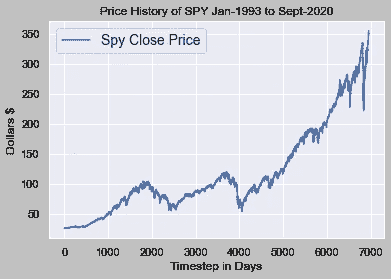
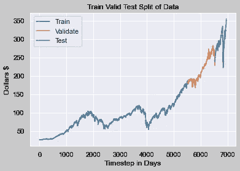
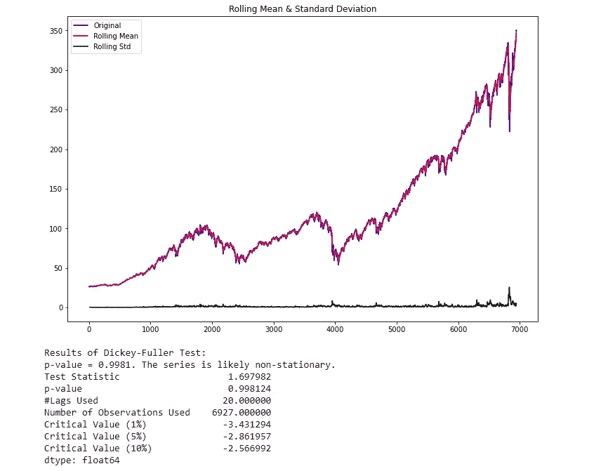
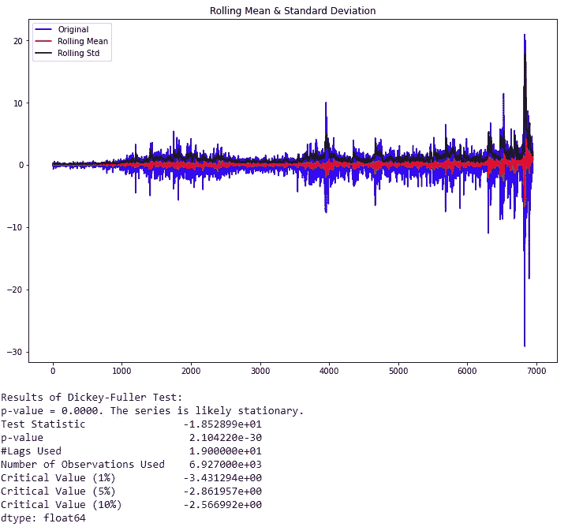
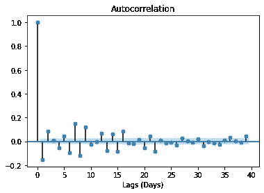
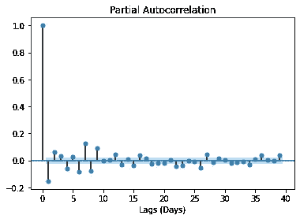
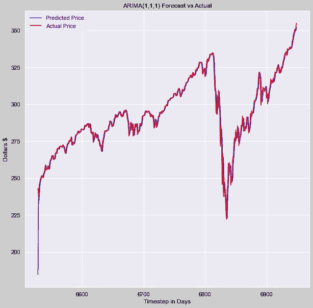
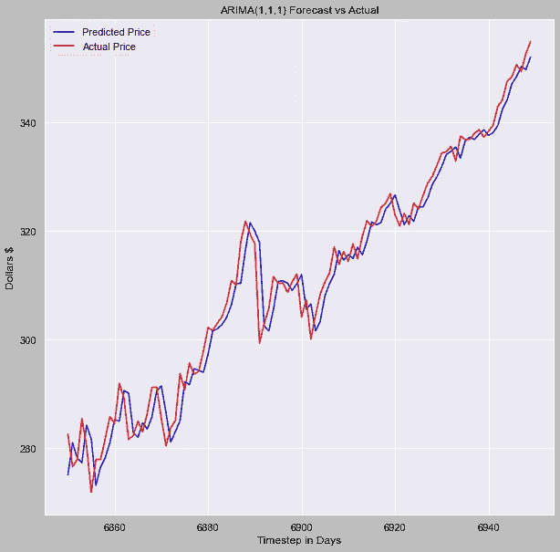

# 建立一个 ARIMA 模型来预测股票价格

> 原文：<https://levelup.gitconnected.com/build-an-arima-model-to-predict-a-stocks-price-c9e1e49367d3>

## 这个博客将教你如何提取必要的数据，并创建一个预测标准普尔 500 价格的模型！


马库斯·斯皮斯克在 [Unsplash](https://unsplash.com/s/photos/stock-market?utm_source=unsplash&utm_medium=referral&utm_content=creditCopyText) 上的照片

# 前言

如果你正在读这篇文章，很可能是因为你喜欢解谜。我天生是一个非常好胜的人。谜题的珠穆朗玛峰，在我看来，就是试图通过股市的活跃交易来寻找超额收益。这篇博客是我尝试——希望——登上算法交易的令人生畏的珠穆朗玛峰并盈利的第一篇文章。

首先，我必须赎罪。**我是一个失败的日内交易者。在一个夏天的工作间隙，我尝试了日内交易。我读过的所有东西都告诉我在交易前要有计划，当我真的交易时，不管我的情绪如何，都要坚持我的交易计划。我确信这不成问题。我对自己所有的恶习都了如指掌——不是吗？如果你是人类，那么答案是否定的。不，你无法控制你的恶习。这是老虎钳的字面定义。我太天真了，谢天谢地，我在对我的账户造成任何实际损害之前就退出了。然而，就像飞蛾扑火一样，我不能留下一个好的谜题。我将重返战场，但这次我有一个计划。我计划建立一个纯粹的量化系统，把交易计划中最糟糕的部分(你自己)从等式中去掉。**

在你继续说下去之前，让我说这篇博文仅仅是关于 ARIMA 模型的，这篇序言只是未来完整算法交易系统的一个预告片。如果介绍没有吓退你，让我们从一个简单的 ARIMA 模型开始，它可以帮助我们预测你选择的任何股票明天的每日收盘价。

# 让我们编码

ARIMA 是首字母缩写，代表自回归综合移动平均线。在这篇博客中，我将分解实施一个成功的 ARIMA 模式的必要步骤。

## 第一步:获取数据

对于这个例子，我们将使用间谍 ETF。SPY 是一种模仿 S&P500 的 ETF，后者是一篮子按市值加权的股票。许多 ETF 模仿标准普尔 500，但这是最常见和最具流动性的基金。

为了使用它，我们将使用 yfinance API。如果你没有安装这个 API，在你的 Jupyter 笔记本上安装一个简单的 pip 就可以了。如果你想了解更多关于这个 API 的信息，[查看 PyPI 页面了解更多细节](https://pypi.org/project/yfinance/)。

```
!pip install yfinance
```

现在，让我们将股票“间谍”的全部每日历史放入一个整洁的数据框架中。

```
import yfinance as yf
import pandas as pdspy = yf.Ticker("SPY")# get stock info
spy.info# get historical market data as df
hist = spy.history(period="max")# Save df as CSV
hist.to_csv('SPY.csv')# Read back in as dataframe
spy = pd.read_csv('SPY.csv')# Convert Date column to datetime
spy['Date'] = pd.to_datetime(spy['Date'])
```

如果你打印出“spy.info ”,你会得到一个包含大量股票额外数据的字典。我们目前担心的只是这款车型的收盘价。对象“hist”是一个数据帧，我们将它发送给 CSV 以获得一个本地副本。如果你想的话，你可以在每天收盘后运行这个程序，获得最新的信息。



间谍的价格历史

## 步骤 2:拆分数据

这段代码直接来自我的笔记本，其中有多个型号，所以数据分割可能看起来有点大材小用。对于纯粹的 ARIMA 模型，您只需要一个训练和测试数据集。然而，我提供的代码将数据分割成一个训练、测试和验证数据集。在所有的机器学习应用中，拆分数据是非常重要的。

```
# Set target series
series = spy['Close']# Create train data set
train_split_date = '2014-12-31'
train_split_index = np.where(spy.Date == train_split_date)[0][0]
x_train = spy.loc[spy['Date'] <= train_split_date]['Close']# Create test data set
test_split_date = '2019-01-02'
test_split_index = np.where(spy.Date == test_split_date)[0][0]
x_test = spy.loc[spy['Date'] >= test_split_date]['Close']# Create valid data set
valid_split_index = (train_split_index.max(),test_split_index.min())
x_valid = spy.loc[(spy['Date'] < test_split_date) & (spy['Date'] > train_split_date)]['Close']#printed index values are: 
#0-5521(train), 5522-6527(valid), 6528-6947(test)
```

我相当随意地选择了这些日期。你可以随意把它们改成你想要的。现在，让我们画出一幅我们的数据是如何分割的图。下图显示了如何通过区分颜色来分割数据。请记住，我们提取了每日数据，因此每个时间步长相当于 1 天。图中的数据跨度从 1993 年 1 月到 2020 年 9 月 1 日。



截至 2020 年 9 月 1 日的“间谍”ETF 历史图

## 步骤 3:测试数据是否稳定

我可以省去这一步，告诉你如果你在看一个股票价格，它很可能不会是平稳的。这是因为，一般来说，股票价格会随着时间的推移而上涨。如果您有不稳定的数据，数据的平均值会随着时间的推移而增长，这会导致模型的退化。

相反，**你应该预测一只股票收盘价的日回报率，而不是实际价格本身。**为了测试数据是否平稳，我们使用了扩展的 Dickey-Fuller 测试。这里有一段代码可以帮助加速这个过程。

```
from statsmodels.tsa.stattools import adfullerdef test_stationarity(timeseries, window = 12, cutoff = 0.01):#Determing rolling statisticsrolmean = timeseries.rolling(window).mean()rolstd = timeseries.rolling(window).std()#Plot rolling statistics:fig = plt.figure(figsize=(12, 8))orig = plt.plot(timeseries, color='blue',label='Original')mean = plt.plot(rolmean, color='red', label='Rolling Mean')std = plt.plot(rolstd, color='black', label = 'Rolling Std')plt.legend(loc='best')plt.title('Rolling Mean & Standard Deviation')plt.show()#Perform Dickey-Fuller test:print('Results of Dickey-Fuller Test:')dftest = adfuller(timeseries, autolag='AIC', maxlag = 20 )dfoutput = pd.Series(dftest[0:4], index=['Test Statistic','p-value','#Lags Used','Number of Observations Used'])for key,value in dftest[4].items():dfoutput['Critical Value (%s)'%key] = valuepvalue = dftest[1]if pvalue < cutoff:print('p-value = %.4f. The series is likely stationary.' % pvalue)else:print('p-value = %.4f. The series is likely non-stationary.' % pvalue)print(dfoutput)
```

既然你有了这个函数，让我们来使用它。

```
test_stationarity(series)
```



test _ stationarity()的输出

获得的 **p 值大于 0.05 的显著性水平，**和 **ADF 检验统计量大于任何临界值。没有理由拒绝零假设。**所以，时间序列是非平稳的****

正如您所看到的，这个函数为您提供了所有必要的信息，以防您忘记。正如我们所想的，数据不是静止的。为了使数据平稳，**我们需要取数据的一阶差分。这只是用昨天的收盘价减去今天的收盘价的一种奇特的说法。**不出所料，熊猫有一个方便的功能可以帮我们做到这一点。

```
# Get the difference of each Adj Close point
spy_close_diff_1 = series.diff()# Drop the first row as it will have a null value in this column
spy_close_diff_1.dropna(inplace=True)
```

既然我们已经尝试让我们的数据集保持稳定，让我们测试它以确保稳定。**重新运行 test _ stationary(spy _ close _ diff _ 1)。**



间谍 ETF 的一阶差分

获得的 **p 值小于显著性水平 0.05，**并且 **ADF 统计低于任何临界值。我们拒绝零假设。**所以，时间序列实际上是平稳的。**最后，我们的数据是静止的，我们可以继续。在某些情况下，您可能需要多次这样做。**

## 步骤 3:自相关和偏自相关

自相关是时间点 t (Pₜ)和点 at(Pₜ₋₁).之间的相关性偏自相关是时间 t 点(Pₜ)和 k 是任意数量滞后的点(Pₜ₋ₖ)。部分自相关忽略两点之间的所有数据。

以一个电影院的票房来说，自相关性决定了今天的票房和昨天的票房的关系。相比较而言，偏相关定义了本周五的门票销售和上周五的门票销售之间的关系。

以下是绘制自相关和偏自相关的快速方法:

```
from statsmodels.graphics.tsaplots import plot_acf,plot_pacfplot_acf(spy_close_diff_1)
plt.xlabel('Lags (Days)')
plt.show()# Break these into two separate cells
plot_pacf(spy_close_diff_1)
plt.xlabel('Lags (Days)')
plt.show()
```



自相关和部分自相关图

这些图看起来几乎一模一样，但事实并非如此。让我们从自相关图开始。这些图的重要细节是第一个滞后。如果第一个滞后为正，我们使用自回归(AR)模型，如果第一个滞后为负，我们使用移动平均(MA)图。**由于第一个滞后为负，第二个滞后为正，我们将使用第一个滞后作为移动平均点。**

对于 PACF 图，由于在滞后 1 时有显著下降，这是负相关的，我们也将使用 AR 因子 1。如果你很难确定什么样的延迟是最好的，请随意尝试，并观看 AIC。AIC 越低越好。

ARIMA 模型将三个主要输入纳入“顺序”论证。这些参数是 AR 项的“p”，差分项的“d”，MA 项的“q”。我们已经确定我们的数据的最佳模型是阶(1，1，1)。同样，您可以随意更改这些数字，并打印出模型的摘要，以查看哪种变化具有最低的 AIC。训练时间比较快。

```
# Use this block to
from statsmodels.tsa.arima_model import ARIMA# fit model
spy_arima = ARIMA(x_train, order=(1,1,1))
spy_arima_fit = spy_arima.fit(disp=0)
print(spy_arima_fit.summary())
```

## 第四步:预测

既然您已经找出了哪个模型具有最好的 AIC 分数，我将使用 order = (1，1，1)。让我们使用这个模型对我们的测试数据集进行预测..现在，我确信一定有更快的方法来完成这件事，但这是我的方法。此单元的运行时间可能需要一些时间。**运行时间很长，因为它一次移动一个数据点，重新调整模型并为第二天创建预测。最后一行代码非常关键，因为它是 Jupyter Notebook 的一个神奇命令，即使你重启笔记本的内核，它也会存储模型预测。这一行将避免您以后必须重新运行该单元格。**

```
# Create list of x train valuess
history = [x for x in x_train]# establish list for predictions
model_predictions = []# Count number of test data points
N_test_observations = len(x_test)# loop through every data point
for time_point in list(x_test.index):
    model = ARIMA(history, order=(1,1,1))
    model_fit = model.fit(disp=0)
    output = model_fit.forecast()
    yhat = output[0]
    model_predictions.append(yhat)
    true_test_value = x_test[time_point]
    history.append(true_test_value)
MAE_error = keras.metrics.mean_absolute_error(x_test, model_predictions).numpy()
print('Testing Mean Squared Error is {}'.format(MAE_error))%store model_predictions
```

下面是如何从 Jupyter magic 命令重新加载存储变量的代码。保存并重新加载您的模型也是最佳实践。

```
# %store model_predictions
%store -r model_predictions# Check to see if it reloaded
model_predictions[:5]# Load model
from statsmodels.tsa.arima.model import ARIMAResults
loaded = ARIMAResults.load('arima_111.pkl')
```

## 步骤 5:可视化你的模型

查看模型的输出以了解它如何处理数据中的特定情况总是很重要的。您可能会发现一些可能导致模型进一步改进的特殊行为。

```
from sklearn.metrics import mean_absolute_value
arima_mae = mean_absolute_error(x_test,model_predictions)
arima_mae
```

对于这个模型，我使用平均绝对误差作为损失函数。我喜欢金融模型的这种损失函数，因为它的单位很容易想象。**ARIMA(1，1，1)模型的损失为 2.788。这一损失意味着实际值和模型预测值之间的平均差异为 2.79 美元。**看看这段时间的波动，我想说 2.97 美元对于我们测试期间的疯狂波动来说并不算太糟糕。让我们绘制图表，看看进一步检查后会是什么样子。

```
plt.rcParams['figure.figsize'] = [10, 10]plt.plot(x_test.index[-100:], model_predictions[-100:], color='blue',label='Predicted Price')
plt.plot(x_test.index[-100:], x_test[-100:], color='red', label='Actual Price')
plt.title('SPY Prices Prediction')
plt.xlabel('Date')
plt.ylabel('Prices')
# plt.xticks(np.arange(881,1259,50), df.Date[881:1259:50])
plt.legend()
plt.figure(figsize=(10,6))
plt.show()
```



左边是完整的 ARIMA 模型预测，右边是放大的部分

模型看起来相当不错！查看完整的测试数据集，您看不到我们的预测和实际值之间有任何差距。**即使在面对更复杂的深度学习模型时，这个模型也表现良好。这个模型优于我在相同数据集上构建和训练的许多深度学习模型。**

# 结论

谢谢你能走到这一步并阅读我的博客！我希望你喜欢它，并从中学到一些东西。在将这个模型应用到交易系统之前，还有很多工作要做。

典型的交易系统是输出交易信号的多个模型和数据源的集合。理解如何使用你的模型来产生交易信号是很重要的，然后彻底回测你的模型来计算所有的交易成本。只有到那时，你才应该试着在纸上交易账户上实施你的系统，看看效果如何。

我还没有达到这些下一阶段，但是当我做到的时候，我一定会分享我的发现！

*领英:*

[*www.linkedin.com/in/blakesamaha*](http://www.linkedin.com/in/blakesamaha)

*个人网站:*

[*aggressiontothemean.com*](http://www.aggressiontothemean.com/)

*推特:*

[*@ Mean _ Agression*](https://twitter.com/Mean_Agression)