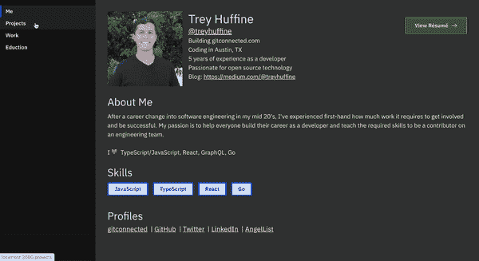
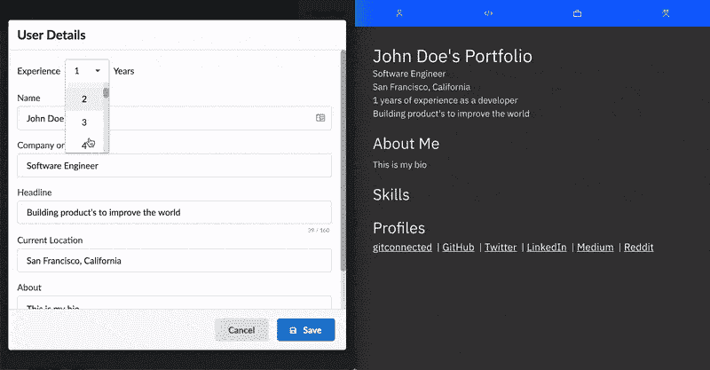
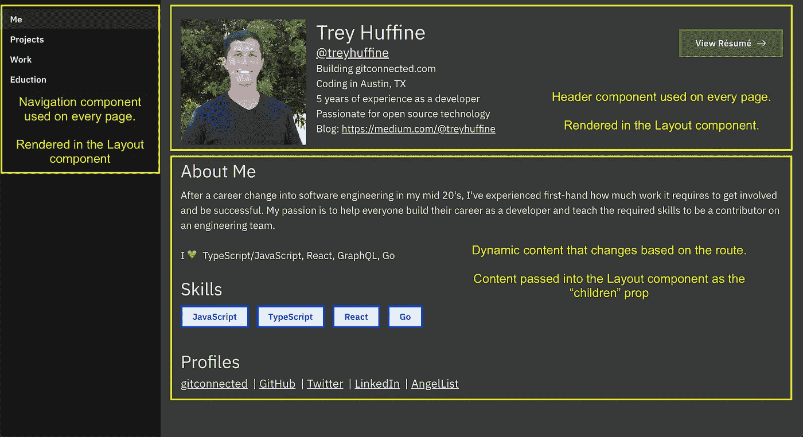
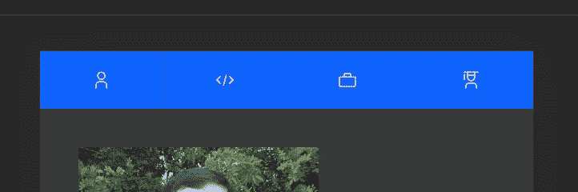
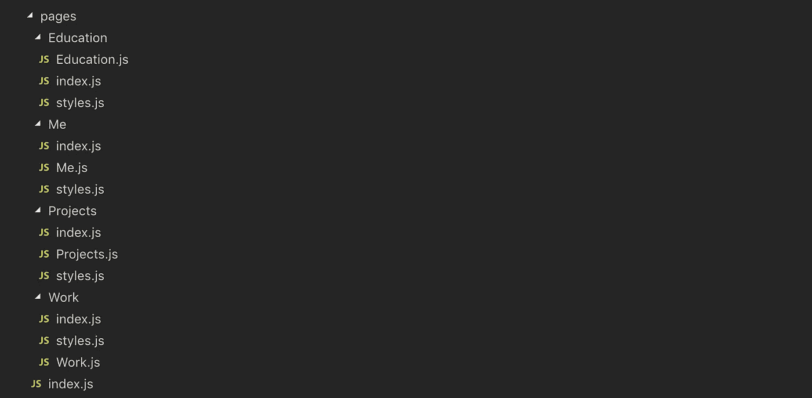
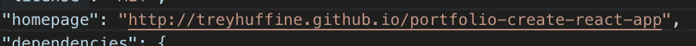
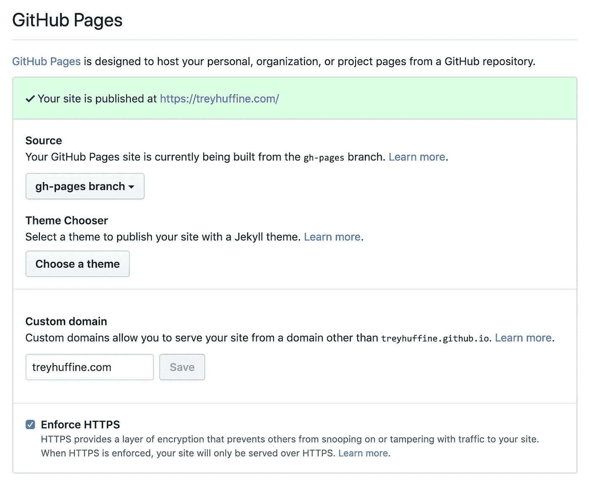

# 使用 React 构建一个出色的开发者组合网站

> 原文：<https://levelup.gitconnected.com/build-an-awesome-developer-portfolio-website-using-react-667abd7bab4d>

## 使用 Create React App 和 gitconnected.com 作品集 API 来建立你的个人网站



在本文中，我将带您浏览使用 React 和 Create React App 构建您的作品集网站，并将完成的项目部署到 GitHub 页面。

[](https://skilled.dev) [## 编写面试问题

### 一个完整的平台，在这里我会教你找到下一份工作所需的一切，以及…

技术开发](https://skilled.dev) 

投资组合对每个开发人员来说都是必不可少的。它给你机会展示你的项目，向每个人展示你热衷于使用的编程语言和库。

使用[gitconnected.com 投资组合 API](https://gitconnected.com/portfolio-api) ，我们可以消除投资组合网站最大的痛苦之一——维护数据，使其总是最新的。我们将使用钩子获取 React 应用程序中的数据，这样您的投资组合将始终保持同步，而无需进行代码更新或重新部署项目。您还将在`gitconnected.com/<USERNAME>/resume`获得一份格式化的简历。看看[我的简历](https://gitconnected.com/treyhuffine/resume)作为例子。你现在有一个单一的链接给招聘人员，引导他们不断更新的简历。

如果你想看到完整的工作代码或者在任何一点卡住了，你可以在 GitHub 上找到[这个项目。](https://github.com/treyhuffine/portfolio-create-react-app)

# 入门指南

导航到您的项目目录并初始化应用程序:

```
npx create-react-app portfolio
```

我们将使用 React Router 为 CSS-in-JS 创建不同的视图、样式组件，并将 [Carbon components](https://www.carbondesignsystem.com/components/overview) 作为我们的 UI 框架。Carbon 的风格使用 Sass，所以我们需要在构建过程中处理它。

```
yarn add react-router-dom styled-components carbon-components carbon-components-react [@carbon/icons-react](http://twitter.com/carbon/icons-react) [@carbon/themes](https://github.com/carbon-design-system/carbon/blob/master/packages/themes) sass
```

# 获取您的数据

我们将从获取我们的投资组合的数据开始，因为我们只需要一个请求，并可以将响应用于整个应用程序。使用您的 GitHub/gitconnected 用户名，我们将使用 React hooks 和`fetch`向 portfolio API 发出请求。可以通过向以下 URL 发出 GET 请求来访问 API:

```
https://gitconnected.com/v1/portfolio/<username>
```

要查看示例用户，请访问—[https://git connected . com/v1/portfolio/Richard-hendrick s-demo](https://gitconnected.com/v1/portfolio/richard-hendricks-demo)



在`src/App.js`中，我们使用`useEffect`钩子来发出请求，只有当组件通过使用空数组`[]`作为“观察”参数挂载时。我们用`useState`钩子存储结果，并将它传递给我们的投资组合组件，我们将在接下来的部分中构建这些组件。

# 布局组件

我们的应用程序中的每个页面都将具有相同的一般结构。将有一个侧栏，有我们的投资组合的不同领域的导航。将有一个顶部部分，将显示您的一般信息，然后我们将有一个动态部分在此之下，将随着页面的变化而变化。



## 共享样式

我们的页面会有一些我们想要分享的常见样式，所以让我们先创建一个`src/styles.js`文件并添加我们可重用的样式组件。

## 标题组件

我们的 header 组件在每页的顶部显示您的一般详细信息。它包括你的基本信息——对我来说，我使用了我的头像以及我的名字、用户名、职务、位置、经验年限、标题和博客。

创建一个`src/components/UserHeader`文件夹，并在其中创建一个`index.js`文件、一个`styles.js`文件和一个`UserHeader.js`文件。在`index.js`内部，我们简单地导入和导出组件:

我们添加 CSS 来样式化和定位 header 组件中的内容。在`styles.js`中:

我们在文章开始时作为数据获取的`user`属性将用于填充该组件的内容。`user.basics`部分将包含您的所有详细信息。

我们还提供了动态生成简历的链接，这样我们就不必担心构建自己的简历或在简历发生变化时生成/上传新版本。

您的`UserHeader.js`组件将包含以下内容:

我们使用 React 路由器的`useLocation`钩子来确定我们是否在主页上。为了获得更好的移动体验，我们将只在主页上显示 header 组件，而不是在每个页面上。

## 侧栏组件

侧边栏是访问者如何导航到你的投资组合的不同部分。首先创建一个`src/components/Sidebar`文件夹，并在其中创建一个`index.js`文件。在其中，我们将导入和导出下一步要构建的`Sidebar`组件。

为了使我们的页面移动响应，我们需要隐藏移动设备屏幕宽度的`Sidebar`。创建一个`styles.js`文件并添加以下代码:

现在我们可以在`Sidebar.js`文件中构建出`Sidebar`组件。我们将为 SPA 导航链接使用`<Link>`组件，并使用`useLocation`挂钩来确定哪条路径是活动的。我们创建了一个包含路线名称和路径的数组，并通过这些数组来构建链接。你的`Sidebar`将如下:

## 移动导航组件

对于移动设备，我们将在页面顶部设置按钮，导航至您投资组合的不同部分。



创建一个`src/components/MobileNav`文件夹，并在其中创建一个`index.js`文件。在这个文件中，我们将导入和导出下一步要构建的`MobileNav`组件。

将`style.js`文件添加到`MobileNav`组件文件夹中。

最后，创建您的`MobileNav.js`组件文件，它只是页面顶部的 4 个导航按钮。

## 布局组件

组件将是所有页面的外壳。它将包含`UserHeader`、`Sidebar`和`MobileNav`组件，然后包装特定于投资组合的每个部分的`children`。

创建一个`src/components/Layout`文件夹，里面有`index.js`、`styles.js`和`Layout.js`文件。在`index.js`文件中，我们将像以前一样导入和导出`Layout.js`组件。

在`styles.js`文件中，让我们的结构移动响应。

我们的`Layout.js`组件将设置我们的`Sidebar`和`MobileNav`组件，以便我们在每一页上都有导航。它还将`UserHeader`添加到每个页面的顶部，我们将`user`属性传递给它。我们将`children`用于动态页面内容，它将是从父页面组件传递来的组件。

# 页

我们将使用 React Router 访问投资组合不同部分的不同视图(关于我、项目、工作和教育)。每一页将提供从我们从 gitconnected.com 组合 API 收到的数据的`user`道具。这将提供所有的内容，我们需要建立我们的投资组合的每一页

创建一个`src/pages`文件夹并添加一个`index.js`文件。该文件将声明每个投资组合部分的路线。

然后在`pages`文件夹中，我们为每条路线创建顶层文件夹— `Me`、`Projects`、`Work`和`Education`。在每个文件夹中，创建一个`index.js`、`styles.js`和`<PageComponentName>.js`。正如我们之前所做的，在每个单独的`index.js`文件中导入和导出组件文件(为了简洁起见，我不再在下面的代码中展示这个步骤)。



## 关于我页面

`Me`页面将包含关于您的其他一般信息——您的简历、技能和社交媒体链接。这个页面需要的其他样式很简单。在`styles.js`中增加:

`Me.js`将使用`user.basics.summary`和`user.basics.profiles`以及`user`支柱上的`user.skills`。

## 项目页面

作为开发人员，展示您的项目是最重要的事情之一。它显示了你热衷于解决的问题类型以及你所使用的语言/框架。先加你的`styles.js`:

然后在我们的`Projects.js`文件中，我们`map`到`user.projects`并显示项目名称、摘要和用于构建它的语言/库:

## 工作页面

此部分将允许您显示您的工作和相关工作经验。在`styles.js`文件中，添加以下代码:

然后在`Work.js`中，我们映射所有的`user.work`项目并显示作业的细节:

## 教育页面

此部分将显示您的教育背景。在 styles.js 文件中，添加以下代码:

然后在`Education.js`中，我们映射所有的`user.education`项目:

# 黑暗模式的全局样式

我们将使用来自 Carbon 的黑暗模式主题，这是通过他们的 Sass 文件提供的。

将`src/index.css`文件重命名为`src/index.scss`。为了确保我们的项目在全球范围内使用 Carbon CSS，我们将在这个文件中导入它们的样式表。我们还添加了一些额外的样式来支持黑暗模式和移动响应。将`index.scss`的内容替换为:

然后在你的`src/index.js`，改变你的风格导入使用新的文件名`import './index.scss'`。这就是我们使用碳纤维所需要的——我们剩下的造型工作将通过我们之前构建的样式组件来完成。

# 部署到 GitHubPages

> ***注(18/5/2020):我强烈推荐您将此部署为*** [***自定义域***](https://help.github.com/en/github/working-with-github-pages/configuring-a-custom-domain-for-your-github-pages-site) *。如果没有，您需要将* `*/<repo-name>*` *作为前缀添加到我们在项目中创建的所有路线，以便它们正确匹配。如果您既不使用自定义域也不添加前缀，您将在部署时得到空白页。* [*这篇文章更详细地解释了这个问题*](https://maximorlov.com/deploying-to-github-pages-dont-forget-to-fix-your-links/) *。*

按照这些步骤，你应该有一个完整的投资组合网站！剩下唯一要做的就是部署它。我将免费使用 [GitHub Pages](https://pages.github.com/) 来部署我们的静态投资组合站点，但是另一个好的/简单的选择是使用 Netlify。

提交你所有的代码，推送到 GitHub。我把我的回购命名为`portfolio-create-react-app`。[如果您在创建回购和上传代码方面需要帮助，请遵循本指南](https://help.github.com/articles/adding-an-existing-project-to-github-using-the-command-line/)。

1)将`"homepage": "http://<username>.github.io/<repo-name>"`添加到您的`package.json`中。用您使用的值替换`<username>`和`<repo-name>`——我的值是`treyhuffine`和`portfolio-create-react-app`。



2)安装`gh-pages`作为开发依赖:

```
yarn add -D gh-pages
```

3)向您的`package.json`添加 2 个脚本:

```
"predeploy": "npm run build",
"deploy": "gh-pages -d build"
```


4)最后，运行`yarn deploy`并访问您在主页中指定的 URL。

5)如果你使用的是自定义域名(强烈推荐)，你需要使用与 URL 相同的回购名称(对我来说，我最终的回购名称和[匹配的 URL 是](https://github.com/treyhuffine/treyhuffine.com) `[treyhuffine.com](https://github.com/treyhuffine/treyhuffine.com)`)。将其设置为从`gh-pages`分支部署，添加一个出现在`gh-pages`分支的`CNAME`文件，并更新 GitHub 中的设置，如下图所示。



# 结论

我们使用 React、风格化组件和 Carbon 设计构建了一个高质量的动态开发人员组合。我们使用了黑暗模式主题，并使用 React Router 创建了不同的页面，以在我们不同的投资组合部分之间导航。

借助 gitconnected.com 投资组合 API，我们能够动态加载我们的投资组合详细信息。这使我们无需更改任何代码或重新部署网站就能进行更新。我们只需更改我们的 Gitconnected 个人资料，并看到它们传播到我们的投资组合和简历中。