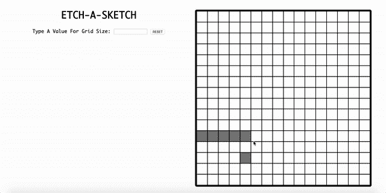

# 用普通的 JS、CSS 和 HTML 构建一个草图

> 原文：<https://levelup.gitconnected.com/build-an-etch-a-sketch-knock-off-with-plain-js-css-and-html-9ab9e104b43f>

## 一个有趣的项目，提高您的 DOM 操作技能

我最近构建了一个 etch-a-sketch 变体，作为练习基本 JavaScript、CSS 和 HTML 的练习。我想记录我的经历，以便加强我对我所构建的东西的理解，并避免“我不知道它是如何工作的，但它工作了！”视角。我也希望听到任何反馈！

# 超文本标记语言

我从一个基本的 HTML 框架开始:

然后，我在这个 HTML 框架中填入了我觉得我的项目需要的内容:

我想让我的“蚀刻草图”网格占据页面的右半部分，标题和交互元素放在左边。为此，我用类“right”编写了一个 div 来包含右半部分的元素，对于我的项目来说，它就是“grid container”div。

接下来，我使用了一个名为“left”的 div 来包含要委托给左侧的元素。在这里，我将我的标题作为标题元素，为用户添加了一个输入来更改网格中的方块数，并编写了一个 reset 按钮来清除网格并使其恢复到默认大小。

当然，我是以我的 JavaScript 的脚本标签结束的。

# 半铸钢ˌ钢性铸铁(Cast Semi-Steel)

接下来，我将分解我的 CSS 文件。这是最终产品:

再说一遍，大部分都很简单。

我将文本放在页面中央，选择摩纳哥作为我的字体。摩纳哥是一个有趣的，复古风格的字体，散发出数字的氛围。

我给了最终组成我的网格的方块一个白色背景和黑色边框，并写了一个单独的灰色背景的类，当用户用鼠标悬停在网格上时触发。我最初给了我的正方形一些填充，但在意识到这将改变整体网格大小后，我移除了它。

我的“gridContainer”的 CSS 花了一些时间，因为我还不熟悉 CSS-grid。回想起来，它看起来非常简单，但是在构建它的时候有点费劲。

我需要做的就是将我的显示设置为 inline-grid，然后使用‘grid-template-columns’和 grid-template-rows’为我的网格设置默认的行数和列数。我给我的蚀刻草图网格设置了高度和宽度，默认为 16 行 16 列。

如果你想学习更多关于 CSS 网格布局的知识，[这个](https://css-tricks.com/snippets/css/complete-guide-grid/)是一个很好的资源。

# Java Script 语言

在这三个部分中，这一部分稍微复杂一些。代码如下:

首先，我创建了变量来抓取网格、用户输入和重置按钮 div。

我写的第一个函数是`createGrid()`，顾名思义，这个函数构建了我的草图网格。这个函数由一个运行了 256 次的 for 循环组成，创建了 256 个“正方形”div，并附加到我的网格中。因为我的网格的 CSS 默认设置为 16 行 16 列，这 256 个方块将完美地填充它。

下一个功能是`updateGrid()`，它使用户能够动态改变组成蚀刻草图的行数和列数。

首先，我清除了默认网格构建中的`innerHTML`,这样我们就不会不断地在旧的方格上叠加新的方格。接下来，我编写了 JavaScript，通过动态插入用户输入来更改网格 CSS 的列和行。最后，我编写了一个 for 循环，实现用户输入，根据需要构建和添加尽可能多的方块，以填充新的列和行。

定义这些函数后，我在一个名为 square 的变量中获取 div 'square '元素。然后，我向每个将侦听“mouseover”的方块添加了一个事件侦听器，当用户用鼠标经过一个方块时，该方块将被分配一个新的类，该类将把它的背景色从白色改为灰色。

我还在输入字段中添加了一个事件监听器，这样一旦用户输入了调整网格大小的新值，就会触发`updateGrid()`函数。

最后，我在重置按钮上添加了一个事件监听器。这个 JavaScript 清除了所有现有的网格 HTML，并将网格 CSS 重置为默认值。然后它触发`createGrid()`来重建默认值。

而且最终的产品看起来就像上面的 gif！又来了:

而且就是这么简单！如果你对我如何改进我的代码有任何反馈，我很乐意听到。接下来，我想为用户添加选择不同颜色来填充网格的功能。

## 感谢您的阅读，祝您建设愉快！