# 用天蓝色 AI 和 Unity 构建用于检测病毒性肺炎、细菌性肺炎的图像分类器

> 原文：<https://levelup.gitconnected.com/build-an-image-classifier-for-detecting-viral-pneumonia-bacterial-pneumonia-with-azure-ai-and-ae616b4d3b59>

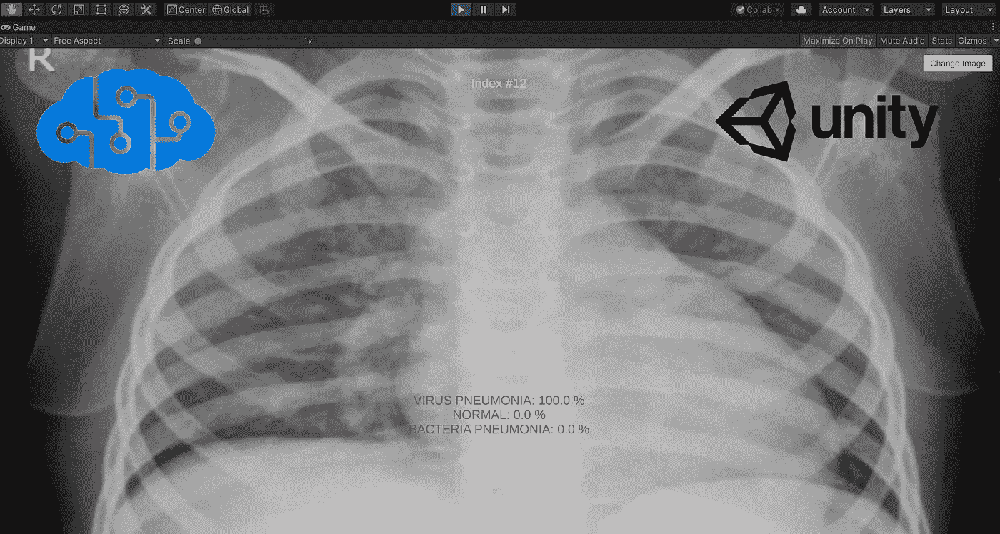

> 安东尼奥·古特雷斯的《现在是团结的时候了》

# 为什么用 AI 检测病毒性肺炎，细菌性肺炎？

世界因 2020 年的新冠肺炎疫情而改变。世界各地的医务人员在抗击新冠肺炎的战斗中表现出了勇敢和坚韧，有些人甚至在履行职责时献出了生命。作为一个普通人，作为一个程序员，我也想帮忙。所以用 AI 来尝试帮助诊断肺部疾病，比如病毒性肺炎，细菌性肺炎，是我有兴趣尝试的一个想法。

我是 Azure 和 Unity 的拥护者，所以我的第一个想法是用 Azure 和 Unity 实现一个可以用于肺部胸片的图像分类器。除了游戏行业，Unity 还可以在其他行业发挥作用，所以我觉得把 Azure 和 Unity 结合起来，创造一些对人有帮助的功能，是一个很有意思的想法。

# Azure 认知服务

Azure 是一个云计算平台，它也为开发者提供人工智能服务。 [Azure Cognitive Services](https://azure.microsoft.com/en-us/services/cognitive-services/) 是一个全面的人工智能服务和认知 API 系列，可帮助您构建智能应用。

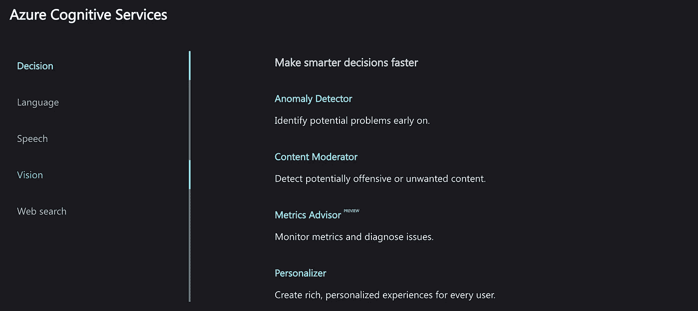

如上图所示，Azure Cognitive Servies 包含许多不同类型的人工智能服务，如决策服务、语言服务、语音服务、视觉服务和网络搜索服务。

我们需要的是人工智能视觉服务。通过使用视觉服务，我们可以识别和分析图像、视频和数字墨水中的内容。为了训练我们自己的模型，我们可以选择视觉服务的定制视觉服务来定制图像识别以符合我们的需求。

# 创建自定义 Vision 项目并获取数据集

Azure 提供的自定义视觉服务为我们开发和部署自定义计算机视觉模型提供了一个用户友好的界面。在下图中，您可以找到创建符合我们用例的自定义计算机视觉模型的过程。

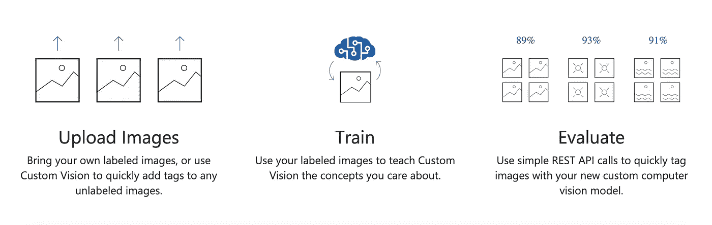

因此，让我们创建自定义视觉项目，并在线获取合适的数据集。

 [## 自定义视觉-主页

### 带上您自己的已标记图像，或使用自定义视觉快速添加标签到任何未标记的图像。使用您的标签…

www.customvision.ai](https://www.customvision.ai/) 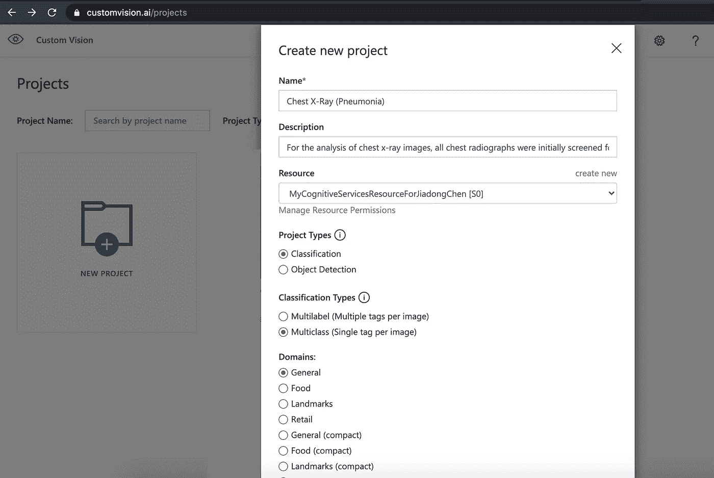

我们需要做的第一件事是在 Custom Vision 站点上创建一个项目。我们应该确定项目的名称，并创建一个新的 Azure 认知服务资源(如果不存在的话)。项目类型有两种选择，*分类*和*物体检测*。在我们的例子中，我选择分类类型。

第二件事是寻找一个合适的数据集，这些图像用于稍后训练我们的模型。在这种情况下，我将使用 Paul Mooney 的数据集，您可以在这里找到它。数据集中有 5，863 张 x 光图像(JPEG)和 2 个类别(肺炎/正常)。

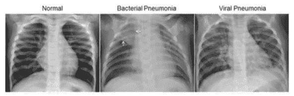

正常的胸部 x 光片(左图)描绘了清晰的肺部，图像中没有任何异常浑浊的区域。细菌性肺炎(中)典型地表现为局灶性肺叶实变，在本例中为右上叶(白色箭头)，而病毒性肺炎(右)表现为两肺弥漫性“间质”样改变。

# 训练模型

在网站上训练我们的计算机视觉模型非常容易。首先要选择合适的图片，用标签上传到我们创建的项目中。在这种情况下，我将使用三个标签对三组图像进行分类，分别是*病毒* *肺炎**细菌性肺炎**和*正常*。*

*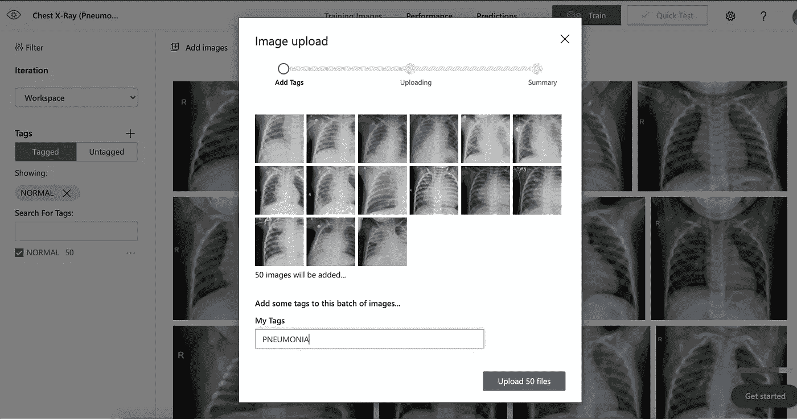*

*选择适当数量的图像是一个好主意，所以我为每个标签选择了大约 70 张图像进行训练。*

*然后点击网站右上角的培训按钮，会弹出一个窗口供您选择培训类型。*

*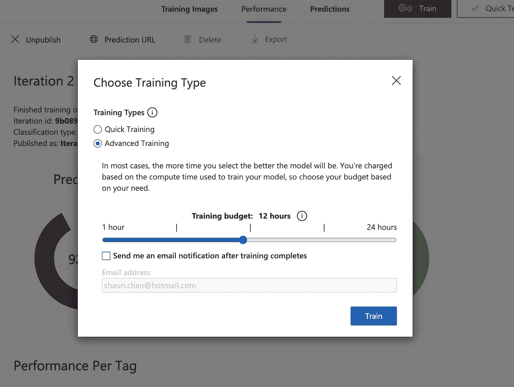*

*我选择的是高级培训类型，培训预算是 12 小时。*

*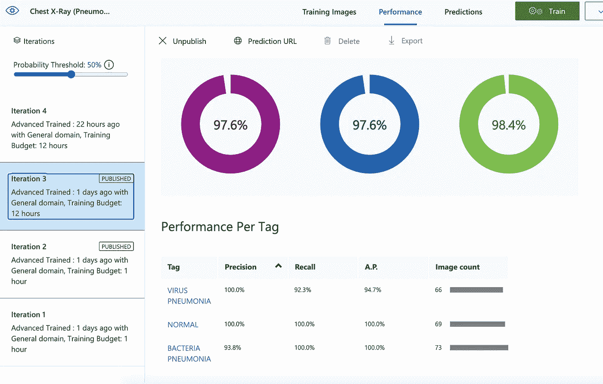*

*训练结束后，我们可以在性能页面上看到结果。为了测试这个模型，我们可以通过网站上的快速测试功能快速测试它。*

*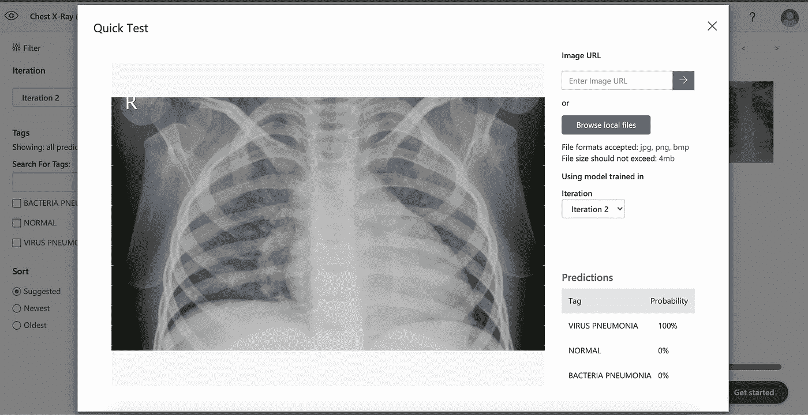*

# *整合 Azure 和 Unity*

*现在，我们得到了一个训练有素的计算机视觉模型和一个 API 来根据标签对图像进行分类。*

*然而，我想将功能集成到 Unity 中。好在微软提供了 C#语言的 Azure 自定义 Vision SDK。所以我觉得把它们整合起来是有可能的，即使我想在 Mac OS 上运行。*

*从 Unity 2018 开始，我们得到一个**。net standard 2.0** 兼容级别，对于 Nuget 包应该是完美的。只需使用一个单独的 VS 项目下载这个包，然后将 netstandard20 版本的 DLL 放到我们的 Unity 项目中。我做了一个. unitypackage 文件，包含了这些需要的 dll，你可以从[这里](https://github.com/chenjd/Unity.DetectPneumoniaWithAzure/releases/tag/SDK)下载。*

*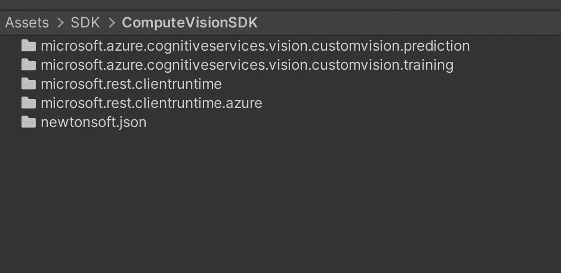*

*你可以在上图中看到我们在项目中需要的 dll。*

*然后我将在我们的 Unity 项目中设置 C#代码。*

```
*void **Start**()
{
    var ENDPOINT = Environment.GetEnvironmentVariable("CUSTOM_VISION_ENDPOINT");

    var predictionKey = Environment.GetEnvironmentVariable("CUSTOM_VISION_PREDICTION_KEY");

    _prediction = new CustomVisionPredictionClient(new Microsoft.Azure.CognitiveServices.Vision.CustomVision.Prediction.ApiKeyServiceClientCredentials(predictionKey))
    {
        Endpoint = ENDPOINT
    };
}*
```

*首先，我在 Unity 的 *Start* 方法中设置环境并创建一个*CustomVisionPredictionClient*的实例。正如您在上面的代码中看到的，我们需要自定义 Vision 资源的*端点*和同一资源的*键*来设置 Unity 中的环境。*

*您可以在自定义 Vision 项目站点的设置窗口中找到它们。你可以在下图中看到它。*

*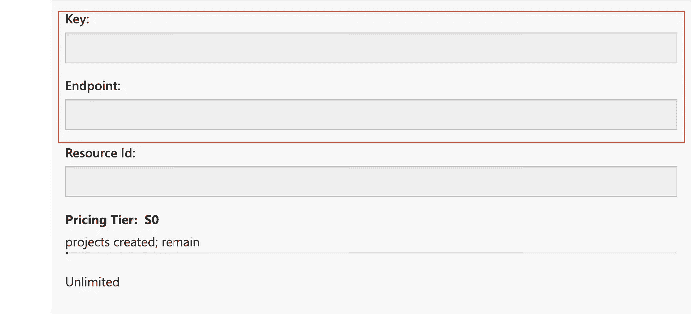*

*如果设置不正确，您将无法连接到正确的认知服务资源。*

*然后我们可以调用*CustomVisionPredictionClient*的`ClassifyImage`方法来*对输入的图像进行分类。**

```
*byte[] bytes = sprite.texture.**EncodeToPNG**();
_testStream = new MemoryStream(bytes);

var publishedModelName = "Iteration2";
var result = _prediction.**ClassifyImage**(_project.Id, publishedModelName, _testStream);*
```

*您需要提供项目的 id，您也可以在您的项目站点上找到它，以及 publishedModelName，您正在使用的模型(迭代)的名称。您可以在项目网站的性能页面上找到此名称。您需要提供的最后一个参数是输入图像的数据。*

*为了将 Unity 上下文中的纹理转换成所需的 MemoryStream 实例，我们调用 texture 的`EncodeToPNG`方法将纹理转换成字节数组，然后创建相应的 MemoryStream 实例。*

*最后，让我们添加一些胸部 x 光图像来测试 Unity 中的功能。*

*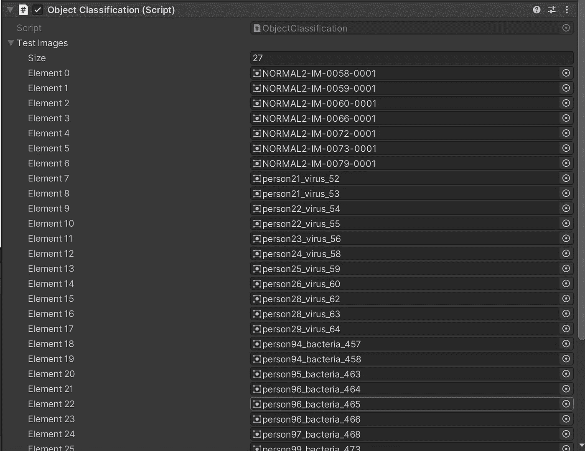*

*然后你可以在下面的视频中看到，我们的 Unity 项目现在可以正确地对胸部 x 光图像进行分类。*

*你可以在这里找到 Unity 项目回购(不包括 Azure 部分):*

*[https://github.com/chenjd/Unity.DetectPneumoniaWithAzure](https://github.com/chenjd/Unity.DetectPneumoniaWithAzure)*

*感谢您的阅读，希望对您有所帮助。*

*在[https://www.linkedin.com/in/chenjd/](https://www.linkedin.com/in/chenjd/)聊天*