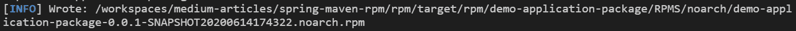
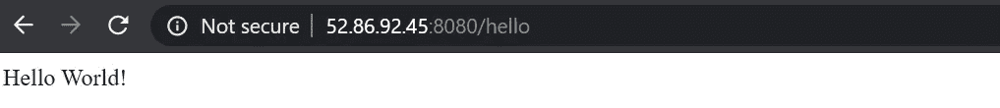

# 使用 Maven 和 Spring Boot 构建一个 RPM

> 原文：<https://levelup.gitconnected.com/build-an-rpm-using-maven-and-spring-boot-643aee7d2a4f>


## 本教程将介绍一种使用 Maven 将 Spring Boot java 应用程序构建到 RPM 包中的技术。

本文的目标是使用 **rpm-maven-plugin** 将 Spring Boot 应用程序打包成 RPM。我们不仅会介绍创建 RPM 的基础知识，还会包括安装前和安装后脚本，以确保您已经准备好构建自己的应用程序。

如果你对通过 Docker 打包感兴趣，看看下面的帖子。

[](https://medium.com/swlh/build-a-docker-image-using-maven-and-spring-boot-58147045a400) [## 使用 Maven 和 Spring Boot 构建 Docker 映像

### 使用 Maven 为您的 Spring Boot 应用程序构建 Docker 映像的三种技术。

medium.com](https://medium.com/swlh/build-a-docker-image-using-maven-and-spring-boot-58147045a400) 

让我们开始吧。

# Spring Boot 应用

出于演示目的，我们将使用 [Spring Boot 快速入门](https://spring.io/quickstart)中详细介绍的 Hello World 示例。您可以自带应用程序，或者使用为本文准备的源代码开始使用，这些源代码可以从 [GitHub](https://github.com/davelms/medium-articles/tree/master/spring-maven-rpm) 中克隆。

我用 Java 11 和 Maven 3.6.3 在 CentOS 7 上运行。我还在我的服务器上安装了 *rpm-build* 包。

使用`mvn package`构建，并使用`java -jar target/demo-application-0.0.1-SNAPSHOT.jar`验证应用程序是否按预期运行(如果您愿意，也可以使用`mvn spring-boot:run`)。

假设一切顺利，您应该能够在浏览器中点击[http://localhost:8080/hello](http://localhost:8080/hello)来查看您正在运行的 Spring Boot 应用程序。


现在让我们将这个应用程序打包成一个 RPM。

# 多模块项目结构

个人喜好在此；我喜欢保持单独的 pom.xml，因为我不喜欢副作用或创建多个工件的 pom(如果 pom.xml 说它创建了一个 jar，那是我个人期望它做的)。我的源代码结构将由两个模块组成— `app`(用于 Java 代码，构建 Spring Boot 可执行 jar)和`rpm`(用于打包成 RPM)。

```
my-project/app
my-project/app/src/main/java/com/example/demo/**DemoApplication.java**
my-project/app/**pom.xml**
my-project/rpm
my-project/rpm/**pom.xml** my-project/**pom.xml**
```

父 pom.xml 只是将 app 和 rpm 指定为模块。app pom.xml 是一个普通的 Spring Boot 示例，下面的配置被添加到了**spring-boot-maven-plugin**中。

```
<configuration>
  <executable>true</executable>
</configuration>
```

使用这个选项允许您直接运行 jar，即不使用`java -jar`，并且稍后在使用 yum/rpm 部署应用程序时只需要保存一点点配置。

从现在开始，我将专注于设置 RPM 包。

# 设置 RPM 包

当我们开始配置`rpm/pom.xml`时，第一步是指定包装。

```
<packaging>rpm</packaging>
```

接下来，我们需要确保我们定义了我们依赖于应用程序 jar 的构建，我们将它分离到了`app`模块中。在这里，我引用了 demo-application-app 并使用了其他值的属性。

```
<dependencies>
... <dependency>
    <groupId>${project.groupId}</groupId>
    <artifactId>demo-application-app</artifactId>
    <version>${project.version}</version>
  </dependency>...
</dependencies>
```

现在我们可以设置和配置 **rpm-maven-plugin** 本身了。接下来我们将介绍配置条目。确保您显式地将 **extensions=true** 设置为高亮显示，因为这允许我们更早地将打包设置为“rpm”。

```
<build>
  <plugins>
  ...

    <plugin>
      <groupId>org.codehaus.mojo</groupId>
      <artifactId>rpm-maven-plugin</artifactId>
      <version>2.2.0</version>
 **<extensions>true</extensions>**
      <configuration>
      ...
      </configuration>
    </plugin> ...
  </plugins>
</build>
```

## 配置 rpm-maven 插件

接下来的所有更改都将进入`<configuration>`部分。

我们可以对大多数属性使用默认值；但是，您需要为`<group>`设置一个值，因为它是强制的，没有默认值。

```
<group>${project.groupId}</group>
```

这样一来，我们就可以进行文件映射，并设置安装前和安装后的 scriptlets。有趣的东西。

出于本演示的目的，我将应用程序安装目录配置为`/var/demo-application`，用户/组将为`demo-application`。因为这个用户在默认情况下不存在，所以我们必须在预安装的 scriptlet 中创建它——我们稍后会谈到这个问题。

所有文件映射在`<mappings>`中被定义为一系列`<mapping>`条目。这些可以采用单个源到目标文件拷贝的形式，也可以采用整个目录的形式。我们的第一个文件将是应用程序 jar 本身，它来自我们的构建依赖项。格式应该是不言自明的，包含 **stripVersion=true** 将确保 jar 名称的一致性。

```
<mapping>
  <directory>/var/demo-application/</directory>
  <filemode>755</filemode>
  <username>demo-application</username>
  <groupname>demo-application</groupname>
  <dependency>
    **<stripVersion>true</stripVersion>**
    <includes>
      <include>${project.groupId}:demo-application-app</include>
    </includes>
  </dependency>
</mapping>
```

在这个阶段，你有了基本的结构。我们现在甚至可以测试它；运行`mvn package`，您应该会看到生成的初始 RPM。



使用`rpm -qpl`验证其当前内容，您将看到基本的文件系统结构正在形成。

```
/var/demo-application
/var/demo-application/demo-application-app.jar
```

安装这个 RPM 肯定可以工作，但是我们仍然缺少一些东西；

1.  我们的用户/组不存在——所以在这个阶段安装会将目录和 jar 默认为 *root* 用户。
2.  我们的应用程序目前不会作为服务运行，它不会在服务器重启时自动启动，等等。

接下来，我们将演示如何分别使用安装前和安装后脚本来实现这两个步骤。

## Scriptlets

RPM 包中可以包含许多脚本，这些脚本作为包的安装、删除或验证的一部分来执行。

我们将重点关注**pre script let**，它在软件包安装之前运行，对应于 spec 文件中的`%pre`标签，以及 **postinstallScriptlet** ，它在软件包安装之后运行，对应于`%post`标签。

让我们将这些引用添加到配置中，并编写两个 shell 脚本**。**

```
<preinstallScriptlet>
  <scriptFile>**src/main/resources/preinstall.sh**</scriptFile>
  <fileEncoding>utf-8</fileEncoding>
  <filter>true</filter>
</preinstallScriptlet><postinstallScriptlet>
  <scriptFile>**src/main/resources/postinstall.sh**</scriptFile>
  <fileEncoding>utf-8</fileEncoding>
  <filter>true</filter>
</postinstallScriptlet>
```

从我们的**预安装**脚本开始，我们希望确保用户和组已经创建，因此我们将使用`useradd`命令。

```
/usr/sbin/useradd -c "Demo Application" -U \
  -s /sbin/nologin -r \
  -d /var/demo-application demo-application 2> /dev/null || :
```

使用我们的 **postinstall** 脚本，我们希望确保在第一次安装 RPM 时启用服务。

```
if [ $1 -eq 1 ] ; then 
  # Initial installation 
  systemctl enable demo-application.service >/dev/null 2>&1 || : 
fi
```

说到这里，我们再来看看服务本身。因为我的目标是 CentOS 7，所以这个演示包括使用`systemd`的步骤。我们将把**demo-application . service**文件包含在我们的源存储库和映射中。

在目录`src/main/resources/systemd`下的源代码库中创建`demo-application.service`文件。

```
[Unit]
Description=demo-application
After=syslog.target[Service]
User=demo-application
ExecStart=/var/demo-application/demo-application-app.jar
SuccessExitStatus=143[Install]
WantedBy=multi-user.target
```

添加一个新的映射，定义我们希望在安装 RPM 时将这个文件复制到`/etc/systemd/system`目录。

```
<mapping>
  <directory>/etc/systemd/system</directory>
  <filemode>755</filemode>
  <username>root</username>
  <groupname>root</groupname>
  <sources>
    <source>
      <location>src/main/resources/systemd</location>
    </source>
  </sources>
</mapping>
```

# 构建、打包和安装

现在，我们已经准备好对 Spring Boot 应用程序(jar)进行测试构建，并将应用程序打包成一个 RPM 以备安装。

通过运行`mvn package`构建并打包应用程序。您可以运行 mvn 部署来分发 RPM，例如分发到 Nexus 或 Artifactory。

成功完成后，您将在目标目录中拥有一个 RPM。如下所示，通过运行`yum localinstall`进行本地测试。

```
yum localinstall rpm/target/rpm/demo-application-package/RPMS/noarch/demo-application-package-0.0.1-SNAPSHOT20200614204300.noarch.rpm
```

一旦 RPM 安装到您的服务器上，让我们使用`systemctl start demo-application`(适用于 CentOS、RHEL、亚马逊 Linux 2)启动应用程序，并使用`systemctl status demo-application`检查它是否正在运行。一旦运行，我们可以测试应用程序的工作。

使用 curl 的本地命令。

```
# curl [http://localhost:8080/hello](http://localhost:8080/hello)
Hello World!
```

最后在浏览器中使用公共 IP 地址。



# 结论

在这篇文章中，我们提到了使用 **rpm-maven-plugin** 为 Spring Boot 应用程序构建 rpm 并安装到服务器的技术。

我们仅仅触及了表面，使用相同的模式，您可以继续探索配置、日志记录和包括更多资源、脚本和安装命令的技术。

祝你申请顺利。

# 参考

*   [Spring Boot 安装文件](https://docs.spring.io/spring-boot/docs/current/reference/html/deployment.html#deployment-service)
*   [rpm-maven-plugin 文档](https://www.mojohaus.org/rpm-maven-plugin/)

# 作者的笔记

感谢您阅读本文——我希望这篇文章对您有用，并期待您的评论和反馈。

源代码可从 [GitHub](https://github.com/davelms/medium-articles/tree/master/spring-maven-rpm) 获得。

你可以在 [Twitter](https://twitter.com/davelms) 上关注我，在 [LinkedIn](https://www.linkedin.com/in/davelms/) 上联系。