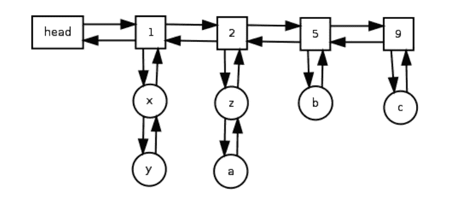
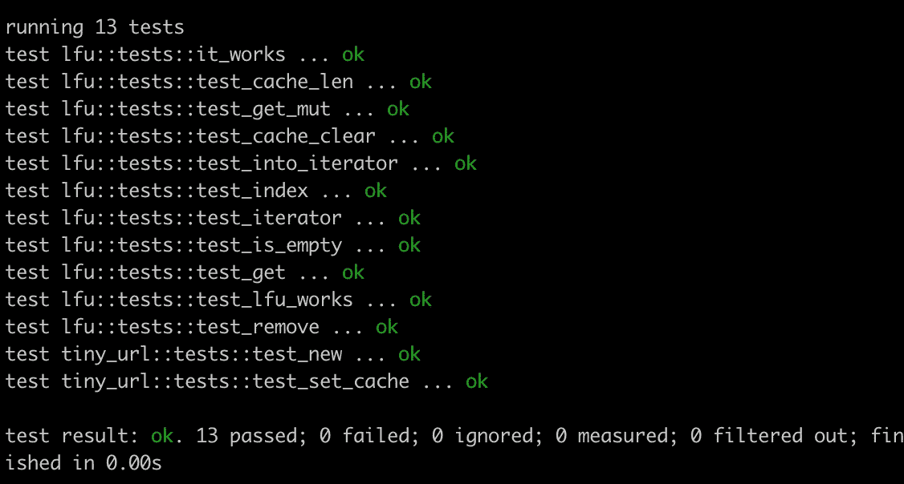

# 用 Rust 的 LFU 缓存创建一个网址缩短器

> 原文：<https://levelup.gitconnected.com/build-an-url-shortener-with-lfu-cache-by-rust-d2056a4d24e9>

周末建设和学习。这个周末让我们创建一个具有 LFU 缓存功能的 URL Shortner。

你也可以看看我的最新系列。

 [## Go 列车延误分析的数据管道——ML 与 Rust 的作用

### ML 管道带锈运行

towardsdatascience.com](https://towardsdatascience.com/a-data-pipeline-for-go-trains-delay-analysis-ml-in-action-with-rust-b294e80eede9) 

# 什么是网址缩写？

网址缩写减少了长链接。使用我们的工具来缩短链接，然后共享它们；您还可以监控流量统计。你可以找到很多(教程、服务、API、文章等等。).

如何设计和建立一个网址缩写器是科技公司面试的热门话题，尤其是系统设计。

 [## 设计类似 TinyURL - LeetCode 的 URL 缩短服务讨论

### 问题:设计一个类似 TinyURL 的服务，一个 URL 缩短服务，一个为…提供短别名的 web 服务

leetcode.com](https://leetcode.com/discuss/interview-question/124658/Design-a-URL-Shortener-%28-TinyURL-%29-System/) 

# 什么是 LFU 缓存？

缓存是保护高并发系统的三种有效方法之一。另外两个分别是节流和降级。

缓存广泛应用于操作系统、数据库和其他系统中，这些系统通过缓存应用程序使用的数据来加快执行速度。有许多政策，如 MRU(最近使用)、MFU(最常使用)、LRU(最近最少使用)和 LFU(最少使用)，这些政策各有利弊，因此用于特定的情况。

对于这个用例，我将更多地关注 LFU(最不常用的)。

# 让我们编码

> 免责声明，该代码主要侧重于逻辑演练，它可能不包含一些实现细节，为了简单起见，我也将跳过 API 部分；然而，如果你密切关注我，单元测试是旅程的一部分。

## 肖特纳

如果我们从逻辑的角度来看。我们需要做的第一件事是构造 Shortener，它将表现出两个重要的功能:

1.  新功能:每次使用时初始化定时器。比如每次 API 调用；当获得请求时，初始化它。
2.  生成器函数:获取输入 URL 并生成一个作为短 URL 的密钥。

非常简单。我们还可以修改或增强算法来生成更短的 URL。例如，我们可以使用原始 URL 的 MD5 或 SHA256 进行计算，然后使用 base62 等进行编码。

正如我之前提到的，我们将只关注使用 Rust 的逻辑演练。不过，如果你对这个算法感兴趣，它会在互联网上有很多例子。

## LFU 高速缓存

关于 LFU 的一个关键设计是在每次设置、查找等时跟踪垂直和水平维度的更新。，操作。

纵轴是用于精确频率计数的数据集，横轴是计数列表。

来源:http://dhruvbird.com/lfu.pdf

让我们按功能方面来分解一下:

1.  公共函数集:将键值对设置到缓存中。
2.  公共函数查找:通过值获取键。
3.  私有功能更新:每次操作时更新访问频率，如#1、#2。
4.  私有函数 evict:移除/驱逐不常用的元素。
5.  其他功能包括获取缓存的总容量、缓存的当前长度、缓存上的循环等。

初始结构—按作者

设置键值对—按作者

更新访问频率—按作者

按关键字获取值并驱逐—按作者

其他公共职能-按作者

## 放在一起

工作原理—作者

## 让我们对它进行单元测试

单元测试结果—作者

# 最后的话

从逻辑代码演练的角度来看，我们主要了解了 Rust 实现 URL 缩短器和 LFU 缓存的方式。

我开始写作之旅已经快三年了。你们的支持是让我不断前进，写出更多精彩学习分享的最重要动力。

请加入我的中帖连载，和我一起编码学习。

 [## 用我的推荐链接加入媒体-黄伟

### 作为一个媒体会员，你的会员费的一部分会给你阅读的作家，你可以完全接触到每一个故事…

jayhuang75.medium.com](https://jayhuang75.medium.com/membership) 

另外，你可以用下面的链接给我买一杯咖啡，让我有动力在周末进行更多的锻炼和学习。

 [## jayhuang75 是编程、编码、工程和领导博客

### 嘿👋你现在可以给我买一杯咖啡，让我有动力在周末进行更多的建设和学习。

www.buymeacoffee.com](https://www.buymeacoffee.com/jayhuang75)