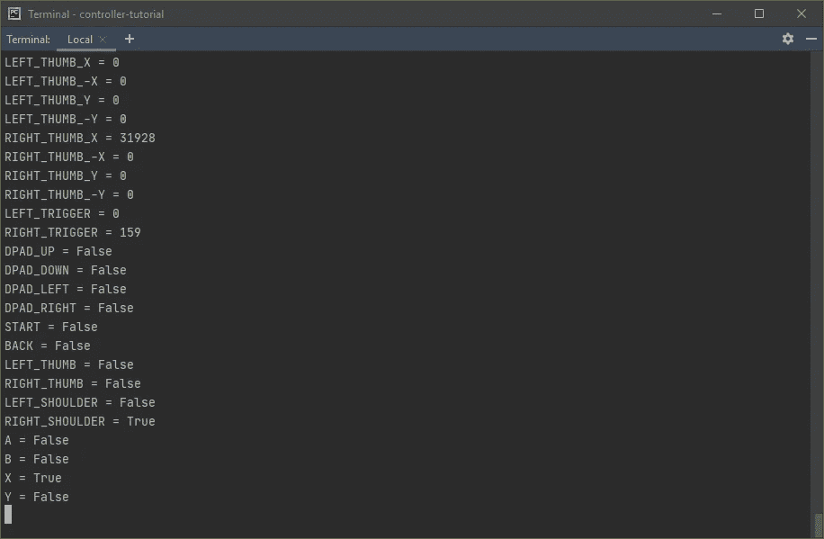

# 使用 XInput API 在 Python 中构建一个 Xbox 控制器抽象层

> 原文：<https://levelup.gitconnected.com/build-an-xbox-controller-abstraction-layer-in-python-using-xinput-api-e971fe4adce8>

或者:如何用夸张的代码量实现简单的目标—第 3 部分


马尔科·布拉泽维奇在 [Unsplash](https://unsplash.com?utm_source=medium&utm_medium=referral) 上的照片

[教程的最后一部分](/build-an-xbox-controller-abstraction-layer-in-python-using-xinput-api-f6d0c716adf)。您将学习如何:

*   检测输入。
*   获取触发器和 thumbs 原始值和规范化值。
*   处理振动。

虽然前面的部分目前可能很平凡，但这一部分几乎完全是代码。让我们看看我们有什么。

# 手柄按钮

要检查按钮是否被按下，您必须引用控制器状态。这里只有一个方法:

```
def is_button_press(self, button):
    if button not in self.BUTTONS:
        raise Exception('Invalid button. Got: "{}"'.format(button))
    return bool(self.BUTTONS[button] & self.gamepad.wButtons)
```

*   如果收到的参数不是按钮，则引发异常。
*   使用按位[和](https://docs.python.org/3/reference/expressions.html#binary-bitwise-operations)操作检查按钮是否被按下，并相应地返回一个响应。

如果你第一次使用位运算，请注意。`XInputGamepad`字段的`wButtons`是一个[位图](https://en.wikipedia.org/wiki/Bitmap)，包含所有被按下(和未被按下)的按钮。假设游戏手柄上只有 **X** 、 **Y** 、 **A** 和 **B** 按钮。你*把它们打包成 4 位，每一位代表按钮状态。假设`wButtons`值被设置为`0011`。显示 **A** 和 **B** 按钮被按下，而 **X** 和 **Y** 没有被按下。想象一下 **A** 按钮用二进制数`0001`来表示，在十进制中就是`1`。[和](https://en.wikipedia.org/wiki/Bitwise_operation#AND)操作检查是否是图案的一部分(`0011`)。因为两者的[最低有效位](https://en.wikipedia.org/wiki/Bit_numbering#Least_significant_bit)的值都是`1`，所以`is_button_press`方法会返回`True`(任何不为零的整数被强制转换为`bool`就是`True`)。*

# 手柄轴

拇指和扳机的行为非常相似。这主要是语义上的——你按下扳机，但移动拇指。

## 获取轴值

由于您将触发器和拇指都视为轴，因此很容易获取它们的状态:

```
def get_axis_value(self, axis):
    if axis not in self.AXES:
        raise Exception('Invalid axis, Got: {}'.format(axis))
    return getattr(self.gamepad, self.AXES[axis])
```

*   使用`self.AXES`映射获得一个可由`XInputGamepad`结构识别的键。
*   使用[反射](https://docs.python.org/3/library/functions.html#getattr)来确定要获取哪个值。

很简单，但是有一个细节需要注意。触发器返回值的范围是从`-128`到`127`，不方便。这也是不对的。根据[文件](https://docs.microsoft.com/en-us/windows/win32/api/xinput/ns-xinput-xinput_gamepad)，触发器应在`0 - 255`范围内运行。让我们编写一些额外的方法来解决这个问题:

```
def get_trigger_value(self, trigger):
    return self.get_axis_value(trigger) & 0xFF

def get_thumb_value(self, thumb):
    return self.get_axis_value(thumb)
```

*   对于触发器，使用按位 AND 运算。十六进制的`0xFF`就是十进制的`255`。这样，你就摆脱了消极的价值观。
*   保持获取拇指值不变。这很重要，因为负值会产生关于方向的重要信息。

## 获取标准化值

我最初编写脚本是为了将鼠标和键盘事件映射到游戏手柄。它迫使我引入一些规范化。我不能操作成千上万个单元。我需要更接近`default.ini`中指定的灵敏度范围的东西。我想到了以下方法(和一些助手):

此处的助手:

*   `get_magnitude`简单读取包含轴大小的类变量。
*   `get_sensitivity`从`default.ini`获取作为参数提供的轴的轴灵敏度。

这是标准化:

*   如果提供了无效的轴，则引发异常。
*   轴字符串为`LEFT-OR-RIGHT_AXIS-TYPE_OPTIONAL-DIRECTION`格式。例如，如果你提供`LEFT_THUMB_X`作为参数，在`_`上分割后，你会得到一个`['LEFT', 'THUMB', 'X']`列表。轴类型将始终是索引为 1 的列表元素。
*   这就是事情变得有点棘手的地方。使用`axis_type`，您可以引用`get_trigger_value`或`get_thumb_value`方法。然后调用它，提供原始的轴参数。
*   返回标准化值。

## 检测变化

关于轴的最后一件事是检测偏差。因为它对标准化值进行操作，所以您可以在配置中设置百分比死区，这很方便:

助手:

*   这里没什么——只有死亡地带。

变化检测:

*   如果提供了无效的轴，则引发异常。
*   得到规范化`axis_value`。现在，你需要确定方向是否正确。如果您提供了`-X`或`-Y`轴，则`axis_value`必须为负。这样你*事实上*把一个轴当作两个独立的轴——一个代表正值，一个代表负值。这样你就可以将一个动作映射到每个主要的拇指方向。
*   比较`axis_value`和`dead_zone`。如果它大于死区，这意味着已经检测到移动。

有了这些，您可以添加专用函数，只是为了保持 API 的一致性:

```
def is_thumb_move(self, thumb):
    return self.is_axis_change(thumb)

def is_trigger_press(self, trigger):
    return self.is_axis_change(trigger)
```

# 震动

有两种振动变量可以设置:

*   手动—切换模式。电机无限期启动，必须手动停止。
*   [去抖](/debounce-in-javascript-improve-your-applications-performance-5b01855e086) —直到发出信号，电机才会停止。API 负责阻止它们。

您可能只需要这些方法中的一种，但我会介绍这两种方法，以防万一。

## 手动振动

您需要利用 [XInputSetState](https://docs.microsoft.com/en-us/windows/win32/api/xinput/nf-xinput-xinputsetstate) 函数和您在教程的第一部分中创建的 XInputVibration 结构:

*   健全检查。电机速度必须用百分比表示。这是一种正常化的方式。
*   使用标准化电机速度创建`XInputVibration`结构。
*   为给定的游戏手柄设置振动。

如果你现在启动马达，你会发现它们不会停止，除非你拔掉控制器。你需要一种方法来引入一些持续时间:

*   在给定的时间内睡眠。
*   将电机速度设置为`0`，有效禁用电机。
*   关闭`vibration_process`。在手动模式下这是多余的，但在去抖模式下将是至关重要的。

好多了。但是，如果您关闭了脚本，却忘记了触发`disable_vibration`方法，该怎么办呢？没什么，因为你已经定义了一个析构函数:

```
def __del__(self):
    self.disable_vibration()
```

*   `disable_vibration`方法在没有参数的情况下被调用，这意味着`duration`参数默认为`0`，这将立即停止电机。

## 去抖振动

如果我错了，请纠正我，但是根据我的观察，去抖动函数在 Python 中并不是一种常见的模式。由于它们的性质，它们在 JavaScript 社区中更受欢迎。有几种方法可以实现这种行为。我选择了基于过程的方法:

*   像平常一样设置振动。
*   终止一个活动的`vibration_process`——如果它已经产生。它负责去抖。
*   在单独的进程中运行`disable_vibration`方法。

# 把所有的放在一起

API 完成了。最后一个合乎逻辑的步骤是测试脚本。让我们来处理它:

*   初始化`XInput`类。
*   如果没有检测到变化，打印先前的状态，等待 200 毫秒，然后`cls`控制台。
*   如果检测到拇指或触发器移动，更新`output`字典中的条目。如果没有，就归零。
*   按钮几乎是一样的，但是你设置了一个短时间的振动。
*   打印`output`。

蚂蚁就是这样！检查是否一切顺利:

```
python xinput.py
```

您应该得到以下输出:



按下`Ctrl + C`关闭脚本。恭喜你！

# 最后的话

感谢阅读！

你可以在我的 [GitHub](https://github.com/izdwuut/xbox-mapper-tutorial/tree/main) 上找到完整的代码。