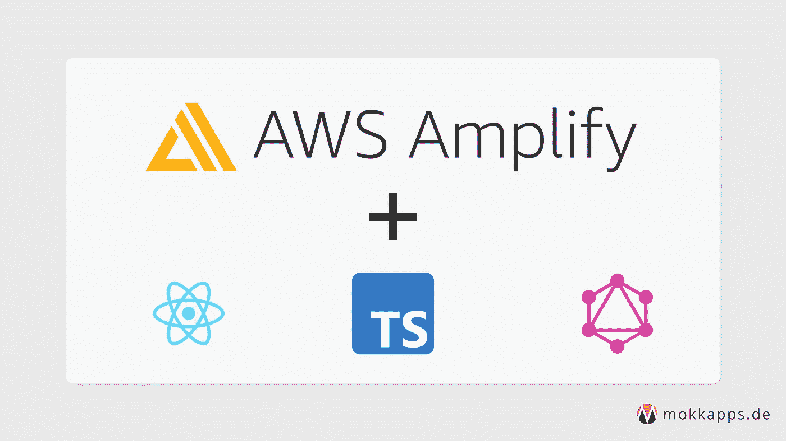
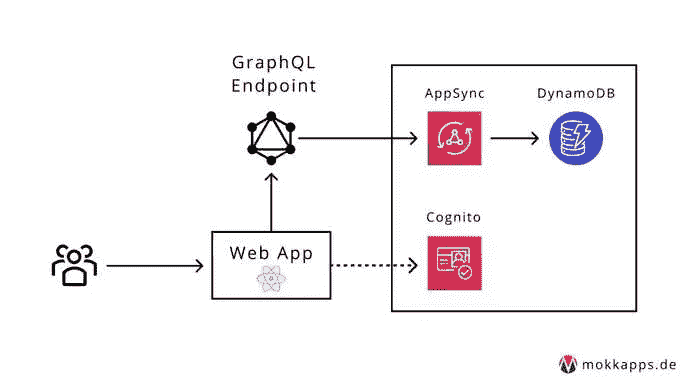
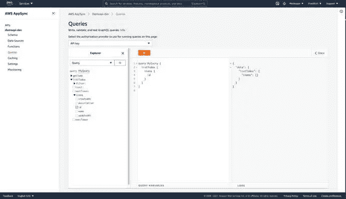
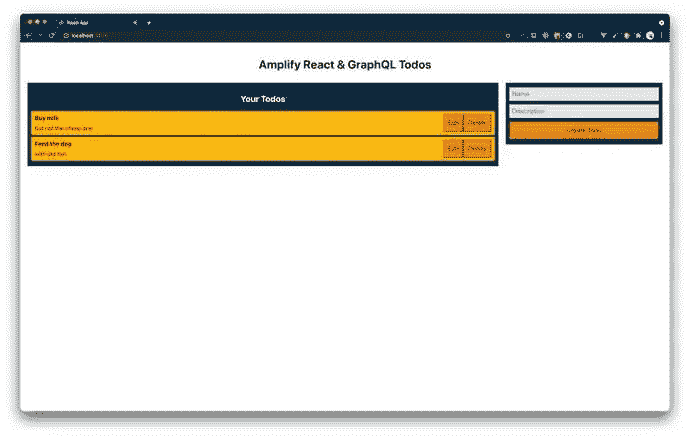
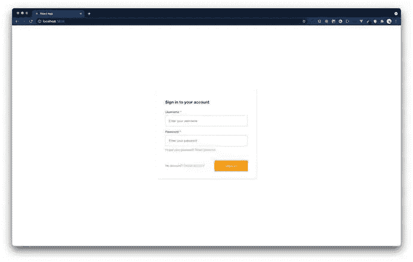

# 使用 AWS Amplify 构建和部署一个无服务器的 GraphQL React 应用程序

> 原文：<https://levelup.gitconnected.com/build-and-deploy-a-serverless-graphql-react-app-using-aws-amplify-83eb8c21de27>



最近我发现一些 SaaS(软件即服务)产品使用 [AWS 放大](https://aws.amazon.com/amplify/)，这有助于他们构建无服务器的全栈应用。我认为[无服务器计算](https://www.cloudflare.com/learning/serverless/why-use-serverless/)将是应用和软件的未来。因此，我想收集一些实践经验，我使用 AWS Amplify 构建了一个无服务器应用程序，它使用 React 作为前端框架，使用 GraphQL 作为后端 API。

在本文中，我想指导您如何构建和部署这样一个 Amplify 应用程序。

# 设置放大器

[AWS Amplify](https://aws.amazon.com/amplify/) 将自己描述为:

> *构建可扩展的移动和网络应用的最快、最简单的方法*

Amplify 提供工具和服务来构建由 [AWS (Amazon Web Services)](https://aws.amazon.com/) 支持的可扩展全栈应用。有了 Amplify，配置后端和部署静态 web 应用变得很容易。它支持 web 框架，如 Angular、React、Vue、JavaScript、Next.js，以及移动平台，包括 iOS、Android、React Native、Ionic 和 Flutter。

您需要[创建一个 AWS 帐户](https://portal.aws.amazon.com/billing/signup?redirect_url=https%3A%2F%2Faws.amazon.com%2Fregistration-confirmation#/start)来执行以下步骤。不用担心，注册后，您可以访问 AWS 免费层，其中不包括任何前期费用或期限承诺。

下一步是安装 Amplify 命令行界面(CLI)。我在 macOS 上使用 cURL:

```
curl -sL https://aws-amplify.github.io/amplify-cli/install | bash && $SHELL
```

或者，您可以观看此视频来了解如何安装和配置 Amplify CLI。

现在，我们可以使用 CLI 配置 Amplify

```
amplify configure
```

这将要求我们登录到 AWS 控制台。登录后，Amplify CLI 将要求我们创建一个 [AWS IAM](https://aws.amazon.com/iam/) 用户:

```
Specify the AWS Region 
? region: # Your preferred region
Specify the username of the new IAM user: 
? user name: # User name for Amplify IAM user
Complete the user creation using the AWS console
```

我们将被重定向到 IAM，在这里我们需要完成向导并创建一个帐户中有`AdministratorAccess`的用户来配置 AWS 资源。创建用户后，Amplify CLI 将要求我们提供`accessKeyId`和`secretAccessKey`来连接 Amplify CLI 和我们创建的 IAM 用户:

```
Enter the access key of the newly created user: 
? accessKeyId: # YOUR_ACCESS_KEY_ID
? secretAccessKey: # YOUR_SECRET_ACCESS_KEY
This would update/create the AWS Profile in your local machine  
? Profile Name: # (default)Successfully set up the new user.
```

# 建立全栈放大器项目

此时，我们已经准备好使用前端的 [React](https://reactjs.org/) 应用程序和后端的[graph QL](https://graphql.org/)API 来设置我们的全栈项目。我们将构建一个使用该架构的 Todo CRUD(创建、读取、更新、删除)应用程序:



该演示的完整源代码可从 [GitHub](https://github.com/Mokkapps/amplify-react-graphql-todo-demo/) 获得。

让我们从使用 [create-react-app](https://reactjs.org/docs/create-a-new-react-app.html) 创建一个新的 React 应用程序开始。从我们的项目目录中，我们运行以下命令，在名为`amplify-react-graphql-demo`的目录中创建新的 React 应用程序，并导航到该新目录:

```
> npx create-react-app amplify-react-graphql-demo 
> cd amplify-react-graphql-demo
```

要启动 React 应用程序，我们可以运行

```
npm start
```

这将在`[http://localhost:3000](http://localhost:3000.)` [启动开发服务器。](http://localhost:3000.)

现在是时候在我们的项目中初始化 Amplify 了。从我们运行的项目的根开始

```
amplify init
```

这将提示一些关于应用程序的信息:

```
▶ amplify init
? Enter a name for the project amplifyreactdemo
The following configuration will be applied:

Project information
| Name: amplifyreactdemo
| Environment: dev
| Default editor: Visual Studio Code
| App type: javascript
| Javascript framework: react
| Source Directory Path: src
| Distribution Directory Path: build
| Build Command: npm run-script build
| Start Command: npm run-script start

? Initialize the project with the above configuration? Yes
Using default provider  awscloudformation
? Select the authentication method you want to use: AWS profile
? Please choose the profile you want to use: default
```

当我们新的 Amplify 项目初始化时，CLI:

*   在 src 目录中创建了一个名为`aws-exports.js`的文件，保存了我们用 Amplify 创建的服务的所有配置
*   创建了一个名为`amplify`的顶级目录，其中包含我们的后端定义
*   修改了`.gitignore`文件并将一些生成的文件添加到忽略列表中

此外，在 [AWS Amplify 控制台](https://docs.aws.amazon.com/amplify/latest/userguide/welcome.html)中创建了一个新的云项目，可以通过运行`amplify console`来访问。Amplify 控制台提供两个主要服务:主机和管理用户界面。更多信息可以在[这里](https://docs.aws.amazon.com/amplify/latest/userguide/welcome.html)找到。

下一步是安装一些放大器库:

```
npm install aws-amplify @aws-amplify/ui-react typescript
```

*   `aws-amplify`:在应用程序中使用 Amplify 的主库
*   `@aws-amplify/ui-react`:包含 React 特定的 UI 组件
*   `typescript`:我们将在本演示的某些部分使用[类型脚本](https://www.typescriptlang.org/)

接下来，我们需要在客户端配置 Amplify。因此，我们需要在`src/index.js`中的最后一次导入下面添加以下代码:

此时，我们已经有了一个正在运行的 React 前端应用程序，Amplify 已经配置好，现在我们可以添加我们的 GraphQL API 了。

我们现在将创建一个后端，使用 AWS AppSync(一个托管的 GraphQL 服务)提供一个 GraphQL API，它使用 Amazon DynamoDB(一个 NoSQL 数据库)。

要添加新的 API，我们需要在项目的根文件夹中运行以下命令:

```
▶ amplify add api
? Please select from one of the below mentioned services: GraphQL
? Provide API name: demoapi
? Choose the default authorization type for the API: API key
? Enter a description for the API key:
? After how many days from now the API key should expire (1-365): 7
? Do you want to configure advanced settings for the GraphQL API: No, I am done.
? Do you have an annotated GraphQL schema? No
? Choose a schema template: Single object with fields (e.g., “Todo” with ID, name, description)
```

流程成功完成后，我们可以在`amplify/backend/api/demoapi/schema.graphql`检查 GraphQL 模式:

```
type Todo @model {
  id: ID!
  name: String!
  description: String
}
```

生成的 Todo 类型用一个`@model`指令进行了注释，该指令是 Amplify 的 [GraphQL 转换](https://docs.amplify.aws/cli/graphql-transformer/model)库的一部分。该库包含多个指令，可用于身份验证、定义数据模型等。添加`@model`指令将为这个类型创建一个数据库表(在我们的例子中是一个 Todo 表)、CRUD(创建、读取、更新、删除)模式和相应的 GraphQL 解析器。

现在是时候部署我们的后端了:

```
▶ amplify push
✔ Successfully pulled backend environment dev from the cloud.

Current Environment: dev

| Category | Resource name | Operation | Provider plugin   |
| -------- | ------------- | --------- | ----------------- |
| Api      | demoapi       | Create    | awscloudformation |
? Are you sure you want to continue? Yes
? Do you want to generate code for your newly created GraphQL API: Yes
? Choose the code generation language target: typescript
? Enter the file name pattern of graphql queries, mutations and subscriptions: src/graphql/**/*.ts
? Do you want to generate/update all possible GraphQL operations - queries, mutations and subscriptions: Yes
? Enter maximum statement depth [increase from default if your schema is deeply nested] 2
? Enter the file name for the generated code: src/API.ts
```

成功完成后，我们的 GraphQL API 就部署好了，我们可以与之交互。要随时在 AppSync 控制台中查看 GraphQL API 并与之交互，我们可以运行:

```
amplify console api
```



或者，我们可以运行以下命令

```
amplify console api
```

在 Amplify 控制台中查看整个应用程序。

GraphQL 的变化、查询和订阅可在`src/graphql`获得。为了能够与它们交互，我们可以使用生成的`src/API.ts`文件。所以我们需要扩展`App.js`来通过我们的 GraphQL API 创建、编辑和删除待办事项:

```
import React, { useEffect, useState } from 'react';
import { API, graphqlOperation } from '@aws-amplify/api';
import { listTodos } from './graphql/queries';
import { createTodo, deleteTodo, updateTodo } from './graphql/mutations';
import TodoList from './components/TodoList';
import CreateTodo from './components/CreateTodo';

const initialState = { name: '', description: '' };

function App() {
  const [formState, setFormState] = useState(initialState);
  const [todos, setTodos] = useState([]);
  const [apiError, setApiError] = useState();
  const [isLoading, setIsLoading] = useState(false);

  useEffect(() => {
    fetchTodos();
  }, []);

  function setInput(key, value) {
    setFormState({ ...formState, [key]: value });
  }

  async function fetchTodos() {
    setIsLoading(true);
    try {
      const todoData = await API.graphql(graphqlOperation(listTodos));      const todos = todoData.data.listTodos.items;
      setTodos(todos);
      setApiError(null);
    } catch (error) {
      console.error('Failed fetching todos:', error);
      setApiError(error);
    } finally {
      setIsLoading(false);
    }
  }

  async function addTodo() {
    try {
      if (!formState.name || !formState.description) {
        return;
      }
      const todo = { ...formState };
      setTodos([...todos, todo]);
      setFormState(initialState);
      await API.graphql(graphqlOperation(createTodo, { input: todo }));      setApiError(null);
    } catch (error) {
      console.error('Failed creating todo:', error);
      setApiError(error);
    }
  }

  async function removeTodo(id) {
    try {
      await API.graphql(graphqlOperation(deleteTodo, { input: { id } }));      setTodos(todos.filter(todo => todo.id !== id));
      setApiError(null);
    } catch (error) {
      console.error('Failed deleting todo:', error);
      setApiError(error);
    }
  }

  async function onItemUpdate(todo) {
    try {
      await API.graphql(        graphqlOperation(updateTodo, {          input: {            name: todo.name,            description: todo.description,            id: todo.id,          },        })      );      setApiError(null);
    } catch (error) {
      console.error('Failed updating todo:', error);
      setApiError(error);
    }
  }

  const errorMessage = apiError && (
    <p style={styles.errorText}>
      {apiError.errors.map(error => (
        <p>{error.message}</p>
      ))}
    </p>
  );

  if (isLoading) {
    return 'Loading...';
  }

  return (
    <div style={styles.container}>
      <h1 style={styles.heading}>Amplify React & GraphQL Todos</h1>
      {errorMessage}
      <div style={styles.grid}>
        <TodoList
          todos={todos}
          onRemoveTodo={removeTodo}
          onItemUpdate={onItemUpdate}
        />
        <CreateTodo
          description={formState.description}
          name={formState.name}
          onCreate={addTodo}
          onDescriptionChange={setInput}
          onNameChange={setInput}
        />
      </div>
    </div>
  );
}

export default App;
```

该演示的完整源代码可从 [GitHub](https://github.com/Mokkapps/amplify-react-graphql-todo-demo/) 获得。

该应用程序应该显示一个可以编辑或删除的可用待办事项列表。此外，我们有可能创建新的待办事项:



Amplify 使用 [Amazon Cognito](https://aws.amazon.com/cognito/) 作为主要的认证提供者。我们将使用它通过添加一个需要密码和用户名的登录来向我们的应用程序添加身份验证。

要添加身份验证，我们需要运行

```
▶ amplify add auth
Using service: Cognito, provided by: awscloudformation
 The current configured provider is Amazon Cognito.

 Do you want to use the default authentication and security configuration? Default configuration
 Warning: you will not be able to edit these selections.
 How do you want users to be able to sign in? Username
 Do you want to configure advanced settings? No, I am done.
```

并通过运行来部署我们的服务

```
amplify push
```

现在，我们可以将登录 UI 添加到我们的前端。通过使用来自`@aws-amplify/ui-react`包的`withAuthenticator`包装器，可以很容易地处理登录流。我们只需要调整我们的`App.js`和导入`withAuthenticator`:

```
import { withAuthenticator } from '@aws-amplify/ui-react';
```

现在我们需要用`withAuthenticator`包装器包装主要组件:

```
export default withAuthenticator(App);
```

运行`npm start`将启动应用程序，并提供认证流程，允许用户注册并登录:



最后，我们希望部署我们的应用程序，这可以手动完成，也可以通过自动持续部署来完成。在这个演示中，我想手动部署它，并将其作为静态 web 应用程序托管。如果你想使用持续部署，请查看官方指南。

首先，我们需要添加主机:

```
▶ amplify add hosting
? Select the plugin module to execute: Hosting with Amplify Console (Managed hosting with custom domains, Continuous deployment)
? Choose a type: Manual deployment
```

然后我们准备发布我们的应用程序:

```
amplify publish
```

发布后，我们可以在终端中的一个“amplifyapp.com”域上看到我们的应用程序所在的应用程序 URL。

# 下一步是什么

Amplify 还提供了一种在本地运行 API 的方法，请看这篇教程。

这里有一些很酷的东西，你可以添加到你的放大器应用:

*   [数据存储](https://docs.amplify.aws/lib/datastore/getting-started/q/platform/js)
*   [用户文件存储](https://docs.amplify.aws/lib/storage/getting-started/q/platform/js)
*   [无服务器 API](https://docs.amplify.aws/lib/graphqlapi/getting-started/q/platform/js)
*   [分析](https://docs.amplify.aws/lib/analytics/getting-started/q/platform/js)
*   [艾/毫升](https://docs.amplify.aws/lib/predictions/getting-started/q/platform/js)
*   [推送通知](https://docs.amplify.aws/lib/push-notifications/getting-started/q/platform/js)
*   [PubSub](https://docs.amplify.aws/lib/pubsub/getting-started/q/platform/js)
*   [AR/VR](https://docs.amplify.aws/lib/xr/getting-started/q/platform/js)

请看一下官方的 Amplify 文档以获得关于这个框架的更多信息。

# 结论

在本文中，我向您展示了使用 AWS Amplify 构建和部署全栈无服务器应用程序只需要最少的工作量。如果不使用这样的框架，事情会变得更加困难，这样你就可以更加关注最终产品，而不是内部发生的事情。

如果你喜欢这篇文章，请在 Twitter 上关注我，从我这里获得关于新博客文章和更多内容的通知。

*原载于*[*https://www . mokkapps . de*](https://www.mokkapps.de/blog/build-and-deploy-a-serverless-graphql-react-app-using-aws-amplify/)*。*