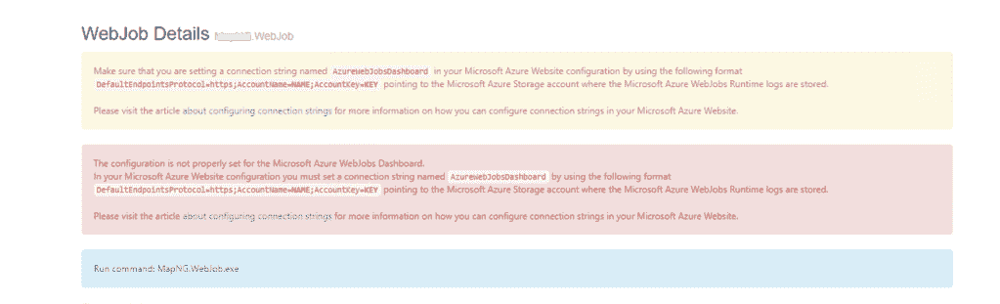

# 使用 azure pipelines 构建和部署 WebJob 以及 web 应用程序

> 原文：<https://levelup.gitconnected.com/build-and-deploy-a-webjob-alongside-web-app-using-azure-pipelines-220bde26642a>


在这篇文章中，我将分享我在尝试使用 azure pipelines 设置和部署 WebJob 以及 web 应用程序时遇到的一些问题和误解。WebJob 是一个控制台应用程序，web app 是一个 ASP.NET 核心。WebJob 和 web 应用程序目标。净 5。

微软关于 azure WebJob 的文档提供了关于如何创建和发布 WebJob 的良好信息。然而，。如果您不熟悉 WebJobs，以下是该文档的简要描述:

> *WebJob 是*[*Azure App Service*](https://docs.microsoft.com/en-us/azure/app-service/)*的一项功能，使您能够在与 web 应用、API 应用或移动应用相同的实例中运行程序或脚本。使用 WebJobs 不需要额外的费用。*
> 
> [*在 Azure App 服务中用 WebJobs 运行后台任务*](https://docs.microsoft.com/en-us/azure/app-service/webjobs-create)

您可以创建两种类型的 web 作业，连续或触发。顾名思义，连续的 WebJob 总是运行，而触发的 WebJob 按需或按计划运行。在我的例子中，我设置了一个触发的 WebJob，按照计划通过电子邮件发送报告。

让我们回顾一下我对 WebJob 的一些误解或没有意识到的事情。

# 你不需要瞄准。NET 框架将 WebJob 与 web 应用程序一起部署

在浏览微软关于 WebJobs 的文档时，我看到了一个关于使用 Visual Studio 部署 WebJobs 的部分。该部分提到了将 WebJob 与 web 项目相链接，这样当您部署 web 项目时，web job 已经是它的一部分了。

> *将项目单独部署为 WebJob，或将其链接到 web 项目，以便在您部署 web 项目时自动部署。*
> 
> [*WebJobs as。NET 框架控制台应用程序*](https://docs.microsoft.com/en-us/azure/app-service/webjobs-dotnet-deploy-vs#webjobs-as-net-framework-console-apps)

如果要将 web 作业与 web 项目相链接，web 作业需要以。NET 框架，而不是。网芯。

> *。NET 核心 Web 应用程序和/或。NET Core WebJobs 不能与 web 项目链接。如果您需要使用 web 应用程序部署您的 WebJob，* [*将您的 WebJobs 创建为. NET Framework 控制台应用程序*](https://docs.microsoft.com/en-us/azure/app-service/webjobs-dotnet-deploy-vs#webjobs-as-net-framework-console-apps) *。*
> 
> [*乔布斯一样。NET Core 控制台应用程序*](https://docs.microsoft.com/en-us/azure/app-service/webjobs-dotnet-deploy-vs#webjobs-as-net-framework-console-apps)

刚开始看这一节的时候很迷茫。特别是，我不确定我是否需要目标。如果我想将 WebJob 与 web 应用程序一起部署，请在构建 web job 时使用. NET framework。答案是否定的。注意，这一节只针对使用 Visual Studios 部署 WebJob。换句话说，WebJob 只需要瞄准。如果您希望使用 Visual Studios 同时部署 WebJob 和 web 应用程序，请使用。在我的例子中，由于我使用 azure devops，我能够一起部署我的 WebJob 和 web app，两者都面向。净 5。

# web 作业需要有受支持的可执行文件

当尝试部署 WebJob 时，我想知道为什么在使用 azure devops 自动部署 WebJob 和 web 应用程序时，WebJob 没有显示在 azure 门户中。然而，如果我使用 visual studios 来部署 WebJob，那么它会正确显示。我在网上找到了一些帖子，比如这个 [StackOverflow](https://stackoverflow.com/questions/58282701/webjob-gets-deployed-from-azure-devops-pipeline-but-doesnt-show-up-under-webapp) 和这个[的文章](https://docs.microsoft.com/en-us/answers/questions/2147/fix-for-webjob-cannot-be-added-from-portal-if-depl.html)，并且得到了一个错误的印象，这个问题与从包装中运行有关。使用 azure 应用服务部署任务时，azure devops 会自动更新应用服务的配置，并打开 WEBSITE_RUN_FROM_PACKAGE 标志。我花了很多时间试图修改管道以不设置标志，或者自己删除标志，但无法让它工作。

原来问题是我使用 ubuntu 代理来发布 WebJob，它只产生。dll 文件。我的 WebJob 是一个. NET 5 控制台应用程序，我必须指定目标平台(win-x64)来生成。EXE 文件，如下面的代码片段所示。当我使用 Visual Studios 发布 WebJob 时，我使用的是 windows 机器，结果工件包含。该文件是 WebJob 显示的预期文件。

```
- task: DotNetCoreCLI@2
  inputs:
    command: 'publish'
    publishWebProjects: false
    projects: '**/WebJob.csproj'
    arguments: '--configuration $(BuildConfiguration) --output $(Build.ArtifactStagingDirectory)/App_Data/jobs/triggered -r win-x64 --self-contained false'
    zipAfterPublish: false
  displayName: 'Publish web job'
```

# 如果两者运行在同一个实例上，WebJob 无法通过 HTTP 调用 web 应用程序

我最初的计划是在 web 应用中构建所有的功能，并通过 REST 端点公开它们。但是，因为 WebJob 和 web 应用程序都运行在同一个应用程序服务上，所以不可能在没有变通办法的情况下从 WebJob 对 web 应用程序进行 HTTP 调用。根据文件，

> *如果*同一个*沙箱中的另一个进程在目标端口上创建了监听套接字，则*到本地地址(例如`*localhost*` *，* `*127.0.0.1*` *)和机器自身 IP 的连接尝试将失败，*除外*。监听端口必须是> 1024，并且当前未被使用。*
> 
> [*Azure WebApp 沙盒*](https://github.com/projectkudu/kudu/wiki/Azure-Web-App-sandbox#local-address-requests)

下面是我得到的异常，如文档中所述

```
Exception Details: System.Net.Sockets.SocketException: An attempt was made to access a socket in a way forbidden by its access permissions 127.0.0.1:...
```

# Azure WebJob 仪表板中缺少 Azure WebJob Dashboard 配置警告

如果没有在 azure 应用服务中设置 AzureWebJobsDashboard 配置，可能会在 azure WebJob dashboard 中看到一些警告，如下所示。



然而，这只是一个警告，并不会造成任何伤害。根据这个 [github 问题](https://github.com/Azure/azure-webjobs-sdk/issues/2179)，似乎只有使用 azure blob 存储的仪表板日志记录才需要这个配置。在我的例子中，我能够登录到 AppInsights，所以我不需要设置配置。但是，我也注意到仪表板最多只显示一定数量的日志。因此，如果您想使用 azure blob 存储持久化日志，或者设置 AppInsights 日志记录，您可能需要设置配置。

> 你遇到的根本问题是，webjobs dashboard UX 不能用于 webjobs 3.x 及以上版本和功能 2.x 及以上版本。现已替换为 [*App 见解集成*](https://github.com/Azure/azure-webjobs-sdk/wiki/Application-Insights-Integration#webjobs-version-3x) *。我们不再对这个 UX 进行任何工程投资。*
> 
> [*确保您正在设置一个名为 azurewebjobsdashard*](https://github.com/Azure/azure-webjobs-sdk/issues/2179)的连接字符串

# 如果触发的 WebJob 没有在计划的时间运行，请检查时区。

通过在 Settings.job 文件中指定 cron 表达式，我将 WebJob 设置为按计划运行。起初，我认为它没有在我根据 cron 表达式所预期的正确时间运行。我意识到这个问题是因为服务器的时间是 UTC。我通过将**网站 _ 时区**配置添加到应用服务中，使 WebJob 在预定的设置下正确运行。如需了解更多信息，请参见此[链接](https://docs.microsoft.com/en-us/azure/app-service/faq-configuration-and-management#how-do-i-set-the-server-time-zone-for-my-web-app-)。

现在我已经了解了我对 WebJob 的一些误解，在下一节中，我将快速浏览一下项目和管道设置。

# WebJob 项目

WebJob 基本上是一个. NET 5 控制台应用程序。我使用主机构建器并配置依赖注入，从 json 文件、环境变量、key vault 加载配置，配置 AppInsights 日志记录等。有关如何使用 WebJobs SDK 开发 WebJob 的说明，请查看[文档](https://docs.microsoft.com/en-us/azure/app-service/webjobs-sdk-get-started)。需要注意的是，我无法从 HostBuilderContext 的 HostingEnvironment 中获得正确的环境名称。我使用了`Environment.GetEnvironmentVariable("ASPNETCORE_ENVIRONMENT")` 来检索环境。

```
// codes omitted for brevity 
using Microsoft.Azure.WebJobs;

namespace WebJob
{
    public class Program
    {
        private static IConfigurationRoot _configuration;

        static async Task Main(string[] args)
        {
            var builder = new HostBuilder();

            builder.ConfigureWebJobs(b =>
            {

            });
            builder.ConfigureAppConfiguration((context, config) =>
            {
                ConfigureAppConfiguration(config, context);
            });

            builder.ConfigureLogging((context, loggingBuilder) =>
            {

                loggingBuilder.AddConsole();
                string appInsightsInstrumentationKey = _configuration["APPINSIGHTS_INSTRUMENTATIONKEY"];
                if (!string.IsNullOrEmpty(appInsightsInstrumentationKey))
                {
                    Console.WriteLine("Configuring applicationInsights logging.");
                    loggingBuilder.AddApplicationInsightsWebJobs(o => {
                        o.InstrumentationKey = appInsightsInstrumentationKey;         
                        });
                }
            });

            builder.ConfigureServices(services =>
            {
                ConfigureServices(services);
            });

            var host = builder.Build();
            using (host)
            {
                var jobHost = host.Services.GetService(typeof(IJobHost)) as JobHost;
                // codes omitted for brevity 

                var paymentReportJob = new PaymentReportJob(...);
                var inputs = new Dictionary<string, object>
                {
                    { "reportJob", paymentReportJob }
                };

                await host.StartAsync();
                await jobHost.CallAsync("DoReport", inputs);
                await host.StopAsync();
            }
        }

        [NoAutomaticTrigger]
        public static async Task DoReport(PaymentReportJob reportJob)
        {
            await reportJob.SendReportAsync();
        }

        private static void ConfigureServices(IServiceCollection services)
        {
            services.Configure<SmtpConfigOptions>(_configuration.GetSection("SmtpConfigOptions"));
            // codes omitted for brevity 
        }

        private static void ConfigureAppConfiguration(IConfigurationBuilder config, HostBuilderContext context)
        {
            var environment = Environment.GetEnvironmentVariable("ASPNETCORE_ENVIRONMENT");
            Console.WriteLine("Environment: " + environment);
            config.AddJsonFile("appsettings.WebJob.json", optional: false, reloadOnChange: true);
            // codes omitted for brevity 
            _configuration = config.Build();
        }
    }

   // codes omitted for brevity 
}
```

# 构建管道

下面的代码片段仅包含构建 WebJob 的相关步骤，并将它与 web 应用程序一起打包在一个工件中，准备部署到应用程序服务。

```
trigger:
- "master"

pool:
  vmImage: 'ubuntu-latest'

variables:
  solution: '**/*.sln'
  buildPlatform: 'Any CPU'

  buildConfiguration: 'Release'

steps:
- checkout: self

# some codes omitted for brevity 

- task: DotNetCoreCLI@2
  inputs:
    command: 'publish'
    publishWebProjects: true
    modifyOutputPath: false
    arguments: '--configuration $(BuildConfiguration) --output $(Build.ArtifactStagingDirectory)'
    zipAfterPublish: false
  displayName: 'Publish web project'

- task: DotNetCoreCLI@2
  inputs:
    command: 'publish'
    publishWebProjects: false
    projects: '**/WebJob.csproj'
    arguments: '--configuration $(BuildConfiguration) --output $(Build.ArtifactStagingDirectory)/App_Data/jobs/triggered -r win-x64 --self-contained false'
    zipAfterPublish: false
  displayName: 'Publish web job'

- task: ArchiveFiles@2
  inputs:
    rootFolderOrFile: '$(Build.ArtifactStagingDirectory)'
    includeRootFolder: false
    archiveType: 'zip'
    archiveFile: '$(Build.ArtifactStagingDirectory)/$(Build.BuildId).zip'

- task: PublishPipelineArtifact@1
  inputs:
    targetPath: '$(Build.ArtifactStagingDirectory)'
    ArtifactName: 'drop'
  displayName: 'Publish artifact'
```

在上面的代码片段中，请注意:

*   我有两个 DotNetCoreCLI@2 任务，一个用于发布 web 应用程序，一个用于发布 WebJob。
*   在“发布 web 作业”任务中，我将值为 win-x64 且自包含标志设置为 false 的运行时(-r)作为参数传递。
*   如果不设置运行时，结果工件文件不包含可执行文件(。exe)文件。这是因为我使用了 ubuntu 代理来构建。
*   在没有关闭自包含标志的情况下，我得到了一个错误，因为 WebJob 是一个可执行文件，它引用了其他不可执行且非自包含的项目。更多详情见本[文件](https://docs.microsoft.com/en-us/dotnet/core/compatibility/sdk/5.0/referencing-executable-generates-error)。
*   WebJob 和 web app 工件文件位于同一个根文件夹下:$(Build。ArtifactStagingDirectory)。
*   WebJob 文件转到子目录:$(Build。artifactstagingdirect)/App _ Data/jobs/triggered。
*   在 azure app service 上， *azure 期望触发的 WebJob 位于相对于工件根目录的子目录 App_Data/jobs/triggered* 下。*如果你的网络作业是连续的，那么你需要确保代码在/site/wwwroot/app _ data/Jobs/Continuous*下，根据[文件](https://docs.microsoft.com/en-us/azure/app-service/webjobs-create#webjob-types)。
*   我使用 ArchiveFiles@2 任务创建结果 zip 文件，为部署做好准备。

# 释放管道

我不需要在发布管道中做任何特别的事情。这是因为 WebJob 只是 web 应用程序的一部分，构建管道将所有内容放在一个 zip 文件中。

# 参考

[在 Azure 应用服务中使用 WebJobs 运行后台任务](https://docs.microsoft.com/en-us/azure/app-service/webjobs-create)

[可执行项目引用不匹配的可执行文件时产生错误](https://docs.microsoft.com/en-us/dotnet/core/compatibility/sdk/5.0/referencing-executable-generates-error)

[在 Azure App Services 应用程序中向本地主机发出请求](https://stackoverflow.com/questions/59471540/making-requests-to-localhost-within-azure-app-services-application)

[如何为我的 web 应用程序设置服务器时区？](https://docs.microsoft.com/en-us/azure/app-service/faq-configuration-and-management#how-do-i-set-the-server-time-zone-for-my-web-app-)

[确保您正在设置一个名为 AzureWebJobsDashboard 的连接字符串](https://github.com/Azure/azure-webjobs-sdk/issues/2179)

*最初发表于 2021 年 12 月 13 日*[*https://www.taithienbo.com*](https://www.taithienbo.com/build-and-deploy-a-webjob-alongside-web-app-using-azure-pipelines/)T22。