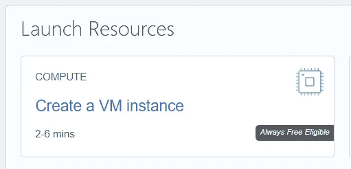
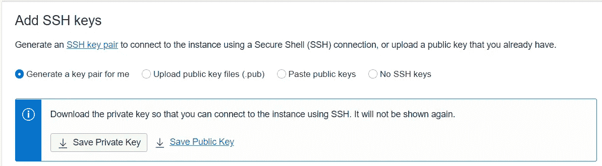
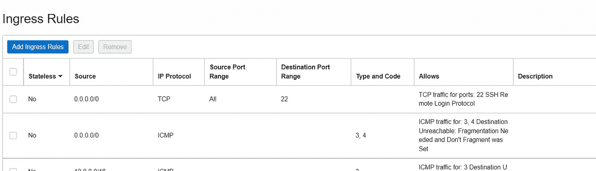
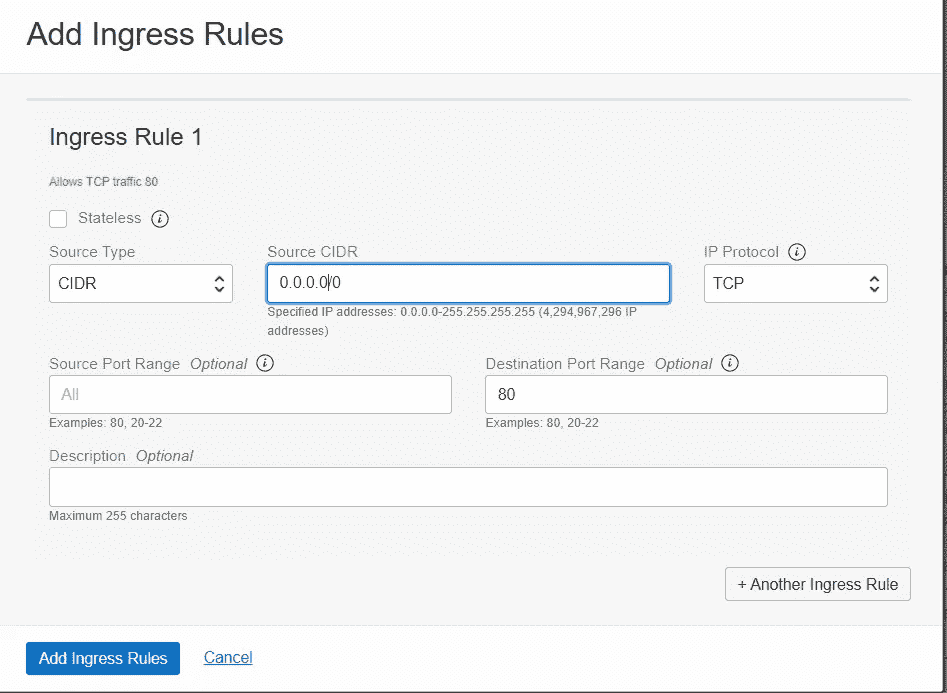
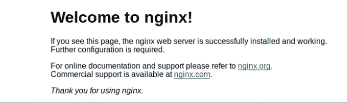
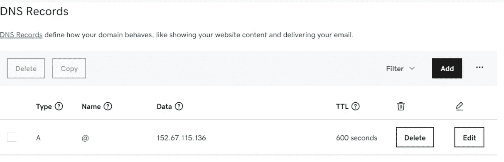
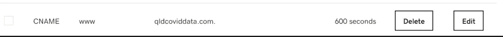
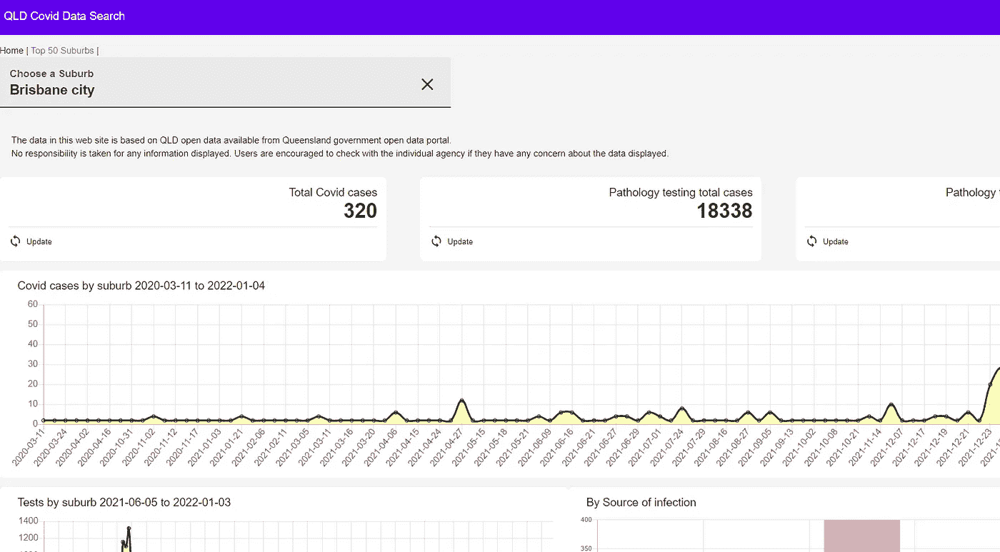
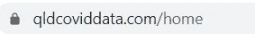

# 构建和托管动态网站的终极指南，每月仅需 1 美元

> 原文：<https://levelup.gitconnected.com/build-and-host-a-dynamic-web-site-for-only-1-per-month-1aa5aa3a7bd1>

## 设置永久免费虚拟机和配置网站的分步指南


由 [Unsplash](https://unsplash.com/s/photos/work?utm_source=unsplash&utm_medium=referral&utm_content=creditCopyText) 上的 [krakenimages](https://unsplash.com/@krakenimages?utm_source=unsplash&utm_medium=referral&utm_content=creditCopyText) 拍摄的照片

我住在澳大利亚的昆士兰。新冠肺炎病毒在阳光之州迅速蔓延，每个人都很担心。

当我试图搜索我的郊区的 Covid 统计数据时，这个网站的想法浮出水面。令人惊讶的是，我很难找到这些数据。因此，我决定自己建一个网站。

让我们一步一步来。

向前跳:

*   [甲骨文总是免费提供](#a880)
*   [配置并访问新虚拟机](#9a57)
*   [安装 Nginx 并配置](#026e)
*   [注册域和配置](#891a)
*   [构建并部署应用](#bf39)
*   [注册一个免费的 SSL 证书](#5776)

## 甲骨文始终免费提供

首先，我想介绍一下[甲骨文的“永远免费”服务](https://www.oracle.com/th/cloud/free/)，如果你还不知道的话。

这是 PaaS 提供商提供的最慷慨的免费服务。它永不过期，还包括:

*   两个 AMD 计算虚拟机，每个都具有 1/8 OCPU 和 1 GB 内存。
*   2 个自治数据库。每个都有 1 个 OCPU 和 20G 用户数据存储。
*   存储:2 个块卷，总共 200 GB。10 GB 对象存储。10 GB 归档存储。
*   负载平衡器:1 个实例，10 Mbps 带宽。

有了这些免费资源，建立一个可靠的个人网站就绰绰有余了。

如果你是甲骨文云的新手，你需要先注册一个免费账户。创建帐户后，登录并导航至 Oracle Cloud dashboard，然后单击“创建虚拟机实例”。



开始吧

除了将映像从“Oracle Linux 7.9”更改为“Canonical-Ubuntu-20.04”之外，我采用了所有默认设置。

需要记住的一件事是下载公钥和私钥。在“添加 SSH 密钥”部分，选择“为我生成密钥对”选项。然后点击“保存公钥”和“保存私钥”按钮下载公钥和私钥。稍后您将需要它们来访问虚拟机。



生成并下载密钥

要创建新的虚拟机，请单击底部的“创建”。几分钟后，当虚拟机的状态变为“正在运行”时，您就可以开始了！

## 配置和访问新虚拟机

我的全新虚拟机正在运行，但默认情况下它是一个锁定的虚拟机。这意味着如果不进行一些配置更改，我们就无法访问它。

因为我的目标是建立一个网站，所以我将打开 HTTP 端口 80 和 443(我计划启用网站 SSL)。要修改默认网络设置，让我们从“dashboard”>“virtual cloud networks”导航。找到新虚拟机的 vcn，单击它进入“安全列表”。



默认规则

默认规则不包括 HTTP 端口 80 和 443。单击“添加入口规则”按钮打开下面的弹出窗口。完成如下所示的弹出窗口后，单击“添加入口规则”按钮，您的新规则即被添加。



为 http 端口 80 添加入口规则

不要忘记添加端口 443。创建 SSL 证书后，我花了一个小时试图排除无响应网站的故障。最后发现是因为忘了添加端口 443 的规则！

现在，让我们登录虚拟机。我正在使用我的 windows 笔记本电脑，所以我需要 [putty](https://www.putty.org/) 来访问它。需要以下信息:

*   用户名和公共 IP 地址:可以在实例详细信息页面中找到。
*   公钥和私钥(在前面的步骤中下载)

我将跳过如何生成 SSH 密钥和配置 putty 的细节，因为如果您搜索一下，会有很多教程。

## 安装 Nginx 和配置

登录虚拟机后，我们需要做的第一件事是更新系统。

```
sudo apt update
sudo apt upgrade
```

我们还需要安装 nodeJs 和 npm，因为新的应用程序依赖于它们。

```
sudo apt install nodejs
```

运行以下命令，以便端口 80 和 443 的 HTTP 连接能够通过。

```
$ sudo iptables -I INPUT 6 -m state --state NEW -p tcp --dport 80 -j ACCEPT
$ sudo iptables -I INPUT 6 -m state --state NEW -p tcp --dport 443 -j ACCEPT
$ sudo netfilter-persistent save
```

对于 web 服务器，我们将使用流行的 Ngnix

```
sudo apt install nginx
```

安装完成后，我们可以启动服务

```
systemctl status nginx 
```

现在 web 服务已经准备好了。在浏览器中键入公共 IP 地址，将显示以下默认页面。



默认页面

## 注册域和配置

现在我们来弄个域名。

我从 GoDaddy 那里买了 qldcoviddata.com 这个域名。这是一个简单的过程。我唯一的抱怨是 GoDaddy 网站让我很难找到管理 DNS 按钮。

为了将新的域名映射到 IP 地址，让我们添加一个 DNS A 记录。点击添加按钮，输入新 A 记录的详细信息:

*   **名称**:这个案例的主机名是 qldcoviddata.com
*   **值**:IP 地址。
*   **TTL** :缓存持续时间。默认是 1 小时，我把它改成了 10 分钟。



一项记录

我还为 www.qldcoviddata.com 创造了一项 CNAME 纪录。这与创建 A 记录的过程类似，只是值不同，如下所示。



CNAME

理论上，DNS 设置需要 24 小时才能生效，但是我的新设置立即生效了！

## 构建和部署应用程序

我计划建立的 web 应用程序是一个简单的应用程序。用户可以通过名称或邮政编码搜索昆士兰州的任何郊区，以获取他们郊区的最新新冠肺炎统计数据。它基于昆士兰州开放数据门户网站上的[昆士兰州新冠肺炎病例行列表数据集](https://www.data.qld.gov.au/dataset/queensland-covid-19-case-line-list-location-source-of-infection)。

我决定使用 Angular 来构建它，只是因为我碰巧知道一个合适的 Angular 模板。由于文章的长度，我不会详细介绍这个应用程序。

Angular 应用程序的分发包可以通过以下方式生成

```
ng build --prod
```

现在，我手动将包文件复制到虚拟机中新创建的文件夹中。更好的方法是建立一个 CI/CD 管道。我将把它留到下一阶段。

下一步是配置 Nginx 服务器，将 HTTP 请求指向新的 web 应用程序。默认情况下，Nginx 配置包含一个 HTTP 上下文部分。

```
http {
    . . .
}
```

我们需要添加以下配置

请注意`location`指向 Angular app 分发包文件夹。更新配置文件后，我们需要重启 Nginx 服务器以使更改生效。

```
sudo systemclt restart nginx
```

web 应用程序的最终结果如下所示。



主页

唯一突出的问题是该网站不是 HTTPS。在浏览器地址栏中，有一个恼人的“不安全”警告。为了消除这个消息，让我们给网站添加一个 SSL 证书。

## 注册一个免费的 SSL 证书

使用 [Certbot](https://certbot.eff.org/) 获得一个让我们加密 SSL 证书从未如此简单。

要安装适用于 Ubuntu 的 certbot:

```
$ apt-get update
$ sudo apt-get install certbot
$ apt-get install python3-certbot-nginx
```

下一步是用 Nginx 生成我们的新证书:

```
$ sudo certbot --nginx -d qldcoviddata.com -d www.qldcoviddata.com
```

在安装过程中，certbot 会问你几个问题，包括是否要将 HTTP 流量重定向到 HTTPS 等。完成该过程后，将下载并安装我们的新证书。Nginx 配置也用证书信息更新，服务器将重新启动。

现在如果你浏览网站，你会在地址栏看到小锁图标！



使用 SSL 保护

请注意，Let's Encrypt 证书将在 90 天后过期。您可以设置[自动更新](https://www.nginx.com/blog/using-free-ssltls-certificates-from-lets-encrypt-with-nginx/#auto-renewal)来保存手动工作。

## 摘要

以下是总费用细目

*   托管虚拟机:免费
*   域名注册:每年 14 美元
*   SSL 证书:免费

整个网站的平均费用在每月 1.2 澳元左右。唯一真正的成本是域名注册。如果你做了足够的研究，你应该可以找到一个更便宜的域名，并把费用降低到每月不到 1 美元！

总的来说，我花了一天时间开发网站，花了半天时间配置虚拟机。

如果您以前没有构建或部署过站点，我希望这篇文章能提供有用的指导。

编程快乐！