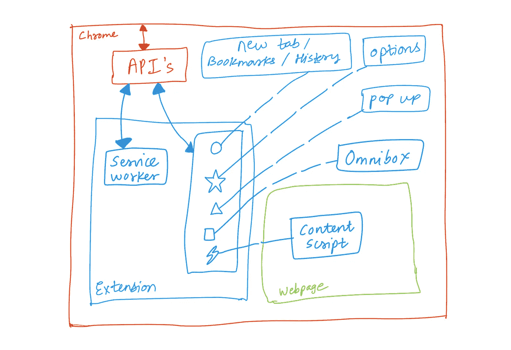
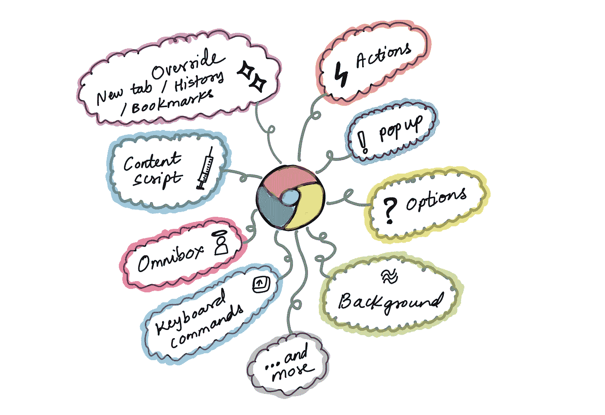
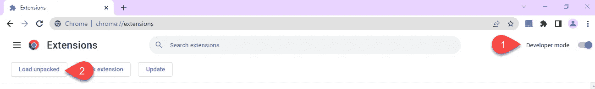
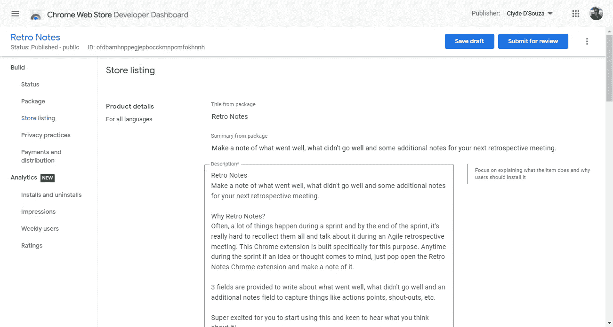
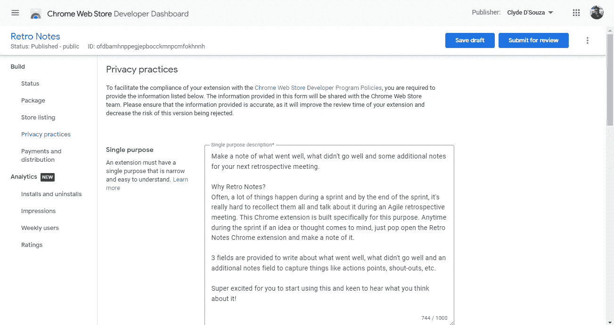
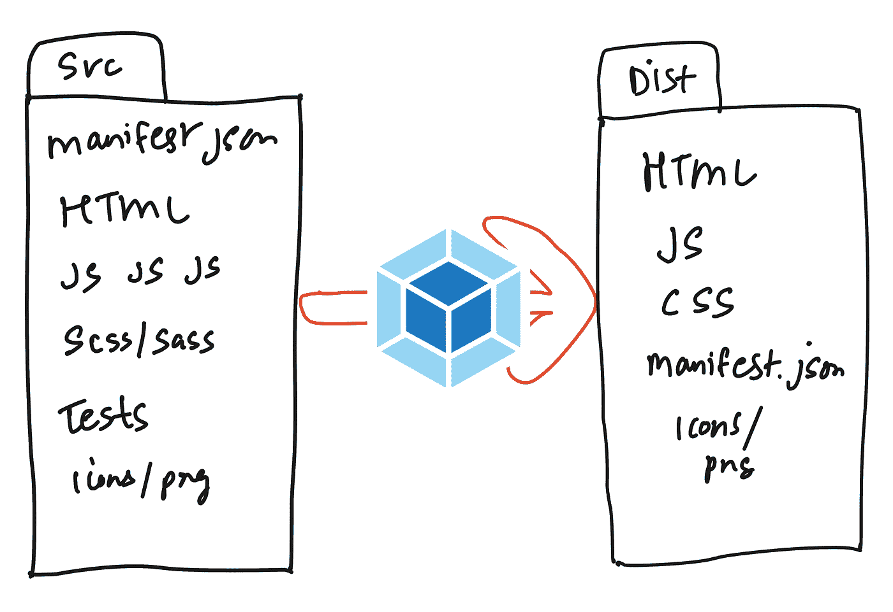

# 构建并发布 Chrome 扩展

> 原文：<https://levelup.gitconnected.com/build-and-publish-a-chrome-extension-ab3d1a4740f6>

与数百万用户分享您的作品

来源:来自 Unsplash 的[图片上的](https://unsplash.com/photos/8Qpqs04ATRk)[谷歌 Chrome](https://www.google.com/chrome/) 标志

# 介绍

Chrome extensions 是可以安装在 Chrome 浏览器上的程序，用于定制您的 Chrome 浏览体验。在最近的过去，我创建了一些 Chrome 扩展，这使我能够试验不同类型的扩展，并直接学习构建和发布它们的过程，我必须承认，这个过程比我想象的要简单得多。在本文中，我们将了解如何开发一个 Chrome 扩展，以及如何将该扩展发布到 Chrome 网络商店供他人使用。

# 高层架构

让我们看看各种组件是如何组合在一起的。

## Chrome 浏览器

上图中红色的外边界是 Chrome 浏览器本身。如你所料，一切都在这个边界之内。

## 网页

当你访问一个网站时，它会加载到 Chrome 的浏览器中。右下角的绿色方框表示加载的网页的上下文。

## 蜜蜂

像任何其他伟大的产品一样，Chrome 也提供了一套 API，允许外部应用程序与 Chrome 进行交互。这些 API 是公开的，它们的用法已经在这里的[文档中说明。在本文的后面，我们将看到一个使用这些 API 的例子。](https://developer.chrome.com/docs/extensions/reference/)

## 延长

Chrome 浏览器的边界内有一个 Chrome 扩展。Chrome 扩展支持一系列位于其上下文中的功能，从扩展的上下文中，这些功能能够使用 Chrome 的 API 与 Chrome 浏览器进行交互。

*   服务工作者:这是一个事件监听器，位于扩展上下文的后台。作为扩展开发人员，您可以配置您的扩展，使其在特定事件被触发时以特定方式运行。例如，在你点击**离开呼叫**按钮后， [Google Meet 退出页面](https://chrome.google.com/webstore/detail/google-meet-exit-page/bjfoplibeabdkfmbanlocafjlbbimgai)会将你重定向到另一个网页。
*   **内容脚本:**您可以提供一个 JavaScript 文件作为您的扩展的一部分，该文件将被注入到某些网页中，并允许您更改 DOM 中的元素(解释)。例如，[亚马逊到 Goodreads 导航器](https://chrome.google.com/webstore/detail/amazon-to-goodreads-navig/lobdefpehipabbpcefccfknigdeolkbb)在亚马逊图书页面上添加了一个点击“查看 Goodreads”按钮，可以轻松地从亚马逊导航到图书的 Goodreads 页面。
*   **弹出:**作为一个扩展开发者，你可以选择在工具栏中点击扩展的图标(也称为**动作**)时打开一个 UI 弹出框。您可以使用弹出式 UI 来提供扩展的所有功能，或者使用这个空间来允许用户配置某些设置。例如，[追溯笔记](https://chrome.google.com/webstore/detail/retro-notes/ofdbamhnppegjepbocckmnpcmfokhnnh)使用弹出界面提供快速进行追溯笔记的功能。
*   **新标签/书签/历史:** Chrome 允许你作为扩展开发者覆盖新标签的默认 Chrome 页面，书签页面和历史页面。不过，一个扩展可能只能覆盖三个中的一个。例如，[4–7–8 呼吸](https://chrome.google.com/webstore/detail/4-7-8-breathing/ihgllkloonfemjjcjcfbkmdlbdffkmnl)覆盖了 Chrome 的新标签，提供了一个干净的界面，引导你完成 4–7–8 呼吸练习。
*   Chrome 的地址栏也被称为 Omnibox，你可以配置你的扩展来监听 Omnibox 中输入的特定关键字。一旦检测到该事件，就可以根据输入的值提供建议，或者对该值执行操作。例如， [DuckDuckGo Search](https://chrome.google.com/webstore/detail/duckduckgo-search-context/fepjgbgflmnaieiodmkkclhjfihdhoid) 扩展了 Omnibox，这样当用户在地址栏中键入“DDG ”,后跟一个空格，然后键入他们的搜索查询并按回车键时，就会使用输入的搜索词在 DuckDuckGo 上执行搜索。
*   **选项:** Chrome 鼓励扩展开发者允许用户自定义扩展的行为。访问扩展选项页面的一种方法是在工具栏右键单击扩展图标，然后点击**选项**。这将打开一个选项弹出模式，或者将您重定向到一个全页选项界面，这取决于扩展开发人员的配置。例如，[吉拉状态颜色](https://chrome.google.com/webstore/detail/jira-status-colours/nglechghbeioejgliejidjlhbfiiinne)提供了一个选项页来定制您的吉拉状态标签的颜色。

# 行动:覆盖 Chrome 的新标签

我们已经简要地看了上面的几个功能，但是为了本文的简洁，我们将看一看开发一个具有单一功能的扩展——覆盖 Chrome 的新标签。

## 清单文件

manifest 文件是一个 JSON 文件，它告诉 Chrome 这个扩展将启用哪些功能，还提供了一些关于这个扩展的元数据。这个文件将被放在扩展代码的根目录下。

一个简单的 starter manifest JSON 文件可能类似于下面的代码片段。我们指定了一些元数据，还包含了扩展图标的路径。不用说，在 icons 文件夹中，您可能希望放置三个与下面代码片段中给出的名称相匹配的 PNG 文件。[这是我在这一点上的变化](https://github.com/ClydeDz/simple-chrome-extension-template/commit/b024088620d44aec2cd933af90abf7828b75a208)的样子。

清单 JSON 文件中所有属性的完整引用可以在这里找到。

## 覆盖 Chrome 的新标签

让我们更新我们的清单文件并注册这个特性。我们将下面的代码片段添加到清单文件中。这将把`newtab.html`文件指定为 Chrome 的新标签。此外，您不必将该文件命名为 *newtab。你可以给它起任何你喜欢的名字。*

## 创建 HTML 文件

在扩展代码的根目录下，创建一个简单的 HTML 文件`newtab.html`。如果你愿意，你也许可以在屏幕上打印传统的“Hello world”信息。你也可以创建一个带有基本样式的 CSS 文件，比如文本或背景颜色，甚至可以创建一个 JavaScript 文件，将消息打印到控制台。如果你包括一个 CSS 和 JavaScript 文件，不要忘记在你的 HTML 文件中引用这些文件。[如果你想跟进的话，这就是我在这个阶段的变化](https://github.com/ClydeDz/simple-chrome-extension-template/commit/81b004a5790cbcb14648ee986a91f537e957e93c)。

在这个阶段，这些文件没有什么特别之处。如果你已经开发了一个网站，那么它是照常营业。这就是开发扩展的美妙之处——在很大程度上，它就像 web 开发一样，只有在某些情况下，您才需要编写特定于扩展的代码。

> 重申一下本文前面提到的内容，把它想象成开发 web 应用程序并将它们打包到一个扩展中。

## 在本地测试

到目前为止，我们已经开发了一个非常简单的扩展，可以用一个打印简单消息的 HTML 文件覆盖 Chrome 的新标签。但是我们如何确认这是否会发生呢？在我们对这些变化感到满意之前，我们需要一种方法在本地测试它，并将其发布到商店供其他人使用。

首先，我们需要打开 Chrome 扩展页面`chrome://extensions/`，在 Chrome 中启用**开发者模式**。现在，点击 **Load unpacked** 按钮，浏览到代码所在的扩展根目录。然后点击**选择文件夹**来加载和安装你的扩展。

现在，如果您单击 new 选项卡，您应该会看到您的 HTML 页面。哒哒！

## 发布您的扩展

使用谷歌账户，你会想注册成为 Chrome 网络商店开发者。您将被要求接受开发者协议，并一次性支付 5 美元的注册费。

下一步将是填写您的帐户信息。这些信息中的一些也会出现在你的扩展页面上，比如你的电子邮件地址和姓名。

点击 **+ New item** 按钮创建您的第一个扩展。它会要求你上传一个你的扩展名的 ZIP 文件。要做到这一点，只需压缩扩展的源代码文件夹，然后上传到这里。开发人员仪表板将读取您的清单文件，并自动填充一些字段。剩下的字段由您来完成。

虽然大部分内容都是不言自明的，但是在开发人员仪表板中填充扩展信息时，需要考虑以下几点:

*   **商店列表:**对于这个页面，你可能需要一堆图像，如图标和截图。我已经创建了[这个 Figma 模板](https://www.figma.com/community/file/1127061326249481158)来协助这个过程。

*   隐私实践:如果您已经在清单文件中请求了特定的权限，那么您可以在这个页面中证明这一点。例如，如果你要求存储权限，你可能想写一个简短的广告，说明你打算如何使用它。在此页面上，如果您的扩展以任何方式使用个人数据，您可能还希望选中几个框，并选中披露框。

*   **预览:**填写字段时，如果您不确定它们将在您的扩展页面上显示的位置和方式，请单击屏幕右上角的三个点，然后单击**预览**按钮。这将填充到目前为止您已经填充的信息，并向您展示您的扩展页面可能的预览。

一旦您对填写的内容感到满意，请点击**提交审核**按钮。在发布之前，您的扩展将处于审核状态几天。然后你可以和你的朋友和家人分享你的 Chrome 扩展。

# 复杂的情况

上面的例子非常简单，所以很容易理解整个过程，然而，在现实生活中，您的扩展代码可能看起来有点复杂。例如:

*   如果您使用多个 JavaScript 文件，您可能希望将它们捆绑在一起，并缩小成一个 JavaScript 文件。在这种情况下，您不会希望在发布到 Chrome Web Store 的 ZIP 文件夹中包含源 JavaScript 文件。
*   如果您使用 Sass 进行样式设计，您可能需要一个预处理器将它们转换成一个缩小的 CSS 文件。在这种情况下，您不会希望将源 Sass 文件包含在您发布到 Chrome Web Store 的 ZIP 文件夹中。
*   如果您正在使用 React 开发 web 应用程序，您可能希望包含适当的构建过程，将它编译到相关的输出文件中。在这种情况下，您不会希望将 React 组件文件放在您发布到 Chrome Web Store 的 ZIP 文件夹中。
*   如果你正在编写单元测试，你不会想在发布到 Chrome 网络商店的 ZIP 文件夹中包含这些文件。

Webpack 可以作为解决部分问题的一种选择。Webpack 帮助捆绑和压缩这些 JavaScript 文件，编译和压缩 Sass 文件，您还可以使用 Webpack 将文件复制到正确的目录。典型的构建看起来像是运行一个命令`npm run build`，它将在一个文件夹中产生输出，例如`dist`。这个文件夹是你想要压缩并发布到 Chrome 网络商店的扩展代码。

## 自动构建和部署

从概念上讲，至少您希望您的构建过程自动为您创建那个 ZIP 文件。如果您正在使用 React 之类的东西，您可能希望在创建那个 ZIP 文件之前运行一个构建命令。

对于部署，您需要以编程方式将这个 ZIP 文件上传到 Chrome 网络商店。以下代码片段来自构建和部署 Chrome 扩展的 [GitHub 工作流文件](https://gist.github.com/ClydeDz/6c037efe69cfe2b825b84474766ca20a)。下面的代码片段是发布步骤，它使用 [Klemensas GitHub 动作](https://github.com/marketplace/actions/extension-upload)来发布您的 ZIP 文件。你所需要做的就是提供客户端 ID，刷新令牌，客户端密码和 Chrome 应用 ID。[这里有一份关于如何获取这些值的外部文档](https://github.com/ClydeDz/google-api-keys-docs/blob/main/How%20to%20generate%20Google%20API%20keys.md)。

## 使用 Chrome APIs

对于一个复杂的扩展，你可能想要使用一个或多个可用的 Chrome APIs。假设您想要获取所有的书签，您可以将下面的代码片段添加到您的 JavaScript 文件中，这样会将所有的书签打印到开发人员控制台中。显然，更实际的是，您可以遍历它们并在 UI 上显示，而不是将其打印到控制台。

## 请求权限

如果您尝试了上面的步骤，您会注意到它实际上还没有在控制台中打印书签。相反，您会得到一条错误消息。

这样做的原因是为了使用大多数 Chrome APIs，你必须在 manifest 文件中声明权限，这样 Chrome 就可以明确地知道你的扩展需要什么，而不是提供所有的访问权限。权限的完整列表可以在[这里](https://developer.chrome.com/docs/extensions/mv3/declare_permissions/)找到。

对于我们的示例，要使用书签，您必须将以下代码片段添加到清单文件中，将扩展重新加载到浏览器中，然后当您现在再次尝试时，它应该会像预期的那样工作。

根据您在该文件中声明的权限，您还需要在 Chrome Web Store 开发者仪表板中记录其意图。

# 等等，不仅仅是 Chrome

你也可以将你的 Chrome 扩展发布到微软 Edge。在大多数情况下，您可能不需要做任何更改，但是通过[端口您的扩展页面](https://learn.microsoft.com/en-us/microsoft-edge/extensions-chromium/developer-guide/port-chrome-extension)是一个好主意。发布微软 Edge 扩展的完整指南可以在[这里](https://learn.microsoft.com/en-us/microsoft-edge/extensions-chromium/publish/publish-extension)找到。

就是这样！感谢阅读。