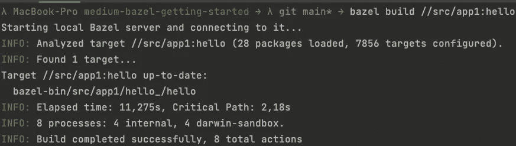
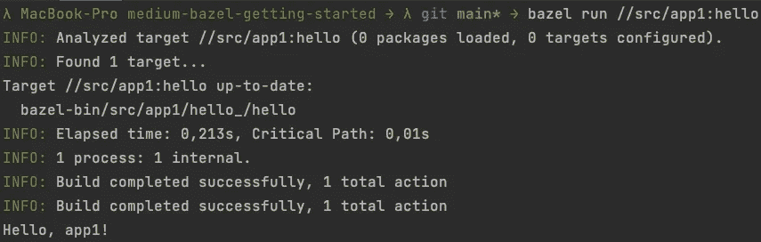
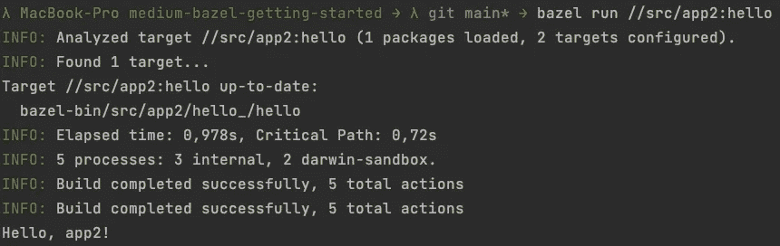
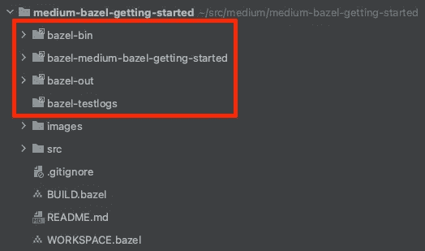

# 使用 Bazel 构建并运行您的第一个 Go 应用程序

> 原文：<https://levelup.gitconnected.com/build-and-run-your-first-go-application-with-bazel-ab83acb747f5>

使用 Bazel 构建和运行您的第一个 Go 应用程序的分步指南。


巴泽尔

**要求**

*   [Bazel 已安装](https://docs.bazel.build/versions/main/install.html)

Bazel 很容易安装，支持 Ubuntu Linux、macOS 和 Windows。

如果你像我一样在 macOS 上运行，安装 Bazel 最简单的方法就是使用自制软件:

```
# Install Homebrew if not already done
/bin/bash -c "$(curl -fsSL https://raw.githubusercontent.com/Homebrew/install/master/install.sh)"# Install bazel via Homebrew
brew install bazel# Verify that bazel is working by checking the installed version
bazel --version 
# -> "bazel 4.2.2-homebrew"# If you have already installed bazel you can easily upgrade it via Homebrew
brew ugprade bazel
```

同样，像往常一样，我准备了一个[极简的 GitHub 库](https://github.com/Abszissex/medium-bazel-getting-started)供你查看整个安装项目:

[](https://github.com/Abszissex/medium-bazel-getting-started) [## GitHub-abszisex/medium-bazel-入门

### 此时您不能执行该操作。您已使用另一个标签页或窗口登录。您已在另一个选项卡中注销，或者…

github.com](https://github.com/Abszissex/medium-bazel-getting-started) 

## 设置项目

一个典型的 Bazel 项目至少包括以下基本要素:

*   `WORKSPACE.bazel` —工作空间文件定义项目的 Bazel 工作空间。Bazel 可以在整个项目中使用该文件中定义的所有内容。然而，它通常用于加载扩展，然后注册它们的工具、函数，并根据项目的需要构建规则。文件扩展名`.bazel`是可选的，但是如果两种扩展名都可用，Bazel 将使用带有该扩展名的文件。
*   `BUILD.bazel` —构建文件包含该路径所有可能的构建目标。Bazel 要正常工作，每个目录需要一个构建文件。此外，你必须有一个规则的构建文件，即使它是空的。`.bazel`文件扩展名是可选的，但是如果两种扩展名都可用，Bazel 将使用带有该扩展名的文件。
*   第三，您需要应用程序的实际源代码。您可能已经猜到，您需要一些源代码来构建。你如何构建它完全取决于你。尽管如此，我还是建议创建一个专用的“src”文件夹，存放所有的应用程序代码，这样你就不会把它和任何根级配置搞混了。

**项目结构**

让我们来看看一个示例项目结构可能是什么样的:

```
/
|- WORKSPACE.bazel
|- BUILD.bazel
|- src/
   |- app1/
     |- BUILD.bazel
     |- go.mod
     |- main.go
   |- app2/
     |- BUILD.bazel
     |- go.mod
     |- main.go
```

在你的项目的根中，你总是需要`WORKSPACE.bazel`和`BUILD.bazel`，特别是因为`WORKSPACE.bazel`本身定义了你的项目根。拥有多个`WORKSPACE.bazel`文件和“子项目”也是可能的，但是这不应该是本文的一部分。在这个例子中，根目录上的`BUILD.bazel`文件保持为空。

除此之外，还有一个包含所有应用程序的`src`文件夹。在这种情况下，我们有两个名为`app1`和`app2`的应用程序。这两个应用程序都只是简单的 hello-world Go 应用程序，用来演示如何通过 Bazel 构建和运行它们。

**workspace . bazel 文件**

在下面的代码片段中，您可以看到`WORKSPACE.bazel`的内容

起初，它可能看起来与您目前所看到的不同，所以让我们解释一下。

```
load("@bazel_tools//tools/build_defs/repo:http.bzl", "http_archive")
```

使用`load()`,我们将函数`http_archive`从其`http.bzl`扩展的官方`@bazel_tools`库中加载到 Bazel 中。所有扩展名文件都以`.bzl`结尾。`@bazel_tools`是 Bazel 的预安装库，不需要像我们在下一步中看到的其他库那样被明确下载。

在我们将`http_archive`函数加载到 Bazel 中之后，当您运行一个命令时，Bazel 将动态下载存储库。之后我们可以立即直接使用它。`http_archive`是一个常用的函数，它下载一个已定义的存储库作为压缩档案，解压缩它，并使它的目标可用于绑定。

```
http_archive(
    name = "io_bazel_rules_go",
    sha256 = "2b1641428dff9018f9e85c0384f03ec6c10660d935b750e3fa1492a281a53b0f",
    urls = [
        "https://mirror.bazel.build/github.com/bazelbuild/rules_go/releases/download/v0.29.0/rules_go-v0.29.0.zip",
        "https://github.com/bazelbuild/rules_go/releases/download/v0.29.0/rules_go-v0.29.0.zip",
    ],
)
```

在这种情况下，Bazeil 将在特定提交时从 GitHub 下载 [rules_go](https://github.com/bazelbuild/rules_go) 存储库，由`sha256`定义。

在我们定义了想要下载的存储库之后，我们可以通过再次使用`load()`函数来访问存储库中的扩展。

```
load("@io_bazel_rules_go//go:deps.bzl", "go_register_toolchains", "go_rules_dependencies")
```

正如您所看到的`@io_bazel_rules_go`，扩展路径以开始，与我们的`http_archive`的`name`属性的值相同。从已定义的扩展中，我们想让两个函数`go_register_toolchains`和`go_rules_dependencies`在我们的工作空间中可用。

```
go_rules_dependencies()

go_register_toolchains(version = "1.17.1")
```

`go_rules_dependencies`是 Bazel 在运行该扩展定义的任何其他`go_rules`之前需要运行的函数，因为它注册了其他规则所需的所有外部依赖关系。

如你所料，Bazel 需要注册 Go 工具链，这样 Bazel 就可以运行 Go 命令来构建、测试和运行你的 Go 文件。在上面的例子中，我明确定义了使用的 Go 版本为`1.17.1`。或者，你也可以设置`"host"`。使用`"host"` Bazel 将使用主机系统上安装的工具链，Bazel 试图在`GOROOT`或`PATH`找到该工具链。尽管我建议定义一个固定的版本，这样所有的东西都可以在其他安装了另一个 Go 版本的机器上正常运行。

**Go 应用代码**

在我们的每个应用程序中都有三个文件，不同之处仅在于应用程序的`fmt.println(...)`方法的输出。终端输出应该是相同的，以验证 Bazel 将在运行 Bazel 命令时构建两个不同的应用程序。

首先是`main.go`文件。它尽可能简单，只向终端打印一些东西，所以我们可以看到它正在工作。

`go.mod`文件也是绝对最小配置，只定义模块名和使用的 Go 版本。

如果您是第一次尝试使用 Bazel 构建 Go 应用程序，那么激动人心的部分可能对您来说是全新的。

`load()`功能你应该已经很熟悉了。在这里，我们再次访问`@io_bazel_rules_go`存储库并导入函数，然后注册该函数。

`go_binary`是导入存储库的核心规则之一。您可能已经猜到它是为了根据名称从 Go 应用程序代码中构建二进制文件。

让我们检查一下所用的参数。

*   `name` —这是目标的名称。在本文的后面，我们将需要这里定义的值在我们的命令中引用它。另外，`name`属性在`BUILD.bazel`文件中需要是唯一的。
*   `srcs` —包含 Bazel 应该用来创建二进制文件的 Go 源文件列表的字符串数组。

## 跑步巴泽尔

现在有趣的部分开始了。Bazel 命令的实际运行。

**巴泽尔建**

首先，让我们通过`bazel build //src/app1:hello`构建我们的`app1`应用程序，看看是否一切正常。



正如你在上面的图片中看到的，我的本地 Bazel 服务器还没有运行，所以 Bazel 启动了它。如果它已经运行，Bazel 将跳过这一步。

让我们来研究一下上面的命令。

*   `bazel` —使用 Bazel 命令
*   `build` —巴泽尔将建造指定的目标；然而，目标的实际实现可能是这样的。这个案例将源文件作为输入，并输出一个二进制文件。
*   `//src/app1:hello` —我们想要建立的目标。`//`是当前存储库的缩写，由`WORKSPACE.bazel`文件定义。`src/app1`是我们的目标所在的`BUILD.bazel`文件的路径。而`hello`是我们为`go_binary`定义的目标的名称，用冒号分隔。

所以用简单的话来说，我们告诉巴泽尔:

> Bazel，请运行由`go_binary`定义的构建步骤，您可以在`./src/app1`找到该步骤，并且可以通过名称`hello`进行识别。

在上面的例子中值得注意的是，构建花费了 11 秒，这对于一个简单的 hello-world Go 应用程序来说是相当长的时间。但是由于 Bazel 必须先做大量的内部检查、创建缓存和建立一些依赖图，所以这是“没问题的”。如果您要重新运行相同的命令，应该用不了 1 秒钟。在我的例子中，由于缓存，它需要 0.2-0.4 秒。

如果您现在更改了`src/app1/main.go`文件中的某些内容，比如`fmt.println(...)`的文本，并重新运行构建命令，您会注意到这需要更长的时间，但即使这样，也只有 1.5 秒。

**巴泽尔跑**

构建您的应用程序是很棒的，但是通常，您会想要一种简单的方法来直接运行您的应用程序。巴泽尔让你来了。除了`bazel build`之外，还有`bazel run`命令可以立即运行构建应用程序。

正如您在下图中看到的，您必须用`run`替换`build`，Bazel 将构建并随后执行您构建的二进制文件。在这种情况下，它将打印“Hello，app1！”到终点站。



可以想象，对于其他应用程序来说也是如此。所以现在我们想运行我们的`app2`而不是`app1`。为此，我们只需调整路径，将`app1`替换为`app2`，就可以了，因为在两种情况下目标的名称都是`:hello`。这种改变的结果，可以在下图中看到:



## 自动生成的文件和文件夹

如果你一步一步地遵循这个教程，你会注意到创建了几个新的文件夹和里面的许多文件。

**长话短说**:最好把这些文件夹放进你的`.gitignore`文件夹里，尽量不要碰它们。这些文件夹应该由 Bazel 单独管理。其中的数据是 Bazel 需要的，因为它的缓存机制，除了其他内部功能，许多文件在不同的文件夹之间链接。此外，我们之前生成的二进制文件位于这些文件夹中，例如在`/bazel-bin/src/app1/hello_/hello`中。因此，理论上，您可以通过提到的路径直接执行创建的二进制文件。



如果你不小心弄乱了这些文件夹中的文件或者想清理它们，你可以使用`bazel clean`。让巴泽尔一眨眼就把这些文件夹拿走。

您应该记住，如果您清除这些文件夹，您的构建步骤将再次花费更长的时间，因为您刚刚清除了缓存的文件。

## 摘要

在本教程中，您学习了设置 Bazel 项目并使用`bazel build`和`bazel run`构建和运行您的 Go 应用程序的基本知识。

我希望这篇短文能帮助你在使用 Bazel 的旅途中走得更远。

## 你想联系吗？

如果你想联系我，请在 LinkedIn 上打电话给我。

另外，请随意查看[我的书籍推荐](https://medium.com/@mr-pascal/my-book-recommendations-4b9f73bf961b)📚。

[](https://mr-pascal.medium.com/my-book-recommendations-4b9f73bf961b) [## 我的书籍推荐

### 在接下来的章节中，你可以找到我对所有日常生活话题的书籍推荐，它们对我帮助很大。

mr-pascal.medium.com](https://mr-pascal.medium.com/my-book-recommendations-4b9f73bf961b) [](https://mr-pascal.medium.com/membership) [## 通过我的推荐链接加入 Medium—Pascal Zwikirsch

### 作为一个媒体会员，你的会员费的一部分会给你阅读的作家，你可以完全接触到每一个故事…

mr-pascal.medium.com](https://mr-pascal.medium.com/membership)